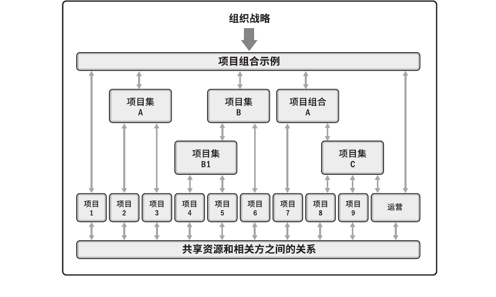
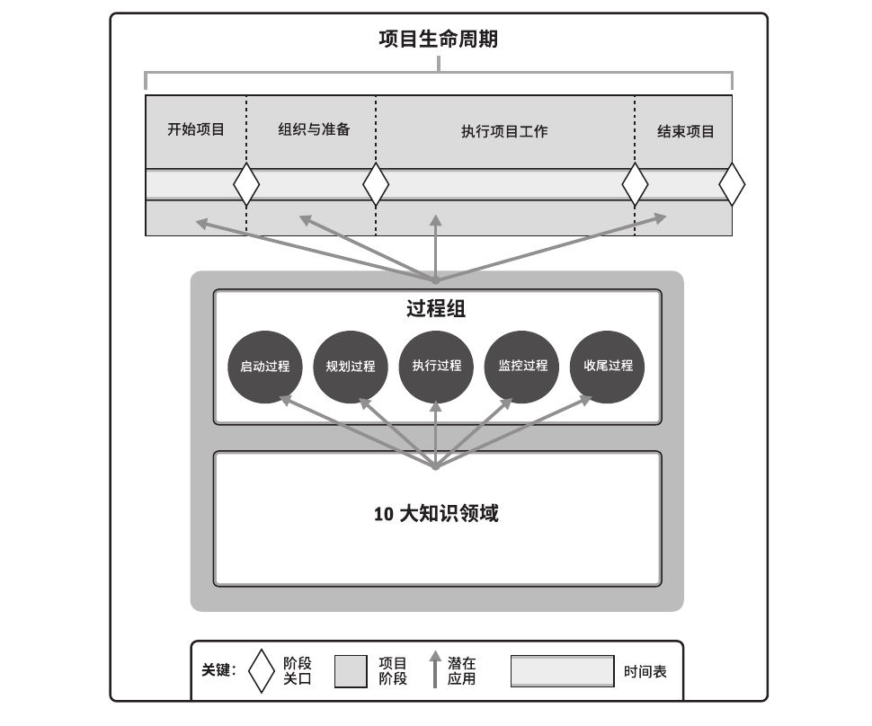
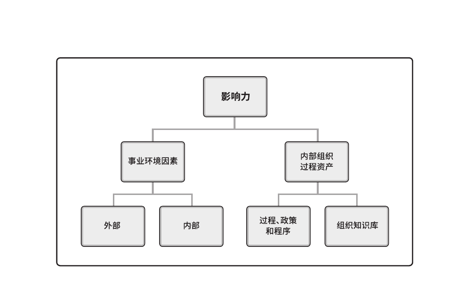
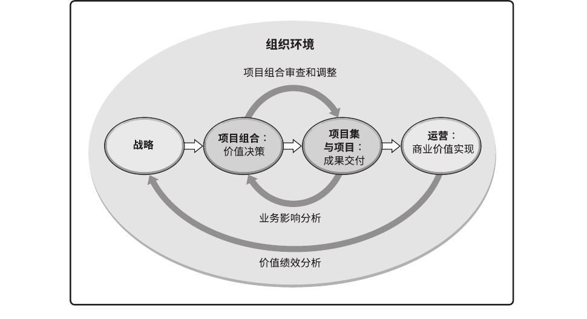
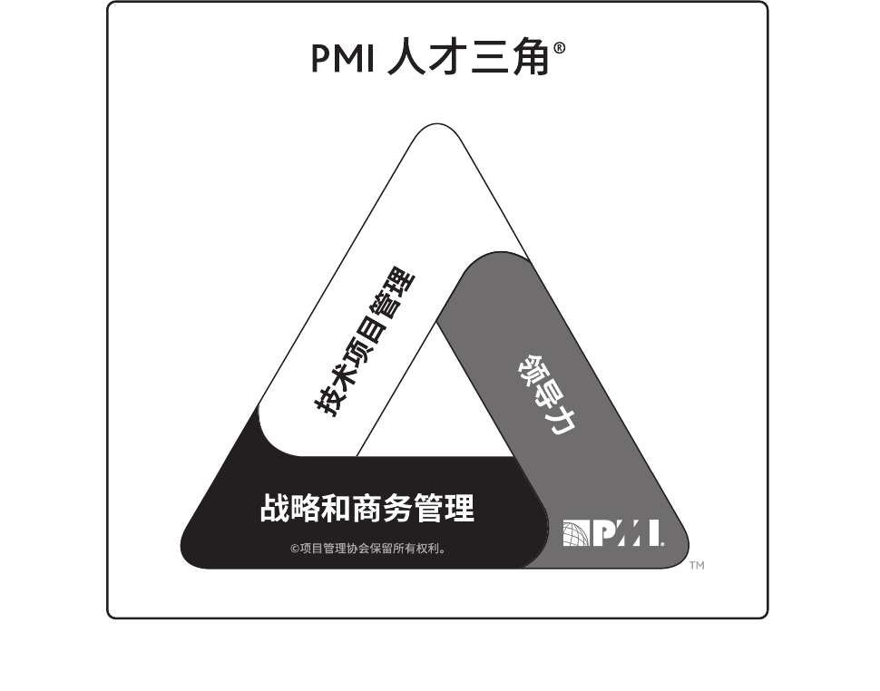
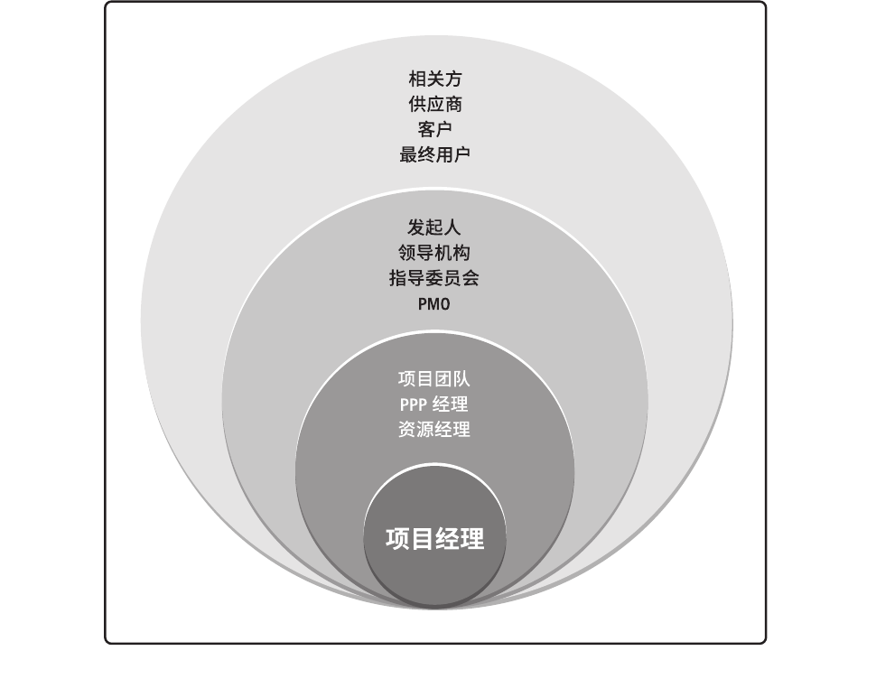
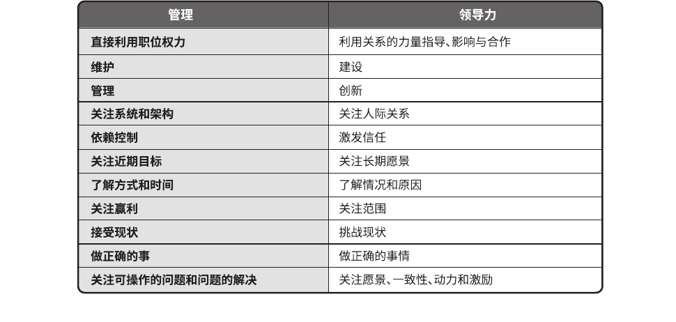
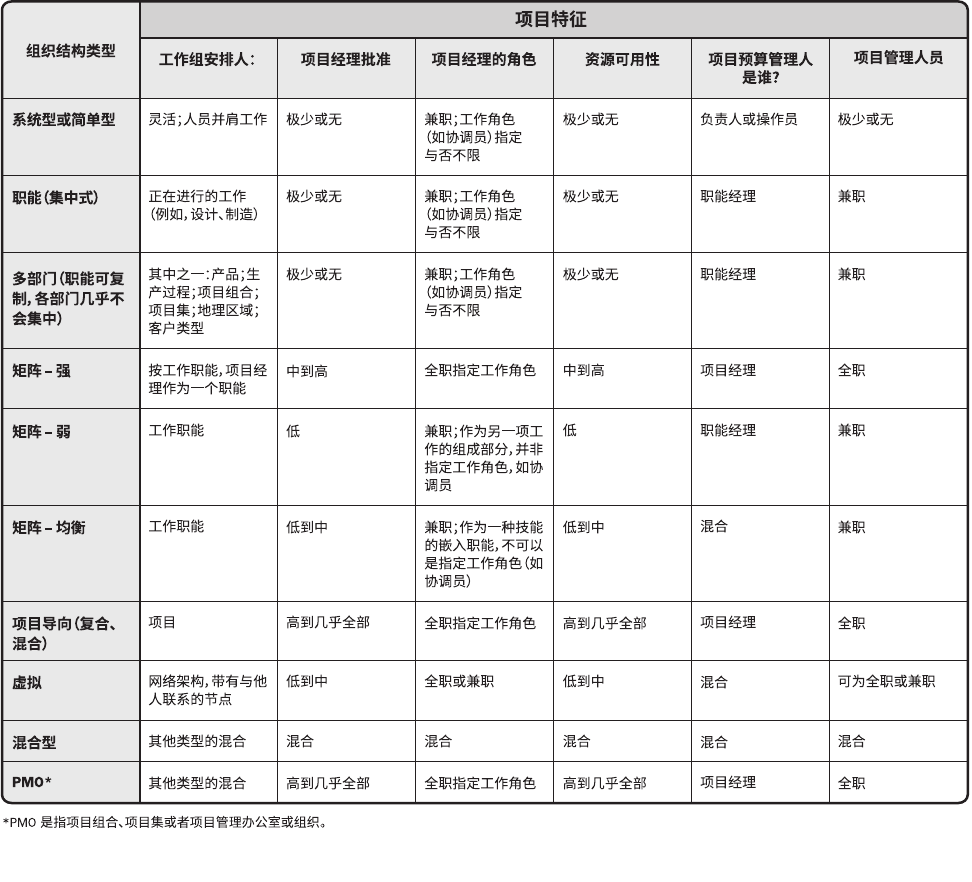

> 对PMBOK原始的编排有一些意见，因此重新编最大的变化就是：不刻意强调指南的存在，直接关注指南的内容。如同：鱼在水里时，是不会考虑水的存在的。

<!-- TOC -->

- [指南概述](#指南概述)
- [项目](#项目)
  - [项目的模式](#项目的模式)
  - [项目的启动](#项目的启动)
  - [项目的生命周期与阶段](#项目的生命周期与阶段)
  - [项目的结束](#项目的结束)
  - [项目运行环境](#项目运行环境)
  - [复杂性](#复杂性)
- [项目管理](#项目管理)
  - [项目管理、项目集管理、项目组合管理](#项目管理项目集管理项目组合管理)
  - [组织级项目管理OPM](#组织级项目管理OPM)
  - [管理过程与知识领域](#管理过程与知识领域)
  - [裁剪](#裁剪)
- [项目经理](#项目经理)
  - [价值观与职业道德](#价值观与职业道德)
  - [职责](#职责)
  - [个性](#个性)
  - [能力](#能力)
  - [影响力范围](#影响力范围)
  - [管理与领导](#管理与领导)
  - [成功](#成功)
- [项目之外](#项目之外)
  - [运营管理](#运营管理)
  - [组织系统](#组织系统)
  - [PMO](#PMO)
  - [组织治理与项目治理之间](#组织治理与项目治理之间)

<!-- /TOC -->

# 指南概述

*PMBOK(项目管理知识体系)* > *PMBOK Guide（《项目管理知识体系指南》）* >< *tailoring（裁剪）*
- PMBOK，是描述项目管理专业范围内知识的术语，包括已被验证并广泛应用的传统做法,以及新近涌现的创新做法。
- PMBOK Guide收录的是PMBOK中被“普遍认可”为“良好实践”的部分。PMBOK Guide是PMBOK的子集。所谓“普遍认可”，是指这些知识和做法在大多数时候适用于大多数项目，并且其价值和有效性已获得一致认可；所谓“良好实践”，则指在项目管理过程中使用这些知识、技能、工具和技术，能够达成预期的商业价值和成果，从而提高很多项目成功的可能性。
- tailoring是确定过程、输入、工具、技术、输出和生命周期阶段的恰当组合以管理项目的过程。tailoring不一定是PMBOK Guide的子集，甚至不一定是PMBOK的子集，可能会根据实际情况有一些特殊方法。

> 《指南》不是方法论。方法论是由专门的从业人员所采用的实践、技术、程序和规则所组成的体系。而《指南》是组织制定实践项目管理所需方法论、政策、程序、规则、工具、技术和生命周期阶段的基础。

《项目管理标准》是ANSI的标准，也是《PMBOK指南》的第二部分。标准确认了在大多时候都被大多数项目视作良好实践的过程，还确认了通常与这些过程相关的输入和输出。  
《PMBOK指南》基于《项目管理标准》，确认了“良好实践”的过程、输入、输出，还说明了核心概念、新兴趋势、裁剪项目管理过程时应考虑的因素，以及如何将工具和技术应用于项目中。

标准和指南均基于描述性实践，而非规范性实践。

# 项目

## 项目的模式

项目存在的三种模式：独立项目、项目集、项目组合。  
**项目** 是为创造 *独特的产品、服务或成果* 而进行的 *临时性工作*。  
**项目集** 是一组相互关联且被协调管理的项目、子项目集和项目集活动，以便获得分别管理所无法获得的利益。项目集包括所属单个项目范围之外的相关工作，也可能包含运营性质的工作。  
**项目组合** 是指为实现战略目标而组合在一起管理的项目、项目集、子项目组合和运营工作的集合。组合中的项目集或项目不一定彼此依赖或直接相关。

从组织的角度来看项目、项目集和项目组合管理：
- 项目集和项目管理的重点在于以“正确”的方式开展项目集和项目；
- 项目组合管理则注重于开展“正确”的项目集和项目。

项目、项目集、项目组合的比较：
|   | 项目 | 项目集 | 项目组合 |
|---|------|-------|--------|
| 定义 | 项目是为创造独特的产品、服务或成果而进行的临时性工作。 | 项目集是一组相互关联且被协调管理的项目、子项目集和项目集活动，以便获得分别管理所无法获得的利益。 | 项目组合是指为实现战略目标而组合在一起管理的项目、项目集、子项目组合和运营工作的集合 |
| 范围 | 项目有明确的目标。其范围在整个项目生命周期中渐进明细。 | 项目集的范围包括起项目集组件的范围。项目集通过确保各项目集组件的输出和成果协调互补，为组织带来利益。 | 项目组合的组织范围随组织战略目标的变化而变化。 |
| 变更 | 项目经理对变更和实施过程做出预期，实现对变更的管理和控制。 | 项目集的管理方法是，随着项目集各组件成果和输出的交付，在必要时接受和适应变更，优化效益实现。 | 项目组合经理持续监督更广泛内外部环境的变更。 |
| 规划 | 在整个项目生命周期中，项目经理逐渐明细高层信息，将其转为详细的计划。 | 项目集的管理利用高层级计划，跟踪项目集组件的依赖关系和进展。项目集计划也用于在组件层级指导规划。 | 项目组合经理建立并维护于总体项目组合有关的必要过程和沟通。 |
| 管理 | 项目经理为实现项目目标而管理项目团队。 | 项目集经理，通过协调项目集组件的活动，确保项目集效益按预期实现。 | 项目组合经理可管理或协调项目组合管理人员或对总体项目组合负有报告职责的项目集和项目人员。 |
| 监督 | 项目经理监控项目开展中生产产品、提供服务或成果的工作。 | 项目集经理监督项目集组件的进展，确保整体目标、进度计划、预算和利益的实现。 | 项目组合经理监督战略变更以及总体资源分配、绩效成果和项目组合风险。 |
| 成功 | 成功通过产品与项目的质量、进度和预算的依从性以及客户满意度水平进行衡量。 | 项目集的成功通过项目集向组织交付预期效益的能力以及项目集交付所述效益的效率和效果进行衡量。 | 成功通过项目组合的总体投资效果和实现的效益进行衡量。 |

## 项目的启动

项目是组织创造价值和效益的主要方式。

项目启动背景大致分为四类：
- 符合法规、法律或社会要求；
- 满足相关方的要求或需求；
- 执行、变更业务或技术战略；
- 创造、改进或修复产品、过程或服务。

项目启动的实际因素，属于四类因素（简称：法律、商业、战略、产品）中一个或多个。
| 特定因素 | 特定因素示例 | 法律 | 商业 | 战略 | 产品 |
|----------|--------------|------|------|------|------|
| 新技术 | 电子公司的新项目，利用新技术开发一种小型笔记本电脑 |  |  | X | X |
| 竞争力 | 为保持竞争力，降低产品成本 |  |  |  | X |
| 材料问题 | 市政桥梁出现裂缝，解决问题 | X |  | X |  |
| 政治变革 | 新官上任，项目经费变化 |  |  |  | X |
| 市场需求 | 应对汽油紧缺，开发低油耗车型 |  | X | X | X |
| 经济变革 | 经济滑坡导致项目优先级变化 |  |  |  | X |
| 客户要求 | 为新工业园区供电，新建一个电厂 |  | X | X |  |
| 相关方需求 | 相关方要求进行新的输出 |  | X |  |  |
| 法律要求 | 化工厂处理有毒材料 | X |  |  |  |
| 业务过程改进 | 运用精益六西格玛 |  |  | X |  |
| 战略机会或业务需求 | 为增加收入，新开项目 |  |  | X | X |
| 社会需要 | 应对传染病，改进用水系统 |  | X |  |  |
| 环境考虑 | 为减少污染，开创电动汽车共享 |  |  | X | X |

## 项目的生命周期与阶段

项目的关键组成部分：
- **项目生命周期**： *从开始到结束的一系列阶段，包括：开始、组织与准备、执行、结束。* 阶段之间的顺序可以顺序、迭代或交叠进行。项目生命周期是项目管理的一个基本框架。项目生命周期可以是预测型或适应型。项目生命周期内有一个或多个阶段是开发生命周期。 **开发生命周期** 可以是预测型（瀑布型）、适应型（敏捷型/迭代型/增量型）或混合型的模式。项目生命周期会受组织、行业、开发方法或所用技术的独特性质的影响。项目生命周期与产品生命周期相互独立，产品生命周期指一个产品从概念、交付、成长、成熟到衰退的整个演变过程的一系列阶段。
- **项目阶段**： *一组具有逻辑关系的项目活动的集合，通常以一个或多个可交付成果的完成为结束。包括（共12个，可以更多）：概念开发、可行性研究、客户需求、解决方案开发、设计、原型、建造、测试、移交、试运行、里程碑审查、经验教训总结。* 各个阶段可以通过不同的属性来描述，如名称/数量/持续时间/资源投入/准入标准/退出标准。各个阶段可基于各种因素建立，如管理需求/项目性质/组织行业或技术特性/项目特性/决策点等。分为多个阶段的方式有助于项目管理，同时还提供了评估项目绩效并在后续采取必要的纠正或预防措施的机会。项目阶段的一个关键组成部分是阶段审查。
- **阶段关口**： *为做出“进入下个阶段、进行整改或结束项目集或项目”的决定而开展的阶段末审查。又称阶段审查、阶段门、关键决策点、阶段入口或阶段出口。* 在该时点，将项目的绩效及进展与各种项目文件及业务文件（如商业论证、项目章程、项目管理计划、效益管理计划等）进行比较，以便做出重要决定，如进入下个阶段、整改后进入下个阶段、结束项目、停留在当前阶段、重复阶段或某个要素。

> iceman注：理解：
> - 项目生命周期，包含开发生命周期。类型也是匹配的，项目预测型对开发瀑布型；项目适应型对开发敏捷型/迭代型/增量型。预测型和适应型的区别在于：预测型，大方向不变，小方向一直变；适应型，小方向不变，大方向一直变。
> - 开发生命周期的选择是根据变更频率和交付频率决定的：变更慢，交付慢，选瀑布（关注计划）；变更慢，交付快，选增量（关注交付）；变更快，交付慢，选迭代（关注改进）；变更快，交付快，选敏捷（关注价值）。
> - 生命周期是对 *项目的状态* 的描述；项目阶段是对生命周期的细分，按 *项目中的活动* 来划分的。

## 项目的结束

当项目目标达成时，或项目因不会或不能达到目标而中止，亦或是项目需求不复存在，则项目便已结束。结束项目的决定必须得到有关当局的审批。

项目管理中最常见的挑战之一是确定项目是否成功，以及考核项目的成功程度。
> 简单的说，判断项目成功的标准，在外不在内。是由发起人（效益管理计划、商业论证）、相关方（履行合同、相关方满意）、组织（状态转变、交付运营）等确定。

主要相关方和项目经理应思考以下三个问题：、怎样才是项目成功、如何评估项目成功、哪些因素会影响项目成功。  
主要相关方和项目经理应就这些问题达成共识并予以记录。

为了取得项目成功，项目团队必须能够正确评估项目状况，平衡项目要求，并与相关方保持积极主动的沟通。

项目成功的标准可能包括：
- 达到商业论证中记录的已商定的财务测量指标。如：净现值 (NPV)；投资回报率 (ROI)；内部报酬率 (IRR)；回收期 (PBP)；效益成本比率 (BCR)。
- 达到商业论证的非财务目标；
- 完成项目效益管理计划。如：目标效益、实现效益的时限、测量指标等；
- 完成组织从“当前状态”转到“将来状态”；
- 达到组织战略、目的和目标；
- 履行合同条款和条件；
- 使相关方满意；
- 可接受的客户/最终用户的采纳度；
- 将可交付成果整合到组织的运营环境中；
- 满足商定的交付质量；
- 遵循治理规则；
- 满足商定的其他成功标准或准则（例如过程产出率）。

> iceman注：项目成功的多个标准的几种来源：
> - 项目目标：如商业论证中的财务指标和非财务目标、效益计划
> - 组织外部：如使相关方满意、履行合同
> - 组织自身：如完成组织的状态升级、达成组织目标
> - 组织内部：如遵循治理规则

在许多情况下，产品、服务或成果的成功只有在项目完成后一段时间方能知晓。例如，在项目产品、服务或成果交付运营时，市场份额增加、运营成本降低或新产品成功可能都是未知的。在这些情况下，项目管理办公室 (PMO)、项目组合指导委员会或组织内的其他职能部门，应该在稍晚时间才对项目成功进行评估，以确定结果是否符合业务目标。

## 项目运行环境

项目所处的环境可能对项目的开展产生有利或不利的影响。这些影响的两大主要来源为：
- **事业环境因素** (Enterprise Environment Factors，EEF)：是指项目团队不能控制的，将对项目产生影响、限制或指令作用的各种条件。
  - 组织内部的EEF包括：
    - 组织文化、结构和治理（如愿景、使命、价值观、信念、文化规范、领导风格、等级制度和职权关系、组织风格、道德和行为规范等）；
    - 设施和资源的地理分布（如工厂位置、虚拟团队、云计算等）；
    - 基础设施（如现有设施、设备、组织通讯渠道、信息技术硬件、可用性和功能等）；
    - 信息技术软件（如进度计划软件工具、配置管理系统、进入其他在线自动化系统的网络界面和工作授权系统等）；
    - 资源可用性（如合同和采购制约因素、获得批准的供应商和分包商以及合作协议等）；
    - 员工能力（如现有人力资源的专业知识、技能、能力和特定知识等）。
  - 组织外部的EEF包括：
    - 市场条件（如竞争对手、市场份额、商标等）
    - 社会和文化影响与问题（如政治氛围、行为规范、道德和观念等）；
    - 法律限制（与安全、数据保护、商业行为、雇佣和采购有关的国家或地方法律法规）；
    - 商业数据库（如标杆对照成果、标准化的成本估算数据、行业风险研究资料和风险数据库等）；
    - 学术研究（如行业研究、出版物和标杆对照成果等）；
    - 政府或行业标准（如与产品、生产、环境、质量和工艺有关的监管机构条例和标准等）；
    - 财务考虑因素（如货币汇率、利率、通货膨胀率、关税和地理位置等）；
    - 物理环境要素（如工作环境、天气和制约因素等）。
- **组织过程资产** (Organizational Process Assets，OPA)：是执行组织所特有并使用的计划、过程、政策、程序和知识库，会影响对具体项目的管理。组织过程资产包括来自任何（或所有）项目执行组织的，可用于执行或治理项目的任何工件、实践或知识，还包括来自组织以往项目的经验教训和历史信息。组织过程资产可能还包括完成的进度计划、风险数据和挣值数据。
  - 过程、政策和程序，是由项目管理办公室(PMO)或项目以外的其他职能部门完成。更新工作仅须遵循与过程、政策和程序更新相关的组织政策。
    - 启动和规划的流程与程序；
      - 指南和标准，用于裁剪组织标准流程和程序以满足项目的特定要求；
      - 特定的组织标准，例如政策（如人力资源政策、健康与安全政策、安保与保密政策、质量政策、采购政策和环境政策）；
      - 产品和项目生命周期，以及方法和程序（如项目管理方法、评估指标、过程审计、改进目标、核对单、组织内使用的标准化的过程定义）；
      - 模板（如项目管理计划、项目文件、项目登记册、报告格式、合同模板、风险分类、风险描述模板、概率与影响的定义、概率和影响矩阵，以及相关方登记册模板）；
      - 预先批准的供应商清单和各种合同协议类型（如总价合同、成本补偿合同和工料合同）。
    - 执行和监控的流程与程序；
      - 变更控制程序，包括修改组织标准、政策、计划和程序（或任何项目文件）所须遵循的步骤，以及如何批准和确认变更；
      - 跟踪矩阵；
      - 财务控制程序（如定期报告、必需的费用与支付审查、会计编码及标准合同条款等）；
      - 问题与缺陷管理程序（如定义问题和缺陷控制、识别与解决问题和缺陷，以及跟踪行动方案）。
      - 资源的可用性控制和分配管理；
      - 组织对沟通的要求（如可用的沟通技术、许可的沟通媒介、记录保存政策、视频会议、协同工具和安全要求）；
      - 确定工作优先顺序、批准工作与签发工作授权的程序；
      - 模板（如风险登记册、问题日志和变更日志）；
      - 标准化的指南、工作指示、建议书评价准则和绩效测量准则；
      - 产品、服务或成果的核实和确认程序。
    - 收尾的流程与程序。
      - 项目收尾指南或要求（如项目终期审计、项目评价、可交付成果验收、合同收尾、资源分配，以及向生产和（或）运营部门转移知识）
  - 组织知识库，是在整个项目期间结合项目信息而更新的。
    - 配置管理知识库，包括软件和硬件组件版本以及所有执行组织的标准、政策、程序和任何项目文件的基准；
    - 财务数据库，包括人工时、实际成本、预算和成本超支等方面的信息；
    - 历史信息与经验教训知识库（如项目记录与文件、完整的项目收尾信息与文件、关于以往项目选择决策的结果及以往项目绩效的信息，以及从风险管理活动中获取的信息）；
    - 问题与缺陷管理数据库，包括问题与缺陷的状态、控制信息、解决方案以及相关行动的结果；
    - 测量指标数据库，用来收集与提供过程和产品的测量数据；
    - 以往项目的项目档案（如范围、成本、进度与绩效测量基准，项目日历，项目进度网络图，风险登记册，风险报告以及相关方登记册）。

事业环境因素是很多项目管理过程，尤其是大多数规划过程的输入。  
组织过程资产是很多项目管理过程的输入。

## 复杂性

“复杂”一词通常被用来描述难以理解或错综复杂的事物。

复杂性本身指个体基于自身经验、观察和技能的一种感知，更准确的描述应该是项目包含复杂性的要素，而不是项目本身复杂。

作为项目的一种特征或属性，复杂性通常被定义为：
- 包含多个部分；
- 不同部分之间存在一系列连接；
- 不同部分之间有动态交互作用；
- 这些交互作用所产生的行为远远大于各部分简单的相加（例如突发性行为）。

项目的复杂性来源于组织的系统行为、人类行为以及组织或环境中的不确定性。
- 系统行为：组成部分与系统之间的依赖关系。
- 人类行为：不同个体与群体之间的相互作用。
- 不确定性：出现问题、缺乏理解或困惑引发的不确定性。

项目整合之前，项目经理应考虑项目内外的要素。这些因素会增加项目的复杂性，通过检查，有助于项目经理在规划、管理和控制项目时可以识别关键领域，确保完成整合。

-----------------------

# 项目管理

## 项目管理、项目集管理、项目组合管理

**项目管理** 就是将知识、技能、工具与技术用于项目活动,以满足 *项目的要求*。  
**项目集管理** 指在项目集中应用知识、技能与原则来实现 *项目集的目标* ，获得分别管理项目集组成部分所无法实现的利益和控制。  
**项目组合管理** 是指为了实现 *战略目标* 而对一个或多个项目组合进行的集中管理。  

有效和高效的项目管理应被视为组织的战略能力。

项目管理注重项目互依赖关系，以确定管理项目的最佳方法。  
项目集管理注重项目与项目以及项目与项目集之间的依赖关系，以确定管理这些项目的最佳方法。  
项目组合中的项目集或项目不一定彼此依赖或直接相关。
> iceman注：内部依赖，外部依赖，不一定依赖。

项目集管理和项目组合管理的生命周期、活动、目标、重点和效率都与项目管理不同，但通常涉及相同的相关方，使用同样的资源，因此，可能会导致冲突。这种情况促使组织增强内部协调，通过项目组合、项目集和项目管理达成组织内部的有效平衡。

## 组织级项目管理OPM

项目组合、项目集和项目均需符合组织战略，或由组织战略驱动，并以不同的方式服务于战略目标的实现。
- 项目组合管理通过选择适当的项目集或项目，对工作进行优先排序，以及提供所需资源，使项目组合与组织战略保持一致。
- 项目集管理通过授权、变更或终止项目，对其组成部分进行协调，对它们之间的依赖关系进行控制，从而实现既定收益，支持组织战略。
- 项目管理使组织的目的和目标得以实现。

组织往往用战略规划引导项目投资，明确项目对实现组织目的和目标的作用。通过组织级项目管理(OPM)，对项目组合、项目集和项目进行系统化管理，确保它们符合组织的战略业务目标。

OPM是指为实现战略目标而整合项目组合、项目集和项目管理于组织驱动因素的框架。OPM旨在确保组织开展正确的项目并合适地分配关键资源。OPM有助于确保组织的各个层级都了解组织的战略愿景、支持愿景的举措、目标以及可交付成果。OPM使组织不断地以可预见的方式取得更好的绩效、更好的结果及可持续的竞争优势，从而实现组织战略。

## 管理过程与知识领域

**项目管理过程**： *旨在创造最终结果的系统化的系列活动，通过合适的工具和技术，将一个或多个输入转化为一个或多个输出。输出是可交付成果或结果，结果是过程的最终成果。* 各个过程通过所产生的输出建立逻辑联系。过程迭代的次数和过程间的相互作用因具体项目的需求而不同。过程通常分为三类：单次、定期、持续。过程可按逻辑和知识领域进行分类。
  - **项目管理过程组**： *是指对项目管理过程进行逻辑分组，以达成项目的特定目标。* 项目管理过程组不同于项目阶段。五大过程组包括启动、规划、执行、监控和收尾。
  - **项目管理知识领域**： *按所需知识内容来定义的项目管理领域，并用其所含过程、做法、输入、输出、工具和技术进行描述。* 每个知识领域都是项目管理中的一个特定主题，以及与该主题相关的一组过程。十大领域包括：整合、范围、进度、成本、质量、资源、沟通、风险、采购、相关方。某些项目可能需要一个或多个其他的知识领域，如财务管理或健康管理。

五大管理过程组：
- 启动过程组，定义一个新项目或现有项目的一个新阶段，授权开始该项目或阶段的过程。
- 规划过程组，明确项目范围，优化目标，为实现目标制定行动方案的过程。
- 执行过程组，完成项目管理计划中确定的工作，以满足项目要求的过程。
- 监控过程组，跟踪、审查和调整项目进展与绩效，识别必要的计划变更并启动相应变更的过程。
- 收尾过程组，正式完成或结束项目、阶段或合同所执行的过程（组）。

十大知识领域：
- 项目整合管理，包括为识别、定义、组合、统一和协调各项目管理过程组的各种过程和活动而开展的过程与活动。
- 项目范围管理，包括确保项目做且只做所需的全部工作，以成功完成项目的各个过程。
- 项目进度管理，包括为管理项目按时完成所需的各个过程。
- 项目成本管理，包括为使项目在批准的预算内完成而对成本进行规划、估算、预算、融资、筹资、管理和控制的各个过程。
- 项目质量管理，包括把组织的质量政策应用于规划、管理、控制项目和产品质量要求，以满足相关方的期望的各个过程。
- 项目资源管理，包括识别、获取和管理所需资源以成功完成项目的各个过程。
- 项目沟通管理，包括为确保项目信息及时且恰当地规划、收集、生成、发布、存储、检索、管理、控制、监督和最终处置所需的各个过程。
- 项目风险管理，包括规划风险管理、识别风险、开展风险分析、规划风险应对、实施风险应对和监督风险的各个过程。
- 项目采购管理，包括从项目团队外部采购或获取所需产品、服务或成果的各个过程。
- 项目相关方管理，包括用于开展下列工作的各个过程：识别影响或受项目影响的人员、群体或组织，分析相关方对项目的期望和影响，制定合适的管理策略来有效调动相关方参与项目决策和执行。

:::success
项目管理过程组与知识领域：
| 知识领域 | 过程之启动 | 过程之规划 | 过程之执行 | 过程之监控 | 过程之收尾 |
|---------|----------|-----------|----------|-----------|----------|
| 4.项目整合管理 | 4.1制定项目章程 | 4.2指定项目管理计划 | 4.3指导与管理项目工作 4.4管理项目知识 | 4.5监控项目工作 4.6实施整体变更控制 | 4.7结束项目或阶段 |
| 5.项目范围管理 |  | 5.1规划范围管理 5.2收集需求 5.3定义范围 5.4创建WBS(工作分解结构) |  | 5.5确认范围 5.6控制范围 |  |
| 6.项目进度管理 |  | 6.1规划进度管理 6.2定义活动 6.3排列活动顺序 6.4估算活动持续时间 6.5制定进度计划 |  | 6.6控制进度 |  |
| 7.项目成本管理 |  | 7.1规划成本管理 7.2估算成本 7.3制定预算 |  | 7.4控制成本 |  |
| 8.项目质量管理 |  | 8.1规划质量管理 | 8.2管理质量 | 8.3控制质量 |  |
| 9.项目资源管理 |  | 9.1规划资源管理 9.2估算活动资源 | 9.3获取资源 9.4建设团队 9.5管理团队 | 9.6控制资源 |  |
| 10.项目沟通管理 |  | 10.1规划沟通管理 | 10.2管理沟通 | 10.3监督沟通 |  |
| 11.项目风险管理 |  | 11.1规划风险管理 11.2识别风险 11.3实施定性风险分析 11.4实施定量风险分析 11.5规划风险应对 | 11.6实施风险应对 | 11.7监督风险 |  |
| 12.项目采购管理 |  | 12.1规划采购管理 | 12.2实施采购 | 12.3控制采购 |  |
| 13.项目相关方管理 | 13.1识别相关方 | 13.2规划相关方参与 | 13.3管理相关方参与 | 13.4监督相关方参与 |  |

注：
- 项目管理 = 管理过程 * 知识领域，横向是知识领域，纵向是管理过程。
- 过程：B（Begin启动）E（End收尾）、P（Plan规划）D（Do执行）C（Check监控）。
- 知识领域：人物风整，多快好省。
  - 人：相关方、沟通
  - 物：资源、采购
  - 风：风险
  - 整：整合
  - 多快好省：范围（多）、进度（快）、质量（好）、成本（省）
:::

:::warning
> 对过程和知识领域的理解和记忆。

启动，仅有整合、相关方有内容，也可忽略。2个活动是：[整合-制定项目章程]、[相关方-识别相关方]。

收尾，仅有整合有内容，可忽略。1个活动是：[整合-结束项目或阶段]。

PDC（规划、执行、监控）：规划24项活动，涉及10个领域；执行10项活动，涉及7个领域，缺范围/进度/成本；监控12项活动，涉及10个领域。
> 规划活动偏多，能看出明显的瀑布流的影子。

十大知识领域分为4类：全程、功能、辅助。
- 全程：风险必然存在，整合始终进行。
- 功能：多（范围）快（进度）好（质量）省（成本）。
- 辅助：人（相关方、沟通）、物（资源、采购）。

项目管理三角形：多（范围）快（进度）好（质量）省（成本）。质量必须坚持，其他三者（范围、进度、成本）任意一个变化都引起其他两者的跟随变化。  
范围、进度、成本只有规划、监控；质量涉及规划、执行、监控。

有些领域介绍比较简单，有些比较复杂。介绍简单，并不是领域本身简单，例如质量领域。
- 简单：整合、质量、沟通、采购、相关方，各个过程都只有一个活动。（简记：整治采购项--整合、质量、采购、沟通、相关方。）
- 复杂：范围、进度、成本、资源、风险，在监管过程只有一个活动，其他都有多个活动。

在7个领域，规划、执行、监控的活动基本一一对应，即“人物好争风”：
- 相关方：[规划-规划相关方参与] vs [执行-管理相关方参与] vs [监控-监督相关方参与]
- 沟通：[规划-规划沟通管理] vs [执行-管理沟通] vs [监控-监督沟通]
- 资源：[规划-规划资源管理] vs [执行-获取资源] vs [监控-控制资源]
- 采购：[规划-规划采购管理] vs [执行-实施采购] vs [监控-控制采购]
- 风险：[规划-规划风险应对] vs [执行-实施风险应对] vs [监控-监督风险]
- 整合：[规划-制定项目管理计划] vs [执行-指导与管理项目工作] vs [监控-监控项目工作]
- 质量：[规划-规划质量管理] vs [执行-管理质量] vs [监控-控制质量]

整合领域，执行和监控各有1个活动影响全局，但规划没有（所谓“计划赶不上变化”）：[执行-管理项目知识] vs [监控-实施整体变更控制]，前者影响全领域，后者影响全过程。

规划/监控比执行多3个领域，即“多快省”：
- 范围：[规划-定义范围]、[监控-确认范围]、[监控-控制范围]
- 进度：[规划-制定进度计划]、[监控-控制进度]
- 成本：[规划-制定预算]、[监控-控制成本]

在“多快省”及其他领域，规划比监控的活动更多，但很多活动属于内部活动：
- 范围：收集需求 是为了 [定义范围]、[创建WBS]
- 进度：[定义活动]、[排列活动顺序]、[估算活动持续时间]是为了[制定进度计划]
- 成本：[估算成本]是为了[制定预算]
- 风险：[识别风险]、[定性风险分析]、[定量风险分析]是为了[规划风险应对]

资源，并不是完全控制在项目经理手中，也不是一次性可获得。因此，资源的规划阶段仅仅是估算，真正到了执行过程，才能获取资源。

执行资源，视人力为资源，因此多出来2个自洽的活动：[建设团队]、[管理团队]。此处，注意的是：直到执行阶段，才有建设团队的活动，并没有提前规划和准备。

规划在每一个领域都有“规划XX管理”的活动，只有整合领域的名称稍微不同--[制定项目管理计划]。

监管过程，凡是不能控制的领域都是“监督XX”，包括：沟通、风险、相关方。其他都是“控制XX”。
:::

:::warning
> 从头开始推演"过程组与知识领域矩阵"。

1.0：将整合和相关方，视为贯穿全过程：
| 知识领域 | 过程之启动 | 过程之规划 | 过程之执行 | 过程之监控 | 过程之收尾 |
|---------|----------|-----------|----------|-----------|----------|
| 4.项目整合管理 | 4.1制定项目章程 | 4.2指定项目管理计划 | 4.3指导与管理项目工作 | 4.5监控项目工作 | 4.7结束项目或阶段 |
| 13.项目相关方管理 | 13.1识别相关方 | 13.2规划相关方参与 | 13.3管理相关方参与 | 13.4监督相关方参与 |  |
1.1：补充整合领域2个影响全局的活动：管理项目知识（执行）、实施整体变更控制（监控）。

2.0：引入“多快好省”，也就是项目管理的主要内容（只有质量涉及执行过程）：
| 知识领域 | 过程之启动 | 过程之规划 | 过程之执行 | 过程之监控 | 过程之收尾 |
|---------|----------|-----------|----------|-----------|----------|
| 5.项目范围管理 |  | 5.1规划范围管理 |  |  |  |
| 6.项目进度管理 |  | 6.1规划进度管理 |  |  |  |
| 7.项目成本管理 |  | 7.1规划成本管理 |  |  |  |
| 8.项目质量管理 |  | 8.1规划质量管理 | 8.2管理质量 | 8.3控制质量 |  |
2.1：完善范围管理：规划（收集需求、定义范围、创建WBS）、监控（确认范围、控制范围）。  
2.2：完善进度：规划（定义活动、排列活动顺序、估算活动时间、制定进度计划）、监控（控制进度）。  
2.3：完善成本：规划（估算成本、制定预算）、监控（控制成本）。

3.0：引入风险管理：
| 知识领域 | 过程之启动 | 过程之规划 | 过程之执行 | 过程之监控 | 过程之收尾 |
|---------|----------|-----------|----------|-----------|----------|
| 11.项目风险管理 |  | 11.1规划风险管理 | 11.6实施风险应对 | 11.7监督风险 |  |
3.1：完善风险：风险的规划涉及两部分，识别风险+规划风险应对、定性分析+定量分析。

4.0：资源不在掌握中，必须协调：
| 知识领域 | 过程之启动 | 过程之规划 | 过程之执行 | 过程之监控 | 过程之收尾 |
|---------|----------|-----------|----------|-----------|----------|
| 9.项目资源管理 |  | 9.1规划资源管理 | 9.3获取资源 | 9.6控制资源 |  |
4.1：物是资源：规划（估算活动资源）、执行（获取资源）。人也是资源：执行（建设团队、管理团队）。

5.0：沟通和采购，不是特别重要：
| 知识领域 | 过程之启动 | 过程之规划 | 过程之执行 | 过程之监控 | 过程之收尾 |
|---------|----------|-----------|----------|-----------|----------|
| 10.项目沟通管理 |  | 10.1规划沟通管理 | 10.2管理沟通 | 10.3监督沟通 |  |
| 12.项目采购管理 |  | 12.1规划采购管理 | 12.2实施采购 | 12.3控制采购 |  |

总结：
- 起步2个：整合、相关方，覆盖全程。
- 主要内容4个：多快好省。
- 风险规划多，执行少。
- 资源规划少，执行多。
- 沟通和采购，顺带完成。
:::

## 裁剪

项目经理通常将项目管理方法论应用于工作。项目管理方法论可能：由组织内的专家开发；从供应商采购而来；从专业协会获取；从政府机构获取。在某些情况下，组织可能要求采用特定的项目管理方法论。

应选择恰当的项目管理过程、输入、工具、技术、输出和生命周期阶段以管理项目。这一选择活动即为针对项目裁剪的项目管理。项目经理与项目团队、发起人或组织管理层合作进行裁剪。

裁剪应处理关于范围、进度、成本、资源、质量和风险的相互竞争的 **制约因素** 。各个制约因素对不同项目的重要性不一样，项目经理应根据项目环境、组织文化、相关方需求和其他变量裁剪管理这些制约因素的方法。

在裁剪项目管理时，项目经理还应考虑运行项目所需的各个治理层级，并考虑组织文化。此外，还需要考虑来自于组织内部还是外部的项目客户也可能会影响项目管理的裁剪决定。

合理的项目管理方法论需要考虑项目的独特性，允许项目经理做出一定程度的裁剪。不过，对某一特定项目而言，方法论中的裁剪法本身可能也需要进行裁剪。

-----------------------

# 项目经理

## 价值观与职业道德

项目管理业界定义的价值观：责任、尊重、公正、诚实。
> iceman注：责任，对上级；尊重，对平级；公正，对下级；诚实，对自己。

《道德与专业行为规范》，为项目管理专业人员增强了信心并帮助个人做出明智的决策，尤其是在面对被要求违背正直诚信或价值观的困境时。  
《道德与专业行为规范》确立了四个价值观的基础地位。  
《道德与专业行为规范》包括期望标准和强制标准：期望标准是从业者力求遵循的行为规范，强制标准是从业者必须遵守的硬性要求。

## 职责

**项目经理是由执行组织委派，领导团队实现项目目标的个人。**

很多项目经理从项目启动时参与项目，直到项目结束。有时，还会参与项目启动之前的评估和分析活动，以及后续跟进活动。

一个大型项目可能包括由一位项目经理领导的上百位项目成员。这些团队成员需要承担各种不同的角色，例如设计、制造和设施管理。  
项目经理需要为团队的成果负责，需要从整体的角度来看待团队产品，以便进行规划、协调和完成。首先，应审查各自组织的愿景、使命和目标，确保与产品保持一致。然后解释与成功完成产品相关的愿景、使命和目标。最后向团队沟通自己的想法，激励团队成功完成目标。  
项目经理无需承担项目中的每个角色，但应具备项目管理知识、技术知识、理解和经验。项目经理通过沟通领导项目团队进行规划和协调。项目经理采用书面沟通（文档计划和进度），还通过会议和口头提示或非言语提示与团队进行实时沟通。

## 个性

高效的项目经理在个性方面具备一定程度的能力。包括（但不限于）：真诚、谦恭、创造力、文化、情绪、智力、管理、政治、以服务为导向、社会、系统化。

## 能力

> PMI人才三角：智商--技术、财商--商务、情商--领导。参见项目经理的职业道德。必须德才兼备。

【技术项目管理】

有效运用项目管理知识实现项目集或项目的预期成果的能力。重要的是项目经理必须了解个人专长以及如何找到具备所需专业知识的人员。几项关键技能：
  - 重点关注所管理的各个项目的关键技术项目管理要素。简单来说就是随时准备好合适的资料。包括：项目成功的关键因素、进度计划、指定的财务报告、问题日志。
  - 针对每个项目裁剪传统和敏捷工具、技术和方法。
  - 花时间制定完整的计划并谨慎排定优先顺序。
  - 管理项目要素，包括（但不限于）进度、成本、资源和风险。

整合是项目经理的一项关键（且独有）技能。三个不同层面发生的整合：
- 过程层面：项目管理可看作实现项目目标而采取的一系列过程和活动。
- 认知层面：项目经理应尽量掌握所有项目管理知识领域，并融合经验、见解、领导力、技术以及商业管理技能，并整合这些知识领域所涵盖的过程。
- 背景层面：在管理整合时，项目经理需要意识到项目背景和这些新因素（如社交网络、虚拟团队等），然后项目经理可以决定如何在项目中最好地利用这些新环境因素。

执行项目整合时，项目经理承担双重角色（战略层面、执行层面）：
- 项目经理扮演重要角色，与项目发起人携手合作，来理解战略目标，并确保项目目标和成果与项目组合、项目集以及业务领域保持一致。项目经理以这种方式有助于项目的整合与执行。
- 在项目层面上，项目经理负责指导团队关注真正重要的事务并协同工作。为此，项目经理需要整合过程、知识和人员。

【战略和商务管理】

纵览组织概况并有效协商和执行有利于战略调整和创新的决策和行动的能力。这项能力可能涉及其他职能部门的工作知识，例如财务部、市场部和运营部，以及相关的产品和行业专业知识（即领域知识）。

项目经理应掌握足够的业务知识，以便能够：
- 向其他人解释关于项目的必要商业信息；
- 与项目发起人、团队和主题专家合作制定合适的项目交付策略；
- 以实现项目商业价值最大化的方式执行策略。

为制定关于项目成功交付的最佳决策，项目经理应咨询具备关于组织运营的专业知识的运营经理。

对项目经理而言，对项目主题的了解越多越好，至少应能够向其他人说明关于组织的以下方面：战略；使命；目的和目标；产品和服务；运营（例如位置、类型、技术）；市场和市场条件，例如客户、市场状况（发展或萎缩）和上市时间因素等；竞争（例如什么、谁、市场地位）。

为确保一致性，项目经理应将以下关于组织的知识和信息运用到项目中：战略；使命；目的和目标；优先级；策略；产品或服务（例如可交付成果）。

战略和商业技能有助于项目经理确定应为其项目考虑哪些商业因素。项目经理应该确定哪些商业和战略因素会对项目造成影响，同时了解项目与组织之间的相互关系。这些商业因素如：风险和问题、财务影响、成本效益分析、商业价值、效益预期实现情况和战略、范围/预算/进度/质量。

【领导力】

包括指导、激励和带领团队的能力。这些技能可能包括协商、抗压、沟通、解决问题、批判性思考和人际关系技能等基本能力。人是所有项目中的共同点，也是最复杂的因素。
  - 人际交往：人际交往占据项目经理工作的很大一部分。项目经理需要运用领导力技能和品质与所有项目相关方合作，包括项目团队、团队指导和项目发起人。
  - 领导者的品质和技能：有远见、积极乐观、乐于合作、善于管理关系和处理冲突、诚信正直、终身学习、要事优先、全局视角等。
  - 权术、权力和办好事情：领导和管理的最终目的是办好事情。很多技能和品质归根究底就是处理政治的能力。政治涉及影响、谈判、自主和权力。项目经理对组织运行方式的了解越多，就越有可能获得成功。权力的种类包括：地位、信息、参考、情境、个性或魅力、关系、专家、奖励相关、处罚或强制力、施加压力、愧疚、说服力、回避。

## 影响力范围

项目经理的影响力范围：
- 项目：
  - 项目经理领导项目团队实现项目目标和相关方的期望。项目经理利用可用资源，以平衡相互竞争的制约因素。
  - 项目经理还充当项目发起人、团队成员与其他相关方之间的沟通者和冲突协调者。
- 组织：
  - 项目经理需要积极地与其他项目经理互动，有助于产生积极的影响，以满足项目的各种需求。
  - 项目经理在组织内扮演强有力的倡导者的角色，积极地与组织中的各位经理互动。
  - 项目经理应与项目发起人合作处理内部的政治和战略问题。
  - 项目经理可以致力于提高自己在组织内的总体项目管理能力和技能，并参与隐性和显性知识的转移或整合计划。
  - 项目经理还应致力于展现项目管理的价值、提高组织对项目管理的接受度、提高PMO的效率。
- 行业：
  - 项目经理应时刻关注行业的最新发展趋势，获得并思考这一信息对当前项目是否有影响或可用。如：新技术、新市场、新标准等。
- 专业学科：
  - 项目管理专业和项目经理担任主题专家的其他领域都在持续推进相应的专业发展。
- 跨学科：
  - 专业的项目经理针对组织的价值可以选择指导和教育其他专业人员项目管理方法。

## 管理与领导

“管理”更接近于运用一系列已知的预期行为指示另一个人从一个位置到另一个位置。相反，“领导力”指通过讨论或辩论与他人合作，带领他们从一个位置到另一个位置。  
为获得成功，项目经理必须同时采用领导力和管理这两种方式。技巧在于如何针对各种情况找到恰当的平衡点。项目经理的领导风格通常体现了他们所采用的管理和领导力方式。

团队管理与团队领导力之比较

项目经理可以采用的多种领导力风格。风格的主要因素包括：领导者的特点、成员的特点、组织的特点、环境特点。在这些风格中，最常见的包括（但不限于）：
- 放任型领导（例如，允许团队自主决策和设定目标，又被称为“无为而治”）；
- 交易型领导（例如，关注目标、反馈和成就以确定奖励，例外管理）；
- 服务型领导（例如，做出服务承诺，处处先为他人着想；关注他人的成长、学习、发展、自主性和福祉；关注人际关系、团体与合作；服务优先于领导）；
- 变革型领导（例如，通过理想化特质和行为、鼓舞性激励、促进创新和创造，以及个人关怀提高追随者的能力）；
- 魅力型领导（例如，能够激励他人；精神饱热情洋溢、充满自信；说服力强）；
- 交互型领导（例如，结合了交易型、变革型和魅力型领导的特点）。

## 成功

项目经理的成功取决于项目目标的实现。相关方的满意程度是衡量项目经理的成功的另一标准。

-----------------------

# 项目之外

## 运营管理

运营管理关注产品的持续生产和（或）服务的持续运作。它使用最优资源满足客户要求，保证业务运作的持续高效。它重点管理把各种输入（如材料、零件、能源和劳力）转变为输出（如产品、商品或服务）的过程。

运营不属于项目的范围，但它们之间有交叉。在每一个交叉点，可交付成果及知识在项目与运营之间转移，以完成工作交接。

## 组织系统

除了事业环境因素和组织过程资产，组织系统也对项目的生命周期有重要影响。
为有效且高效地开展项目，项目经理需要了解组织内的职责、终责和职权的分配情况。这有助于项目经理有效地利用其权力、影响力、能力、领导力和政治能力完成项目。

组织内多种因素的交互影响成一个独特的系统，会对在该系统内运行的项目造成影响。这种组织系统决定了组织系统内部人员的权力、影响力、利益、能力和政治能力。系统因素包括：
- 管理要素。管理要素指组织内部关键职能部门或一般管理原则的组成部分。组织根据其选择的治理框架和组织结构类型分配一般管理要素。包括：分工、职权、职责、纪律、薪酬、沟通渠道等等。分配到各个层级的职责、终责和职权表明了各个层级的员工在组织结构内执行上述职能的方式。
- 治理框架。治理指组织各个层面的有组织的或有结构的安排，旨在确定和影响组织成员的行为。治理是在组织内行使职权的框架，包括（但不限于）：规则、政策、程序、规范、关系、系统、过程。该框架会影响：组织目标的设定和实现方式；风险监控和评估方式；绩效优化方式。包括组织治理和项目治理（含项目组合、项目集、项目治理）。项目治理涉及四个治理领域：一致性、风险、绩效和沟通；各个领域都具备以下职能部门--监督、控制、整合与决策；各个职能部门都可针对独立项目或项目组合/项目集中的项目的支持过程与活动进行治理。项目治理是指用于指导项目管理活动的框架、功能和过程，从而创造独特的产品、服务或结果以满足组织、战略和运营目标。不存在一种治理框架适用于所有组织。组织应根据组织文化、项目类型和组织需求裁剪治理框架，才能发挥其作用。
- 组织结构类型。组织需要权衡两个关键变量之后才可确定合适的组织结构类型，这两个变量指可以采用的组织结构类型以及针对特定组织如何优化组织结构类型的方式。在确定组织结构时，每个组织都需要考虑大量的因素，包括：与组织目标的一致性；专业能力；控制、效率与效果的程度；明确的决策升级渠道；明确的职权线和范围；授权方面的能力；终责分配；职责分配；设计的灵活性；简单的设计；实施效率；成本考虑；物理位置；清晰的沟通。特定组织的最终结构是独特的。

系统通常由组织管理层负责。组织管理层检查组件与系统之间的优化权衡，以便采取合适的措施为组织实现最佳结果。这一检查工作的结果将对相应的项目造成影响。因此，项目经理在确定如何达成项目目标时务必要考虑这些结果。此外，项目经理应考虑到组织的治理框架。

## PMO

组织结构中有一个特殊的组织：PMO（Project Management Office）是对与项目相关的治理过程进行标准化，并促进资源、方法论、工具和技术共享的一种组织结构。

PMO有几种类型：支持型、控制型、指令型。

PMO的具体形式、职能和结构取决于所在组织的需要。
PMO的一个主要职能是通过各种方式向项目经理提供支持，包括：
- 对共享资源进行管理；
- 识别和制定项目管理方法、最佳实践和标准；
- 指导、辅导、培训和监督；
- 通过项目审计，监督对项目管理标准、政策、程序和模板的遵守程度；
- 制定和管理项目策略、程序、模板和其他共享的文件；
- 对跨项目的沟通进行协调。

## 组织治理与项目治理之间

> iceman注：所谓治理，其实是项目经理和项目管理被治理。具体说，就是项目经理与CCB、PMO等的关系。

治理类型多种多样，包括：组织治理、组织级项目管理 (OPM) 治理，以及项目组合、项目集和项目治理。

组织治理通过制定政策和流程，用结构化方式指明工作方向并进行控制，以便实现战略和运营目标。组织治理通常由董事会执行，以确保对相关方的最终责任得以落实，并保持公平和透明。组织治理原则、决策和过程可能通过以下方式影响项目组合、项目集和项目的治理：
- 执行法律、法规、标准和合规性要求；
- 明确伦理、社会和环境职责；
- 制定运营、法律和风险政策。

项目治理是指用于指导项目管理活动的框架、功能和过程，从而创造独特的产品、服务或结果以满足组织、战略和运营目标。项目层面的治理包括：
- 指导和监督对项目工作的管理；
- 确保遵守政策、标准和指南；
- 确立治理角色、职责和职权；
- 关于风险上报、变更和资源（例如团队、财力、物力、设施）的决策；
- 确保相应相关方的参与；
- 监督成效。

项目治理框架为项目相关方提供管理项目的结构、过程、角色、职责、终责和决策模型。项目治理框架的内容包括（但不限于）以下原则或过程：
- 阶段关口或阶段审查；
- 识别、上报和解决风险及问题；
- 明确角色、职责和职权；
- 开展项目知识管理并吸取项目经验教训的过程；
- 超出项目经理职权的决策制定、问题解决和需上报议题；
- 审查和批准超出项目经理职权的项目变更及产品变更。

