<!-- TOC -->

- [商业文件](#商业文件)
  - [需求评估](#需求评估)
  - [项目商业论证](#项目商业论证)
  - [项目效益管理计划](#项目效益管理计划)
  - [项目章程](#项目章程)
- [项目管理计划](#项目管理计划)
  - [十大计划](#十大计划)
    - [范围管理计划](#范围管理计划)
    - [需求管理计划](#需求管理计划)
    - [进度管理计划](#进度管理计划)
    - [成本管理计划](#成本管理计划)
    - [质量管理计划](#质量管理计划)
    - [资源管理计划](#资源管理计划)
    - [沟通管理计划](#沟通管理计划)
    - [风险管理计划](#风险管理计划)
    - [采购管理计划](#采购管理计划)
    - [相关方参与计划](#相关方参与计划)
  - [三大基准](#三大基准)
    - [范围基准](#范围基准)
    - [进度基准](#进度基准)
    - [成本基准](#成本基准)
  - [其他组件](#其他组件)
    - [变更管理计划](#变更管理计划)
    - [配置管理计划](#配置管理计划)
    - [绩效测量基准](#绩效测量基准)
    - [项目生命周期](#项目生命周期)
    - [开发方法](#开发方法)
    - [管理审查](#管理审查)
- [项目文件](#项目文件)
  - [整合](#整合)
    - [协议](#协议)
    - [假设日志](#假设日志)
    - [问题日志](#问题日志)
    - [经验教训登记册](#经验教训登记册)
    - [最终报告](#最终报告)
  - [范围](#范围)
    - [需求文件](#需求文件)
    - [需求跟踪矩阵](#需求跟踪矩阵)
    - [项目范围说明书](#项目范围说明书)
  - [进度](#进度)
    - [活动属性](#活动属性)
    - [活动清单](#活动清单)
    - [里程碑清单](#里程碑清单)
    - [项目进度网络图](#项目进度网络图)
    - [持续时间估算](#持续时间估算)
    - [进度估算依据](#进度估算依据)
    - [项目日历](#项目日历)
    - [项目进度计划](#项目进度计划)
    - [进度数据](#进度数据)
    - [进度预测](#进度预测)
  - [成本](#成本)
    - [成本估算](#成本估算)
    - [成本估算依据](#成本估算依据)
    - [项目资金需求](#项目资金需求)
    - [成本预测](#成本预测)
  - [质量](#质量)
    - [质量测量指标](#质量测量指标)
    - [质量报告](#质量报告)
    - [测试与评估文件](#测试与评估文件)
    - [质量控制测量结果](#质量控制测量结果)
  - [资源](#资源)
    - [团队章程](#团队章程)
    - [资源需求](#资源需求)
    - [资源估算依据](#资源估算依据)
    - [资源分解结构](#资源分解结构)
    - [实物资源分配单](#实物资源分配单)
    - [资源日历](#资源日历)
    - [项目团队派工单](#项目团队派工单)
    - [团队绩效评价](#团队绩效评价)
  - [沟通](#沟通)
    - [项目沟通记录](#项目沟通记录)
  - [风险](#风险)
    - [风险登记册](#风险登记册)
    - [风险报告](#风险报告)
  - [采购](#采购)
    - [采购策略](#采购策略)
    - [招标文件](#招标文件)
    - [采购工作说明书](#采购工作说明书)
    - [供方选择标准](#供方选择标准)
    - [自制或外购决策](#自制或外购决策)
    - [独立成本估算](#独立成本估算)
    - [卖方建议书](#卖方建议书)
    - [采购文档](#采购文档)
  - [相关方](#相关方)
    - [相关方登记册](#相关方登记册)
  - [成果相关](#成果相关)
    - [可交付成果](#可交付成果)
    - [核实的可交付成果](#核实的可交付成果)
    - [验收的可交付成果](#验收的可交付成果)
    - [最终产品、服务或成果移交](#最终产品服务或成果移交)
  - [变更相关](#变更相关)
    - [变更请求](#变更请求)
    - [批准的变更请求](#批准的变更请求)
    - [变更日志](#变更日志)
- [过程文件](#过程文件)
  - [工作绩效数据](#工作绩效数据)
  - [工作绩效信息](#工作绩效信息)
  - [工作绩效报告](#工作绩效报告)

<!-- /TOC -->

## 商业文件

> 商业文件是指出现在“引论-基本要素-项目管理商业文件”中5个文件。其中，“项目管理计划”在“整合管理-制定项目管理计划-输出”被细化为：10个子计划、3个基准和其他组件。

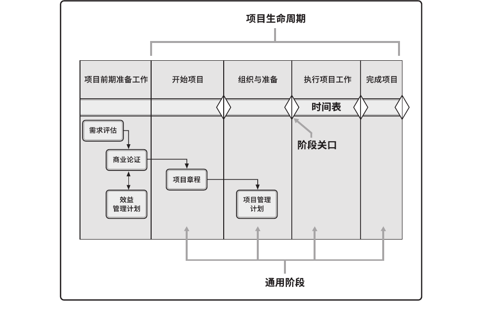

### 需求评估

需求评估通常是在商业论证之前进行，包括了解业务目的和目标、问题及机会，并提出处理建议。需求评估结果可能会在商业论证文件中进行总结。

### 项目商业论证

项目商业论证是文档化的经济可行性研究报告，用来对尚缺乏充分定义的所选方案的收益进行有效性论证，是启动后续项目管理的依据。商业论证列出了项目启动的目标和理由，可以作为衡量项目是否成功的标准。在项目启动之前通过商业论证，可能会做出继续/终止项目的决策。

通常由项目发起人负责制定和维护，项目经理负责提供建议和见解。

商业论证可能包括（但不限于）记录以下内容：
- 业务需要；
  - 确定促进采取行动的动机；
  - 情况说明，记录了待处理的业务问题或机会，包括能够为组织创造的价值；
  - 确定受影响的相关方；
  - 确定范围。
- 形势分析：
  - 确定组织战略、目的和目标；
  - 确定问题的根本原因或机会的触发因素；
  - 分析项目所需能力与组织现有能力之间的差距；
  - 识别已知风险；
  - 识别成功的关键因素；
  - 确定可能用于评估各种行动的决策准则。准则分为：必须践行的准则、希望践行的准则、非必要的准则。
  - 确定一套方案，用以处理业务问题或机会。可选方案指组织可能采取的备选行动方案。可选方案也可称为商业场景。例如，商业论证可提供以下三种可选方案：不采取任何行动；尽最小的努力处理问题或机会；以超过最低限度的努力处理问题或机会。商业论证可能会提供上述多个方案。
- 推荐：
  - 对所推荐方案的说明；
  - 说明书的内容可能包括（但不限于）：潜在方案的分析结果；潜在方案的制约因素、假设、风险和依赖关系；成功标准。
  - 一种实施方法，可能包括（但不限于）：里程碑；依赖关系；角色与职责。
- 评估：
  - 对如何测量项目所交付的效益的说明。其中应该说明项目实施完成之后的持续运营安排。

通过将成果与目标和确定的成功标准进行比较，商业论证文件为衡量整个项目周期的成功和进展奠定了基础。

### 项目效益管理计划

项目效益管理计划描述了项目实现效益的方式和时间，以及应制定的效益衡量机制。项目效益指为发起组织和项目预期受益方创造价值的行动、行为、产品、服务或成果的结果。项目生命周期早期应确定目标效益，并据此制定效益管理计划。

项目效益管理计划描述了效益的关键要素：
- 目标效益（例如预计通过项目实施可以创造的有形价值和无形价值；财务价值体现为净现值）；
- 战略一致性（例如项目效益与组织业务战略的一致程度）；
- 实现效益的时限（例如阶段效益、短期效益、长期效益和持续效益）；
- 效益责任人（例如在计划确定的整个时限内负责监督、记录和报告已实现效益的负责人）；
- 测量指标（例如用于显示已实现效益的直接测量值和间接测量值）；
- 假设（例如预计存在或显而易见的因素）；
- 风险（例如实现效益的风险）。

制定效益管理计划需要使用商业论证和需求评估中的数据和信息，例如，成本效益分析数据。在成本效益分析中已经把成本估算与项目拟实现的效益进行了比较。效益管理计划和项目管理计划描述了项目创造的商业价值如何能够成为组织持续运营的一部分，包括使用的测量标准。测量指标可核实商业价值并确认项目成功与否。

效益管理计划是商业论证、项目章程和项目管理计划的补充性文件。项目经理与发起人共同维护，迭代开发。

### 项目章程

项目章程是由项目启动者或发起人发布的，正式批准项目成立，并授权项目经理使用组织资源开展项目活动的文件。

项目章程记录了关于项目和项目预期交付的产品、服务或成果的高层级信息，例如：
- 项目目的；
- 可测量的项目目标和相关的成功标准；
- 高层级需求；
- 高层级项目描述、边界定义以及主要可交付成果；
- 整体项目风险；
- 总体里程碑进度计划；
- 预先批准的财务资源；
- 关键相关方名单；
- 项目审批要求（例如，用什么标准评价项目成功，由谁对项目成功下结论，由谁来签署项目结束）；
- 项目退出标准（例如，在何种条件下才能关闭或取消项目或阶段）；
- 委派的项目经理及其职责和职权；
- 发起人或其他批准项目章程的人员的姓名和职权。

项目章程确保相关方在总体上就主要可交付成果、里程碑以及每个项目参与者的角色和职责达成共识。

## 项目管理计划

项目管理计划是说明项目执行、监控和收尾方式的一份文件，它整合并综合了所有子管理计划和基准，以及管理项目所需的其他信息。项目管理计划是用于管理项目的主要文件之一。

项目管理计划组件包括（但不限于）：
- 子管理计划：
  - 范围管理计划。确立如何定义、制定、监督、控制和确认项目范围。
  - 需求管理计划。确定如何分析、记录和管理需求。
  - 进度管理计划。为编制、监督和控制项目进度建立准则并确定活动。
  - 成本管理计划。确定如何规划、安排和控制成本。
  - 质量管理计划。确定在项目中如何实施组织的质量政策、方法和标准。
  - 资源管理计划。指导如何对项目资源进行分类、分配、管理和释放。
  - 沟通管理计划。确定项目信息将如何、何时、由谁来进行管理和传播。
  - 风险管理计划。确定如何安排与实施风险管理活动。
  - 采购管理计划。确定项目团队将如何从执行组织外部获取货物和服务。
  - 相关方参与计划。确定如何根据相关方的需求、利益和影响让他们参与项目决策和执行。
- 基准：
  - 范围基准。经过批准的范围说明书、工作分解结构(WBS)和相应的WBS词典，用作比较依据。
  - 进度基准。经过批准的进度模型，用作与实际结果进行比较的依据。
  - 成本基准。经过批准的、按时间段分配的项目预算，用作与实际结果进行比较的依据。
- 其他组件。大多数项目管理计划组件都来自于其他过程通常包括（但不限于）：
  - 变更管理计划。描述在整个项目期间如何正式审批和采纳变更请求。
  - 配置管理计划。描述如何记录和更新项目的特定信息，以及该记录和更新哪些信息，以保持产品、服务或成果的一致性和（或）有效性。
  - 绩效测量基准。经过整合的项目范围、进度和成本计划，用作项目执行的比较依据，以测量和管理项目绩效。
  - 项目生命周期。描述项目从开始到结束所经历的一系列阶段。
  - 开发方法。描述产品、服务或成果的开发方法，例如预测、迭代、敏捷或混合型模式。
  - 管理审查。确定项目经理和有关相关方审查项目进展的时间点，以考核绩效是否符合预期，或者确定是否有必要采取预防或纠正措施。

> 可有可无的计划包括：范围、进度、质量、采购、相关方。  
> 必须存在的计划包括：需求、成本、资源、沟通、风险、

### 十大计划

#### 范围管理计划

范围管理计划是项目管理计划的组成部分，描述将如何定义、制定、监督、控制和确认项目范围。

范围管理计划要对将用于下列工作的管理过程做出规定：
- 制定项目范围说明书；
- 根据详细项目范围说明书创建 WBS；
- 确定如何审批和维护范围基准；
- 正式验收已完成的项目可交付成果。

根据项目需要，范围管理计划可以是正式或非正式的，非常详细或高度概括的。

#### 需求管理计划

需求管理计划是项目管理计划的组成部分，描述将如何分析、记录和管理项目和产品需求。有些组织称之为“商业分析计划”。

需求管理计划的主要内容包括（但不限于）：
- 如何规划、跟踪和报告各种需求活动；
- 配置管理活动，例如，如何启动变更，如何分析其影响，如何进行追溯、跟踪和报告，以及变更审批权限；
- 需求优先级排序过程；
- 测量指标及使用这些指标的理由；
- 反映哪些需求属性将被列入跟踪矩阵的跟踪结构。

#### 进度管理计划

进度管理计划是项目管理计划的组成部分，为编制、监督和控制项目进度建立准则和明确活动。

进度管理计划会规定：
- 项目进度模型制定。需要规定用于制定项目进度模型的进度规划方法论和工具。
- 进度计划的发布和迭代长度。使用适应型生命周期时，应指定固定时间的发布时段、阶段和迭代。固定时间段指项目团队稳定地朝着目标前进的持续时间，它可以推动团队先处理基本功能，然后在时间允许的情况下再处理其他功能，从而尽可能减少范围蔓延。
- 准确度。准确度定义了需要规定活动持续时间估算的可接受区间，以及允许的应急储备数量。
- 计量单位。需要规定每种资源的计量单位，例如，用于测量时间的人时数、人天数或周数，用于计量数量的米、升、吨、千米或立方码。
- 组织程序链接。工作分解结构（WBS）为进度管理计划提供了框架，保证了与估算及相应进度计划的协调性。
- 项目进度模型维护。需要规定在项目执行期间，将如何在进度模型中更新项目状态，记录项目进展。
- 控制临界值。可能需要规定偏差临界值，用于监督进度绩效。它是在需要采取某种措施前，允许出现的最大差异。临界值通常用偏离基准计划中的参数的某个百分数来表示。
- 绩效测量规则。需要规定用于绩效测量的挣值管理（EVM）规则或其他测量规则。例如，进度管理计划可能规定：
  - 确定完成百分比的规则；
  - EVM 技术，如基准法、固定公式法、完成百分比法等。
  - 进度绩效测量指标，如进度偏差（SV）和进度绩效指数（SPI），用来评价偏离原始进度基准的程度。
- 报告格式。需要规定各种进度报告的格式和编制频率。

根据项目需要，进度管理计划可以是正式或非正式的，非常详细或高度概括的，其中应包括合适的控制临界值。

#### 成本管理计划

成本管理计划是项目管理计划的组成部分，描述将如何规划、安排和控制项目成本。

成本管理过程及其工具与技术应记录在成本管理计划中。例如，在成本管理计划中规定：
- 计量单位。需要规定每种资源的计量单位，例如用于测量时间的人时数、人天数或周数，用于计量数量的米、升、吨、千米或立方码，或者用货币表示的总价。
- 精确度。根据活动范围和项目规模，设定成本估算向上或向下取整的程度（例如 995.59 美元取整为 1,000 美元）。
- 准确度。为活动成本估算规定一个可接受的区间（如 ±10%），其中可能包括一定数量的应急储备。
- 组织程序链接。工作分解结构为成本管理计划提供了框架，以便据此规范地开展成本估算、预算和控制。在项目成本核算中使用的 WBS 组成部分，称为控制账户（CA），每个控制账户都有唯一的编码或账号，直接与执行组织的会计制度相联系。
- 控制临界值。可能需要规定偏差临界值，用于监督成本绩效。它是在需要采取某种措施前，允许出现的最大差异，通常用偏离基准计划的百分数来表示。
- 绩效测量规则。需要规定用于绩效测量的挣值管理（EVM）规则。例如，成本管理计划应该：
  - 定义 WBS 中用于绩效测量的控制账户；
  - 确定拟用的 EVM 技术（如加权里程碑法、固定公式法、完成百分比法等）；
  - 规定跟踪方法，以及用于计算项目完工估算（EAC）的 EVM 公式，该公式计算出的结果可用于验证通过自下而上方法得出的完工估算。
- 报告格式。需要规定各种成本报告的格式和编制频率。
- 其他细节。关于成本管理活动的其他细节包括（但不限于）：
  - 对战略筹资方案的说明；
  - 处理汇率波动的程序；
  - 记录项目成本的程序。

#### 质量管理计划

质量管理计划是项目管理计划的组成部分，描述如何实施适用的政策、程序和指南以实现质量目标。它描述了项目管理团队为实现一系列项目质量目标所需的活动和资源。

质量管理计划包括（但不限于）以下组成部分：
- 项目采用的质量标准；
- 项目的质量目标；
- 质量角色与职责；
- 需要质量审查的项目可交付成果和过程；
- 为项目规划的质量控制和质量管理活动；
- 项目使用的质量工具；
- 与项目有关的主要程序，例如处理不符合要求的情况、纠正措施程序，以及持续改进程序。

质量管理计划可以是正式或非正式的，非常详细或高度概括的，其风格与详细程度取决于项目的具体需要。

应该在项目早期就对质量管理计划进行评审，以确保决策是基于准确信息的。这样做的好处是，更加关注项目的价值定位，降低因返工而造成的成本超支金额和进度延误次数。

#### 资源管理计划

作为项目管理计划的一部分，资源管理计划提供了关于如何分类、分配、管理和释放项目资源的指南。

资源管理计划可以根据项目的具体情况分为团队管理计划和实物资源管理计划。

资源管理计划可能包括（但不限于）：
- 识别资源。用于识别和量化项目所需的团队和实物资源的方法。
- 获取资源。关于如何获取项目所需的团队和实物资源的指南。
- 角色与职责。
  - 角色。在项目中，某人承担的职务或分配给某人的职务。
  - 职权。使用项目资源、做出决策、签字批准、验收可交付成果并影响他人开展项目工作的权力。当个人的职权水平与职责相匹配时，团队成员就能最好地开展工作。
  - 职责。为完成项目活动，项目团队成员必须履行的职责和工作。
  - 能力。为完成项目活动，项目团队成员需具备的技能和才干。如果项目团队成员不具备所需的能力，就不能有效地履行职责。一旦发现成员的能力与职责不匹配，就应主动采取措施，如安排培训、招募新成员、调整进度计划或工作范围。
- 项目组织图。项目组织图以图形方式展示项目团队成员及其报告关系。基于项目的需要，项目组织图可以是正式或非正式的，非常详细或高度概括的。例如，一个 3000 人的灾害应急团队的项目组织图，要比仅有 20 人的内部项目的组织图详尽得多。
- 项目团队资源管理。关于如何定义、配备、管理和最终遣散项目团队资源的指南。
- 培训。针对项目成员的培训策略。
- 团队建设。建设项目团队的方法。
- 资源控制。依据需要确保实物资源充足可用、并为项目需求优化实物资源采购，而采用的方法。包括有关整个项目生命周期期间的库存、设备和用品管理的信息。
- 认可计划。将给予团队成员哪些认可和奖励，以及何时给予。

#### 沟通管理计划

沟通管理计划是项目管理计划的组成部分，描述将如何规划，结构化、执行与监督项目沟通，以提高沟通的有效性。

该计划包括如下信息：
- 相关方的沟通需求；
- 需沟通的信息，包括语言、形式、内容和详细程度；
- 上报步骤；
- 发布信息的原因；
- 发布所需信息、确认已收到，或作出回应（若适用）的时限和频率；
- 负责沟通相关信息的人员；
- 负责授权保密信息发布的人员；
- 接收信息的人员或群体，包括他们的需要、需求和期望；
- 用于传递信息的方法或技术，如备忘录、电子邮件、新闻稿，或社交媒体；
- 为沟通活动分配的资源，包括时间和预算；
- 随着项目进展，如项目不同阶段相关方社区的变化，而更新与优化沟通管理计划的方法；
- 通用术语表；
- 项目信息流向图、工作流程（可能包含审批程序）、报告清单和会议计划等；
- 来自法律法规、技术、组织政策等的制约因素。

沟通管理计划中还包括关于项目状态会议、项目团队会议、网络会议和电子邮件等的指南和模板。如果项目要使用项目网站和项目管理软件，那就要把它们写进沟通管理计划。

#### 风险管理计划

风险管理计划是项目管理计划的组成部分，描述如何安排与实施风险管理活动。

风险管理计划可包括以下部分或全部内容：
- 风险管理战略。描述用于管理本项目的风险的一般方法。
- 方法论。确定用于开展本项目的风险管理的具体方法、工具及数据来源。
- 角色与职责。确定每项风险管理活动的领导者、支持者和团队成员，并明确他们的职责。
- 资金。确定开展项目风险管理活动所需的资金，并制定应急储备和管理储备的使用方案。
- 时间安排。确定在项目生命周期中实施项目风险管理过程的时间和频率，确定风险管理活动并将其纳入项目进度计划。
- 风险类别。确定对单个项目风险进行分类的方式。通常借助风险分解结构 (RBS)来构建风险类别。风险分解结构是潜在风险来源的层级展现（下图1）。风险分解结构有助于项目团队考虑单个项目风险的全部可能来源，对识别风险或归类已识别风险特别有用。组织可能有适用于所有项目的通用风险分解结构，也可能针对不同类型项目使用几种不同的风险分解结构框架，或者允许项目量身定制专用的风险分解结构。如果未使用风险分解结构，组织则可能采用某种常见的风险分类框架，既可以是简单的类别清单，也可以是基于项目目标的某种类别结构。
- 相关方风险偏好。应在风险管理计划中记录项目关键相关方的风险偏好。他们的风险偏好会影响规划风险管理过程的细节。特别是，应该针对每个项目目标，把相关方的风险偏好表述成可测量的风险临界值。这些临界值不仅将联合决定可接受的整体项目风险敞口水平，而且也用于制定概率和影响定义。以后将根据概率和影响定义，对单个项目风险进行评估和排序。
- 风险概率和影响定义。根据具体的项目环境，组织和关键相关方的风险偏好和临界值，来制定风险概率和影响定义。项目可能自行制定关于概率和影响级别的具体定义，或者用组织提供的通用定义作为出发点。应该根据拟开展项目风险管理过程的详细程度，来确定概率和影响级别的数量，即：更多级别（通常为五级）对应于更详细的风险管理方法，更少级别（通常为三级）对应于更简单的方法。下图2通过将影响定义为负面威胁（工期延误、成本增加和绩效不佳）和正面机会（工期缩短、成本节约和绩效改善），表格所示的量表可同时用于评估威胁和机会。
- 概率和影响矩阵。组织可在项目开始前确定优先级排序规则，并将其纳入组织过程资产，或者也可为具体项目量身定制优先级排序规则。在常见的概率和影响矩阵中，会同时列出机会和威胁；以正面影响定义机会，以负面影响定义威胁。概率和影响可以用描述性术语（如很高、高、中、低和很低）或数值来表达。如果使用数值，就可以把两个数值相乘，得出每个风险的概率 - 影响分值，以便据此在每个优先级组别之内排列单个风险相对优先级。下图3概率和影响矩阵的示例。
- 报告格式。确定将如何记录、分析和沟通项目风险管理过程的结果。在这一部分，描述风险登记册、风险报告以及项目风险管理过程的其他输出的内容和格式。
- 跟踪。跟踪是确定将如何记录风险活动，以及将如何审计风险的管理过程。

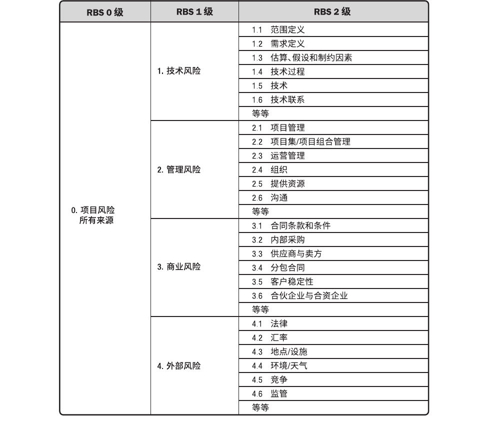
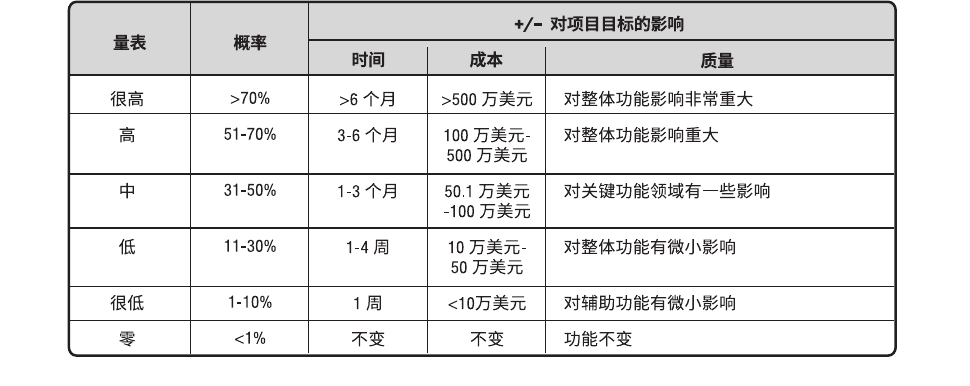
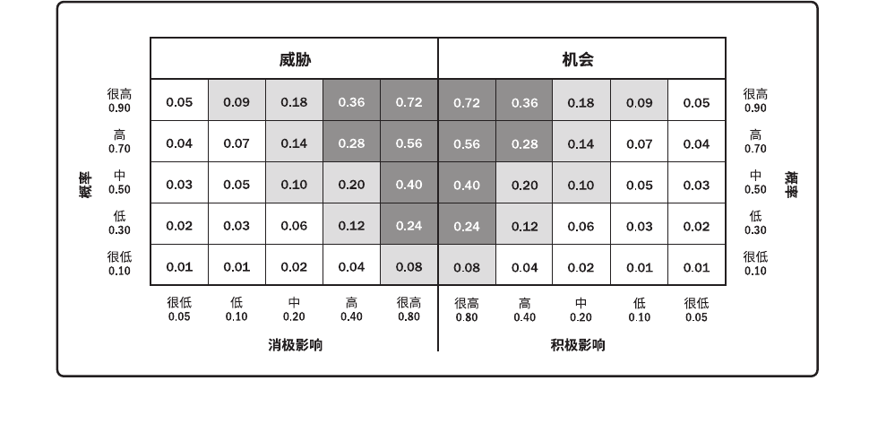

#### 采购管理计划

采购管理计划包含要在采购过程中开展的各种活动。它应该记录是否要开展国际竞争性招标、国内竞争性招标、当地招标等。如果项目由外部资助，资金的来源和可用性应符合采购管理计划和项目进度计划的规定。

采购管理计划可包括以下内容：
- 如何协调采购与项目的其他工作，例如，项目进度计划制定和控制；
- 开展重要采购活动的时间表；
- 用于管理合同的采购测量指标；
- 与采购有关的相关方角色和职责；如果执行组织有采购部，项目团队拥有的职权和受到的限制；
- 可能影响采购工作的制约因素和假设条件；
- 司法管辖权和付款货币；
- 是否需要编制独立估算，以及是否应将其作为评价标准；
- 风险管理事项，包括对履约保函或保险合同的要求，以减轻某些项目风险；
- 拟使用的预审合格的卖方（如果有）。

根据每个项目的需要，采购管理计划可以是正式或非正式的，非常详细或高度概括的。

#### 相关方参与计划

相关方参与计划是项目管理计划的组成部分。它确定用于促进相关方有效参与决策和执行的策略和行动。

相关方参与计划可包括（但不限于）调动个人或相关方参与的特定策略或方法。

基于项目的需要和相关方的期望，相关方参与计划可以是正式或非正式的，非常详细或高度概括的。

### 三大基准

#### 范围基准

范围基准是经过批准的范围说明书、WBS和相应的WBS词典，只有通过正式的变更控制程序才能进行变更，它被用作比较的基础。

范围基准是项目管理计划的组成部分，包括：
- 项目范围说明书。项目范围说明书包括对项目范围、主要可交付成果、假设条件和制约因素的描述。
- WBS。WBS 是对项目团队为实现项目目标、创建所需可交付成果而需要实施的全部工作范围的层级分解。工作分解结构每向下分解一层，代表对项目工作更详细的定义。
- 工作包。WBS 的最低层级是带有独特标识号的工作包。这些标识号为进行成本、进度和资源信息的逐层汇总提供了层级结构，构成账户编码。每个工作包都是控制账户的一部分，而控制账户则是一个管理控制点。在该控制点上，把范围、预算和进度加以整合，并与挣值相比较，以测量绩效。控制账户拥有两个或更多工作包，但每个工作包只与一个控制账户关联。
- 规划包。一个控制账户可以包含一个或多个规划包，其是一种低于控制账户而高于工作包的工作分解结构组件，工作内容已知，但详细的进度活动未知。
- WBS 词典。WBS 词典是针对 WBS 中的每个组件，详细描述可交付成果、活动和进度信息的文件。WBS 词典对 WBS 提供支持，其中大部分信息由其他过程创建，然后在后期添加到词典中。WBS 词典中的内容可能包括（但不限于）：账户编码标识；工作描述；假设条件和制约因素；负责的组织；进度里程碑；相关的进度活动；所需资源；成本估算；质量要求；验收标准；技术参考文献；协议信息。

#### 进度基准

进度基准是经过批准的进度模型，只有通过正式的变更控制程序才能进行变更，用作与实际结果进行比较的依据。经相关方接受和批准，进度基准包含基准开始日期和基准结束日期。在监控过程中，将用实际开始和完成日期与批准的基准日期进行比较，以确定是否存在偏差。进度基准是项目管理计划的组成部分。

#### 成本基准

成本基准是经过批准的、按时间段分配的项目预算，不包括任何管理储备，只有通过正式的变更控制程序才能变更，用作与实际结果进行比较的依据。成本基准是不同进度活动经批准的预算的总和。

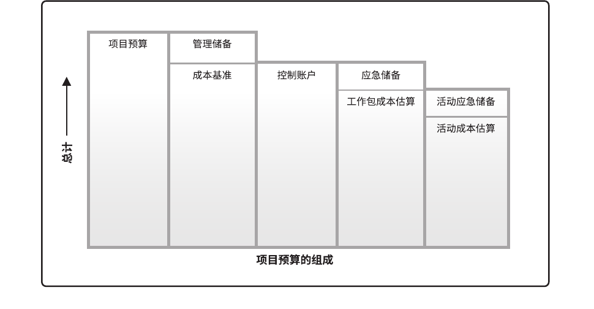
项目预算和成本基准的各个组成部分，如上图所示。先汇总各项目活动的成本估算及其应急储备，得到相关工作包的成本；然后汇总各工作包的成本估算及其应急储备，得到控制账户的成本；接着再汇总各控制账户的成本，得到成本基准。

由于成本基准中的成本估算与进度活动直接关联，因此就可按时间段分配成本基准，得到一条 S 曲线，如下图所示。对于使用挣值管理的项目，成本基准指的是绩效测量基准。
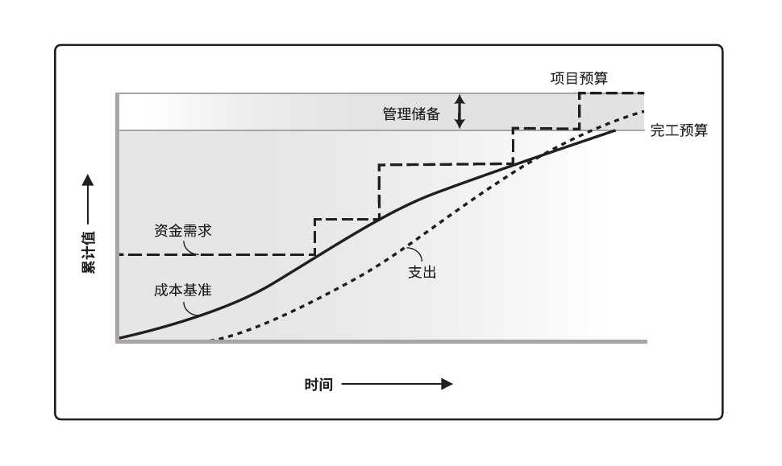

最后，在成本基准之上增加管理储备，得到项目预算。当出现有必要动用管理储备的变更时，则应该在获得变更控制过程的批准之后，把适量的管理储备移入成本基准中。

### 其他组件

#### 变更管理计划

描述在整个项目期间如何正式审批和采纳变更请求。

#### 配置管理计划

描述如何记录和更新项目的特定信息，以及该记录和更新哪些信息，以保持产品、服务或成果的一致性和（或）有效性。

#### 绩效测量基准

经过整合的项目范围、进度和成本计划，用作项目执行的比较依据，以测量和管理项目绩效。

#### 项目生命周期

描述项目从开始到结束所经历的一系列阶段。

#### 开发方法

描述产品、服务或成果的开发方法，例如预测、迭代、敏捷或混合型模式。

#### 管理审查

确定项目经理和有关相关方审查项目进展的时间点，以考核绩效是否符合预期，或者确定是否有必要采取预防或纠正措施。

## 项目文件

> iceman注：项目文件是指出现在“整合管理-制定项目管理计划-输出”中的33个文件。严格地说，项目文件还包括后文的“[其他文件](#其他文件)”。个人猜测，列出的33个文件，都是内部流转、无需对外的文件；在“其他文件”中，采购相关、交付成果相关、协议等，都与外部有关联。

项目文件不属于项目管理计划，但它们也是实现高效管理所必需的文件。包括（共33种）：活动属性、活动清单、假设日志、估算依据、变更日志、成本估算、成本预测、持续时间估算、问题日志、经验教训登记册、里程碑清单、实物资源分配单、项目日历、项目沟通记录、项目进度计划、项目进度网络图、项目范围说明书、项目团队派工单、质量控制测量结果、质量测量指标、质量报告、需求文件、需求跟踪矩阵、资源分解结构、资源日历、资源需求、风险登记册、风险报告、进度数据、进度预测、相关方登记册、团队章程、测试与评估文件。

| 知识领域 | 过程之启动 | 过程之规划 | 过程之执行 | 过程之监控 | 过程之收尾 |
|---------|----------|-----------|----------|-----------|----------|
| 整合 | 制定项目章程(**假设日志**) | 指定项目管理计划 | 指导与管理项目工作(**问题日志**) 管理项目知识(**经验教训登记册**) | 监控项目工作 实施整体变更控制 | 结束项目或阶段 |
| 范围 |  | 规划范围管理 收集需求(**需求文件**/**需求跟踪矩阵**) 定义范围(**项目范围说明书**) 创建WBS(**工作分解结构**) |  | 确认范围 控制范围 |  |
| 进度 |  | 规划进度管理 定义活动(**活动属性**/**活动清单**/**里程碑清单**) 排列活动顺序(**项目进度网络图**) 估算活动持续时间(**持续时间估算**/**估算依据**) 制定进度计划(**项目日历**/**项目进度计划**/**进度数据**) |  | 控制进度(**进度预测**) |  |
| 成本 |  | 规划成本管理 估算成本(**估算依据**/**成本估算**) 制定预算 |  | 控制成本(**成本预测**) |  |
| 质量 |  | 规划质量管理(**质量测量指标**) | 管理质量(**质量报告**/**测试与评估文件**) | 控制质量(**质量控制测量结果**) |  |
| 资源 |  | 规划资源管理(**团队章程**) 估算活动资源(**估算依据**/**资源需求**/**资源分解结构**) | 获取资源(**实物资源分配单**/**资源日历**/**项目团队派工单**) 建设团队 管理团队 | 控制资源 |  |
| 沟通 |  | 规划沟通管理 | 管理沟通(**项目沟通记录**) | 监督沟通 |  |
| 风险 |  | 规划风险管理 识别风险(**风险登记册**/**风险报告**) 实施定性风险分析 实施定量风险分析 规划风险应对 | 实施风险应对 | 监督风险 |  |
| 采购 |  | 规划采购管理 | 实施采购 | 控制采购 |  |
| 相关方 | 识别相关方(**相关方登记册**) | 规划相关方参与 | 管理相关方参与 | 监督相关方参与 |  |
| 所有管理 |  |  | **变更日志** | **变更日志** |  |

### 整合

#### 协议

协议用于定义启动项目的初衷。协议有多种形式，包括合同、谅解备忘录（MOUs）、服务水平协议（SLA）、协议书、意向书、口头协议、电子邮件或其他书面协议。为外部客户做项目时，通常就以合同的形式出现。

#### 假设日志

通常，在项目启动之前编制商业论证时，识别高层级的战略和运营假设条件与制约因素。这些假设条件与制约因素应纳入项目章程。较低层级的活动和任务假设条件在项目期间随着诸如定义技术规范、估算、进度和风险等活动的开展而生成。假设日志用于记录整个项目生命周期中的所有假设条件和制约因素。

#### 问题日志

在整个项目生命周期中，项目经理通常会遇到问题、差距、不一致或意外冲突。项目经理需要采取某些行动加以处理，以免影响项目绩效。问题日志是一种记录和跟进所有问题的项目文件，所需记录和跟进的内容可能包括：
- 问题类型；
- 问题提出者和提出时间；
- 问题描述；
- 问题优先级；
- 由谁负责解决问题；
- 目标解决日期；
- 问题状态；
- 最终解决情况。

问题日志可以帮助项目经理有效跟进和管理问题，确保它们得到调查和解决。在整个项目生命周期应该随同监控活动更新问题日志。

#### 经验教训登记册

经验教训登记册可以包含情况的类别和描述，经验教训登记册还可包括与情况相关的影响、建议和行动方案。经验教训登记册可以记录遇到的挑战、问题、意识到的风险和机会，或其他适用的内容。

经验教训登记册在项目早期创建。因此，在整个项目期间，它可以作为很多过程的输入，也可以作为输出而不断更新。参与工作的个人和团队也参与记录经验教训。可以通过视频、图片、音频或其他合适的方式记录知识，确保有效吸取经验教训。

在项目或阶段结束时，把相关信息归入经验教训知识库，成为组织过程资产的一部分。

#### 最终报告

用最终报告总结项目绩效，其中可包含诸如以下信息：
- 项目或阶段的概述；
- 范围目标、范围的评估标准，以及证明达到完工标准的证据；
- 质量目标、项目和产品质量的评估标准、相关核实信息和实际里程碑交付日期以及偏差原因；
- 成本目标，包括可接受的成本区间、实际成本，以及产生任何偏差的原因；
- 最终产品、服务或成果的确认信息的总结。
- 进度计划目标包括成果是否实现项目所预期的效益。如果在项目结束时未能实现效益，则指出效益实现程度并预计未来实现情况。
- 关于最终产品、服务或成果如何满足商业计划所述业务需求的概述。如果在项目结束时未能满足业务需求，则指出需求满足程度并预计业务需求何时能够得到满足。
- 关于项目过程中发生的风险或问题及其解决情况的概述。

### 范围

#### 需求文件

需求文件描述各种单一需求将如何满足与项目相关的业务需求。一开始可能只有高层级的需求，然后随着有关需求信息的增加而逐步细化。只有明确的（可测量和可测试的）、可跟踪的、完整的、相互协调的，且主要相关方愿意认可的需求，才能作为基准。需求文件的格式多种多样，既可以是一份按相关方和优先级分类列出全部需求的简单文件，也可以是一份包括内容提要、细节描述和附件等的详细文件。

许多组织把需求分为不同的种类，如业务解决方案和技术解决方案。前者是相关方的需要，后者是指如何实现这些需要。把需求分成不同的类别，有利于对需求进行进一步完善和细化。需求的类别包括：
- 业务需求。整个组织的高层级需要，例如，解决业务问题或抓住业务机会，以及实施项目的原因。
- 相关方需求。相关方或相关方群体的需要。
- 解决方案需求。为满足业务需求和相关方需求，产品、服务或成果必须具备的特性、功能和特征。解决方案需求又进一步分为功能需求和非功能需求：
  - 功能需求。功能需求描述产品应具备的功能，例如，产品应该执行的行动、流程、数据和交互。
  - 非功能需求。非功能需求是对功能需求的补充，是产品正常运行所需的环境条件或质量要求，例如，可靠性、保密性、性能、安全性、服务水平、可支持性、保留或清除等。
- 过渡和就绪需求。这些需求描述了从“当前状态”过渡到“将来状态”所需的临时能力，如数据转换和培训需求。
- 项目需求。项目需要满足的行动、过程或其他条件，例如里程碑日期、合同责任、制约因素等。
- 质量需求。用于确认项目可交付成果的成功完成或其他项目需求的实现的任何条件或标准，例如测试、认证、确认等。

#### 需求跟踪矩阵

需求跟踪矩阵是把产品需求从其来源连接到能满足需求的可交付成果的一种表格。使用需求跟踪矩阵，把每个需求与业务目标或项目目标联系起来，有助于确保每个需求都具有商业价值。需求跟踪矩阵提供了在整个项目生命周期中跟踪需求的一种方法，有助于确保需求文件中被批准的每项需求在项目结束的时候都能交付。最后，需求跟踪矩阵还为管理产品范围变更提供了框架。

跟踪需求包括（但不限于）：
- 业务需要、机会、目的和目标；
- 项目目标；
- 项目范围和 WBS 可交付成果；
- 产品设计；
- 产品开发；
- 测试策略和测试场景；
- 高层级需求到详细需求。

应在需求跟踪矩阵中记录每个需求的相关属性，这些属性有助于明确每个需求的关键信息。需求跟踪矩阵中记录的典型属性包括唯一标识、需求的文字描述、收录该需求的理由、所有者、来源、优先级别、版本、当前状态（如进行中、已取消、已推迟、新增加、已批准、被分配和已完成）和状态日期。为确保相关方满意，可能需要增加一些补充属性，如稳定性、复杂性和验收标准。

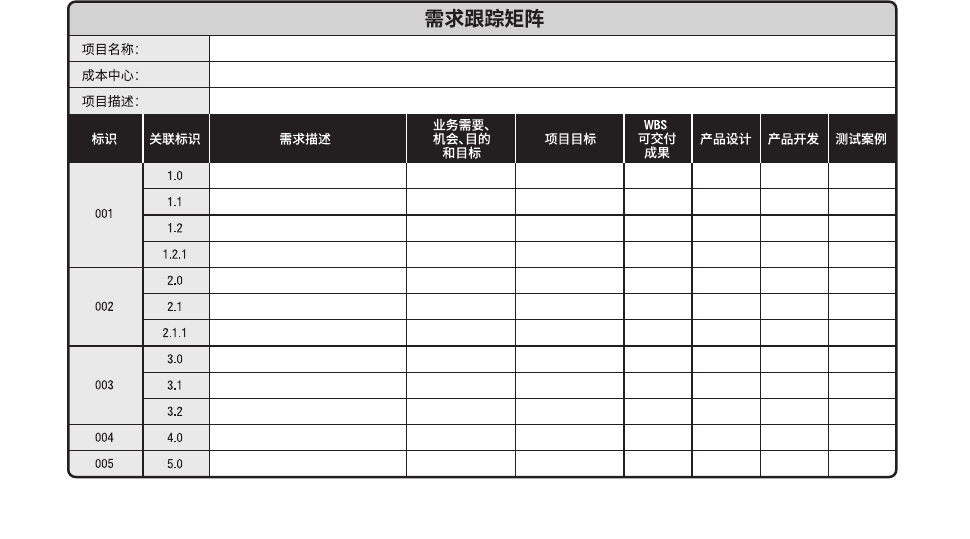

#### 项目范围说明书

项目范围说明书是对项目范围、主要可交付成果、假设条件和制约因素的描述。它记录了整个范围，包括项目和产品范围；详细描述了项目的可交付成果；还代表项目相关方之间就项目范围所达成的共识。为便于管理相关方的期望，项目范围说明书可明确指出哪些工作不属于本项目范围。项目范围说明书使项目团队能进行更详细的规划，在执行过程中指导项目团队的工作，并为评价变更请求或额外工作是否超过项目边界提供基准。

项目范围说明书描述要做和不要做的工作的详细程度，决定着项目管理团队控制整个项目范围的有效程度。详细的项目范围说明书包括以下内容（可能直接列出或参引其他文件）：
- 产品范围描述。逐步细化在项目章程和需求文件中所述的产品、服务或成果的特征。
- 可交付成果。为完成某一过程、阶段或项目而必须产出的任何独特并可核实的产品、成果或服务能力，可交付成果也包括各种辅助成果，如项目管理报告和文件。对可交付成果的描述可略可详。
- 验收标准。可交付成果通过验收前必须满足的一系列条件。
- 项目的除外责任。识别排除在项目之外的内容。明确说明哪些内容不属于项目范围，有助于管理相关方的期望及减少范围蔓延。

虽然项目章程和项目范围说明书的内容存在一定程度的重叠，但它们的详细程度完全不同。项目章程包含高层级的信息，而项目范围说明书则是对范围组成部分的详细描述，这些组成部分需要在项目过程中渐进明细。

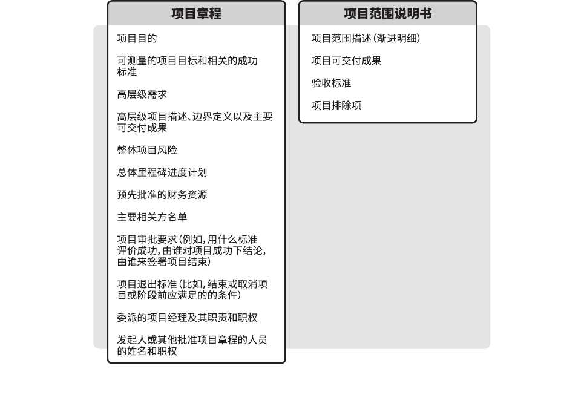

### 进度

#### 活动属性

活动属性是指每项活动所具有的多重属性，用来扩充对活动的描述，活动属性随时间演进。在项目初始阶段，活动属性包括唯一活动标识 (ID)、WBS 标识和活动标签或名称；在活动属性编制完成时，活动属性可能包括活动描述、紧前活动、紧后活动、逻辑关系、提前量和滞后量、资源需求、强制日期、制约因素和假设条件。活动属性可用于识别开展工作的地点、编制开展活动的项目日历，以及相关的活动类型。活动属性还可用于编制进度计划。根据活动属性，可在报告中以各种方式对计划进度活动进行选择、排序和分类。

#### 活动清单

活动清单包含项目所需的进度活动。对于使用滚动式规划或敏捷技术的项目，活动清单会在项目进展过程中得到定期更新。活动清单包括每个活动的标识及工作范围详述，使项目团队成员知道需要完成什么工作。

#### 里程碑清单

里程碑是项目中的重要时点或事件，里程碑清单列出了所有项目里程碑，并指明每个里程碑是强制性的（如合同要求的）还是选择性的（如根据历史信息确定的）。里程碑的持续时间为零，因为它们代表的是一个重要时间点或事件。

#### 项目进度网络图

项目进度网络图是表示项目进度活动之间的逻辑关系（也叫依赖关系）的图形。项目进度网络图可手工或借助项目管理软件来绘制，可包括项目的全部细节，也可只列出一项或多项概括性活动。项目进度网络图应附有简要文字描述，说明活动排序所使用的基本方法。在文字描述中，还应该对任何异常的活动序列做详细说明。

带有多个紧前活动的活动代表路径汇聚，而带有多个紧后活动的活动则代表路径分支。带汇聚和分支的活动受到多个活动的影响或能够影响多个活动，因此存在更大的风险。I 活动被称为“路径汇聚”，因为它拥有多个紧前活动，而 K 活动被称为“路径分支”，因为它拥有多个紧后活动。

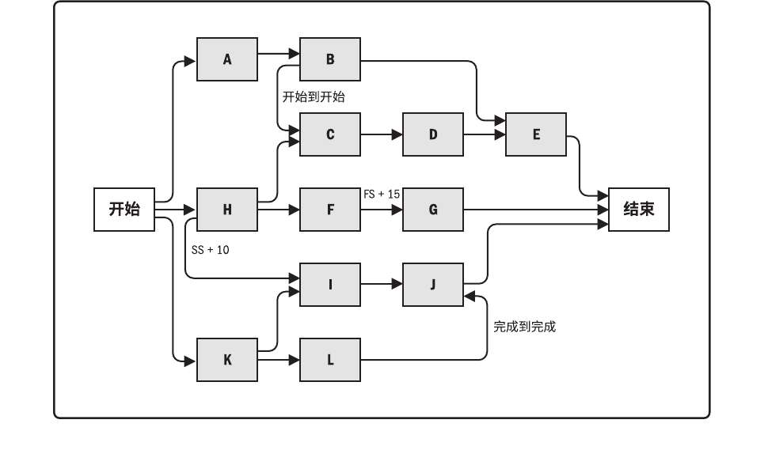

#### 持续时间估算

持续时间估算是对完成某项活动、阶段或项目所需的工作时段数的定量评估，其中并不包括任何滞后量，但可指出一定的变动区间。例如：
- 2周±2天，表明活动至少需要8天，最多不超过12天（假定每周工作5天）；
- 超过3周的概率为15%，表明该活动将在3周内（含3周）完工的概率为85%。

#### 进度估算依据

持续时间估算所需的支持信息的数量和种类，因应用领域而异。不论其详细程度如何，支持性文件都应该清晰、完整地说明持续时间估算是如何得出的。  
持续时间估算的支持信息可包括：
- 关于估算依据的文件（如估算是如何编制的）；
- 关于全部假设条件的文件；
- 关于各种已知制约因素的文件；
- 对估算区间的说明（如“±10%”），以指出预期持续时间的所在区间；
- 对最终估算的置信水平的说明；
- 有关影响估算的单个项目风险的文件。

#### 项目日历

在项目日历中规定可以开展进度活动的可用工作日和工作班次，它把可用于开展进度活动的时间段（按天或更小的时间单位）与不可用的时间段区分开来。在一个进度模型中，可能需要采用不止一个项目日历来编制项目进度计划，因为有些活动需要不同的工作时段。因此，可能需要对项目日历进行更新。

#### 项目进度计划

项目进度计划是进度模型的输出，为各个相互关联的活动标注了计划日期、持续时间、里程碑和所需资源等星系。项目进度计划中至少要包括每个活动的计划开始日期与计划完成日期。即使在早期阶段就进行了资源规划，但在未确认资源分配和计划开始与完成日期之前，项目进度计划都只是初步的。一般要在项目管理计划编制完成之前进行这些确认。还可以编制一份目标项目进度模型，规定每个活动的目标开始日期与目标完成日期。项目进度计划可以是概括（有时称为主进度计划或里程碑进度计划）或详细的。虽然项目进度计划可用列表形式，但图形方式更常见。可以采用以下一种或多种图形来呈现：
- 横道图。横道图也称为“甘特图”，是展示进度信息的一种图表方式。在横道图中，纵向列示活动，横向列示日期，用横条表示活动自开始日期至完成日期的持续时间。横道图相对易读，比较常用。它可能会包括浮动时间，也可能不包括，具体取决于受众。为了便于控制，以及与管理层进行沟通，可在里程碑或横跨多个相关联的工作包之间，列出内容更广、更综合的概括性活动，并在横道图报告中显示。见下图中的“概括性进度计划”部分，它按 WBS 的结构罗列相关活动。
- 里程碑图。与横道图类似，但仅标示出主要可交付成果和关键外部接口的计划开始或完成日期，见下图的“里程碑进度计划”部分。
- 项目进度网络图。这些图形通常用活动节点法绘制，没有时间刻度，纯粹显示活动及其相互关系，有时也称为“纯逻辑图”。项目进度网络图也可以是包含时间刻度的进度网络图，有时称为“逻辑横道图”，如下图中的详细进度计划所示。这些图形中有活动日期，通常会同时展示项目网络逻辑和项目关键路径活动等信息。本例子也显示了如何通过一系列相关活动来对每个工作包进行规划。项目进度网络图的另一种呈现形式是“时标逻辑图”，其中包含时间刻度和表示活动持续时间的横条，以及活动之间的逻辑关系。它们用于优化展现活动之间的关系，许多活动都可以按顺序出现在图的同一行中。

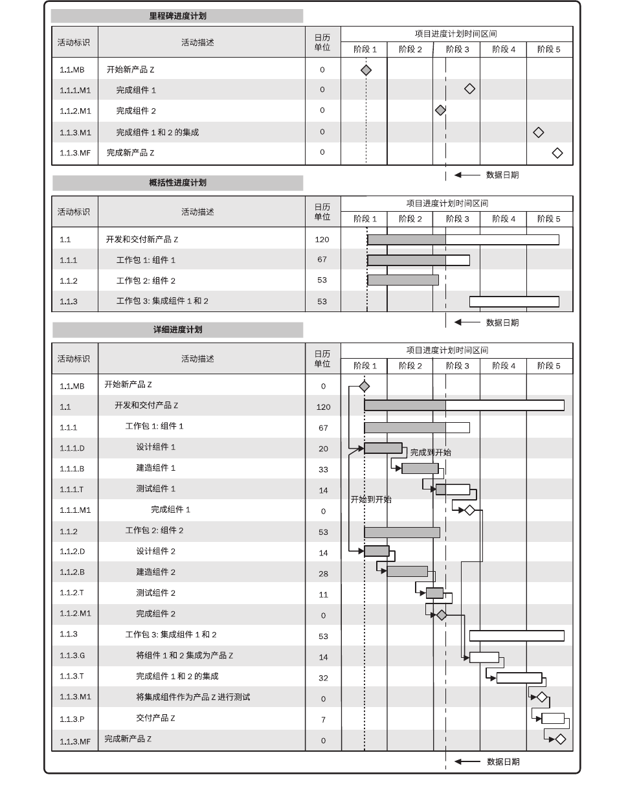
上图是一个正在执行的示例项目的进度计划，工作进展是通过截止日期或状态日期表示的。针对一个简单的项目，进度计划有三种形式：（1）里程碑进度计划，也叫里程碑图；（2）概括性进度计划，也叫横道图；（3）详细进度计划，也叫项目进度关联横道图。

#### 进度数据

项目进度模型中的进度数据是用以描述和控制进度计划的信息集合。进度数据至少包括进度里程碑、进度活动、活动属性，以及已知的全部假设条件与制约因素，而所需的其他数据因应用领域而异。经常可用作支持细节的信息包括（但不限于）：
- 按时段计列的资源需求，往往以资源直方图表示；
- 备选的进度计划，如最好情况或最坏情况下的进度计划、经资源平衡或未经资源平衡的进度计划、有强制日期或无强制日期的进度计划；
- 使用的进度储备。

进度数据还可包括资源直方图、现金流预测，以及订购与交付进度安排等其他相关信息。

#### 进度预测

进度更新即进度预测，指根据已有的信息和知识，对项目未来的情况和事件进行的估算或预计。随着项目执行，应该基于工作绩效信息，更新和重新发布预测。这些信息基于项目的过去绩效，并取决于纠正或预防措施所期望的未来绩效，可能包括挣值绩效指数，以及可能在未来对项目造成影响的进度储备信息。

### 成本

#### 成本估算

成本估算包括对完成项目工作可能需要的成本、应对已识别风险的应急储备，以及应对计划外工作的管理储备的量化估算。成本估算可以是汇总的或详细分列的。成本估算应覆盖项目所使用的全部资源，包括（但不限于）直接人工、材料、设备、服务、设施、信息技术，以及一些特殊的成本种类，如融资成本（包括利息）、通货膨胀补贴、汇率或成本应急储备。如果间接成本也包含在项目估算中，则可在活动层次或更高层次上计列间接成本。

#### 成本估算依据

成本估算所需的支持信息的数量和种类，因应用领域而异，不论其详细程度如何，支持性文件都应该清晰、完整地说明成本估算是如何得出的。  
成本估算的支持信息可包括：
- 关于估算依据的文件（如估算是如何编制的）；
- 关于全部假设条件的文件；
- 关于各种已知制约因素的文件；
- 有关已识别的、在估算成本时应考虑的风险的文件；
- 对估算区间的说明（如“10,000美元 ±10%”就说明了预期成本的所在区间）；
- 对最终估算的置信水平的说明。

#### 项目资金需求

根据成本基准，确定总资金需求和阶段性（如季度或年度）资金需求。成本基准中既包括预计支出及预计债务。项目资金通常以增量的方式投入，并且可能是非均衡的，呈现出阶梯状。如果有管理储备，则总资金需求等于成本基准加管理储备。在资金需求文件中，也可说明资金来源。

#### 成本预测

无论是计算得出的 EAC 值，还是自下而上估算的 EAC 值，都需要记录下来，并传达给相关方。

### 质量

#### 质量测量指标

质量测量指标专用于描述项目或产品属性，以及控制质量过程将如何验证符合程度。质量测量指标的例子包括按时完成的任务的百分比、以 CPI 测量的成本绩效、故障率、识别的日缺陷数量、每月总停机时间、每个代码行的错误、客户满意度分数，以及测试计划所涵盖的需求的百分比（即测试覆盖度）。

#### 质量报告

质量报告可能是图形、数据或定性文件，其中包含的信息可帮助其他过程和部门采取纠正措施，以实现项目质量期望。质量报告的信息可以包含团队上报的质量管理问题，针对过程、项目和产品的改善建议，纠正措施建议（包括返工、缺陷/漏洞补救、100% 检查等），以及在控制质量过程中发现的情况的概述。

#### 测试与评估文件

可基于行业需求和组织模板创建测试与评估文件。它们是控制质量过程的输入，用于评估质量目标的实现情况。这些文件可能包括专门的核对单和详尽的需求跟踪矩阵。

#### 质量控制测量结果

控制质量的测量结果是对质量控制活动的结果的书面记录，应以质量管理计划所确定的格式加以记录。

### 资源

#### 团队章程

团队章程是为团队创建团队价值观、共识和工作指南的文件。团队章程可能包括（但不限于）：
- 团队价值观；
- 沟通指南；
- 决策标准和过程；
- 冲突处理过程；
- 会议指南；
- 团队共识。

团队章程对项目团队成员的可接受行为确定了明确的期望。尽早认可并遵守明确的规则，有助于减少误解，提高生产力；讨论诸如行为规范、沟通、决策、会议礼仪等领域，团队成员可以了解彼此重要的价值观。由团队制定或参与制定的团队章程可发挥最佳效果。所有项目团队成员都分担责任，确保遵守团队章程中规定的规则。可定期审查和更新团队章程，确保团队始终了解团队基本规则，并指导新成员融入团队。

#### 资源需求

资源需求识别了各个工作包或工作包中每个活动所需的资源类型和数量，可以汇总这些需求，以估算每个工作包、每个 WBS 分支以及整个项目所需的资源。资源需求描述的细节数量与具体程度因应用领域而异，而资源需求文件也可包含为确定所用资源的类型、可用性和所需数量所做的假设。

#### 资源估算依据

资源估算所需的支持信息的数量和种类，因应用领域而异。但不论其详细程度如何，支持性文件都应该清晰完整地说明资源估算是如何得出的。  
资源估算的支持信息可包括：
- 估算方法；
- 用于估算的资源，如以往类似项目的信息；
- 与估算有关的假设条件；
- 已知的制约因素；
- 估算范围；
- 估算的置信水平；
- 有关影响估算的已识别风险的文件。

#### 资源分解结构

资源分解结构是资源依类别和类型的层级展现。资源类别包括（但不限于）人力、材料、设备和用品，资源类型则包括技能水平、要求证书、等级水平或适用于项目的其他类型。在规划资源管理过程中，资源分解结构用于指导项目的分类活动。在这一过程中，资源分解结构是一份完整的文件，用于获取和监督资源。

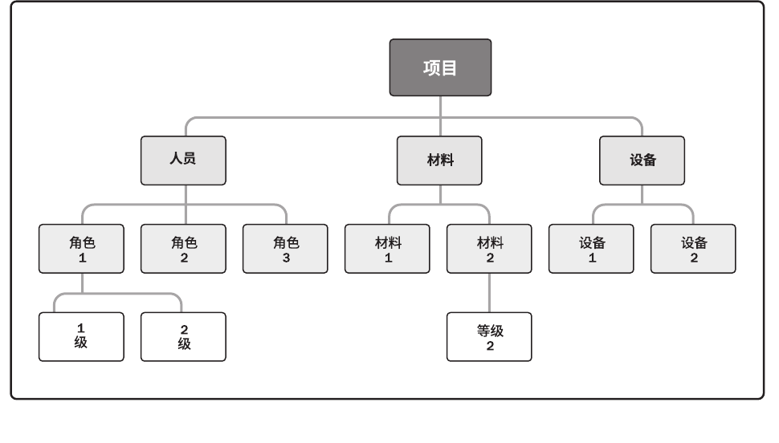

#### 实物资源分配单

实物资源分配单记录了项目将使用的材料、设备、用品、地点和其他实物资源。

#### 资源日历

资源日历识别了每种具体资源可用时的工作日、班次、正常营业的上下班时间、周末和公共假期。在规划活动期间，潜在的可用资源信息（如团队资源、设备和材料）用于估算资源可用性。资源日历规定了在项目期间确定的团队和实物资源何时可用、可用多久。这些信息可以在活动或项目层面建立，这考虑了诸如资源经验和/或技能水平以及不同地理位置等属性。

#### 项目团队派工单

项目团队派工单记录了团队成员及其在项目中的角色和职责，可包括项目团队名录，还需要把人员姓名插入项目管理计划的其他部分，如项目组织图和进度计划。

#### 团队绩效评价

随着项目团队建设工作（如培训、团队建设和集中办公等）的开展，项目管理团队应该对项目团队的有效性进行正式或非正式的评价。有效的团队建设策略和活动可以提高团队绩效，从而提高实现项目目标的可能性。

评价团队有效性的指标可包括：
- 个人技能的改进，从而使成员更有效地完成工作任务；
- 团队能力的改进，从而使团队成员更好地开展工作；
- 团队成员离职率的降低；
- 团队凝聚力的加强，从而使团队成员公开分享信息和经验，并互相帮助来提高项目绩效。

通过对团队整体绩效的评价，项目管理团队能够识别出所需的特殊培训、教练、辅导、协助或改变，以提高团队绩效。项目管理团队也应该识别出合适或所需的资源，以执行和实现在绩效评价过程中提出的改进建议。

### 沟通

#### 项目沟通记录

项目沟通工件可包括（但不限于）：绩效报告、可交付成果的状态、进度进展、产生的成本、演示，以及相关方需要的其他信息。

### 风险

#### 风险登记册

风险登记册记录已识别单个项目风险的详细信息。随着实施定性风险分析、规划风险应对、实施风险应对和监督风险等过程的开展，这些过程的结果也要记进风险登记册。取决于具体的项目变量（如规模和复杂性），风险登记册可能包含有限或广泛的风险信息。

当完成识别风险过程时，风险登记册的内容可能包括（但不限于）：
- 已识别风险的清单。在风险登记册中，每项单个项目风险都被赋予一个独特的标识号。要以所需的详细程度对已识别风险进行描述，确保明确理解。可以使用结构化的风险描述，来把风险本身与风险原因及风险影响区分开来。
- 潜在风险责任人。如果已在识别风险过程中识别出潜在的风险责任人，就要把该责任人记录到风险登记册中。随后将由实施定性风险分析过程进行确认。
- 潜在风险应对措施清单。如果已在识别风险过程中识别出某种潜在的风险应对措施，就要把它记录到风险登记册中。随后将由规划风险应对过程进行确认。

根据风险管理计划规定的风险登记册格式，可能还要记录关于每项已识别风险的其他数据，包括：简短的风险名称、风险类别、当前风险状态、一项或多项原因、一项或多项对目标的影响、风险触发条件（显示风险即将发生的事件或条件）、受影响的 WBS组件，以及时间信息（风险何时识别、可能何时发生、何时可能不再相关，以及采取行动的最后期限）。

#### 风险报告

风险报告提供关于整体项目风险的信息，以及关于已识别的单个项目风险的概述信息。在项目风险管理过程中，风险报告的编制是一项渐进式的工作。随着实施定性风险分析、实施定量风险分析、规划风险应对、实施风险应对和监督风险过程的完成，这些过程的结果也需要记录在风险登记册中。

在完成识别风险过程时，风险报告的内容可能包括（但不限于）：
- 整体项目风险的来源。说明哪些是整体项目风险敞口的最重要驱动因素。
- 关于已识别单个项目风险的概述信息。例如，已识别的威胁与机会的数量、风险在风险类别中的分布情况、测量指标和发展趋势。

根据风险管理计划中规定的报告要求，风险报告中可能还包含其他信息。

### 采购

#### 采购策略

一旦完成自制或外购分析，并决定从项目外部渠道采购，就应制定一套采购策略。应该在采购策略中规定项目交付方法、具有法律约束力的协议类型，以及如何在采购阶段推动采购进展。
- 交付方法。对专业服务项目和建筑施工项目，应该采用不同的交付方法。
  - 专业服务项目的交付方法包括：买方或服务提供方不得分包、买方或服务提供方可以分包、买方和服务提供方设立合资企业、买方或服务提供方仅充当代表。
  - 而工业或商业施工项目的交付方法包括（但不限于）：交钥匙式、设计-建造 (DB)、设计-招标-建造 (DBB)、设计-建造-运营 (DBO)、建造-拥有-运营-转让 (BOOT)，及其他。
- 合同支付类型。合同支付类型与项目交付方法无关，需要与采购组织的内部财务系统相协调。它们包括（但不限于）以下合同类型及其变种：总价、固定总价、成本加奖励费用、成本加激励费用、工料、目标成本及其他。
  - 总价合同适用于工作类型可预知、需求能清晰定义且不太可能变更的情况；
  - 成本补偿合同适用于工作不断演进、很可能变更或未明确定义的情况；
  - 激励和奖励费用可用于协调买方和卖方的目标。
- 采购阶段。采购策略也可以包括与采购阶段有关的信息，这种信息可能包括：
  - 采购工作的顺序安排或阶段划分，每个阶段的描述，以及每个阶段的具体目标；
  - 用于监督的采购绩效指标和里程碑；
  - 从一个阶段过渡到下一个阶段的标准；
  - 用于追踪采购进展的监督和评估计划；
  - 向后续阶段转移知识的过程。

#### 招标文件

招标文件用于向潜在卖方征求建议书。如果主要依据价格来选择卖方（如购买商业或标准产品时），通常就使用标书、投标或报价等术语；如果其他考虑因素（如技术能力或技术方法）至关重要，则通常使用建议书之类的术语。具体使用的采购术语也可能因行业或采购地点而异。

取决于所需的货物或服务，招标文件可以是信息邀请书、报价邀请书、建议邀请书，或其他适当的采购文件。使用不同文件的条件如下：
- 信息邀请书 (RFI)。如果需要卖方提供关于拟采购货物和服务的更多信息，就使用信息邀请书。随后一般还会使用报价邀请书或建议邀请书。
- 报价邀请书 (RFQ)。如果需要供应商提供关于将如何满足需求和（或）将需要多少成本的更多信息，就使用报价邀请书。
- 建议邀请书 (RFP)。如果项目中出现问题且解决办法难以确定，就使用建议邀请书。这是最正式的“邀请书”文件，需要遵守与内容、时间表，以及卖方应答有关的严格的采购规则。

买方拟定的采购文件不仅应便于潜在卖方做出准确、完整的应答，还要便于买方对卖方应答进行评价。采购文件会包括规定的应答格式、相关的采购工作说明书，以及所需的合同条款。

采购文件的复杂和详细程度应与采购的价值及相关的风险相符。采购文件既需要具备足够详细的信息，以确保卖方做出一致且适当的应答，同时它又要有足够的灵活度，让卖方为满足相同的要求而提出更好的建议。

#### 采购工作说明书

依据项目范围基准，为每次采购编制工作说明书（SOW），仅对将要包含在相关合同中的那一部分项目范围进行定义。工作说明书会充分详细地描述拟采购的产品、服务或成果，以便潜在卖方确定是否有能力提供此类产品、服务或成果。根据采购品的性质、买方的需求，或拟采用的合同形式，工作说明书的详细程度会有较大不同。工作说明书的内容包括：规格、所需数量、质量水平、绩效数据、履约期间、工作地点和其他要求。

采购工作说明书应力求清晰、完整和简练。它需要说明所需的附加服务，例如，报告绩效，或对采购品的后续运营支持。在采购过程中，应根据需要对工作说明书进行修订，直到它成为所签协议的一部分。

对于服务采购，可能会用“工作大纲 (TOR)”这个术语。与采购工作说明书类似，工作大纲通常包括以下内容：
- 承包商需要执行的任务，以及所需的协调工作；
- 承包商必须达到的适用标准；
- 需要提交批准的数据；
- 由买方提供给承包商的，将用于合同履行的全部数据和服务的详细清单（若适用）；
- 关于初始成果提交和审查（或审批）的进度计划。

#### 供方选择标准

在确定评估标准时，买方要努力确保选出的建议书将提供最佳质量的所需服务。供方选择标准可包括（但不限于）：
- 能力和潜能；
- 产品成本和生命周期成本；
- 交付日期；
- 技术专长和方法；
- 具体的相关经验；
- 用于响应工作说明书的工作方法和工作计划；
- 关键员工的资质、可用性和胜任力；
- 公司的财务稳定性；
- 管理经验；
- 知识转移计划，包括培训计划。

针对国际项目，评估标准还可包括“本地内容”要求，例如，在提议的关键员工中要有本国人。

针对不同的标准，可以用数值分数、颜色代码或书面描述，来说明卖方满足采购组织需求的程度。这些标准是加权系统的组成部分，可据此以加权打分的方法排列所有建议书的顺序，以便确定谈判的顺序，并与某个卖方签订合同。

#### 自制或外购决策

通过自制或外购分析，做出某项特定工作最好由项目团队自己完成，还是需要从外部渠道采购的决策。

#### 独立成本估算

对于大型的采购，采购组织可以自行准备独立估算，或聘用外部专业估算师做出成本估算，并将其作为评价卖方报价的对照基准。如果二者之间存在明显差异，则可能表明采购工作说明书存在缺陷或模糊，或者潜在卖方误解了或未能完全响应采购工作说明书。

#### 卖方建议书

卖方为响应采购文件包而编制的建议书，其中包含的基本信息将被评估团队用于选定一个或多个投标人（卖方）。如果卖方将提交价格建议书，最好要求他们将价格建议书与技术建议书分开。评估团队会根据供方选择标准审查每一份建议书，然后选出最能满足采购组织需求的卖方。

#### 采购文档

采购文档包含用于管理采购过程的完整支持性记录，包括工作说明书、支付信息、承包商工作绩效信息、计划、图纸和其他往来函件。

### 相关方

#### 相关方登记册

相关方登记册是识别相关方过程的主要输出。它记录关于已识别相关方的信息，包括（但不限于）：
- 身份信息。姓名、组织职位、地点、联系方式，以及在项目中扮演的角色。
- 评估信息。主要需求、期望、影响项目成果的潜力，以及相关方最能影响或冲击的项目生命周期阶段。
- 相关方分类。用内部或外部，作用、影响、权力或利益，上级、下级、外围或横向，或者项目经理选择的其他分类模型，进行分类的结果。

### 成果相关

#### 可交付成果

可交付成果是在某一过程、阶段或项目完成时，必须产出的任何独特并可核实的产品、成果或服务能力。它通常是为实现项目目标而完成的有形的组成部分，并可包括项目管理计划的组成部分。

一旦完成了可交付成果的第一个版本，就应该执行变更控制。用配置管理工具和程序来支持对可交付成果（如文件、软件和构件）的多个版本的控制。

作为指导与管理项目工作过程的输出的可交付成果将得到检查，并与项目范围说明书定义的验收标准做比较。

#### 核实的可交付成果

核实的可交付成果是指已经完成，并被控制质量过程检查为正确的可交付成果。

#### 验收的可交付成果

符合验收标准的可交付成果应该由客户或发起人正式签字批准。应该从客户或发起人那里获得正式文件，证明相关方对项目可交付成果的正式验收。这些文件将提交给结束项目或阶段过程。

#### 最终产品、服务或成果移交

项目交付的产品、服务或成果可转交给另一团队或组织，并由其在整个生命周期中进行运营、维护和支持。

### 变更相关

#### 变更请求

变更请求是关于修改任何文件、可交付成果或基准的正式提议。如果在开展项目工作时发现问题，就可提出变更请求，对项目政策或程序、项目或产品范围、项目成本或预算、项目进度计划、项目或产品结果的质量进行修改。其他变更请求包括必要的预防措施或纠正措施，用来防止以后的不利后果。任何项目相关方都可以提出变更请求，应该通过实施整体变更控制过程对变更请求进行审查和处理。变更请求源自项目内部或外部，是可选或由法律（合同）强制的。变更请求可能包括：
- 纠正措施。为使项目工作绩效重新与项目管理计划一致，而进行的有目的的活动。
- 预防措施。为确保项目工作的未来绩效符合项目管理计划，而进行的有目的的活动。
- 缺陷补救。为了修正不一致产品或产品组件的有目的的活动。
- 更新。对正式受控的项目文件或计划等进行的变更，以反映修改或增加的意见或内容。

#### 批准的变更请求

由项目经理、CCB或指定的团队成员，根据变更管理计划处理变更请求，做出批准、推迟或否决的决定。批准的变更请求应通过指导与管理项目工作过程加以实施。对于推迟或否决的变更请求，应通知提出变更请求的个人或小组。

以项目文件更新的形式，在变更日志中记录所有变更请求的处理情况。

#### 变更日志

变更日志用于记录项目期间发生的变更。

## 过程文件

在整个项目生命周期中需要定期收集和分析项目数据。项目数据和信息的主要术语包括：工作绩效数据、工作绩效信息、工作绩效报告。
> 执行过程获取工作绩效数据；控制过程获取工作绩效信息；整体项目控制获取工作绩效报告。
> 工作绩效报告，通知到项目团队成员和项目相关方。

### 工作绩效数据

工作绩效数据是在执行项目工作的过程中，从每个正在执行的活动中收集到的原始观察结果和测量值。数据通常是最低层次的细节，将交由其他过程从中提炼出信息。在工作执行过程中收集数据，再交由控制过程做进一步分析。

例如，工作绩效数据包括已完成的工作、关键绩效指标 (KPI)、技术绩效测量结果、进度活动的实际开始日期和完成日期、已完成的故事点、可交付成果状态、进度进展情况、变更请求的数量、缺陷的数量、实际发生的成本、实际持续时间等。

项目数据通常记录在项目管理信息系统(PMIS)。

### 工作绩效信息

在工作执行过程中收集工作绩效数据，再交由控制过程做进一步分析。将工作绩效数据与项目管理计划组件、项目文件和其他项目变量比较之后生成工作绩效信息。通过这种比较可以了解项目的执行情况。

在项目开始时，就在项目管理计划中规定关于范围、进度、预算和质量的具体工作绩效测量指标。项目期间通过控制过程收集绩效数据，与计划和其他变量比较，为工作绩效提供背景。

例如，关于成本的工作绩效数据可能包含已支出的资金，但必须与预算、已执行的工作、用于完成工作的资源以及资金使用计划比较之后才能有用。这些附加信息为确定项目是否符合预算或是否存在偏差提供了相应的情境；还有助于了解偏差的严重程度。通过与项目管理计划中的偏差临界值进行比较，就可以确定是否需要采取预防或纠正措施。对工作绩效数据和附加信息进行综合分析，可以为项目决策提供可靠的基础。

### 工作绩效报告

工作绩效信息可以用实体或电子形式加以合并、记录和分发。基于工作绩效信息，以实体或电子形式编制工作绩效报告，以制定决策、采取行动或引起关注。根据项目沟通管理计划，通过沟通过程向项目相关方发送工作绩效报告。

工作绩效报告的示例包括状态报告和进展报告。工作绩效报告可以包含挣值图表和信息、趋势线和预测、储备燃尽图、缺陷直方图、合同绩效信息和风险情况概述。可以表现为有助于引起关注、制定决策和采取行动的仪表指示图、热点报告、信号灯图或其他形式。
