<!-- TOC -->

- [项目管理知识](#项目管理知识)
  - [4.整合](#4整合)
    - [4.1制定项目章程](#41制定项目章程)
    - [4.2制定项目管理计划](#42制定项目管理计划)
    - [4.3指导与管理项目工作](#43指导与管理项目工作)
    - [4.4管理项目知识](#44管理项目知识)
    - [4.5监控项目工作](#45监控项目工作)
    - [4.6实施整体变更控制](#46实施整体变更控制)
    - [4.7结束项目或阶段](#47结束项目或阶段)
  - [5.范围](#5范围)
    - [5.1规划范围管理](#51规划范围管理)
    - [5.2收集需求](#52收集需求)
    - [5.3定义范围](#53定义范围)
    - [5.4创建WBS](#54创建WBS)
    - [5.5确认范围](#55确认范围)
    - [5.6控制范围](#56控制范围)
  - [6.进度](#6进度)
    - [6.1规划进度管理](#61规划进度管理)
    - [6.2定义活动](#62定义活动)
    - [6.3排列活动顺序](#63排列活动顺序)
    - [6.4估算活动持续时间](#64估算活动持续时间)
    - [6.5制定进度计划](#65制定进度计划)
    - [6.6控制进度](#66控制进度)
  - [7.成本](#7成本)
    - [7.1规划成本管理](#71规划成本管理)
    - [7.2估算成本](#72估算成本)
    - [7.3制定预算](#73制定预算)
    - [7.4控制成本](#74控制成本)
  - [8.质量](#8质量)
    - [8.1规划质量管理](#81规划质量管理)
    - [8.2管理质量](#82管理质量)
    - [8.3控制质量](#83控制质量)
  - [9.资源](#9资源)
    - [9.1规划资源管理](#91规划资源管理)
    - [9.2估算活动资源](#92估算活动资源)
    - [9.3获取资源](#93获取资源)
    - [9.4建设团队](#94建设团队)
    - [9.5管理团队](#95管理团队)
    - [9.6控制资源](#96控制资源)
  - [10.沟通](#10沟通)
    - [10.1规划沟通管理](#101规划沟通管理)
    - [10.2管理沟通](#102管理沟通)
    - [10.3监督沟通](#103监督沟通)
  - [11.风险](#11风险)
    - [11.1规划风险管理](#111规划风险管理)
    - [11.2识别风险](#112识别风险)
    - [11.3实施定性风险分析](#113实施定性风险分析)
    - [11.4实施定量风险分析](#114实施定量风险分析)
    - [11.5规划风险应对](#115规划风险应对)
    - [11.6实施风险应对](#116实施风险应对)
    - [11.7监督风险](#117监督风险)
  - [12.采购](#12采购)
    - [12.1规划采购管理](#121规划采购管理)
    - [12.2实施采购](#122实施采购)
    - [12.3控制采购](#123控制采购)
  - [13.相关方](#13相关方)
    - [13.1识别相关方](#131识别相关方)
    - [13.2规划相关方参与](#132规划相关方参与)
    - [13.3管理相关方参与](#133管理相关方参与)
    - [13.4监督相关方参与](#134监督相关方参与)
- [二、项目管理过程](#二项目管理过程)
  - [2.启动](#2启动)
  - [3.规划](#3规划)
  - [4.执行](#4执行)
  - [5.监控](#5监控)
  - [6.收尾](#6收尾)

<!-- /TOC -->

# 项目管理知识

## 4.整合

**项目整合管理包括对隶属于项目管理过程组的各种过程和项目管理活动进行识别、定义、组合、统一和协调的各个过程。**
在项目管理中，整合兼具统一、合并、沟通和建立联系的性质，这些行动应该贯穿项目始终。项目整合管理包括进行以下选择：
- 资源分配；
- 平衡竞争性需求；
- 研究各种备选方法；
- 为实现项目目标而裁剪过程；
- 管理各个项目管理知识领域之间的依赖关系。

项目整合管理过程包括：
- 制定项目章程 — 编写一份正式批准项目并授权项目经理在项目活动中使用组织资源的文件的过程。
- 制定项目管理计划 — 定义、准备和协调项目计划的所有组成部分，并把它们整合为一份综合项目管理计划的过程。
- 指导与管理项目工作 — 为实现项目目标而领导和执行项目管理计划中所确定的工作，并实施已批准变更的过程。
- 管理项目知识 — 使用现有知识并生成新知识，以实现项目目标，并且帮助组织学习的过程。
- 监控项目工作 — 跟踪、审查和报告整体项目进展，以实现项目管理计划中确定的绩效目标的过程。
- 实施整体变更控制 — 审查所有变更请求，批准变更，管理对可交付成果、组织过程资产、项目文件和项目管理计划的变更，并对变更处理结果进行沟通的过程。
- 结束项目或阶段 — 终结项目、阶段或合同的所有活动的过程。

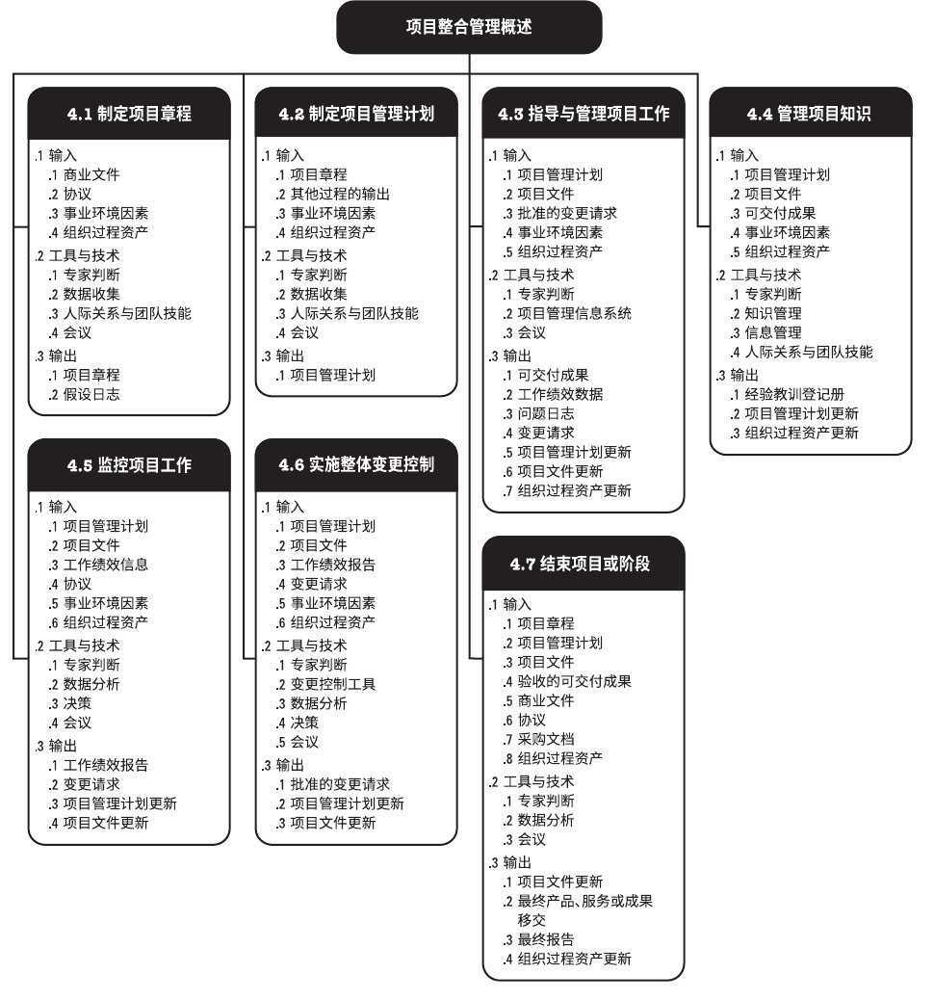

【核心概念】

项目整合管理由项目经理负责。只能由项目经理负责整合所有其他知识领域的成果，并掌握项目总体情况。项目经理必须对整个项目承担最终责任。  
项目和项目管理本质上具有整合性质。项目越复杂，相关方的期望越多样化，就越需要全面的整合方法。  
项目管理过程组的各个过程之间经常反复发生联系。

项目整合管理指的是：
- 确保产品、服务或成果的交付日期，项目生命周期以及效益管理计划这些方面保持一致；
- 编制项目管理计划以实现项目目标；
- 确保创造合适的知识并运用到项目中，并从项目中获取必要的知识；
- 管理项目管理计划中活动的绩效和变更；
- 做出针对影响项目的关键变更的综合决策；
- 测量和监督项目进展，并采取适当措施以实现项目目标；
- 收集关于已达成结果的数据，分析数据以获取信息，并与相关方分享信息；
- 完成全部项目工作，正式关闭各个阶段、合同以及整个项目；
- 管理可能需要的阶段过渡。

【发展趋势与新兴实践】

与整合管理过程相关的发展趋势包括（但不限于）：
- 使用自动化工具。使用项目管理信息系统(PMIS) 和自动化工具来收集、分析和使用信息，以实现项目目标和项目效益。
- 使用可视化管理工具。便于整个团队直观地看到项目的实时状态，促进知识转移，并提高团队成员和其他相关方识别和解决问题的能力。
- 项目知识管理。项目人员的流动性和不稳定性越来越高，就要求采用更严格的过程，在整个项目生命周期中积累知识并传达给目标受众，以防止知识流失。
- 增加项目经理的职责。项目经理被要求介入启动和结束项目，例如开展项目商业论证和效益管理。项目经理也需要更全面地识别相关方，并引导他们参与项目，包括管理项目经理与各职能部门、运营部门和高级管理人员之间的接口。
- 混合型方法。经实践检验的新做法会不断地融入项目管理方法，例如，采用敏捷或其他迭代做法，为开展需求管理而采用商业分析技术，为分析项目复杂性而采用相关工具，以及为在组织中应用项目成果而采用组织变革管理方法。

【裁剪考虑因素】

裁剪时应考虑的因素包括（但不限于）：
- 项目生命周期。什么是合适的项目生命周期？项目生命周期应包括哪些阶段？
- 开发生命周期。对特定产品、服务或成果而言，什么是合适的开发生命周期和开发方法？预测型或适应型方法是否适当？如果是适应型，开发产品是该采用增量还是迭代的方式？混合型方法是否为最佳选择？
- 管理方法。考虑到组织文化和项目的复杂性，哪种管理过程最有效？
- 知识管理。在项目中如何管理知识以营造合作的工作氛围？
- 变更。在项目中如何管理变更？
- 治理。有哪些监控机构、委员会和其他相关方该参与项目治理？对项目状态报告的要求是什么？
- 经验教训。在项目期间及项目结束时，应收集哪些信息？历史信息和经验教训是否适用于未来的项目？
- 效益。应该在何时以何方式报告效益：在项目结束时还是在每次迭代或阶段结束时？

【敏捷或适应性环境中的考虑因素】

迭代和敏捷方法能够促进团队成员以相关领域专家的身份参与整合管理。团队成员自行决定计划及其组件的整合方式。  
在适应型环境下，把对具体产品的规划和交付授权给团队来控制。项目经理的关注点在于营造一个合作型的决策氛围，并确保团队有能力应对变更。如果团队成员具有广泛的技能技术，那么这种合作型方法就会更加有效。

### 4.1制定项目章程

制定项目章程是编写一份正式 *批准*项目 并 *授权* 项目经理在项目活动中使用组织资源的文件的过程。本过程的主要作用是，明确项目与组织战略目标之间的直接联系，确立项目的正式地位，并展示组织对项目的承诺。本过程仅开展一次或仅在项目的预定义点开展。

项目章程在项目执行组织与需求组织之间建立起伙伴关系。项目章程可由发起人编制，或者由项目经理与发起机构合作编制。项目章程授权项目经理规划、执行和控制项目。通过编制项目章程，来确认项目符合组织战略和日常运营的需要。

项目章程一旦被批准，就标志着项目的正式启动。项目启动者或发起人应该具有一定的职权，能为项目获取资金并提供资源。

在项目中，应尽早确认并任命项目经理，最好在制定项目章程时就任命，且总应在规划开始之前任命。通过这种合作，项目经理可以更好地了解项目目的、目标和预期效益，以便更有效地向项目活动分配资源。

项目章程不是合同。合同用于建立外部的正式的合作关系，项目章程用于建立组织内部的合作关系。

【输入】
- 商业文件：商业论证、效益管理计划
- 协议
- 事业环境因素
- 组织过程资产

【工具与技术】
- 专家判断
- 数据收集：头脑风暴、焦点小组、访谈
- 人际关系与团队技能：冲突管理、引导、会议管理
- 会议

【输出】
- 项目章程
- 假设日志

### 4.2制定项目管理计划

制定项目管理计划是定义、准备和协调项目计划的所有组成部分，并把它们整合为一份 *综合项目管理计划* 的过程。本过程的主要作用是，生成一份综合文件，用于确定所有项目工作的基础及其执行方式，它仅开展一次或仅在项目的预定义点开展。

项目管理计划确定项目的执行、监控和收尾方式，可以是概括或详细的。项目管理计划应足够强大，可以应对不断变化的项目环境。这种敏捷性有利于随项目进展产出更准确的信息。

项目管理计划应基准化，即，至少应规定项目的范围、时间和成本方面的基准，以便据此考核项目执行情况和管理项目绩效。一旦确定了基准，就只能通过实施整体变更控制过程进行更新。在项目收尾之前，该计划需要通过不断更新来渐进明细，并且这些更新需要得到控制和批准。

对隶属于项目集或项目组合的项目，则应该制定与项目集或项目组合管理计划相一致的项目管理计划。

【输入】
- 项目章程
- 其他过程的输出
- 事业环境因素
- 组织过程资产

【工具与技术】
- 专家判断
- 数据收集：头脑风暴、核对单、焦点小组、访谈
- 人际关系与团队技能：冲突管理、引导、会议管理
- 会议

【输出】
- 项目管理计划

### 4.3指导与管理项目工作

指导与管理项目工作是为实现项目目标而领导和执行项目管理计划中所确定的工作，并实施已批准变更的过程。本过程的主要作用是，对项目工作和可交付成果开展综合管理，以提高项目成功的可能性。本过程需要在整个项目期间开展。

指导与管理项目工作包括执行计划的项目活动，以完成项目可交付成果并达成既定目标。本过程需要分配可用资源并管理其有效使用，也需要执行因分析工作绩效数据和信息而提出的项目计划变更。指导与管理项目工作过程会受项目所在应用领域的直接影响，按项目管理计划中的规定，开展相关过程，完成项目工作，并产出可交付成果。

项目经理与项目管理团队一起指导实施已计划好的项目活动，并管理项目内的各种技术接口和组织接口。指导与管理项目工作还要求回顾所有项目变更的影响，并实施已批准的变更，包括纠正措施、预防措施和（或）缺陷补救。

在项目执行过程中，收集工作绩效数据并传达给合适的控制过程做进一步分析。通过分析工作绩效数据，得到关于可交付成果的完成情况以及与项目绩效相关的其他细节，工作绩效数据也用作监控过程组的输入，并可作为反馈输入到经验教训库，以改善未来工作包的绩效。

【输入】
- 项目管理计划：任何组件
- 项目文件：变更日志、经验教训登记册、里程碑清单、项目沟通记录、项目进度计划、需求跟踪矩阵、风险登记册、风险报告
- 批准的变更请求
- 事业环境因素
- 组织过程资产

【工具与技术】
- 专家判断
- 项目管理信息系统
- 会议

【输出】
- 可交付成果
- 工作绩效数据
- 问题日志
- 变更请求
- 项目管理计划更新：任何组件
- 项目文件更新：活动清单、假设日志、经验教训登记册、需求文件、风险登记册、相关方登记册
- 组织过程资产更新

### 4.4管理项目知识

管理项目知识是使用现有知识并生成新知识，以实现项目目标，并且帮助组织学习的过程。本过程的主要作用是，利用已有的组织知识来创造或改进项目成果，并且使当前项目创造的知识可用于支持组织运营和未来的项目或阶段。本过程需要在整个项目期间开展。

知识通常分为“显性知识”（易使用文字、图片和数字进行编撰的知识）和“隐性知识”（个体知识以及难以明确表达的知识，如信念、洞察力、经验和“诀窍”）两种。知识管理指管理显性和隐性知识，旨在重复使用现有知识并生成新知识。有助于达成这两个目的的关键活动是知识分享和知识集成（不同领域的知识、情境知识和项目管理知识）。

显性知识缺乏情境，可作不同解读，易分享，但无法确保正确理解或应用。隐性知识虽蕴含情境，却很难编撰，它存在于个人思想或者社会团体和情境中，通常经由人际交流和互动来分享。

从组织的角度来看，知识管理指的是确保项目团队和其他相关方的技能、经验和专业知识在项目开始之前、开展期间和结束之后得到运用。因为知识存在于人们的思想中，且无法强迫人们分享自己的知识或关注他人的知识，所以，知识管理最重要的环节就是营造一种相互信任的氛围，激励人们分享知识或关注他人的知识。在实践中，联合使用知识管理工具和技术（用于人际互动）以及信息管理工具和技术（用于编撰显性知识）来分享知识。

【输入】
- 项目管理计划：所有组件
- 项目文件：经验教训登记册、项目团队派工单、资源分解结构、供方选择标准、相关方登记册
- 可交付成果
- 事业环境因素
- 组织过程资产

【工具与技术】
- 专家判断
- 知识管理
- 信息管理
- 人际关系与团队技能：积极倾听、引导、领导力、人际交往、政治意识

【输出】
- 经验教训登记册
- 项目管理计划更新：任何组件
- 组织过程资产更新

### 4.5监控项目工作

监控项目工作是跟踪、审查和报告整体项目进展，以实现项目管理计划中确定的绩效目标的过程。本过程的主要作用是，让相关方了解项目的当前状态并认可为处理绩效问题而采取的行动，以及通过成本和进度预测，让相关方了解未来项目状态。本过程需要在整个项目期间开展。

监督是贯穿于整个项目的项目管理活动之一，包括收集、测量和分析测量结果，以及预测趋势，以便推动过程改进。持续的监督使项目管理团队能洞察项目的健康状况，并识别须特别关注的任何方面。控制包括制定纠正或预防措施或重新规划，并跟踪行动计划的实施过程，以确保它们能有效解决问题。监控项目工作过程关注：
- 把项目的实际绩效与项目管理计划进行比较；
- 定期评估项目绩效，决定是否需要采取纠正或预防措施，并推荐必要的措施；
- 检查单个项目风险的状态；
- 在整个项目期间，维护一个准确且及时更新的信息库，以反映项目产品及相关文件的情况；
- 为状态报告、进展测量和预测提供信息；
- 做出预测，以更新当前的成本与进度信息；
- 监督已批准变更的实施情况；
- 如果项目是项目集的一部分，还应向项目集管理层报告项目进展和状态；
- 确保项目与商业需求保持一致。

【输入】
- 项目管理计划：任何组件
- 项目文件：假设日志、估算依据、成本预测、问题日志、经验教训登记册、里程碑清单、质量报告、风险登记册、风险报告、进度预测
- 工作绩效信息
- 协议
- 事业环境因素
- 组织过程资产

【工具与技术】
- 专家判断
- 数据分析：备选方案分析、成本效益分析、挣值分析、根本原因分析、趋势分析、偏差分析
- 决策
- 会议

【输出】
- 工作绩效报告
- 变更请求
- 项目管理计划更新：任何组件
- 项目文件更新：成本预测、问题日志、经验教训登记册、风险登记册、进度预测

### 4.6实施整体变更控制

实施整体变更控制是审查所有变更请求、批准变更，管理对可交付成果、项目文件和项目管理计划的变更，并对变更处理结果进行沟通的过程。本过程审查对项目文件、可交付成果或项目管理计划的所有变更请求，并决定对变更请求的处置方案。本过程的主要作用是确保对项目中已记录在案的变更做综合评审。如果不考虑变更对整体项目目标或计划的影响就开展变更，往往会加剧整体项目风险。本过程需要在整个项目期间开展。

实施整体变更控制过程贯穿项目始终，项目经理对此承担最终责任。变更请求可能影响项目范围、产品范围以及任一项目管理计划组件或任一项目文件。变更可以发生在整个项目生命周期的任何时间。变更控制的实施程度，取决于项目所在应用领域、项目复杂程度、合同要求，以及项目所处的背景与环境。

在基准确定之前，变更无需正式受控于实施整体变更控制过程。一旦确定了项目基准，就必须通过本过程来处理变更请求。依照常规，每个项目的配置管理计划应规定哪些项目工件受控于配置控制程序。对配置要素的任何变更都应该提出变更请求，并经过正式控制。

所有变更请求都必须以书面形式记录，并纳入变更管理和（或）配置管理系统中。在批准变更之前，可能需要了解变更对进度的影响和对成本的影响。在变更请求可能影响任一项目基准的情况下，都需要开展正式的整体变更控制过程。每项记录在案的变更请求都必须由一位责任人批准、推迟或否决，这个责任人通常是项目发起人或项目经理。

变更请求得到批准后，可能需要新编（或修订）成本估算、活动排序、进度日期、资源需求和（或）风险应对方案分析，这些变更可能要求调整项目管理计划和其他项目文件。

【输入】
- 项目管理计划：变更管理计划、配置管理计划、范围基准、进度基准、成本基准
- 项目文件：估算依据、需求跟踪矩阵、风险报告
- 工作绩效报告
- 变更需求
- 事业环境因素
- 组织过程资产

【工具与技术】
- 专家判断
- 变更控制工具
- 数据分析：备选方案分析、成本效益分析
- 决策：投票、独裁型决策制定、多标准决策分析
- 会议

【输出】
- 批准的变更请求
- 项目管理计划更新：任何组件
- 项目文件更新：变更日志

### 4.7结束项目或阶段

结束项目或阶段是终结项目、阶段或合同的所有活动的过程。本过程的主要作用是，存档项目或阶段信息，完成计划的工作，释放组织团队资源以展开新的工作。它仅开展一次或仅在项目的预定义点开展。

在结束项目时，项目经理需要回顾项目管理计划，确保所有项目工作都已完成以及项目目标均已实现。项目或阶段行政收尾所需的必要活动包括（但不限于）：
- 为达到阶段或项目的完工或退出标准所必须的行动和活动，例如：
  - 确保所有文件和可交付成果都已是最新版本，且所有问题都已得到解决；
  - 确认可交付成果已交付给客户并已获得客户的正式验收；
  - 确保所有成本都已记入项目成本账；
  - 关闭项目账户；
  - 重新分配人员；
  - 处理多余的项目材料；
  - 重新分配项目设施、设备和其他资源；
  - 根据组织政策编制详尽的最终项目报告。
- 为关闭项目合同协议或项目阶段合同协议所必须开展的活动，例如
  - 确认卖方的工作已通过正式验收；
  - 最终处置未决索赔；
  - 更新记录以反映最后的结果；
  - 存档相关信息供未来使用。
- 为完成下列工作所必须开展的活动：
  - 收集项目或阶段记录；
  - 审计项目成败；
  - 管理知识分享和传递；
  - 总结经验教训；
  - 存档项目信息以供组织未来使用。
- 为向下一个阶段，或者向生产和（或）运营部门移交项目的产品、服务或成果所必须开展的行动和活动。
- 收集关于改进或更新组织政策和程序的建议，并将它们发送给相应的组织部门。
- 测量相关方的满意程度。

如果项目在完工前就提前终止，结束项目或阶段过程还需要制定程序，来调查和记录提前终止的原因。为了实现上述目的，项目经理应该引导所有合适的相关方参与本过程。

【输入】
- 项目章程
- 项目管理计划：所有组件
- 项目文件：假设日志、估算依据、变更日志、问题日志、经验教训登记册、里程碑清单、项目沟通记录、质量控制测量结果、质量报告、需求文件、风险登记册、风险报告
- 验收的可交付成果
- 商业文件：商业论证、效益管理计划
- 协议
- 采购文档
- 组织过程资产

【工具与技术】
- 专家判断
- 数据分析：文件分析、回归分析、趋势分析、偏差分析
- 会议

【输出】
- 项目文件更新：经验教训登记册
- 最终产品、服务或成果移交
- 最终报告
- 组织过程资产更新

## 5.范围

**项目范围管理包括确保项目做且只做所需的全部工作，以成功完成项目的各个过程。** 管理项目范围主要在于定义和控制哪些工作应该包括在项目内，哪些不应该包括在项目内。

项目范围管理过程包括：
- 规划范围管理 — 为记录如何定义、确认和控制项目范围及产品范围，而创建范围管理计划的过程。
- 收集需求 — 为实现项目目标而确定、记录并管理相关方的需要和需求的过程。
- 定义范围 — 制定项目和产品详细描述的过程。
- 创建WBS — 将项目可交付成果和项目工作分解为较小的、更易于管理的组件的过程。
- 确认范围 — 正式验收已完成的项目可交付成果的过程。
- 控制范围 — 监督项目和产品的范围状态，管理范围基准变更的过程。

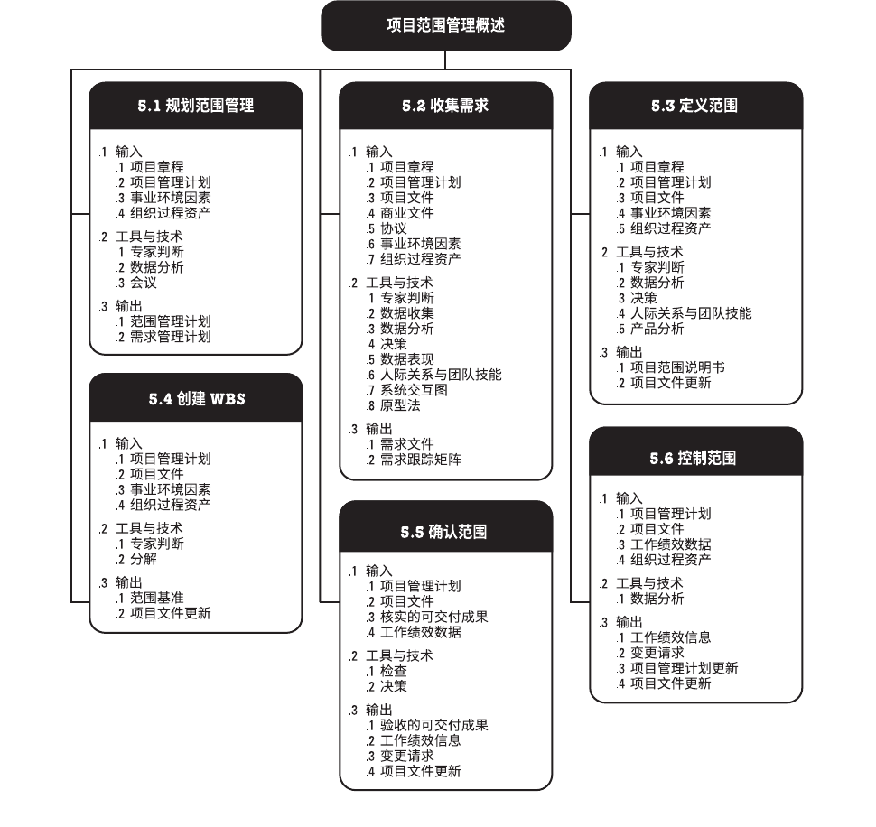

【核心概念】

在项目环境中，“范围”这一术语有两种含义：
- 产品范围。某项产品、服务或成果所具有的特征和功能。
- 项目范围。为交付具有规定特性与功能的产品、服务或成果而必须完成的工作。项目范围有时也包括产品范围。

范围与项目生命周期类型的关系
- 定义范围：
  - 预测型：项目开始时，可交付成果进行定义，并在必要时通过实施变更进行更新。
  - 适应型：迭代开始时，确定要交付的成果。
- 变更范围：
  - 预测型：范围基准确定后，经过正式变更控制程序，才能进行基准变更。
  - 适应型：使用未完成项反映当前需求。
- 确认范围和控制范围：
  - 预测型：确认在阶段审查点开展，控制则持续进行。
  - 适应型：迭代开始时，发起人和客户参与范围的确认和控制。

项目范围的完成情况是根据项目管理计划来衡量的，而产品范围的完成情况是根据产品需求来衡量的。
在这里，“需求”是指根据特定协议或其他强制性规范，产品、服务或成果必须具备的条件或能力。

确认范围是正式验收已完成的项目可交付成果的过程。从控制质量过程输出的核实的可交付成果是确认范围过程的输入，而验收的可交付成果是确认范围过程的输出之一，由获得授权的相关方正式签字批准。因此，相关方需要在规划阶段早期介入（有时需要在启动阶段就介入），对可交付成果的质量提出意见，以便控制质量过程能够据此评估绩效并提出必要的变更建议。

【发展趋势与新兴实践】

需求一直是项目管理中的重点。运用商业分析，通过定义、管理和控制需求活动，可以提高竞争优势。
- 商业分析活动可在项目启动和项目经理任命之前就开始。
- 需求管理始于需求评估，需求评估又可能始于项目组合规划、项目集规划或单个项目。

在项目范围管理过程中，收集、记录和管理相关方需求。项目范围管理的范围趋势和新兴实践包括（但不限于）注重与商业分析专业人士的合作，以便：
- 确定问题并识别商业需要；
- 识别并推荐能够满足这些需要的可行解决方案；
- 收集、记录并管理相关方需求，以满足商业和项目目标；
- 推动项目集或项目的产品、服务或最终成果的成功应用。

需求管理过程结束于需求关闭，即把产品、服务或成果移交给接收方，以便长期测量、监控、实现和维持效益。

应该将商业分析的角色连同职责分配给商业分析师。项目经理与商业分析师之间是伙伴式合作关系。
商业分析师，负责与需求管理相关的活动。项目经理则负责确保这些活动在项目管理计划有所安排，并且在预算内按时完成，同时能够创造价值。

【裁剪考虑因素】

裁剪考虑因素包括（但不限于）：
- 知识和需求管理。组织是否拥有正式或非正式的知识和需求管理体系？为了在未来项目中重复使用需求，项目经理应建立哪些指南？
- 确认和控制。组织是否拥有正式或非正式的与确认和控制相关的政策、程序和指南？
- 开发方法。组织是否采用敏捷方法管理项目？开发方法属于迭代型还是增量型？是否采用预测型方法？混合型方法是否有效？
- 需求的稳定性。项目中是否存在需求不稳定的领域？是否有必要采用精益、敏捷或其他适应型技术来处理不稳定的需求，直至需求稳定且定义明确？
- 治理。组织是否拥有正式或非正式的审计和治理政策、程序和指南？

【敏捷或适应性环境中的考虑因素】

对于需求不断变化、风险大或不确定性高的项目，在项目开始时通常无法明确项目的范围，而需要在项目期间逐渐明确。
敏捷方法在项目早期缩短定义和协商范围的时间，有目的地构建和审查原型，并通过多次发布版本来明确需求。这样一来，范围会在在整个项目期间被定义和再定义。

### 5.1规划范围管理

规划范围管理是为记录如何定义、确认和控制项目范围及产品范围，而创建范围管理计划的过程。本过程的主要作用是，在整个项目期间对如何管理范围提供指南和方向。本过程仅开展一次或仅在项目的预定义点开展。

范围管理计划是项目或项目集管理计划的组成部分，描述将如何定义、制定、监督、控制和确认项目范围。制定范围管理计划和细化项目范围始于对下列信息的分析：项目章程中的信息、项目管理计划中已批准的子计划、组织过程资产中的历史信息和相关事业环境因素。

【输入】
- 项目章程
- 项目管理计划：质量管理计划、项目生命周期描述、开发方法
- 事业环境因素
- 组织过程资产

【工具与技术】
- 专家判断
- 数据分析：备选方案分析
- 会议

【输出】
- 范围管理计划
- 需求管理计划

### 5.2收集需求

收集需求是为实现目标而确定、记录并管理相关方的需要和需求的过程。本过程的主要作用是，为定义产品范围和项目范围奠定基础，且仅开展一次或仅在项目的预定义点开展。

《PMBOK® 指南》并没有专门讨论产品需求，因为产品需求因行业而异。让相关方积极参与需求的探索和分解工作（分解成项目和产品需求），并仔细确定、记录和管理对产品、服务或成果的需求，能直接促进项目成功。需求是指根据特定协议或其他强制性规范，产品、服务或成果必须具备的条件或能力。它包括发起人、客户和其他相关方的已量化且书面记录的需要和期望。应该足够详细地探明、分析和记录这些需求，将其包含在范围基准中，并在项目执行开始后对其进行测量。需求将成为工作分解结构（WBS）的基础，也将成为成本、进度、质量和采购规划的基础。

【输入】
- 项目章程
- 项目管理计划：范围管理计划、需求管理计划、相关方参与计划
- 项目文件：假设日志、经验教训登记册、相关方登记册
- 商业文件：商业论证
- 协议
- 事业环境因素
- 组织过程资产

【工具与技术】
- 专家判断
- 数据收集：头脑风暴、访谈、焦点小组、问卷调查、标杆对照
- 数据分析：文件分析
- 决策：投票、多标准决策分析
- 数据表现：亲和图、思维导图
- 人际关系与团队技能：名义小组技术、观察/交谈/引导
- 系统交互图
- 原型法

【输出】
- 需求文件
- 需求跟踪矩阵

### 5.3定义范围

定义范围是制定项目和产品详细描述的过程。本过程的主要作用是，描述产品、服务或成果的边界和验收标准。

由于在收集需求过程中识别出的所有需求未必都包含在项目中，所以定义范围过程就要从需求文件（收集需求过程的输出）中选取最终的项目需求，然后制定出关于项目及其产品、服务或成果的详细描述。准备好详细的项目范围说明书，对项目成功至关重要。

应根据项目启动过程中记载的主要可交付成果、假设条件和制约因素来编制详细的项目范围说明书。在项目规划过程中，随着对项目信息的更多了解，应该更加详细具体地定义和描述项目范围。

此外，还需要分析现有风险、假设条件和制约因素的完整性，并做必要的增补或更新。需要多次反复开展定义范围过程：在迭代型生命周期的项目中，先为整个项目确定一个高层级的愿景，再一次针对一个迭代期明确详细范围。通常，随着当前迭代期的项目范围和可交付成果的进展，而详细规划下一个迭代期的工作。

【输入】
- 项目章程
- 项目管理计划：范围管理计划
- 项目文件：假设日志、需求文件、风险登记册
- 事业环境因素
- 组织过程资产

【工具与技术】
- 专家判断
- 数据分析：备选方案分析
- 决策：多标准决策分析
- 人际关系与团队技能：引导
- 产品分析

【输出】
- 项目范围说明书
- 项目文件更新：假设日志、需求文件、需求跟踪矩阵、相关方登记册

### 5.4创建WBS

创建工作分解结构（WBS）是把项目可交付成果和项目工作分解成较小、更易于管理的组件的过程。本过程的主要作用是，为所要交付的内容提供架构，它仅开展一次或仅在项目的预定义点开展。

WBS 是对项目团队为实现项目目标、创建所需可交付成果而需要实施的全部工作范围的层级分解。

WBS 组织并定义了项目的总范围，代表着经批准的当前项目范围说明书中所规定的工作。

WBS 最低层的组成部分称为工作包，其中包括计划的工作。工作包对相关活动进行归类，以便对工作安排进度、进行估算、开展监督与控制。

【输入】
- 项目管理计划：范围管理计划
- 项目文件：项目范围说明书、需求文件
- 事业环境因素
- 组织过程资产

【工具与技术】
- 专家判断
- 分解

【输出】
- 范围基准
- 项目文件更新：假设日志、需求文件

### 5.5确认范围

确认范围是正式验收已完成的项目可交付成果的过程。本过程的主要作用是，使验收过程具有客观性；同时通过确认每个可交付成果，来提高最终产品、服务或成果获得验收的可能性。本过程应根据需要在整个项目期间定期开展。

由客户或发起人审查从控制质量过程输出的核实的可交付成果，确认这些可交付成果已经圆满完成并通过正式验收。本过程对可交付成果的确认和最终验收，需要依据：从项目范围管理知识领域的各规划过程获得的输出（如需求文件或范围基准），以及从其他知识领域的各执行过程获得的工作绩效数据。

确认范围过程与控制质量过程的不同之处在于，前者关注可交付成果的验收，而后者关注可交付成果的正确性及是否满足质量要求。控制质量过程通常先于确认范围过程，但二者也可同时进行。

【输入】
- 项目管理计划：范围管理计划、需求管理计划、范围基准
- 项目文件：经验教训登记册、质量报告、需求文件、需求跟踪矩阵
- 核实的可交付成果
- 工作绩效数据

【工具与技术】
- 检查
- 决策：投票

【输出】
- 验收的可交付成果
- 工作绩效信息
- 变更请求
- 项目文件更新：经验教训登记册、需求文件、需求跟踪矩阵

### 5.6控制范围

控制范围是监督项目和产品的范围状态，管理范围基准变更的过程。本过程的主要作用是，在整个项目期间保持对范围基准的维护，且需要在整个项目期间开展。

控制项目范围确保所有变更请求、推荐的纠正措施或预防措施都通过实施整体变更控制过程进行处理。在变更实际发生时，也要采用控制范围过程来管理这些变更。控制范围过程应该与其他控制过程协调开展。未经控制的产品或项目范围的扩大（未对时间、成本和资源做相应调整）被称为范围蔓延。变更不可避免，因此在每个项目上，都必须强制实施某种形式的变更控制。

【输入】
- 项目管理计划：范围管理计划、需求管理计划、变更管理计划、配置管理计划、范围基准、绩效测量基准
- 项目文件：经验教训登记册、需求文件、需求跟踪矩阵
- 工作绩效数据
- 组织过程资产

【工具与技术】
- 数据分析：偏差分析、趋势分析

【输出】
- 工作绩效信息
- 变更请求
- 项目管理计划更新：范围管理计划、范围基准、进度基准、成本基准、绩效测量基准
- 项目文件更新：经验教训登记册、需求文件、需求跟踪矩阵

## 6.进度

**项目进度管理包括为管理项目按时完成所需的各个过程。**

其过程包括：
- 规划进度管理 — 为规划、编制、管理、执行和控制项目进度而制定政策、程序和文档的过程。
- 定义活动 — 识别和记录为完成项目可交付成果而需采取的具体行动的过程。
- 排列活动顺序 — 识别和记录项目活动之间的关系的过程。
- 估算活动持续时间 — 根据资源估算的结果，估算完成单项活动所需工作时段数的过程。
- 制定进度计划 — 分析活动顺序、持续时间、资源需求和进度制约因素，创建项目进度模型，从而落实项目执行和监控的过程。
- 控制进度 — 监督项目状态，以更新项目进度和管理进度基准变更的过程。

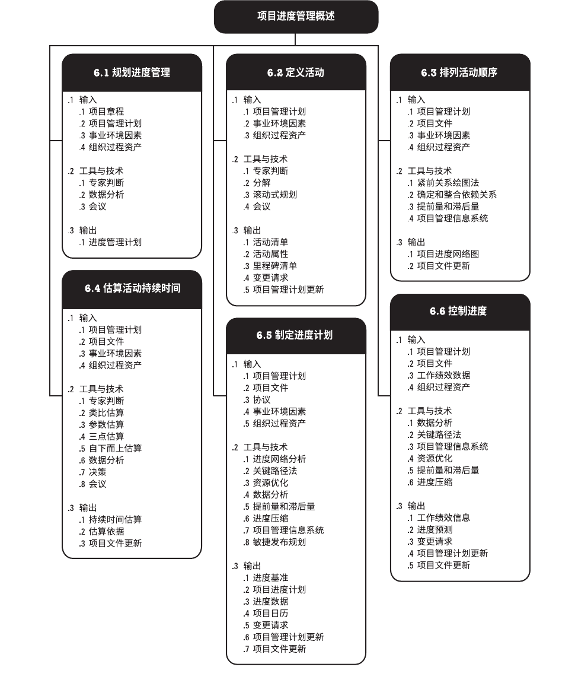

【核心概念】

通过项目进度计划提供详尽的计划，说明项目如何以及何时交付项目范围中定义的产品、服务和成果，并作为一种用于沟通和管理相关方期望的工具，为绩效报告提供了依据。

项目管理团队选择进度计划方法，例如关键路径法或敏捷方法。之后，项目管理团队将项目特定数据，如活动、计划日期、持续时间、资源、依赖关系和制约因素等输入进度计划编制工具，以创建项目进度模型。这件工作的成果就是项目进度计划。

在可能的情况下，应在整个项目期间保持项目详细进度计划的灵活性，使其可以随着知识的获得、对风险理解的加深，以及增值活动的设计而调整。

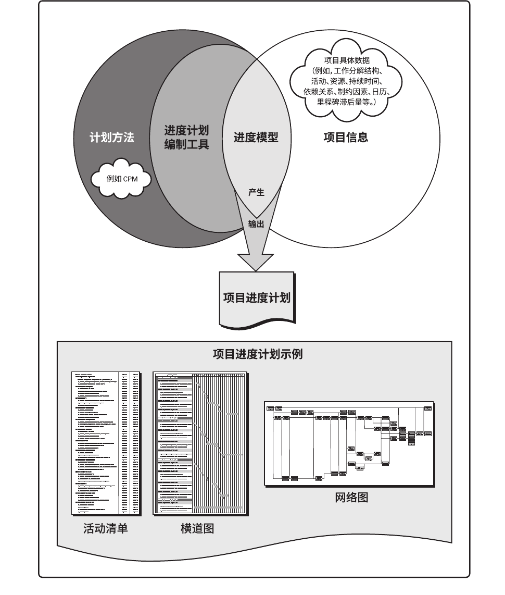

【发展趋势与新兴实践】

很难定义长期范围，适应型规划虽然制定了计划，也意识到工作开始之后，优先级可能发生改变，需要修改计划以反映新的优先级。

有关项目进度计划方法的新兴实践包括（但不限于）：
- 具有未完项的迭代型进度计划。这是一种基于适应型生命周期的滚动式规划。将需求记录在用户故事中，然后在建造之前按优先级排序并优化用户故事，最后在规定的时间盒内开发产品功能。这一方法通常用于向客户交付增量价值，或多个团队并行开发大量内部关联较小的功能。好处在于，它允许在整个开发生命周期期间进行变更。
- 按需进度计划。这种方法通常用于看板体系，基于制约理论和来自精益生产的拉动式进度计划概念，根据团队的交付能力来限制团队正在开展的工作。按需进度计划方法不依赖于以前为产品开发或产品增量制定的进度计划，而是在资源可用时立即从未完项和工作序列中提取出来开展。按需进度计划方法经常用于此类项目：在运营或持续环境中以增量方式研发产品，其任务可以被设计成相对类似的规模和范围，或者可以按规模和范围进行组合的工作。

【裁剪考虑因素】

裁剪考虑的因素包括（但不限于）：
- 生命周期方法。哪种生命周期方法最适合制定详细的进度计划？
- 资源可用性。影响资源可持续时间的因素是什么（如可用资源与其生产效率之间的相关性）？
- 项目维度。项目复杂性、技术不确定性、产品新颖度、速度或进度跟踪（如挣值、完成百分比、“红黄绿”停止信号灯指示）如何影响预期的控制水平？
- 技术支持。是否采用技术来制定、记录、传递、接收和存储项目进度模型的信息以及是否易于获取？

【敏捷或适应性环境中的考虑因素】

适应型方法采用短周期来开展工作、审查结果，并在必要时做出调整。这些周期可针对方法和可交付成果的适用性提供快速反馈，通常表现为迭代型进度计划和拉动式按需进度计划。

在大型组织中，可能同时存在小规模项目和大规模举措，需要制定长期路线图，通过规模参数（如团队规模、地理分布、法规合规性、组织复杂性和技术复杂性）来管理这些项目集。
为此，可能需要采用一系列技术，包括预测型方法、适应型方法或两种方法的混合。还可能需要结合几种核心方法，或采用已实践过的方法，并采纳来自传统技术的一些原则和实践。

### 6.1规划进度管理

规划进度管理是为规划、编制、管理、执行和控制项目进度而制定政策、程序和文档的过程。

本过程的主要作用是，为如何在整个项目期间管理项目进度提供指南和方向。本过程仅开展一次或仅在项目的预定义点开展。

【输入】
- 项目章程
- 项目管理计划：范围管理计划、开发方法
- 事业环境因素
- 组织过程资产

【工具与技术】
- 专家判断
- 数据分析
- 会议

【输出】
- 进度管理计划

### 6.2定义活动

定义活动是识别和记录为完成项目可交付成果而须采取的具体行动的过程。本过程的主要作用是，将工作包分解为进度活动，作为对项目工作进行进度估算、规划、执行、监督和控制的基础。

本过程需要在整个项目期间开展。

【输入】
- 项目管理计划：进度管理计划、范围基准
- 事业环境因素
- 组织过程资产

【工具与技术】
- 专家判断
- 分解
- 滚动式规划
- 会议

【输出】
- 活动清单
- 活动属性
- 里程碑清单
- 变更请求
- 项目管理计划更新：进度基准、成本基准

### 6.3排列活动顺序

排列活动顺序是识别和记录项目活动之间的关系的过程，本过程的主要作用是定义工作之间的逻辑顺序，以便在既定的所有项目制约因素下获得最高的效率。本过程需要在整个项目期间开展。

除了首尾两项，每项活动都至少有一项紧前活动和一项紧后活动，并且逻辑关系适当。通过设计逻辑关系来创建一个切实的项目进度计划，可能有必要在活动之间使用提前量或滞后量，使项目进度计划更为切实可行；可以使用项目管理软件、手动技术或自动技术，来排列活动顺序。排列活动顺序过程旨在将项目活动列表转化为图表，作为发布进度基准的第一步。

【输入】
- 项目管理计划：进度管理计划、范围基准
- 项目文件：活动属性、活动清单、假设日志、里程碑清单
- 事业环境因素
- 组织过程资产

【工具与技术】
- 紧前关系绘图法
- 确定和整合依赖关系
- 提前量和滞后量
- 项目管理信息系统

【输出】
- 项目进度网络图
- 项目文件更新：活动属性、活动清单、假设日志、里程碑清单

### 6.4估算活动持续时间

估算活动持续时间是根据资源估算的结果，估算完成单项活动所需工作时段数的过程。本过程的主要作用是，确定完成每个活动所需花费的时间量。本过程需要在整个项目期间开展。

估算活动持续时间依据的信息包括：工作范围、所需资源类型与技能水平、估算的资源数量和资源日历，而可能影响持续时间估算的其他因素包括对持续时间受到的约束、相关人力投入、资源类型（如固定持续时间、固定人力投入或工作、固定资源数量）以及所采用的进度网络分析技术。

应该由项目团队中最熟悉具体活动的个人或小组提供持续时间估算所需的各种输入，对持续时间的估算也应该渐进明细，取决于输入数据的数量和质量。例如，在工程与设计项目中，随着数据越来越详细，越来越准确，持续时间估算的准确性和质量也会越来越高。

在本过程中，应该首先估算出完成活动所需的工作量和计划投入该活动的资源数量，然后结合项目日历和资源日历，据此估算出完成活动所需的工作时段数（活动持续时间）。在许多情况下，预计可用的资源数量以及这些资源的技能熟练程度可能会决定活动的持续时间，更改分配到活动的主导性资源通常会影响持续时间，但这不是简单的“直线”或线性关系。有时候，因为工作的特性（即受到持续时间的约束、相关人力投入或资源数量），无论资源分配如何（如 24 小时应力测试），都需要花预定的时间才能完成工作。估算持续时间时需要考虑的其他因素包括：
- 收益递减规律。在保持其他因素不变的情况下，增加一个用于确定单位产出所需投入的因素（如资源）会最终达到一个临界点，在该点之后的产出或输出会随着增加这个因素而递减。
- 资源数量。增加资源数量，使其达到初始数量的两倍不一定能缩短一半的时间，因为这样做可能会因风险而造成持续时间增加；在某些情况下，如果增加太多活动资源，可能会因知识传递、学习曲线、额外合作等其他相关因素而造成持续时间增加。
- 技术进步。在确定持续时间估算时，这个因素也可能发挥重要作用。例如，通过采购最新技术，制造工厂可以提高产量，而这可能会影响持续时间和资源需求。
- 员工激励。项目经理还需要了解“学生综合征”（即拖延症）和帕金森定律，前者指出，人们只有在最后一刻，即快到期限时才会全力以赴；后者指出，只要还有时间，工作就会不断扩展，直到用完所有的时间。

应该把活动持续时间估算所依据的全部数据与假设都记录在案。

【输入】
- 项目管理计划：进度管理计划、范围基准
- 项目文件：活动属性、活动清单、假设日志、经验教训登记册、里程碑清单、项目团队派工单、资源分解结构、资源日历、资源需求、风险登记册
- 事业环境因素
- 组织过程资产

【工具与技术】
- 专家判断
- 类比估算
- 参数估算
- 三点估算
- 自下而上估算
- 数据分析：备选方案分析、储备分析
- 决策
- 会议

【输出】
- 持续时间估算
- 估算依据
- 项目文件更新：活动属性、假设日志、经验教训登记册

### 6.5制定进度计划

制定进度计划是分析活动顺序、持续时间、资源需求和进度制约因素，创建进度模型，从而落实项目执行和监控的过程。本过程的主要作用是，为完成项目活动而制定具有计划日期的进度模型。

本过程需要在整个项目期间开展。

【输入】
- 项目管理计划：进度管理计划、范围基准
- 项目文件：活动属性、活动清单、假设日志、估算依据、持续时间估算、经验教训登记册、里程碑清单、项目进度网络图、项目团队派工单、资源日历、资源需求、风险登记册
- 协议
- 事业环境因素
- 组织过程资产

【工具与技术】
- 进度网络分析
- 关键路径法
- 资源优化
- 数据分析：假设情景分析、模拟
- 提前量和滞后量
- 进度压缩
- 项目管理信息系统
- 敏捷发布规划

【输出】
- 进度基准
- 项目进度计划
- 进度数据
- 项目日历
- 变更请求
- 项目管理计划更新：进度管理计划、成本基准
- 项目文件更新：活动属性、假设日志、持续时间估算、经验教训登记册、资源需求、风险登记册

### 6.6控制进度

控制进度是监督项目状态，以更新项目进度和管理进度基准变更的过程。本过程的主要作用是在整个项目期间保持对进度基准的维护，且需要在整个项目期间开展。

要更新进度模型，就需要了解迄今为止的实际绩效。进度基准的任何变更都必须经过实施整体变更控制过程的审批。控制进度作为实施整体变更控制过程的一部分，关注如下内容：
- 判断项目进度的当前状态；
- 对引起进度变更的因素施加影响；
- 重新考虑必要的进度储备；
- 判断项目进度是否已经发生变更；
- 在变更实际发生时对其进行管理。

如果采用敏捷方法，控制进度要关注如下内容：
- 通过比较上一个时间周期中已交付并验收的工作总量与已完成的工作估算值，来判断项目进度的当前状态；
- 实施回顾性审查（定期审查，记录经验教训），以便纠正与改进过程（如果需要的话）；
- 对剩余工作计划（未完项）重新进行优先级排序；
- 确定每次迭代时间（约定的工作周期持续时间，通常是两周或一个月）内可交付成果的生成、核实和验收的速度；
- 确定项目进度已经发生变更；
- 在变更实际发生时对其进行管理。

将工作外包时，定期向承包商和供应商了解里程碑的状态更新是确保工作按商定进度进行的一种途径，有助于确保进度受控。同时，应执行进度状态评审和巡检，确保承包商报告准确且完整。

【输入】
- 项目管理计划：进度管理计划、进度基准、范围基准、绩效测量基准
- 项目文件：经验教训登记册、项目日历、项目进度计划、资源日历、进度数据
- 工作绩效数据
- 组织过程资产

【工具与技术】
- 数据分析：挣值分析、迭代燃尽图、绩效审查、趋势分析、偏差分析、假设情景分析
- 关键路径法
- 项目管理信息系统
- 资源优化
- 提前量和滞后量
- 进度压缩

【输出】
- 工作绩效信息
- 进度预测
- 变更请求
- 进度管理计划更新：进度管理计划、进度基准、成本基准、绩效测量基准
- 项目文件更新：假设日志、估算依据、经验教训登记册、项目进度计划、资源日历、风险登记册、进度数据

## 7.成本

**项目成本管理包括为使项目在批准的预算内完成而对成本进行规划、估算、预算、融资、筹资、管理和控制的各个过程，从而确保项目在批准的预算内完工。**

项目成本管理过程包括：
- 规划成本管理 — 确定如何估算、预算、管理、监督和控制项目成本的过程。
- 估算成本 — 对完成项目活动所需货币资源进行近似估算的过程。
- 制定预算 — 汇总所有单个活动或工作包的估算成本，建立一个经批准的成本基准的过程。
- 控制成本 — 监督项目状态，以更新项目成本和管理成本基准变更的过程。

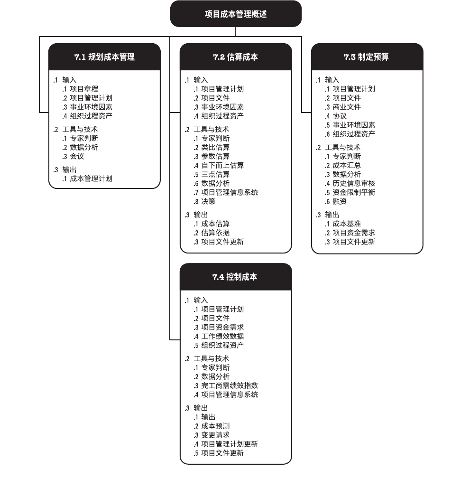

【核心概念】

项目成本管理重点关注完成项目活动所需资源的成本，但同时也应考虑项目决策对项目产品、服务或成果的使用成本、维护成本和支持成本的影响。例如，限制设计审查的次数可降低项目成本，但可能增加由此带来的产品运营成本。

成本管理的另一个方面是认识到不同的相关方会在不同的时间，用不同的方法测算项目成本。在很多组织中，预测和分析项目产品的财务效益是在项目之外进行的，但对于有些项目，如固定资产投资项目，可在项目成本管理中进行这项预测和分析工作。在这种情况下，项目成本管理还需使用其他过程和许多通用财务管理技术，如投资回报率分析、现金流贴现分析和投资回收期分析等。

【发展趋势与新兴实践】

在项目成本管理的实践中，通过对挣值管理 (EVM)的扩展，引入挣得进度 (ES) 这一概念。

ES 是 EVM 理论和实践的延伸。挣得进度理论用 ES 和实际时间 (AT) 替代了传统 EVM 所使用的进度偏差测量指标（挣值 – 计划价值），使用这种替代方法计算进度偏差 ES - AT，如果挣得进度大于 0，则表示项目进度提前了。使用挣得进度测量指标的进度绩效指数 (SPI) 为 ES 与 AT 之比，表示完成项目的工作效率。此外，挣得进度理论通过挣得进度、实际时间和估算持续时间，提供了预测项目完成日期的计算公式。

【裁剪考虑因素】

裁剪时应考虑的因素包括（但不限于）：
- 知识管理。组织是否拥有易于使用的、正式的知识管理体系和财务数据库，并要求项目经理使用？
- 估算和预算。组织是否拥有正式或非正式的，与成本估算和预算相关的政策、程序和指南？
- 挣值管理。组织是否采用挣值管理来管理项目？
- 敏捷方法的使用。组织是否采用敏捷方法管理项目？这对成本估算有什么影响？
- 治理。组织是否拥有正式或非正式的审计和治理政策、程序和指南？

【敏捷或适应性环境中的考虑因素】

对易变性高、范围并未完全明确、经常发生变更的项目，无法进行详细的成本计算，可采用轻量级估算方法快速生成对项目人力成本的高层级预测，在出现变更时容易调整预测；而详细的估算适用于采用准时制的短期规划。

如果易变的项目也遵循严格的预算，通常需要更频繁地更改范围和进度计划，以始终保持在成本制约因素之内。

### 7.1规划成本管理

规划成本管理是确定如何估算、预算、管理、监督和控制项目成本的过程。本过程的主要作用是，在整个项目期间为如何管理项目成本提供指南和方向。本过程仅开展一次或仅在项目的预定义点开展。

应该在项目规划阶段的早期就对成本管理工作进行规划，建立各成本管理过程的基本框架，以确保各过程的有效性及各过程之间的协调性。成本管理计划是项目管理计划的组成部分，其过程及工具与技术应记录在成本管理计划中。

【输入】
- 项目章程
- 项目管理计划：进度管理计划、风险管理计划
- 事业环境因素
- 组织过程资产

【工具与技术】
- 专家判断
- 数据分析
- 会议

【输出】
- 成本管理计划

### 7.2估算成本

估算成本是对完成项目工作所需资源成本进行近似估算的过程。本过程的主要作用是，确定项目所需的资金。本过程应根据需要在整个项目期间定期开展。

成本估算是对完成活动所需资源的可能成本的量化评估，是在某特定时点，根据已知信息所做出的成本预测。在估算成本时，需要识别和分析可用于启动与完成项目的备选成本方案；需要权衡备选成本方案并考虑风险，如比较自制成本与外购成本、购买成本与租赁成本及多种资源共享方案，以优化项目成本。

通常用某种货币单位（如美元、欧元、日元等）进行成本估算，但有时也可采用其他计量单位，如人时数或人天数，以消除通货膨胀的影响，便于成本比较。

在项目过程中，应该随着更详细信息的呈现和假设条件的验证，对成本估算进行审查和优化。

在项目生命周期中，项目估算的准确性亦将随着项目的进展而逐步提高。例如，在启动阶段可得出项目的粗略量级估算（Rough Order of Magnitude，ROM），其区间为 −25% 到 +75%；之后，随着信息越来越详细，确定性估算的区间可缩小至 −5% 到 +10%。某些组织已经制定出相应的指南，规定何时进行优化，以及每次优化所要达到的置信度或准确度。

进行成本估算，应该考虑将向项目收费的全部资源，包括（但不限于）人工、材料、设备、服务、设施，以及一些特殊的成本种类，如通货膨胀补贴、融资成本或应急成本。成本估算可在活动层级呈现，也可以汇总形式呈现。

【输入】
- 项目管理计划：成本管理计划、质量管理计划、范围基准
- 项目文件：经验教训登记册、项目进度计划、资源需求、风险登记册
- 事业环境因素
- 组织过程资产

【工具与技术】
- 专家判断
- 类比估算
- 参数估算
- 自下而上估算
- 三点估算
- 数据分析：备选方案分析、储备分析、质量成本
- 项目管理信息系统
- 决策：投票

【输出】
- 成本估算
- 估算依据
- 项目文件更新：假设日志、经验教训登记册、风险登记册

### 7.3制定预算

制定预算是汇总所有单个活动或工作包的估算成本，建立一个经批准的成本基准的过程。本过程的主要作用是，确定可据以监督和控制项目绩效的成本基准。本过程仅开展一次或仅在项目的预定义点开展。

项目预算包括经批准用于执行项目的全部资金，而成本基准是经过批准且按时间段分配的项目预算，包括应急储备，但不包括管理储备。

【输入】
- 项目管理计划：成本管理计划、资源管理计划、范围基准
- 项目文件：估算依据、成本估算、项目进度计划、风险登记册
- 商业文件：商业论证、效益管理计划
- 协议
- 事业环境因素
- 组织过程资产

【工具与技术】
- 专家判断
- 成本汇总
- 数据分析：储备分析
- 历史信息审核
- 资金限制平衡
- 融资

【输出】
- 成本基准
- 项目资金需求
- 项目文件更新：成本估算、项目进度计划、风险登记册

### 7.4控制成本

控制成本是监督项目状态，以更新项目成本和管理成本基准变更的过程。本过程的主要作用是，在整个项目期间保持对成本基准的维护。本过程需要在整个项目期间开展。

要更新预算，就需要了解截至目前的实际成本。只有经过实施整体变更控制过程的批准，才可以增加预算。只监督资金的支出，而不考虑由这些支出所完成的工作的价值，对项目没有什么意义，最多只能跟踪资金流。所以在成本控制中，应重点分析项目资金支出与相应完成的工作之间的关系。有效成本控制的关键在于管理经批准的成本基准。

项目成本控制包括：
- 对造成成本基准变更的因素施加影响；
- 确保所有变更请求都得到及时处理；
- 当变更实际发生时，管理这些变更；
- 确保成本支出不超过批准的资金限额，既不超出按时段、按 WBS 组件、按活动分配的限额，也不超出项目总限额；
- 监督成本绩效，找出并分析与成本基准间的偏差；
- 对照资金支出，监督工作绩效；
- 防止在成本或资源使用报告中出现未经批准的变更；
- 向相关方报告所有经批准的变更及其相关成本；
- 设法把预期的成本超支控制在可接受的范围内。

【输入】
- 项目管理计划：成本管理计划、成本基准、绩效测量基准
- 项目文件：经验教训登记册
- 项目资金需求
- 工作绩效数据
- 组织过程资产

【工具与技术】
- 专家判断
- 数据分析：挣值分析、偏差分析、趋势分析、储备分析
- 完工尚需绩效指标
- 项目管理信息系统

【输出】
- 工作绩效信息
- 成本预测
- 变更请求
- 项目管理计划更新：成本管理计划、成本基准、绩效测量基准
- 项目文件更新：假设日志、估算依据、成本估算、经验教训登记册、风险登记册

## 8.质量

**项目质量管理包括把组织的质量政策应用于规划、管理、控制项目和产品质量要求，以满足相关方目标的各个过程。此外，项目质量管理以执行组织的名义支持过程的持续改进活动。**

项目质量管理过程包括：
- 规划质量管理 — 识别项目及其可交付成果的质量要求和/或标准，并书面描述项目将如何证明符合质量要求和/或标准的过程。
- 管理质量 — 管理质量是把组织的质量政策用于项目，并将质量管理计划转化为可执行的质量活动的过程。
- 控制质量 — 为了评估绩效，确保项目输出完整、正确，并满足客户期望，而监督和记录质量管理活动执行结果的过程。

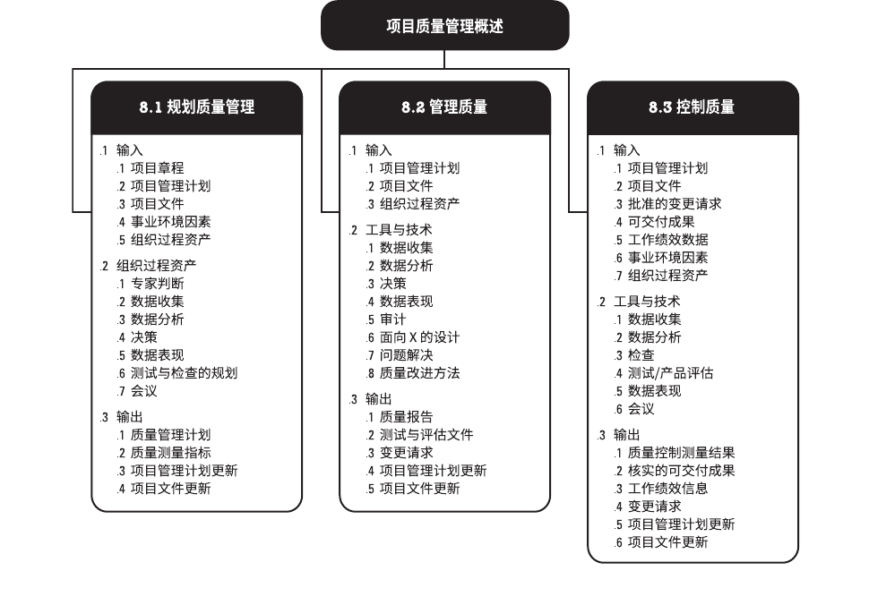

*规划质量管理* 过程关注工作需要达到的质量，*管理质量* 则关注管理整个项目期间的质量过程。在管理质量过程期间，在规划质量管理过程中识别的质量要求成为测试与评估工具，将用于 *控制质量* 过程，以确认项目是否达到这些质量要求。 *控制质量* 关注工作成果与质量要求的比较，确保结果可接受。
项目质量管理知识领域有两个用于其他知识领域的特定输出，即核实的可交付成果和质量报告。

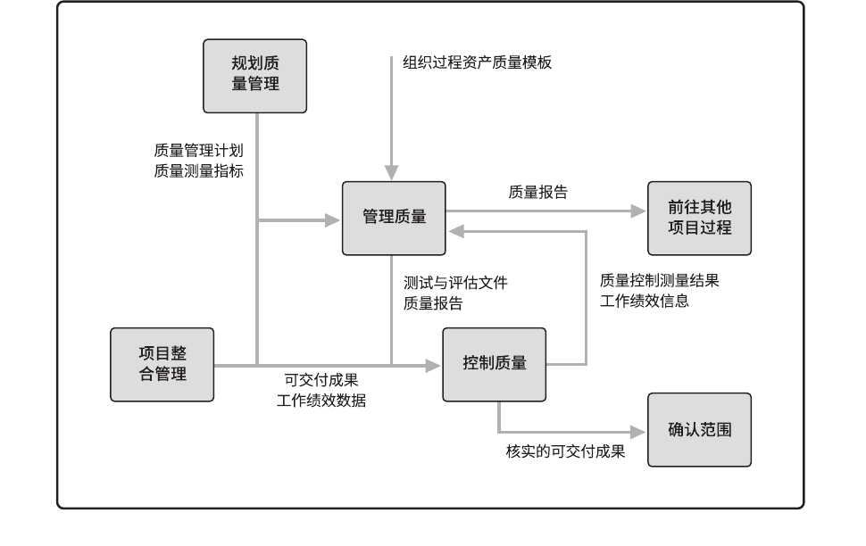

【核心概念】

项目质量管理需要兼顾项目管理与项目可交付成果两个方面，它适用于所有项目，无论项目的可交付成果具有何种特性。质量的测量方法和技术则需专门针对项目所产生的可交付成果类型而定。无论什么项目，若未达到质量要求，都会给某个或全部项目相关方带来严重的负面后果。

预防胜于检查。最好将质量设计到可交付成果中，而不是在检查时发现质量问题。预防错误的成本通常远低于在检查或使用中发现并纠正错误的成本。

质量成本 (COQ) 包括在产品生命周期中为预防不符合要求、为评价产品或服务是否符合要求，以及因未达到要求（返工）而发生的所有成本。
失败成本通常分为内部（项目团队发现的）和外部（客户发现的）两类。失败成本也称为劣质成本。

组织选择投资缺陷预防，因为它对产品生命周期有利。由于项目的临时性，针对产品生命周期的COQ 决策，通常是项目集管理、项目组合管理、PMO 或运营的关注点。

按有效性递增排列的五种质量管理水平如下：
- 通常，代价最大的方法是让客户发现缺陷。这种方法可能会导致担保问题、召回、商誉受损和返工成本。
- 控制质量过程包括先检测和纠正缺陷，再将可交付成果发送给客户。该过程会带来相关成本，主要是评估成本和内部失败成本。
- 通过质量保证检查并纠正过程本身，而不仅仅是特殊缺陷。
- 将质量融入项目和产品的规划和设计中。
- 在整个组织内创建一种关注并致力于实现过程和产品质量的文化。

【发展趋势与新兴实践】

项目质量管理的趋势可能包括（但不限于）：
- 客户满意。把“符合要求”（确保项目产出预定的成果）和“适合使用”（产品或服务必须满足实际需求）结合起来。
- 持续改进。“计划 — 实施 — 检查 — 行动 (PDCA)”循环是质量改进的基础。另外，诸如全面质量管理（TQM）、六西格玛和精益六西格玛等质量改进举措也可以提高项目管理的质量以及最终产品、服务或成果的质量。
- 管理层的责任。项目的成功需要项目团队全体成员的参与。管理层在其质量职责内，肩负着为项目提供具有足够能力的资源的相应责任。
- 与供应商的互利合作关系。互利合作关系增强了组织和供应商互相为对方创造价值的能力，推动他们共同实现客户的需求和期望，并优化成本和资源。

【裁剪考虑因素】

裁剪时应考虑的因素包括（但不限于）：
- 政策合规与审计。组织有哪些质量政策和程序？组织使用哪些质量工具、技术和模板？
- 标准与法规合规性。是否存在必须遵守的行业质量标准？需要考虑哪些政府、法律或法规方面的制约因素？
- 持续改进。如何管理项目中的质量改进？是在组织层面还是在单个项目层面进行管理？
- 相关方参与。项目环境是否有利于与相关方及供应商合作？

【敏捷或适应性环境中的考虑因素】

敏捷方法要求多个质量与审核步骤贯穿整个项目，而不是在面临项目结束时才执行。
- 循环回顾，定期检查质量过程的效果；
- 寻找问题的根本原因，然后建议实施新的质量改进方法；
- 后续回顾会议评估试验过程，确定是否可行、是否应继续、或做出调整，或者直接弃用。

### 8.1规划质量管理

规划质量管理是识别项目及其可交付成果的质量要求和（或）标准，并书面描述项目将如何证明符合质量要求和（或）标准的过程。本过程的主要作用是，为在整个项目期间如何管理和核实质量提供指南和方向。本过程仅开展一次或仅在项目的预定义点开展。

质量规划应与其他规划过程并行开展。例如，为满足既定的质量标准而对可交付成果提出变更，可能需要调整成本或进度计划，并就该变更对相关计划的影响进行详细风险分析。

本节讨论项目中最常用的质量规划技术，但在特定项目或应用领域中，还可采用许多其他质量规划技术。

【输入】
- 项目章程
- 项目管理计划：需求管理计划、风险管理计划、相关方参与计划、范围基准
- 项目文件：假设日志、需求文件、需求跟踪矩阵、风险登记册、相关方登记册
- 事业环境因素
- 组织过程资产

【工具与技术】
- 专家判断
- 数据收集：标杆对照、头脑风暴、访谈
- 数据分析：成本效益分析、质量成本
- 决策：多标准决策分析
- 数据表现：流程图、逻辑数据模型、矩阵图、思维导图
- 测试与检查的规划
- 会议

【输出】
- 质量管理计划
- 质量测量指标
- 项目管理计划更新：风险管理计划、范围基准
- 项目文件更新：经验教训登记册、需求跟踪矩阵、风险登记册、相关方登记册

### 8.2管理质量

管理质量是把组织的质量政策用于项目，并将质量管理计划转化为可执行的质量活动的过程。

本过程的主要作用是，提高实现质量目标的可能性，以及识别无效过程和导致质量低劣的原因。

管理质量使用控制质量过程的数据和结果向相关方展示项目的总体质量状态。本过程需要在整个项目期间开展。

管理质量有时被称为“质量保证”，但“管理质量”的定义比“质量保证”更广，因其可用于非项目工作。在项目管理中，质量保证着眼于项目使用的过程，旨在高效地执行项目过程，包括遵守和满足标准，向相关方保证最终产品可以满足他们的需求、期望和要求。管理质量包括所有质量保证活动，还与产品设计和过程改进有关。管理质量的工作属于质量成本框架中的一致性工作。

管理质量过程执行在项目质量管理计划中所定义的一系列有计划、有系统的行动和过程，有助于：
- 通过执行有关产品特定方面的设计准则，设计出最优的成熟产品；
- 建立信心，相信通过质量保证工具和技术（如质量审计和故障分析）可以使未来输出在完工时满足特定的需求和期望；
- 确保使用质量过程并确保其使用能够满足项目的质量目标；
- 提高过程和活动的效率与效果，以获得更好的成果和绩效并提高相关方的满意程度。

项目经理和项目团队可以通过组织的质量保证部门或其他组织职能执行某些管理质量活动，例如故障分析、实验设计和质量改进。质量保证部门在质量工具和技术的使用方面通常拥有跨组织经验，是良好的项目资源。

管理质量被认为是所有人的共同职责，包括项目经理、项目团队、项目发起人、执行组织的管理层，甚至是客户。所有人在管理项目质量方面都扮演一定的角色，尽管这些角色的人数和工作量不同。参与质量管理工作的程度取决于所在行业和项目管理风格。在敏捷项目中，整个项目期间的质量管理由所有团队成员执行；但在传统项目中，质量管理通常是特定团队成员的职责。

【输入】
- 项目管理计划：质量管理计划
- 项目文件：经验教训登记册、质量控制测量结果、质量测量指标、风险报告
- 组织过程资产

【工具与技术】
- 数据收集：核对单
- 数据分析：备选方案分析、文件分析、过程分析、根本原因分析
- 决策：多标准决策分析
- 数据表现：亲和图、因果图、流程图、直方图、矩阵图、散点图
- 审计
- 面向X的设计
- 问题解决
- 质量改进方法

【输出】
- 质量报告
- 测试与评估文件
- 变更请求
- 项目管理计划更新：质量管理计划、范围基准、进度基准、成本基准
- 项目文件更新：问题日志、经验教训登记册、风险登记册

### 8.3控制质量

控制质量是为了评估绩效，确保项目输出完整、正确且满足客户期望，而监督和记录质量管理活动执行结果的过程。本过程的主要作用是，核实项目可交付成果和工作已经达到主要相关方的质量要求，可供最终验收。控制质量过程确定项目输出是否达到预期目的，这些输出需要满足所有适用标准、要求、法规和规范。本过程需要在整个项目期间开展。

控制质量过程的目的是在用户验收和最终交付之前测量产品或服务的完整性、合规性和适用性。

本过程通过测量所有步骤、属性和变量，来核实与规划阶段所描述规范的一致性和合规性。

在整个项目期间应执行质量控制，用可靠的数据来证明项目已经达到发起人和/或客户的验收标准。

控制质量的努力程度和执行程度可能会因所在行业和项目管理风格而不同。例如，相比其他行业，制药、医疗、运输和核能产业可能拥有更加严格的质量控制程序，为满足标准付出的工作也会更广；在敏捷项目中，控制质量活动可能由所有团队成员在整个项目生命周期中执行，而在瀑布式项目中，控制质量活动由特定团队成员在特定时间点或者项目或阶段快结束时执行。

【输入】
- 项目管理计划：质量管理计划
- 质量管理计划：经验教训登记册、质量测量指标、测试与评估文件
- 批准的变更请求
- 可交付成果
- 工作绩效数据
- 事业环境因素
- 组织过程资产

【工具与技术】
- 工具与技术：核对单、核查表、统计抽样、问卷调查
- 数据分析：绩效审查、根本原因分析
- 检查
- 测试/产品评估
- 数据表现：因果图、直方图、控制图、散点图
- 会议

【输出】
- 质量控制测量结果
- 核实的可交付成果
- 工作绩效信息
- 变更请求
- 项目管理计划更新：质量管理计划
- 项目文件更新：问题日志、经验教训登记册、风险登记册、测试与评估文件

## 9.资源

**项目资源管理包括识别、获取和管理所需资源以成功完成项目的各个过程，这些过程有助于确保项目经理和项目团队在正确的时间和地点使用正确的资源。**

项目资源管理过程包括：
- 规划资源管理 — 定义如何估算、获取、管理和利用实物以及团队项目资源的过程。
- 估算活动资源 — 估算执行项目所需的团队资源，以及材料、设备和用品的类型和数量的过程。
- 获取资源 — 获取项目所需的团队成员、设施、设备、材料、用品和其他资源的过程。
- 建设团队 — 提高工作能力，促进团队成员互动，改善团队整体氛围，以提高项目绩效的过程。
- 管理团队 — 跟踪团队成员工作表现，提供反馈，解决问题并管理团队变更，以优化项目绩效的过程。
- 控制资源 — 确保按计划为项目分配实物资源，以及根据资源使用计划监督资源实际使用情况，并采取必要纠正措施的过程。

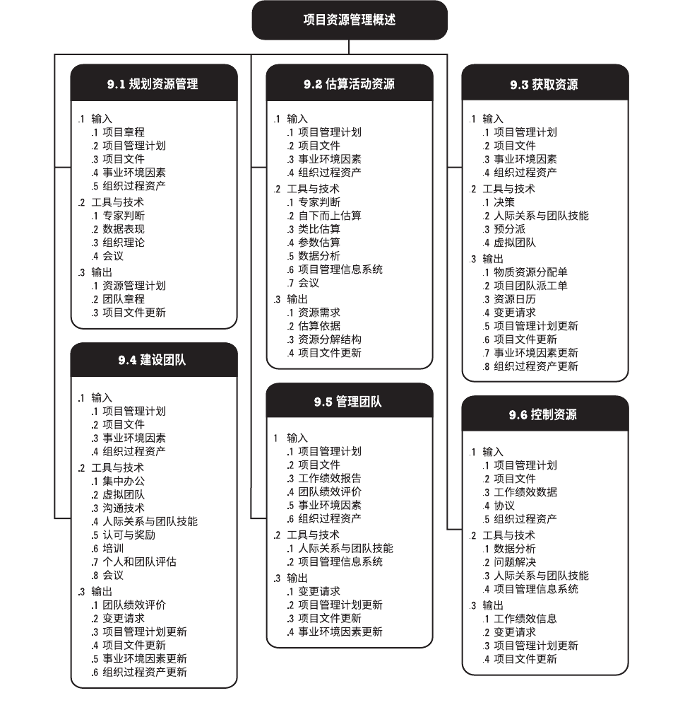

实物资源包括设备、材料、设施和基础设施，而团队资源或人员指的是人力资源。项目团队成员可能具备不同的技能，可能是全职或兼职的，可能随项目进展而增加或减少。

【核心概念】

项目经理应在获取、管理、激励和增强项目团队方面投入适当的努力。让项目团队成员全员参与项目规划和决策是有益的，既可使他们对项目规划工作贡献专业技能，又可以增强他们对项目的责任感。

项目经理既是项目团队的领导者又是项目团队的管理者。除了项目管理活动，例如启动、规划、执行、监控和关闭各个项目阶段，项目经理还负责建设高效的团队。项目经理应留意能够影响团队的不同因素，例如：
- 团队环境；
- 团队成员的地理位置；
- 相关方之间的沟通；
- 组织变更管理；
- 内外部政治氛围；
- 文化问题和组织的独特性；
- 其他可能改变项目绩效的因素。

作为领导者，项目经理还负责积极培养团队技能和能力，同时提高并保持团队的满意度和积极性，项目经理还应留意并支持职业与道德行为，确保所有团队成员都遵守这些行为。

实物资源管理着眼于以有效和高效的方式，分配和使用成功完成项目所需的实物资源，如材料、设备和用品。为此，组织应当拥有如下数据：（当前和合理的未来的）资源需求、（可以满足这些需求的）资源配置，以及资源供应。

【发展趋势与新兴实践】

项目管理风格正在从管理项目的命令和控制结构，转向更加协作和支持性的管理方法，通过将决策权分配给团队成员来提高团队能力。
此外，现代的项目资源管理方法致力于寻求优化资源使用。

有关项目资源管理的趋势和新兴实践包括（但不限于）：
- 资源管理方法。例如精益管理、准时制 (JIT) 生产、Kaizen（持续改善）、全员生产维护 (TPM)、约束理论等方法。项目经理应确定执行组织是否采用了一种或多种资源管理工具，从而对项目做出相应的调整。
- 情商 (EI)。项目经理应提升内在（如自我管理和自我意识）和外在（如关系管理）能力，从而提高个人情商和团队的情商。
- 自组织团队。对于拥有自组织团队的项目，“项目经理”（可能不称为“项目经理”）的角色主要是为团队创造环境、提供支持并信任团队可以完成工作。成功的自组织团队通常由通用的专才而不是主题专家组成，他们能够不断适应变化的环境并采纳建设性反馈。
- 虚拟团队/分布式团队。沟通技术（如电子邮件、电话会议、社交媒体、网络会议和视频会议等）的使用，使虚拟团队变得可行。而虚拟团队管理面临的挑战主要在于沟通，包括可能产生孤立感、团队成员之间难以分享知识和经验、难以跟进进度和生产率，以及可能存在时区和文化差异。

【裁剪考虑因素】

裁剪时应考虑的因素包括（但不限于）：
- 多元化。团队的多元化背景是什么？
- 物理位置。团队成员和实物资源的物理位置在哪里？
- 行业特定资源。所在行业需要哪些特殊资源？
- 团队成员的获得。如何获得项目团队成员？项目团队资源是全职还是兼职？
- 团队管理。如何管理项目团队建设？组织是否有管理团队建设的工具或是否需要创建新工具？是否存在有特殊需求的团队成员？是否需要为团队提供有关多元化管理的特别培训？
- 生命周期方法。项目采用哪些生命周期方法？

【敏捷或适应性环境中的考虑因素】

易变性高的项目得益于最大限度地集中和协作的团队结构，例如拥有通才的自组织团队。

协作旨在提高生产率和促进创新的问题解决方式。协作型团队可以促进不同工作活动的加速整合、改善沟通、增加知识分享，以及提供工作分配的灵活性和其他优势。

对于易变性高的项目，实物和人力资源规划的可预测性要低得多。在这些环境中，关于快速供应和精益方法的协议，对控制成本和实现进度而言至关重要。

### 9.1规划资源管理

规划资源管理是定义如何估算、获取、管理和利用团队以及实物资源的过程。本过程的主要作用是，根据项目类型和复杂程度确定适用于项目资源的管理方法和管理程度。本过程仅开展一次或仅在项目的预定义点开展。

资源规划用于确定和识别一种方法，以确保项目的成功完成有足够的可用资源。项目资源可能包括团队成员、用品、材料、设备、服务和设施。有效的资源规划需要考虑稀缺资源的可用性和竞争，并编制相应的计划。

这些资源可以从组织内部资产获得，或者通过采购过程从组织外部获取。其他项目可能在同一时间和地点竞争项目所需的相同资源，从而对项目成本、进度、风险、质量和其他项目领域造成显著影响。

【输入】
- 项目章程
- 项目管理计划：质量管理计划、范围基准
- 项目文件：项目进度计划、需求文件、风险登记册、相关方登记册
- 事业环境因素
- 组织过程资产

【工具与技术】
- 专家判断
- 数据表现：层级型、责任分配矩阵、文本型
- 组织理论
- 会议

【输出】
- 资源管理计划
- 团队章程
- 项目文件更新：假设日志、风险登记册

### 9.2估算活动资源

估算活动资源是估算执行项目所需的团队资源，以及材料、设备和用品的类型和数量的过程。

本过程的主要作用是，明确完成项目所需的资源种类、数量和特性。本过程应根据需要在整个项目期间定期开展。

估算活动资源过程与其他过程紧密相关，例如估算成本过程。例如：
- 建筑项目团队需要熟悉当地建筑法规。这类知识常可从当地卖方获取，但是，如果内部劳动力资源对不常用或专门的建筑技术缺乏经验，那么支付额外费用聘请咨询专家，可能就是了解当地建筑法规的最有效的方法。
- 汽车设计团队需要熟悉最新的自动装配技术。这些必要的知识可以通过聘请顾问、派设计人员参加机器人技术研讨会，或者邀请制造人员加入项目团队等方式来获取。

【输入】
- 项目管理计划：资源管理计划、范围基准
- 项目文件：活动属性、活动清单、假设日志、成本估算、资源日历、风险登记册
- 事业环境因素
- 组织过程资产

【工具与技术】
- 专家判断
- 自下而上估算
- 类比估算
- 参数估算
- 数据分析：备选方案分析
- 项目管理信息系统
- 会议

【输出】
- 资源需求
- 估算依据
- 资源分解结构
- 项目文件更新：活动属性、假设日志、经验教训登记册

### 9.3获取资源

获取资源是获取项目所需的团队成员、设施、设备、材料、用品和其他资源的过程。本过程的主要作用是，概述和指导资源的选择，并将其分配给相应的活动。本过程应根据需要在整个项目期间定期开展。

项目所需资源可能来自项目执行组织的内部或外部。内部资源由职能经理或资源经理负责获取（分配），外部资源则是通过采购过程获得。

因为集体劳资协议、分包商人员使用、矩阵型项目环境、内外部报告关系或其他原因，项目管理团队可能或可能不对资源选择有直接控制权。重要的是，在获取项目资源过程中应注意下列事项：
- 项目经理或项目团队应该进行有效谈判，并影响那些能为项目提供所需团队和实物资源的人员。
- 不能获得项目所需的资源时，可能会影响项目进度、预算、客户满意度、质量和风险；资源或人员能力不足会降低项目成功的概率，最坏的情况可能导致项目取消。
- 如因制约因素（如经济因素或其他项目对资源的占用）而无法获得所需团队资源，项目经理或项目团队可能不得不使用也许能力和成本不同的替代资源。在不违反法律、规章、强制性规定或其他具体标准的前提下可以使用替代资源。

在项目规划阶段，应该对上述因素加以考虑并做出适当安排。项目经理或项目管理团队应该在项目进度计划、项目预算、项目风险计划、项目质量计划、培训计划及其他相关项目管理计划中，说明缺少所需资源的后果。

【输入】
- 项目管理计划：资源管理计划、采购管理计划、成本基准
- 项目文件：项目进度计划、资源日历、资源需求、相关方登记册
- 事业环境因素
- 组织过程资产

【工具与技术】
- 决策：多标准决策分析
- 人际关系与团队技能：谈判
- 预分派
- 虚拟团队

【输出】
- 实物资源分配单
- 项目团队派工单
- 资源日历
- 变更请求
- 项目管理计划更新：资源管理计划、成本基准
- 项目文件更新：经验教训登记册、项目进度计划、资源分解结构、资源需求、风险登记册、相关方登记册
- 事业环境因素更新
- 组织过程资产更新

### 9.4建设团队

建设团队是提高工作能力，促进团队成员互动，改善团队整体氛围，以提高项目绩效的过程。

本过程的主要作用是，改进团队协作、增强人际关系技能、激励员工、减少摩擦以及提升整体项目绩效。本过程需要在整个项目期间开展。

项目经理应该能够定义、建立、维护、激励、领导和鼓舞项目团队，使团队高效运行，并实现项目目标。团队协作是项目成功的关键因素，而建设高效的项目团队是项目经理的主要职责之一。

项目经理应创建一个能促进团队协作的环境，并通过给予挑战与机会、提供及时反馈与所需支持，以及认可与奖励优秀绩效，不断激励团队。通过以下行为可以实现团队的高效运行：
- 使用开放与有效的沟通；
- 创造团队建设机遇；
- 建立团队成员间的信任；
- 以建设性方式管理冲突；
- 鼓励合作型的问题解决方法；
- 鼓励合作型的决策方法。

项目经理在全球化环境和富有文化多样性的项目中工作：团队成员经常来自不同的行业，讲不同的语言，有时甚至会在工作中使用一种特别的“团队语言”或文化规范，而不是使用他们的母语；

项目管理团队应该利用文化差异，在整个项目生命周期中致力于发展和维护项目团队，并促进在相互信任的氛围中充分协作；通过建设项目团队，可以改进人际技巧、技术能力、团队环境及项目绩效。在整个项目生命周期中，团队成员之间都要保持明确、及时、有效（包括效果和效率两个方面）的沟通。建设项目团队的目标包括（但不限于）：
- 提高团队成员的知识和技能，以提高他们完成项目可交付成果的能力，并降低成本、缩短工期和提高质量；
- 提高团队成员之间的信任和认同感，以提高士气、减少冲突和增进团队协作；
- 创建富有生气、凝聚力和协作性的团队文化，从而：（1）提高个人和团队生产率，振奋团队精神，促进团队合作；（2）促进团队成员之间的交叉培训和辅导，以分享知识和经验；
- 提高团队参与决策的能力，使他们承担起对解决方案的责任，从而提高团队的生产效率，获得更有效和高效的成果。

有一种关于团队发展的模型叫塔克曼阶梯理论 [19，20]，其中包括团队建设通常要经过的五个阶段。尽管这些阶段通常按顺序进行，然而，团队停滞在某个阶段或退回到较早阶段的情况也并非罕见；而如果团队成员曾经共事过，项目团队建设也可跳过某个阶段。
- 形成阶段。在本阶段，团队成员相互认识，并了解项目情况及他们在项目中的正式角色与职责。在这一阶段，团队成员倾向于相互独立，不一定开诚布公。
- 震荡阶段。在本阶段，团队开始从事项目工作、制定技术决策和讨论项目管理方法。如果团队成员不能用合作和开放的态度对待不同观点和意见，团队环境可能变得事与愿违。
- 规范阶段。在规范阶段，团队成员开始协同工作，并调整各自的工作习惯和行为来支持团队，团队成员会学习相互信任。
- 成熟阶段。进入这一阶段后，团队就像一个组织有序的单位那样工作，团队成员之间相互依靠，平稳高效地解决问题。
- 解散阶段。在解散阶段，团队完成所有工作，团队成员离开项目。通常在项目可交付成果完成之后，或者，在结束项目或阶段过程中，释放人员，解散团队。

某个阶段持续时间的长短，取决于团队活力、团队规模和团队领导力。项目经理应该对团队活力有较好的理解，以便有效地带领团队经历所有阶段。

【输入】
- 项目管理计划：资源管理计划
- 项目文件：经验教训登记册、项目进度计划、项目团队派工单、资源日历、团队章程
- 事业环境因素
- 组织过程资产

【工具与技术】
- 集中办公
- 虚拟团队
- 沟通技术
- 人际关系与团队技能：冲突管理、影响力、激励、谈判、团队建设
- 认可与奖励
- 培训
- 个人和团队评估
- 会议

【输出】
- 团队绩效评价
- 变更请求
- 项目管理计划更新：资源管理计划
- 项目文件更新：经验教训登记册、项目进度计划、项目团队派工单、资源日历、团队章程
- 事业环境因素更新
- 组织过程资产更新

### 9.5管理团队

管理团队是跟踪团队成员工作表现，提供反馈，解决问题并管理团队变更，以优化项目绩效的过程。本过程的主要作用是，影响团队行为、管理冲突以及解决问题。本过程需要在整个项目期间开展。

管理项目团队需要借助多方面的管理和领导力技能，来促进团队协作，整合团队成员的工作，从而创建高效团队。进行团队管理，需要综合运用各种技能，特别是沟通、冲突管理、谈判和领导技能。项目经理应该向团队成员分配富有挑战性的任务，并对优秀绩效进行表彰。

项目经理应留意团队成员是否有意愿和能力完成工作，然后相应地调整管理和领导力方式。相对那些已展现出能力和有经验的团队成员，技术能力较低的团队成员更需要强化监督。

【输入】
- 项目管理计划：资源管理计划
- 项目文件：问题日志、经验教训登记册、项目团队派工单、团队章程
- 工作绩效报告
- 团队绩效评价
- 事业环境因素
- 组织过程资产

【工具与技术】
- 人际关系与团队技能：冲突管理、制定决策、情商、影响力、领导力
- 项目管理信息系统

【输出】
- 变更请求
- 项目管理计划更新：资源管理计划、进度基准、成本基准
- 项目文件更新：问题日志、经验教训登记册、项目团队派工单
- 事业环境因素更新

### 9.6控制资源

控制资源是确保按计划为项目分配实物资源，以及根据资源使用计划监督资源实际使用情况，并采取必要纠正措施的过程。本过程的主要作用是，确保所分配的资源适时适地可用于项目，且在不再需要时被释放。本过程需要在整个项目期间开展。

应在所有项目阶段和整个项目生命周期期间持续开展控制资源过程，且适时、适地和适量地分配和释放资源，使项目能够持续进行。控制资源过程关注实物资源，例如设备、材料、设施和基础设施。管理团队过程关注团队成员。

本节讨论的控制资源技术是项目中最常用的，而在特定项目或应用领域中，还可采用许多其他控制资源技术。

更新资源分配时，需要了解已使用的资源和还需要获取的资源。为此，应审查至今为止的资源使用情况。控制资源过程关注：
- 监督资源支出；
- 及时识别和处理资源缺乏/剩余情况；
- 确保根据计划和项目需求使用和释放资源；
- 在出现资源相关问题时通知相应的相关方；
- 影响可以导致资源使用变更的因素；
- 在变更实际发生时对其进行管理。

进度基准或成本基准的任何变更，都必须经过实施整体变更控制过程的审批。

【输入】
- 项目管理计划：资源管理计划
- 项目文件：问题日志、经验教训登记册、实物资源分配单、项目进度计划、资源分解结构、资源需求、风险登记册
- 工作绩效数据
- 协议
- 组织过程资产

【工具与技术】
- 数据分析：备选方案分析、成本效益分析、绩效审查、趋势分析
- 问题解决
- 人际关系与团队技能：谈判、影响力
- 项目管理信息系统

【输出】
- 工作绩效信息
- 变更请求
- 项目管理计划更新：资源管理计划、进度基准、成本基准
- 项目文件更新：假设日志、问题日志、经验教训登记册、物质资源分配单、资源分解机构、风险登记册

## 10.沟通

**项目沟通管理包括通过开发工件，以及执行用于有效交换信息的各种活动，来确保项目及其相关方的信息需求得以满足的各个过程。**

项目沟通管理由两个部分组成：第一部分是制定策略，确保沟通对相关方行之有效；第二部分是执行必要活动，以落实沟通策略。

项目沟通管理的过程包括：
- 规划沟通管理 — 基于每个相关方或相关方群体的信息需求、可用的组织资产，以及具体项目的需求，为项目沟通活动制定恰当的方法和计划的过程。
- 管理沟通 — 确保项目信息及时且恰当地收集、生成、发布、存储、检索、管理、监督和最终处置的过程。
- 监督沟通 — 确保满足项目及其相关方的信息需求的过程。

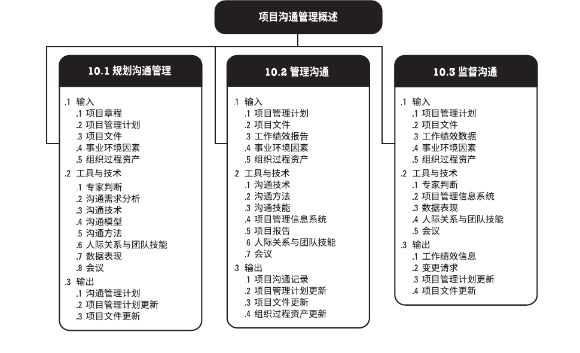

【核心概念】

沟通是指用各种可能的方式来发送或接收信息，或者通过沟通活动（如会议和演讲），或者以工件的方式（如电子邮件、社交媒体、项目报告或项目文档）。

项目经理的大多数时间用于与团队成员和其他项目相关方沟通，包括来自组织内部（组织的各个层级）和组织外部的人员。

沟通活动可按多种维度进行分类，包括（但不限于）：
- 内部、外部
- 正式、非正式
- 层级沟通：向上沟通、向下沟通、横向沟通。
- 官方沟通、非官方沟通
- 书面与口头沟通

成功的沟通包括两个部分。
第一部分是根据项目及其相关方的需求而制定适当的沟通策略。从该策略出发，制定沟通管理计划，来确保用各种形式和手段把恰当的信息传递给相关方。这些信息构成项目沟通-成功沟通的第二部分。

沟通管理计划定义了信息的收集、生成、发布、储存、检索、管理、追踪和处置。最终，沟通策略和沟通管理计划将成为监督沟通效果的依据。

有效的沟通活动和工件创建具有如下基本属性：
- 沟通目的明确；
- 尽量了解沟通接收方，满足其需求及偏好；
- 监督并衡量沟通的效果。

【发展趋势与新兴实践】

在关注相关方，以及认可相关方的有效参与对项目及组织的价值的同时，也要认识到制定和落实适当的沟通策略，对维系与相关方的有效关系是至关重要的。

项目沟通管理的发展趋势和新兴实践包括（但不限于）：
- 将相关方纳入项目评审范围。有效的沟通策略要求定期且及时地评审相关方社区，以管理成员及其态度的变化。
- 让相关方参加项目会议。项目会议应邀请项目外部甚至组织外部（若适当）的相关方参与。
- 社交工具的使用日益增多。以硬件平台、社交媒体服务和个人便携设备为代表的社交工具已经改变组织及其人员的沟通和业务方式。
- 多面性沟通方法。通常应考虑所有可用技术，并从中作出选择；同时也应尊重因文化、实践和个人背景而产生的对沟通语言、媒介、内容和方式的偏好。

【裁剪考虑因素】

裁剪时应考虑的因素包括（但不限于）：
- 相关方。相关方是属于组织内部或外部，或者二者都是？
- 物理地点。团队成员身处何地？团队是否集中办公？团队是否位于相同地理区域？团队是否分散于多个时区？
- 沟通技术。哪项技术可用于创建、记录、传输、检索、追踪和储存沟通工件？哪些技术最适用于与相关方沟通且成本效益最高？
- 语言。语言是沟通活动中要考虑的主要因素。使用的是一种语言，还是多种语言？是否已为适应多语种团队的复杂情况安排了资金？
- 知识管理。组织是否有正式的知识管理库？是否采用管理库？

【敏捷或适应性环境中的考虑因素】

在模糊不定的项目环境中，必然需要对不断演变和出现的细节情况，进行更频繁和快速的沟通。因此，应该尽量简化团队成员获取信息的通道，频繁进行团队检查，并让团队成员集中办公。

此外，为了促进与高级管理层和相关方的沟通，还需要以透明的方式发布项目工件，并定期邀请相关方评审项目工件。

### 10.1规划沟通管理

规划沟通管理是基于每个相关方或相关方群体的信息需求、可用的组织资产，以及具体项目的需求，为项目沟通活动制定恰当的方法和计划的过程。本过程的主要作用是，为及时向相关方提供相关信息，引导相关方有效参与项目，而编制书面沟通计划。本过程应根据需要在整个项目期间定期开展。

需在项目生命周期的早期，针对项目相关方多样性的信息需求，制定有效的沟通管理计划。应该定期审核沟通管理计划，并进行必要的修改，例如在相关方社区发生变化或每个新项目阶段开始时。

在大多数项目中，都需要很早就开展沟通规划工作，例如在识别相关方及制定项目管理计划期间。

虽然所有项目都需要进行信息沟通，但是各项目的信息需求和信息发布方式可能差别很大。此外，在本过程中，需要考虑并合理记录用来存储、检索和最终处置项目信息的方法。应该在整个项目期间，定期审查规划沟通管理过程的成果并做必要修改，以确保其持续适用。

【输入】
- 项目章程
- 项目管理计划：资源管理计划、相关方参与计划
- 项目文件：需求文件、相关方登记册
- 事业环境因素
- 组织过程资产

【工具与技术】
- 专家判断
- 沟通需求分析
- 沟通技术
- 沟通模型
- 沟通方法
- 人际关系与团队技能：沟通风格评估、政治意识、文化意识
- 数据表现：相关方参与度评估矩阵
- 会议

【输出】
- 沟通管理计划
- 项目管理计划更新：相关方参与计划
- 项目文件更新：项目进度计划、相关方登记册

### 10.2管理沟通

管理沟通是确保项目信息及时且恰当地收集、生成、发布、存储、检索、管理、监督和最终处置的过程。本过程的主要作用是，促成项目团队与相关方之间的有效信息流动。本过程需要在整个项目期间开展。

管理沟通过程会涉及与开展有效沟通有关的所有方面，包括使用适当的技术、方法和技巧。

此外，它还应允许沟通活动具有灵活性，允许对方法和技术进行调整，以满足相关方及项目不断变化的需求。

本过程不局限于发布相关信息，它还设法确保信息以适当的格式正确生成和送达目标受众。本过程也为相关方提供机会，允许他们请求更多信息、澄清和讨论。有效的沟通管理需要借助相关技术并考虑相关事宜，包括（但不限于）：
- 发送方 - 接收方模型。运用反馈循环，为互动和参与提供机会，并清除妨碍有效沟通的障碍。
- 媒介选择。为满足特定的项目需求而使用合理的沟通工件，例如，何时进行书面沟通或口头沟通、何时准备非正式备忘录或正式报告、何时使用推式或拉式沟通，以及该选择何种沟通技术。
- 写作风格。合理使用主动或被动语态、句子结构，以及合理选择词汇。
- 会议管理。准备议程，邀请重要参会者并确保他们出席；处理会议现场发生的冲突，或因对会议纪要和后续行动跟进不力而导致的冲突，或因不当人员与会而导致的冲突。
- 演示。了解肢体语言和视觉辅助设计的作用。
- 引导。达成共识、克服障碍（如小组缺乏活力），以及维持小组成员的兴趣和热情。
- 积极倾听。积极倾听包括告知已收到、澄清与确认信息、理解，以及消除妨碍理解的障碍。

【输入】
- 项目管理计划：资源管理计划、沟通管理计划、相关方参与计划
- 项目文件：变更日志、问题日志、经验教训登记册、质量报告、风险报告、相关方登记册
- 工作绩效报告
- 事业环境因素
- 组织过程资产

【工具与技术】
- 沟通技术
- 沟通方法
- 沟通技能：沟通胜任力、反馈、非言语、演示
- 项目管理信息系统
- 项目报告
- 人际关系与团队技能：积极倾听、冲突管理、文化意识、会议管理、人际交往、政治意识
- 会议

【输出】
- 项目沟通记录
- 项目管理计划更新：沟通管理计划、相关方参与计划
- 项目文件更新：问题日志、经验教训登记册、项目进度计划、风险登记册、相关风登记册
- 组织过程资产更新

### 10.3监督沟通

监督沟通是确保满足项目及其相关方的信息需求的过程。本过程的主要作用是，按沟通管理计划和相关方参与计划的要求优化信息传递流程。本过程需要在整个项目期间开展。

通过监督沟通过程，来确定规划的沟通工件和沟通活动是否如预期提高或保持了相关方对项目可交付成果与预计结果的支持力度。项目沟通的影响和结果应该接受认真的评估和监督，以确保在正确的时间，通过正确的渠道，将正确的内容（发送方和接收方对其理解一致）传递给正确的受众。

监督沟通可能需要采取各种方法，例如，开展客户满意度调查、整理经验教训、开展团队观察、审查问题日志中的数据，或评估相关方参与度评估矩阵中的变更。

监督沟通过程可能触发规划沟通管理和（或）管理沟通过程的迭代，以便修改沟通计划并开展额外的沟通活动，来提升沟通的效果。这种迭代体现了项目沟通管理各过程的持续性质。问题、关键绩效指标、风险或冲突，都可能立即触发重新开展这些过程。

【输入】
- 项目管理计划：资源管理计划、沟通管理计划、相关方参与计划
- 项目文件：问题日志、经验教训登记册、项目沟通记录
- 工作绩效数据
- 事业环境因素
- 组织过程资产

【工具与技术】
- 专家判断
- 项目管理信息系统
- 数据分析：相关方参与度评估矩阵
- 人际关系与团队技能：观察/交谈
- 会议

【输出】
- 工作绩效信息
- 变更请求
- 项目管理计划更新：沟通管理计划、相关方参与计划
- 项目文件更新：问题日志、经验教训登记册、相关方登记册

## 11.风险

**项目风险管理包括规划风险管理、识别风险、开展风险分析、规划风险应对、实施风险应对和监督风险的各个过程。**

项目风险管理的目标在于提高正面风险的概率和（或）影响，降低负面风险的概率和（或）影响，从而提高项目成功的可能性。

项目风险管理的过程是：
- 规划风险管理 — 定义如何实施项目风险管理活动的过程。
- 识别风险 — 识别单个项目风险，以及整体项目风险的来源，并记录风险特征的过程。
- 实施定性风险分析 — 通过评估单个项目风险发生的概率和影响以及其他特征，对风险进行优先级排序，从而为后续分析或行动提供基础的过程。
- 实施定量风险分析 — 就已识别的单个项目风险和其他不确定性的来源对整体项目目标的综合影响进行定量分析的过程。
- 规划风险应对 — 为处理整体项目风险敞口，以及应对单个项目风险，而制定可选方案、选择应对策略并商定应对行动的过程。
- 实施风险应对 — 执行商定的风险应对计划的过程。
- 监督风险 — 在整个项目期间，监督商定的风险应对计划的实施、跟踪已识别风险、识别和分析新风险，以及评估风险管理有效性的过程。

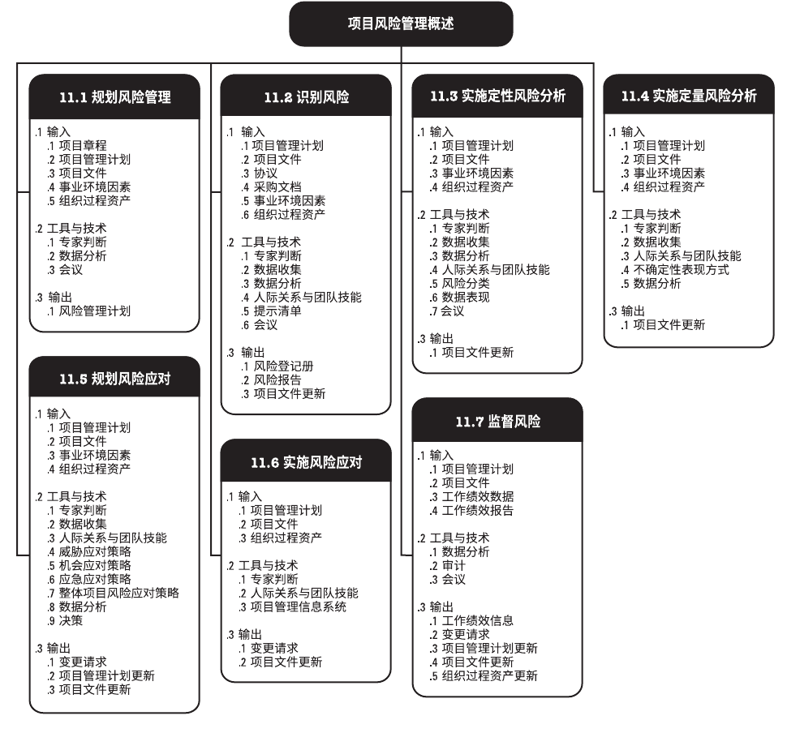

【核心概念】

开展项目，不仅要面对各种制约因素和假设条件，而且还要应对可能相互冲突和不断变化的相关方期望。组织应该有目的地以可控方式去冒项目风险，以便平衡风险和回报，并创造价值。

项目风险管理旨在识别和管理未被其他项目管理过程所管理的风险。项目风险管理的有效性直接关乎项目成功与否。

每个项目都在两个层面上存在风险。每个项目都有会影响项目达成目标的单个风险，以及由单个项目风险和不确定性的其他来源联合导致的整体项目风险。考虑整体项目风险，也非常重要。项目风险管理过程同时兼顾这两个层面的风险。它们的定义如下：
- 单个项目风险是一旦发生，会对一个或多个项目目标产生正面或负面影响的不确定事件或条件。
- 整体项目风险是不确定性对项目整体的影响，是相关方面临的项目结果正面和负面变异区间。它源于包括单个风险在内的所有不确定性。

单个项目风险会对项目目标产生正面或负面的影响。项目风险管理旨在利用或强化正面风险（机会），规避或减轻负面风险（威胁）。  
整体项目风险也有正面或负面之分。管理整体项目风险旨在通过削弱负面变异的驱动因素，加强正面变异的驱动因素，以及最大化实现整体项目目标的概率，把项目风险敞口保持在可接受的范围之内。

风险会在项目生命周期内持续发生，所以，项目风险管理过程也应不断迭代开展。在项目规划期间，就应该通过调整项目策略对风险做初步处理。接着，应该随着项目进展，监督和管理风险，确保项目处于正轨，并且突发性风险也得到处理。

为有效管理特定项目的风险，项目团队需要知道，相对于要追求的项目目标，可接受的风险敞口究竟是多大。这通常用可测量的风险临界值来定义。风险临界值反映了组织与项目相关方的风险偏好程度，是项目目标的可接受的变异程度。应该明确规定风险临界，并传达给项目团队，同时反映在项目的风险影响级别定义中。

【发展趋势与新兴实践】

项目风险管理的发展趋势和新兴实践包括（但不限于）：
- 非事件类风险。大多数项目只关注作为可能发生或不发生的不确定性未来事件的风险。例如：关键卖方可能在项目期间停业，客户可能在设计完成后变更需求，或分包商可能要求对标准化操作流程进行优化。非事件类风险有两种主要类型：
  - 变异性风险。已规划事件、活动或决策的某些关键方面存在不确定性，就导致变异性风险。例如，生产率可能高于或低于目标值，测试发现的错误数量可能多于或少于预期，或施工阶段可能出现反常的天气情况。变异性风险可通过蒙特卡洛分析加以处理，即：用概率分布表示变异的可能区间，然后采取行动去缩小可能结果的区间。
  - 模糊性风险。对未来可能发生什么，存在不确定性。知识不足可能影响项目达成目标的能力，例如，不太了解需求或技术解决方案的要素、法规框架的未来发展，或项目内在的系统复杂性。管理模糊性风险，则需要先定义认知或理解不足之处，进而通过获取外部专家意见或以最佳实践为标杆来填补差距。也可以采用增量开发、原型搭建或模拟等方法来处理模糊性风险。
- 项目韧性。随着对所谓“未知-未知”因素的意识的增强，人们也越来越明确地知道确实存在突发性风险。这种风险只有在发生后才能被发现。可以通过加强项目韧性来应对突发性风险。这就要求每个项目：
  - 除了为已知风险列出具体风险预算，还要为突发性风险预留合理的应急预算和时间；
  - 采用灵活的项目过程，包括强有力的变更管理，以便在保持朝项目目标推进的正确方向的同时，应对突发性风险；
  - 授权目标明确且值得信赖的项目团队在商定限制范围内完成工作；
  - 经常留意早期预警信号，以尽早识别突发性风险；
  - 明确征求相关方的意见，以明确为应对突发性风险而可以调整项目范围或策略的领域。
- 整合式风险管理。项目存在于组织背景中，可能是项目集或项目组合的一部分。在项目、项目集、项目组合和组织这些层面上，都存在风险。应该在适当的层面上承担和管理风险。在较高层面识别出的某些风险，将被授权给项目团队去管理；而在较低层面识别出的某些风险，又可能上交给较高层面去管理（如果在项目之外管理最有效）。应该采用协调式企业级风险管理方法，来确保所有层面的风险管理工作的一致性和连贯性。这样就能使项目集和项目组合的结构具有风险效率，有利于在给定的风险敞口水平下创造最大的整体价值。

【裁剪考虑因素】

裁剪时应考虑的因素包括（但不限于）：
- 项目规模。由预算、持续时间、范围或团队人数所体现的项目规模，要求采取更详细的风险管理方法吗？或者项目小到只需要用简化的风险管理过程吗？
- 项目复杂性。由高水平创新、新技术采用、商务安排、界面或外部依赖关系导致的项目复杂性提高，是否要求采用更稳健的风险管理方法？或者项目是否简单到只需要用简化的风险管理过程？
- 项目重要性。项目的战略重要性有多大？项目的风险级别因旨在创造突破性机会、克服组织经营的重大障碍或涉及重大产品创新而提高了吗？
- 开发方法。它是否是瀑布式项目，风险管理过程可以相继或重复开展；或者此项目是否采取敏捷型方法，需在每个重复过程的开始阶段以及执行期间处理风险？

【敏捷或适应性环境中的考虑因素】

从本质上讲，越是变化的环境就存在越多的不确定性和风险。要应对快速变化，就需要采用适应型方法管理项目，即：通过跨职能项目团队和经常审查增量式工作产品，来加快知识分享，确保对风险的认知和管理。在选择每个迭代期的工作内容时，应该考虑风险；在每个迭代期间应该识别、分析和管理风险。

此外，应该根据对当前风险敞口的理解的加深，定期更新需求文件，并随项目进展重新排列工作优先级。

### 11.1规划风险管理

规划风险管理是定义如何实施项目风险管理活动的过程。本过程的主要作用是，确保风险管理的水平、方法和可见度与项目风险程度，以及项目对组织和其他相关方的重要程度相匹配。本过程仅开展一次或仅在项目的预定义点开展。

规划风险管理过程在项目构思阶段就应开始，并在项目早期完成。在项目生命周期的后期，可能有必要重新开展本过程，例如，在发生重大阶段变更时，在项目范围显著变化时，或者后续对风险管理有效性进行审查且确定需要调整项目风险管理过程时。

【输入】
- 项目章程
- 项目管理计划：所有组件
- 项目文件：相关方登记册
- 事业环境因素
- 组织过程资产

【工具与技术】
- 专家判断
- 数据分析：相关方分析
- 会议

【输出】
- 风险管理计划

### 11.2识别风险

识别风险是识别单个项目风险以及整体项目风险的来源，并记录风险特征的过程。本过程的主要作用是，记录现有的单个项目风险，以及整体项目风险的来源；同时，汇集相关信息，以便项目团队能够恰当应对已识别的风险。本过程需要在整个项目期间开展。

识别风险时，要同时考虑单个项目风险，以及整体项目风险的来源。风险识别活动的参与者可能包括：项目经理、项目团队成员、项目风险专家（若已指定）、客户、项目团队外部的主题专家、最终用户、其他项目经理、运营经理、相关方和组织内的风险管理专家。虽然这些人员通常是风险识别活动的关键参与者，但是还应鼓励所有项目相关方参与单个项目风险的识别工作。项目团队的参与尤其重要，以便培养和保持他们对已识别单个项目风险、整体项目风险级别和相关风险应对措施的主人翁意识和责任感。

应该采用统一的风险描述格式，来描述和记录单个项目风险，以确保每一项风险都被清楚、明确地理解，从而为有效的分析和风险应对措施制定提供支持。可以在识别风险过程中为单个项目风险指定风险责任人，待实施定性风险分析过程确认。也可以识别和记录初步的风险应对措施，待规划风险应对过程审查和确认。

在整个项目生命周期中，单个项目风险可能随项目进展而不断出现，整体项目风险的级别也会发生变化。因此，识别风险是一个迭代的过程。迭代的频率和每次迭代所需的参与程度因情况而异，应在风险管理计划中做出相应规定。

【输入】
- 项目管理计划：需求管理计划、进度管理计划、成本管理计划、质量管理计划、资源管理计划、风险管理计划、范围基准、进度基准、成本基准
- 项目文件：假设日志、成本估算、持续时间估算、问题日志、经验教训登记册、需求文件、资源需求、相关方登记册
- 协议
- 采购文档
- 事业环境因素
- 组织过程资产

【工具与技术】
- 专家判断
- 数据收集：头脑风暴、核对单、访谈
- 数据分析：根本原因分析、假设条件和制约因素分析、SWOT分析、文本分析
- 人际关系与团队技能：引导
- 提示清单
- 会议

【输出】
- 风险登记册
- 风险报告
- 项目文件更新：假设日志、问题日志、经验教训登记册

### 11.3实施定性风险分析

实施定性风险分析是通过评估单个项目风险发生的概率和影响以及其他特征，对风险进行优先级排序，从而为后续分析或行动提供基础的过程。本过程的主要作用是重点关注高优先级的风险。

本过程需要在整个项目期间开展。

实施定性风险分析，使用项目风险的发生概率、风险发生时对项目目标的相应影响以及其他因素，来评估已识别单个项目风险的优先级。这种评估基于项目团队和其他相关方对风险的感知程度，从而具有主观性。所以，为了实现有效评估，就需要认清和管理本过程关键参与者对风险所持的态度。风险感知会导致评估已识别风险时出现偏见，所以应该注意找出偏见并加以纠正。如果由引导者来引导本过程的开展，那么找出并纠正偏见就是该引导者的一项重要工作。同时，评估单个项目风险的现有信息的质量，也有助于澄清每个风险对项目的重要性的评估。

实施定性风险分析能为规划风险应对过程确定单个项目风险的相对优先级。本过程会为每个风险识别出责任人，以便由他们负责规划风险应对措施，并确保应对措施的实施。如果需要开展实施定量风险分析过程，那么实施定性风险分析也能为其奠定基础。

根据风险管理计划的规定，在整个项目生命周期中要定期开展实施定性风险分析过程。在敏捷开发环境中，实施定性风险分析过程通常要在每次迭代开始前进行。

【输入】
- 项目管理计划：风险管理计划
- 项目文件：假设日志、风险登记册、相关方登记册
- 事业环境因素
- 组织过程资产

【工具与技术】
- 专家判断
- 数据收集：访谈
- 数据分析：风险数据质量评估、风险概率和影响评估、其他风险参数评估
- 人际关系与团队技能：引导
- 风险分类
- 数据表现：概率和影响矩阵、层级型
- 会议

【输出】
- 项目文件更新：假设日志、问题日志、风险登记册、风险报告

### 11.4实施定量风险分析

实施定量风险分析是就已识别的单个项目风险和不确定性的其他来源对整体项目目标的影响进行定量分析的过程。本过程的主要作用是，量化整体项目风险敞口，并提供额外的定量风险信息，以支持风险应对规划。本过程并非每个项目必需，但如果采用，它会在整个项目期间持续开展。

并非所有项目都需要实施定量风险分析。能否开展稳健的分析取决于是否有关于单个项目风险和其他不确定性来源的高质量数据，以及与范围、进度和成本相关的扎实项目基准。定量风险分析通常需要运用专门的风险分析软件，以及编制和解释风险模式的专业知识，还需要额外的时间和成本投入。

项目风险管理计划会规定是否需要使用定量风险分析，定量分析最可能适用于大型或复杂的项目、具有战略重要性的项目、合同要求进行定量分析的项目，或主要相关方要求进行定量分析的项目。

通过评估所有单个项目风险和其他不确定性来源对项目结果的综合影响，定量风险分析就成为评估整体项目风险的唯一可靠的方法。

在实施定量风险分析过程中，要使用被定性风险分析过程评估为对项目目标存在重大潜在影响的单个项目风险的信息。

实施定量风险分析过程的输出，则要用作规划风险应对过程的输入，特别是要据此为整体项目风险和关键单个项目风险推荐应对措施。定量风险分析也可以在规划风险应对过程之后开展，以分析已规划的应对措施对降低整体项目风险敞口的有效性。

【输入】
- 项目管理计划：风险管理计划、范围基准、进度基准、成本基准
- 项目文件：假设日志、估算依据、成本预测、持续时间估算、里程碑清单、资源需求、风险登记册、风险报告、进度预测
- 事业环境因素
- 组织过程资产

【工具与技术】
- 专家判断
- 数据收集：访谈
- 人际关系与团队技能：引导
- 不确定性表现方式
- 数据分析：模拟、敏感度分析、决策树分析、影响图

【输出】
- 项目文件更新：风险报告

### 11.5规划风险应对

规划风险应对是为处理整体项目风险敞口，以及应对单个项目风险，而制定可选方案、选择应对策略并商定应对行动的过程。本过程的主要作用是，制定应对整体项目风险和单个项目风险的适当方法；本过程还将分配资源，并根据需要将相关活动添加进项目文件和项目管理计划。本过程需要在整个项目期间开展。

有效和适当的风险应对可以最小化单个威胁，最大化单个机会，并降低整体项目风险敞口；不恰当的风险应对则会适得其反。一旦完成对风险的识别、分析和排序，指定的风险责任人就应该编制计划，以应对项目团队认为足够重要的每项单个项目风险。这些风险会对项目目标的实现造成威胁或提供机会。项目经理也应该思考如何针对整体项目风险的当前级别做出适当的应对。

风险应对方案应该与风险的重要性相匹配、能经济有效地应对挑战、在当前项目背景下现实可行、能获得全体相关方的同意，并由一名责任人具体负责。往往需要从几套可选方案中选出最优的风险应对方案。应该为每个风险选择最可能有效的策略或策略组合。可用结构化的决策技术来选择最适当的应对策略。对于大型或复杂项目，可能需要以数学优化模型或实际方案分析为基础，进行更加稳健的备选风险应对策略经济分析。

要为实施商定的风险应对策略，包括主要策略和备用策略（若必要），制定具体的应对行动。

如果选定的策略并不完全有效，或者发生了已接受的风险，就需要制定应急计划（或弹回计划）。

同时，也需要识别次生风险。次生风险是实施风险应对措施而直接导致的风险。往往需要为风险分配时间或成本应急储备，并可能需要说明动用应急储备的条件。

【输入】
- 项目管理计划：资源管理计划、风险管理计划、成本基准
- 项目文件：经验教训登记册、项目进度计划、项目团队派工单、资源日历、风险登记册、风险报告、相关方登记册
- 事业环境因素
- 组织过程资产

【工具与技术】
- 专家判断
- 数据收集：访谈
- 人际关系与团队技能：引导
- 威胁应对策略
- 机会应对策略
- 应急应对策略
- 整体项目风险应对策略
- 数据分析：备选方案分析、成本效益分析
- 决策：多标准决策分析

【输出】
- 变更请求
- 项目管理计划更新：进度管理计划、成本管理计划、质量管理计划、资源管理计划、采购管理计划、范围基准、进度基准、成本基准
- 项目文件更新：假设日志、成本预测、经验教训登记册、项目进度计划、项目团队派工单、风险登记册、风险报告

### 11.6实施风险应对

实施风险应对是执行商定的风险应对计划的过程。本过程的主要作用是，确保按计划执行商定的风险应对措施，来管理整体项目风险敞口、最小化单个项目威胁，以及最大化单个项目机会。本过程需要在整个项目期间开展。

适当关注实施风险应对过程，能够确保已商定的风险应对措施得到实际执行。项目风险管理的一个常见问题是，项目团队努力识别和分析风险并制定应对措施，然后把经商定的应对措施记录在风险登记册和风险报告中，但是不采取实际行动去管理风险。

只有风险责任人以必要的努力去实施商定的应对措施，项目的整体风险敞口和单个威胁及机会才能得到主动管理。

【输入】
- 项目管理计划：风险管理计划
- 项目文件：经验教训登记册、风险登记册、风险报告
- 组织过程资产

【工具与技术】
- 专家判断
- 人际关系与团队技能：影响力
- 项目管理信息系统

【输出】
- 变更请求
- 项目文件更新：问题日志、经验教训登记册、项目团队派工单、风险登记册、风险报告

### 11.7监督风险

监督风险是在整个项目期间，监督商定的风险应对计划的实施、跟踪已识别风险、识别和分析新风险，以及评估风险管理有效性的过程。本过程的主要作用是，使项目决策都基于关于整体项目风险敞口和单个项目风险的当前信息。本过程需要在整个项目期间开展。

为了确保项目团队和关键相关方了解当前的风险敞口级别，应该通过监督风险过程对项目工作进行持续监督，来发现新出现、正变化和已过时的单个项目风险。监督风险过程采用项目执行期间生成的绩效信息，以确定：
- 实施的风险应对是否有效；
- 整体项目风险级别是否已改变；
- 已识别单个项目风险的状态是否已改变；
- 是否出现新的单个项目风险；
- 风险管理方法是否依然适用；
- 项目假设条件是否仍然成立；
- 风险管理政策和程序是否已得到遵守；
- 成本或进度应急储备是否需要修改；
- 项目策略是否仍然有效。

【输入】
- 项目管理计划：风险管理计划
- 项目文件：问题日志、经验教训登记册、风险登记册、风险报告
- 工作绩效数据
- 工作绩效报告

【工具与技术】
- 数据分析：技术绩效分析、储备分析
- 审计
- 会议

【输出】
- 工作绩效信息
- 变更请求
- 项目管理计划更新：任何组件
- 项目文件更新：假设日志、问题日志、经验教训登记册、风险登记册、风险报告
- 组织过程资产更新

## 12.采购

**项目采购管理包括从项目团队外部采购或获取所需产品、服务或成果的各个过程。**

项目采购管理包括编制和管理协议所需的管理和控制过程，例如，合同、订购单、协议备忘录 (MOA)，或服务水平协议 (SLA)。被授权采购项目所需货物和（或）服务的人员可以是项目团队、管理层或组织采购部（如果有）的成员。

项目采购管理过程包括：
- 规划采购管理 — 记录项目采购决策、明确采购方法，及识别潜在卖方的过程。
- 实施采购 — 获取卖方应答、选择卖方并授予合同的过程。
- 控制采购 — 管理采购关系、监督合同绩效、实施必要的变更和纠偏，以及关闭合同的过程。

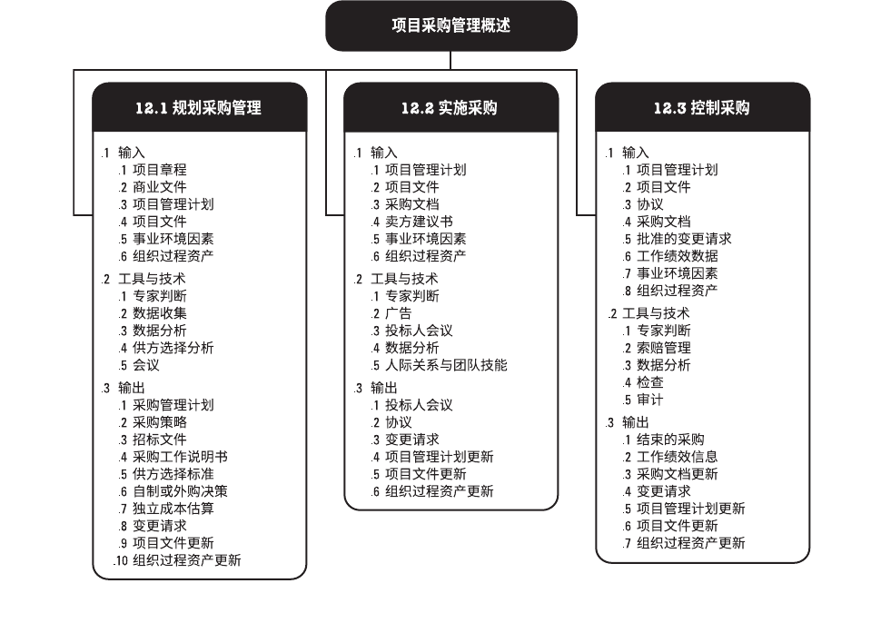

【核心概念】

项目经理不必成为采购管理法律法规领域的专家，但应该对采购过程有足够了解，以便做出与合同及合同关系相关的明智决定。

项目采购管理过程涉及到用协议来描述买卖双方之间的关系。

合同应明确说明预期的可交付成果和结果，包括从卖方到买方的任何知识转移。合同中未规定的任何事项则不具法律强制力。

采购合同中包括条款和条件，也可包括买方就卖方应实施工作或应交付产品的其他规定。在与采购办公室协作确保遵守组织的采购政策的同时，项目管理团队必须确定所有采购都能满足项目的具体需要。因应用领域不同，协议可以是合同、服务水平协议（SLA）、谅解备忘录、协议备忘录（MOA）或订购单。

在复杂项目中，可能需要同时或先后管理多个合同。这种情况下，不同合同的生命周期可在项目生命周期的任何阶段开始与结束。买卖方关系是采购组织与外部组织之间的关系，可存在于项目的许多层次上。

【发展趋势与新兴实践】

项目采购管理的发展趋势和新兴实践包括（但不限于）：
- 工具的改进。用于管理项目采购和项目执行的工具已经取得重大发展。如买方发布采购广告；卖方在线填写。
- 更先进的风险管理。在风险管理领域日益流行的一个趋势，就是在编制合同时准确地将具体风险分配给最有能力对其加以管理的一方。
- 变化中的合同签署实践。在过去几年时间内，超大型项目的数量显著增加，尤其是在基础设施建设和工程项目领域。数十亿美元的项目现在已十分常见。大部分此类项目都要求与多个国家的多家承包商签署国际合同，因此肯定比仅使用当地承包商的项目具有更大的风险。承包商越来越重视在采购过程中与客户开展密切合作，以便对批量采购或有其他特殊关系的客户给予折扣优惠。对于此类项目来说，为了减少执行过程中的问题和索赔，采用国际公认的标准合同范本也日益普遍。
- 物流和供应链管理。因为如此多的大型工程、施工和基础设施建设项目都由多家跨国承包商来完成，材料物流管理对于项目成功完成至关重要。对采购周期较长的产品，制造环节和运输（到项目现场）环节都是项目进度的决定因素。在 IT 领域，有些产品可能需要提前 2 至 3 个月订购；在复杂的施工项目上，订购时间可能需要提前 1-2 年，甚至更长。在这些项目上，可能需要在签订其他采购合同之前就采购这些订购周期长的产品，以便项目如期完成。在最终产品的最终设计完成之前，就可能需要根据总体设计中已确定的要求开始订购采购周期较长的材料、用品或设备。供应链管理也是承包商的项目团队日益重视的一个领域。在项目早期，不仅要明确主要的采购渠道，通常还需要明确次要和备选渠道。全球很多国家会要求跨国承包商至少向当地供应商采购一定比例的材料和用品。
- 技术和相关方关系。公共资助的项目正受越来越多的关注。基础设施和商业建设项目正日益采用包括网络摄像（webcams）在内的技术，以改善与相关方的沟通和关系。在施工期间，施工现场会安装一台或多台网络摄像机，定期更新并发布到公开的网站上，方便所有相关方在互联网上查看项目进展。另外，视频资料可以储存，有助于在索赔发生时进行分析。有些项目显示，使用网络摄像机记录现场情况，能够避免对事实的分歧，从而能够把与现场施工有关的争议降到最低程度。
- 试用采购。并非每一个卖方都能很好地适应买方组织的环境，因此，在决定大批量采购之前，有些项目会试用多个候选卖方，向他们采购少量的可交付成果和工作产品。这样一来，买方可以在推进项目工作的同时，对潜在合作伙伴进行评估。

【裁剪考虑因素】

裁剪时应考虑的因素包括（但不限于）：
- 采购的复杂性。只开展一次主要的采购，或者需要在不同时间向不同卖方进行多次采购（会提高采购的复杂性）？
- 物理地点。买方和卖方在同一或邻近地点，或者位于不同时区、国家或大洲？
- 治理和法规环境。组织的采购政策是否和当地相关的法律法规兼容？当地的法律法规会如何影响合同审计工作？
- 承包商的可用性。是否有具备工作执行能力的承包商可供选择？

【敏捷或适应性环境中的考虑因素】

敏捷型环境中，可能需要与特定卖方协作来扩充团队。这种协作关系能够营造风险共担式采购模型，让买方和卖方共担项目风险和共享项目奖励。

在大型项目上，可能针对某些可交付成果采用适应型方法，而对其他部分则采用更稳定的方法。在这种情况下，可以通过主体协议，如主要服务协议（MSA），来管辖整体协作关系，而将适应型工作写入附录或补充文件。这样一来，变更只针对适应型工作，而不会对主体协议造成影响。

### 12.1规划采购管理

规划采购管理是记录项目采购决策、明确采购方法，及识别潜在卖方的过程。本过程的主要作用是，确定是否从项目外部获取货物和服务，如果是，则还要确定将在什么时间、以什么方式获取什么货物和服务。货物和服务可从执行组织的其他部门采购，或者从外部渠道采购。本过程仅开展一次或仅在项目的预定义点开展。

应该在规划采购管理过程的早期，确定与采购有关的角色和职责。项目经理应确保在项目团队中配备具有所需采购专业知识的人员。采购过程的参与者可能包括购买部或采购部的人员，以及采购组织法务部的人员。这些人员的职责也应记录在采购管理计划中。

典型的步骤可能有：
- 准备采购工作说明书 (SOW) 或工作大纲 (TOR)；
- 准备高层级的成本估算，制定预算；
- 发布招标广告；
- 确定合格卖方的短名单；
- 准备并发布招标文件；
- 由卖方准备并提交建议书；
- 对建议书开展技术（包括质量）评估；
- 对建议书开展成本评估；
- 准备最终的综合评估报告（包括质量及成本），选出中标建议书；
- 结束谈判，买方和卖方签署合同。

项目进度计划对规划采购管理过程中的采购策略制定有重要影响。在制定采购管理计划时所做出的决定也会影响项目进度计划。在开展制定进度计划过程、估算活动资源过程以及自制或外购决策制定时，都需要考虑这些决定。

【输入】
- 项目章程
- 商业文件：商业论证、效益管理计划
- 项目管理计划：范围管理计划、质量管理计划、资源管理计划、范围基准
- 项目文件：里程碑清单、项目团队派工单、需求文件、需求跟踪矩阵、资源需求、风险登记册、相关方登记册
- 事业环境因素
- 组织过程资产

【工具与技术】
- 专家判断
- 数据收集：市场调研
- 数据分析：自制或外购分析
- 供方选择分析
- 会议

【输出】
- 采购管理计划
- 采购策略
- 招标文件
- 采购工作说明书
- 供方选择标准
- 自制或外购决策
- 独立成本估算
- 变更请求
- 项目文件更新：经验教训登记册、里程碑清单、需求文件、需求跟踪矩阵、风险登记册、相关方登记册
- 组织过程资产更新

### 12.2实施采购

实施采购是获取卖方应答、选择卖方并授予合同的过程。本过程的主要作用是，选定合格卖方并签署关于货物或服务交付的法律协议。本过程的最后成果是签订的协议，包括正式合同。本过程应根据需要在整个项目期间定期开展。

【输入】
- 项目管理计划：范围管理计划、需求管理计划、沟通管理计划、风险管理计划、采购管理计划、配置管理计划、成本基准
- 项目文件：经验教训登记册、项目进度计划、需求文件、风险登记册、相关方登记册
- 采购文档
- 卖方建议书
- 事业环境因素
- 组织过程资产

【工具与技术】
- 专家判断
- 广告
- 投标人会议
- 数据分析：建议书评价
- 人际关系与团队技能：谈判

【输出】
- 投标人会议
- 协议
- 变更请求
- 项目管理计划更新：需求管理计划、质量管理计划、沟通管理计划、风险管理计划、范围基准、进度基准、成本基准
- 项目文件更新：经验教训登记册、需求文件、需求跟踪矩阵、资源日历、风险登记册、相关方登记册
- 组织过程资产更新

### 12.3控制采购

控制采购是管理采购关系，监督合同绩效，实施必要的变更和纠偏，以及关闭合同的过程。本过程的主要作用是，确保买卖双方履行法律协议，满足项目需求。本过程应根据需要在整个项目期间开展。

买方和卖方都出于相似的目的来管理采购合同，每方都必须确保双方履行合同义务，确保各自的合法权利得到保护。合同关系的法律性质，要求项目管理团队必须了解在控制采购期间所采取的任何行动的法律后果。对于有多个供应商的较大项目，合同管理的一个重要方面就是管理各个供应商之间的沟通。

鉴于其法律意义，很多组织都将合同管理视为独立于项目的一种组织职能。虽然采购管理员可以是项目团队成员，但通常还向另一部门的经理报告。

在控制采购过程中，需要把适当的项目管理过程应用于合同关系，并且需要整合这些过程的输出，以用于对项目的整体管理。如果涉及多个卖方，以及多种产品、服务或成果，就往往需要在多个层级上开展这种整合。

合同管理活动可能包括：
- 收集数据和管理项目记录，包括维护对实体和财务绩效的详细记录，以及建立可测量的采购绩效指标；
- 完善采购计划和进度计划；
- 建立与采购相关的项目数据的收集、分析和报告机制，并为组织编制定期报告；
- 监督采购环境，以便引导或调整实施；
- 向卖方付款。

控制措施的质量，包括采购审计的独立性和可信度，是采购系统可靠性的关键决定因素。组织的道德规范、内部法律顾问和外部法律咨询，包括持续的反腐计划，都有助于实现适当的采购控制。

在控制采购过程中，需要开展财务管理工作，包括监督向卖方付款。这是要确保合同中的支付条款得到遵循，确保按合同规定，把付款与卖方的工作进展联系起来。需要重点关注的一点是，确保向卖方的付款与卖方实际已经完成的工作量之间有密切的关系。如果合同规定了基于项目输出及可交付成果来付款，而不是基于项目输入（如工时），那么就可以更有效地开展采购控制。

在合同收尾前，若双方达成共识，可以根据协议中的变更控制条款，随时对协议进行修改。通常要书面记录对协议的修改。

【输入】
- 项目管理计划：需求管理计划、风险管理计划、采购管理计划、变更管理计划、进度基准
- 项目文件：假设日志、经验教训登记册、里程碑清单、质量报告、需求文件、需求跟踪矩阵、风险登记册、相关方登记册
- 协议
- 采购文档
- 批准的变更请求
- 工作绩效数据
- 事业环境因素
- 组织过程资产

【工具与技术】
- 专家判断
- 索赔管理
- 数据分析：绩效审查、挣值分析、趋势分析
- 检查
- 审计

【输出】
- 结束的采购
- 工作绩效信息
- 采购文档更新
- 变更请求
- 项目管理计划更新：风险管理计划、采购管理计划、进度基准、成本基准
- 项目文件更新：经验教训登记册、资源需求、需求跟踪矩阵、风险登记册、相关方登记册
- 组织过程资产更新

## 13.相关方

相关方是指可能影响项目决策、活动或结果的个人、群体或组织，以及会受或自认为会受项目决策、活动或结果影响的个人、群体或组织。项目相关方可能来自项目内部或外部，可能主动或被动参与项目，甚至完全不了解项目。项目相关方可能对项目施加积极或消极影响，也可能受项目的积极或消极影响。相关方包括（但不限于）：
- 内部相关方：
  - 发起人；
  - 资源经理；
  - 项目管理办公室（PMO）；
  - 项目组合指导委员会；
  - 项目集经理；
  - 其他项目的项目经理；
  - 团队成员。
- 外部相关方：
  - 客户；
  - 最终用户；
  - 供应商；
  - 股东；
  - 监管机构；
  - 竞争者。

项目相关方管理包括用于开展下列工作的各个过程：识别能够影响项目或会受项目影响的人员、团体或组织，分析相关方对项目的期望和影响，制定合适的管理策略来有效调动相关方参与项目决策和执行。用这些过程分析相关方期望，评估他们对项目或受项目影响的程度，以及制定策略来有效引导相关方支持项目决策、规划和执行。这些过程能够支持项目团队的工作。

项目相关方管理的过程是：
- 识别相关方 — 识别相关方是定期识别项目相关方，分析和记录他们的利益、参与度、相互依赖性、影响力和对项目成功的潜在影响的过程。
- 规划相关方参与 — 规划相关方参与是根据相关方的需求、期望、利益和对项目的潜在影响，制定项目相关方参与项目的方法的过程。
- 管理相关方参与 — 管理相关方参与是与相关方进行沟通和协作，以满足其需求与期望，处理问题，并促进相关方合理参与的过程。
- 监督相关方参与 — 监督项目相关方关系，并通过修订参与策略和计划来引导相关方合理参与项目的过程。

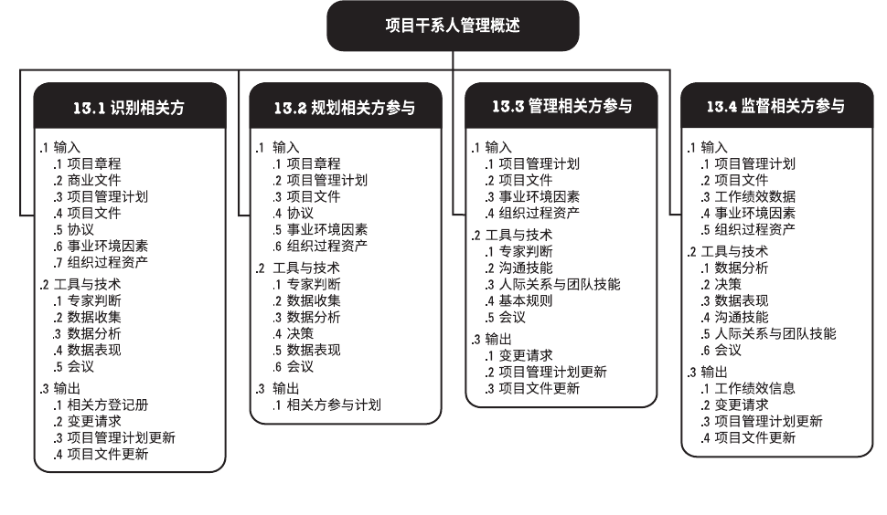

【核心概念】

项目经理和团队正确识别并合理引导所有相关方参与的能力，能决定着项目的成败。为提高成功的可能性，应该在项目章程被批准、项目经理被委任，以及团队开始组建之后，尽早开始识别相关方并引导相关方参与。

相关方满意度应作为项目目标加以识别和管理。有效引导相关方参与的关键是重视与所有相关方保持持续沟通（包括团队成员），以理解他们的需求和期望、处理所发生的问题、管理利益冲突，并促进相关方参与项目决策和活动。

为了实现项目收益，识别相关方和引导相关方参与的过程需要迭代开展。虽然在项目相关方管理中仅对这些过程讨论一次，但是，应该经常开展识别相关方、排列其优先级以及引导其参与等活动。至少要在以下时点开展这些活动：
- 项目进入其生命周期的不同阶段；
- 当前相关方不再与项目工作有关，或者在项目的相关方社区中出现了新的相关方成员；
- 组织内部或更大区域的相关方社区发生重大变化。

【发展趋势与新兴实践】

“相关方”一词的外延正在扩大，从传统意义上的员工、供应商和股东扩展到涵盖各式群体，包括监管机构、游说团体、环保人士、金融组织、媒体，以及那些自认为是相关方的人员（他们认为自己会受项目工作或成果的影响）。

项目相关方管理的发展趋势和新兴实践包括（但不限于）：
- 识别所有相关方，而非在限定范围内；
- 确保所有团队成员都涉及引导相关方参与的活动；
- 定期审查相关方社区，往往与单个项目风险的审查并行开展；
- 应用“共创”概念，咨询最受项目工作或成果影响的相关方。该概念的重点是，将团队内受影响的相关方视为合作伙伴。
- 关注与相关方有效参与程度有关的正面及负面价值。正面价值是相关方（尤其是强大相关方）对项目的更积极支持所带来的效益；负面价值是因相关方未有效参与而造成的真实成本，包括产品召回、组织信誉损失或项目信誉损失。

【裁剪考虑因素】

裁剪时应考虑的因素包括（但不限于）：
- 相关方多样性。现有多少相关方？相关方群体中的文化多样性如何？
- 相关方关系的复杂性。相关方社区内的关系有多复杂？相关方或相关方群体加入的网络越多，与其相关的信息或误传网络就越复杂。
- 沟通技术。有哪些可用的沟通技术？为了实现技术的最大价值，目前采用怎样的支持机制？

【敏捷或适应性环境中的考虑因素】

高度变化的项目更需要项目相关方的有效互动和参与。适应型团队会直接与相关方互动，而不是通过层层的管理级别。在整个项目期间保持与相关方社区的互动，有利于降低风险、建立信任和尽早做出项目调整，从而节约成本，提高项目成功的可能性。

为加快组织内部和组织之间的信息分享，敏捷型方法提倡高度透明。例如，邀请所有相关方参与项目会议和审查，或将项目工件发布到公共空间，其目的在于让各方之间的不一致和依赖关系，或者与不断变化的项目有关的其他问题，都尽快浮现。

### 13.1识别相关方

识别相关方是定期识别项目相关方，分析和记录他们的利益、参与度、相互依赖性、影响力和对项目成功的潜在影响的过程。本过程的主要作用是，使项目团队能够建立对每个相关方或相关方群体的适度关注。本过程应根据需要在整个项目期间定期开展。

本过程通常在编制和批准项目章程之前或同时首次开展。本过程需在必要时重复开展，至少应在每个阶段开始时，以及项目或组织出现重大变化时重复开展。每次重复开展本过程，都应通过查阅项目管理计划组件及项目文件，来识别有关的项目相关方。

【输入】
- 项目章程
- 商业文件：商业论证、效益管理计划
- 项目管理计划：沟通管理计划、相关方参与计划
- 项目文件：变更日志、问题日志、需求日志
- 协议
- 事业环境因素
- 组织过程资产

【工具与技术】
- 专家判断
- 数据收集：问卷调查、头脑风暴
- 数据分析：相关方分析、文件分析
- 数据表现：相关方映射分析/表现
- 会议

【输出】
- 相关方登记册
- 变更请求
- 项目管理计划更新：需求管理计划、沟通管理计划、风险管理计划、相关方参与计划
- 项目文件更新：假设日志、问题日志、风险登记册

### 13.2规划相关方参与

规划相关方参与是根据相关方的需求、期望、利益和对项目的潜在影响，制定项目相关方参与项目的方法的过程。本过程的主要作用是，提供与相关方进行有效互动的可行计划。本过程应根据需要在整个项目期间定期开展。

为满足项目相关方的多样性信息需求，应该在项目生命周期的早期制定一份有效的计划；然后，随着相关方社区的变化，定期审查和更新该计划。在通过识别相关方过程明确最初的相关方社区之后，就应该编制第一版的相关方参与计划，然后定期更新相关方参与计划，以反映相关方社区的变化。会触发该计划更新的典型情况包括（但不限于）：
- 项目新阶段开始；
- 组织结构或行业内部发生变化；
- 新的个人或群体成为相关方，现有相关方不再是相关方社区的成员，或特定相关方对项目成功的重要性发生变化；
- 当其他项目过程（如变更管理、风险管理或问题管理）的输出导致需要重新审查相关方参与策略。

这些情况都可能导致已识别相关方的相对重要性发生变化。

【输入】
- 项目章程
- 项目管理计划：资源管理计划、沟通管理计划、风险管理计划
- 项目文件：假设日志、变更日志、问题日志、项目进度计划、风险登记册、相关方登记册
- 协议
- 事业环境因素
- 组织过程资产

【工具与技术】
- 专家判断
- 数据收集：标杆对照
- 数据分析：假设条件和制约因素分析、根本原因分析
- 决策：优先级排序/分级
- 数据表现：思维导图、相关方参与度评估矩阵
- 会议

【输出】
- 相关方参与计划

### 13.3管理相关方参与

管理相关方参与是与相关方进行沟通和协作以满足其需求与期望、处理问题，并促进相关方合理参与的过程。本过程的主要作用是，让项目经理能够提高相关方的支持，并尽可能降低相关方的抵制。本过程需要在整个项目期间开展。

在管理相关方参与过程中，需要开展多项活动，例如：
- 在适当的项目阶段引导相关方参与，以便获取、确认或维持他们对项目成功的持续承诺；
- 通过谈判和沟通管理相关方期望；
- 处理与相关方管理有关的任何风险或潜在关注点，预测相关方可能在未来引发的问题；
- 澄清和解决已识别的问题。

管理相关方参与有助于确保相关方明确了解项目目的、目标、收益和风险，以及他们的贡献将如何促进项目成功。

【输入】
- 项目管理计划：沟通管理计划、风险管理计划、相关方参与计划、变更管理计划
- 项目文件：变更日志、问题日志、经验教训登记册、相关方登记册
- 事业环境因素
- 组织过程资产

【工具与技术】
- 专家判断
- 沟通技能：反馈
- 人际关系与团队技能：冲突管理、文化意识、谈判、观察/交谈、政治意识
- 基本规则
- 会议

【输出】
- 变更请求
- 项目管理计划更新：沟通管理计划、相关方参与计划
- 项目文件更新：变更日志、问题日志、经验教训登记册、相关方登记册

### 13.4监督相关方参与

监督相关方参与是监督项目相关方关系，并通过修订参与策略和计划来引导相关方合理参与项目的过程。本过程的主要作用是，随着项目进展和环境变化，维持或提升相关方参与活动的效率和效果。本过程需要在整个项目期间开展。

【输入】
- 项目管理计划：资源管理计划、沟通管理计划、相关方参与计划
- 项目文件：问题日志、经验教训登记册、项目沟通记录、风险登记册、相关方登记册
- 工作绩效数据
- 事业环境因素
- 组织过程资产

【工具与技术】
- 数据分析：备选方案分析、根本原因分析、相关方分析
- 决策：多标准决策分析、投票
- 数据表现：相关方参与度评估矩阵
- 沟通技能：反馈、演示
- 人际关系与团队技能：积极倾听、文化意识、领导力、人际交往、政治意识
- 会议

【输出】
- 工作绩效信息
- 变更请求
- 项目管理计划更新：资源管理计划、沟通管理计划、相关方参与计划
- 相关文件更新：问题日志、经验教训登记册、风险登记册、相关方登记册

-------------------------------------

# 二、项目管理过程

> iceman注：每一章照例会有输入/输出，只是没有了工具与技术。可能，只关注输入/输出，这就是项目管理过程最初的样子。

## 2.启动

启动过程组包括定义一个新项目或现有项目的一个新阶段，授权开始该项目或阶段的一组过程。

启动过程组的目的是：协调相关方期望与项目目的，告知相关方项目范围和目标，并商讨他们对项目及相关阶段的参与将如何有助实现其期望。在启动过程中，定义初步项目范围和落实初步财务资源，识别那些将相互作用并影响项目总体结果的相关方，指派项目经理（如果尚未安排）。这些信息应反映在项目章程和相关方登记册中。一旦项目章程获得批准，项目也就正式立项，同时，项目经理就有权将组织资源用于项目活动。

本过程组的主要作用是，确保只有符合组织战略目标的项目才能立项，以及在项目开始时就认真考虑商业论证、项目效益和相关方。在一些组织中，项目经理会参与制定商业论证和分析项目效益，会帮助编写项目章程。在另一些组织中，项目的前期准备工作则由项目发起人、项目管理办公室 (PMO)、项目组合指导委员会或其他相关方群体完成。本标准假设项目已获得发起人或其他治理机构的批准，并且他们在批准项目之前已经审核了商业文件。

启动过程组包括：制定项目章程、识别相关方。
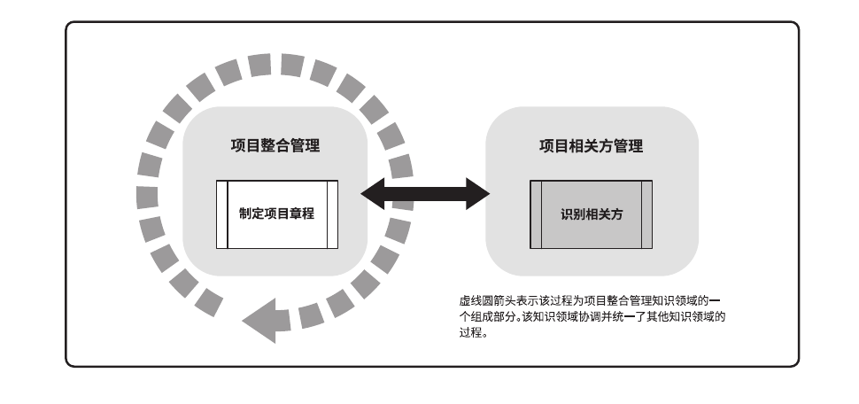

- 制定项目章程
- 识别相关方

## 3.规划

规划过程组包括明确项目全部范围、定义和优化目标，并为实现目标制定行动方案的一组过程。规划过程组中的过程制定项目管理计划的组成部分，以及用于执行项目的项目文件。取决于项目本身的性质，可能需要通过多轮反馈来做进一步分析。随着收集和掌握更多的项目信息或特性，项目很可能需要进一步规划。项目生命周期中发生的重大变更，可能引发重新开展一个或多个规划过程，甚至一个或全部两个启动过程。这种对项目管理计划的持续精细化叫做“渐进明细”，表明项目规划和文件编制是迭代或持续开展的活动。本过程组的主要作用是，确定成功完成项目或阶段的行动方案。

在规划项目、制定项目管理计划和项目文件时，项目管理团队应当征求适当相关方的意见，并鼓励相关方参与。初始规划工作完成时，经批准的项目管理计划就被视为基准。在整个项目期间，监控过程将把项目绩效与基准进行比较。

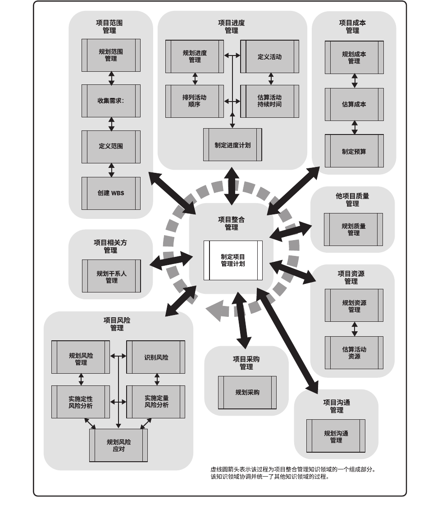

- 制定项目管理计划
- 规划范围管理
- 收集需求
- 定义范围
- 创建 WBS
- 规划进度管理
- 定义活动
- 排列活动顺序
- 估算活动持续时间
- 制定进度计划
- 规划成本管理
- 估算成本
- 制定预算
- 规划质量管理
- 规划资源管理
- 估算活动资源
- 规划沟通管理
- 规划风险管理
- 识别风险
- 实施定性风险分析
- 实施定量风险分析
- 规划风险应对
- 规划采购管理
- 规划相关方参与

## 4.执行

执行过程组包括完成项目管理计划中确定的工作，以满足项目要求的一组过程。本过程组需要按照项目管理计划来协调资源，管理相关方参与，以及整合并实施项目活动。本过程组的主要作用是，根据计划执行为满足项目要求、实现项目目标所需的项目工作。相当多的项目预算、资源和时间将用于开展执行过程组的过程。开展执行过程组的过程，可能导致变更请求。一旦变更请求获得批准，则可能触发一个或多个规划过程，来修改管理计划、完善项目文件，甚至建立新的基准。

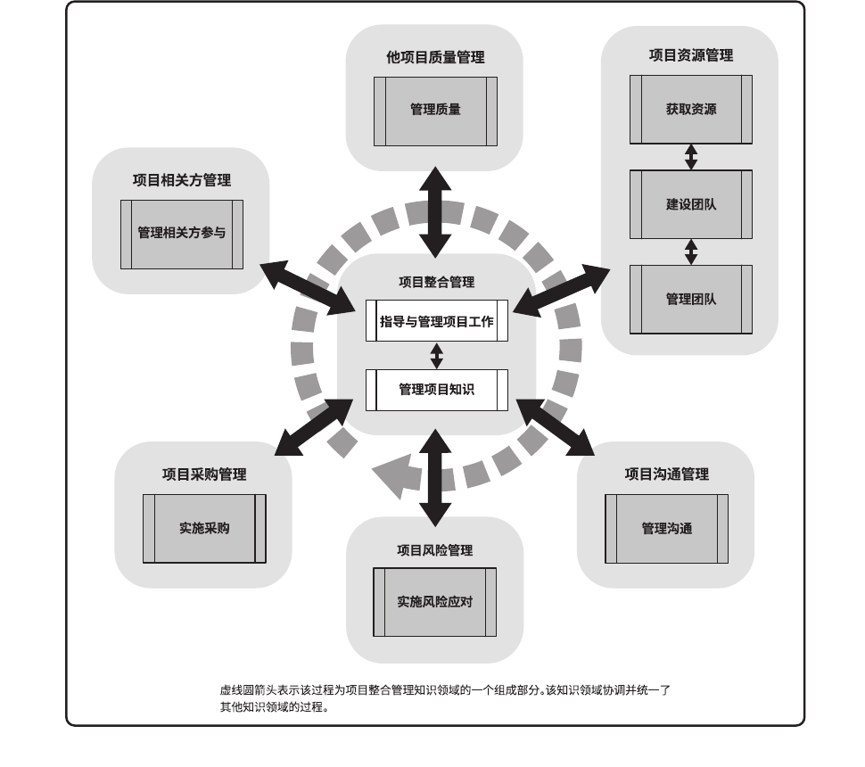

- 指导于管理项目工作
- 管理项目知识
- 管理质量
- 获取资源
- 建设团队
- 管理团队
- 管理沟通
- 实施风险应对
- 实施采购
- 管理相关方参与

## 5.监控

监控过程组包括跟踪、审查和调整项目进展与绩效，识别必要的计划变更并启动相应变更的一组过程。监督是收集项目绩效数据，计算绩效指标，并报告和发布绩效信息。控制是比较实际绩效与计划绩效，分析偏差，评估趋势以改进过程，评价可选方案，并建议必要的纠正措施。本过程组的主要作用是，按既定时间间隔、在特定事件发生时或在异常情况出现时，对项目绩效进行测量和分析，以识别和纠正与项目管理计划的偏差。监控过程组还涉及：
- 评价变更请求并制定恰当的响应行动；
- 建议纠正措施，或者对可能出现的问题建议预防措施；
- 对照项目管理计划和项目基准，监督正在进行中的项目活动；
- 影响可能导致规避变更控制过程的因素，确保只有经批准的变更才能付诸执行。

持续的监督使项目团队和其他相关方得以洞察项目的健康状况，并识别需要格外注意的方面。在监控过程组，需要监督和控制在每个知识领域、每个过程组、每个生命周期阶段以及整个项目中正在进行的工作。

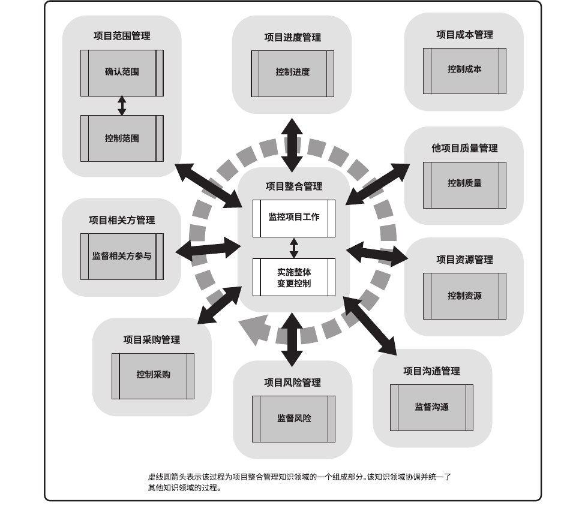

- 监控项目工作
- 实施整体变更控制
- 确认范围
- 控制范围
- 控制进度
- 控制成本
- 控制质量
- 控制资源
- 监督沟通
- 监督风险
- 控制采购
- 监督相关方参与

## 6.收尾

收尾过程组包括为正式完成或关闭项目、阶段或合同而开展的过程。本过程组旨在核实为完成项目或阶段所需的所有过程组的全部过程均已完成，并正式宣告项目或阶段关闭。本过程组的主要作用是，确保恰当地关闭阶段、项目和合同。虽然本过程组只有一个过程，但是组织可以自行为项目、阶段或合同添加相关过程。因此，仍把它称为“过程组”。

本过程组也适用于项目的提前关闭，例如项目流产或取消。

- 结束项目或阶段

