| 知识领域 | 管理过程 | 工具技术 |
|---------|---------|--------|
| 整合 | 启动-制定项目章程 | [专家判断](#专家判断) 数据收集：[头脑风暴](#头脑风暴)、[焦点小组](#焦点小组)、[访谈](#访谈) 人际关系与团队技能：[冲突管理](#冲突管理)、[引导](#引导)、[会议管理](#会议管理) [会议](#会议) |
| 整合 | 规划-制定项目管理计划 | [专家判断](#专家判断) 数据收集：[头脑风暴](#头脑风暴)、**[核对单](#核对单)**、[焦点小组](#焦点小组)、[访谈](#访谈) 人际关系与团队技能：[冲突管理](#冲突管理)、[引导](#引导)、[会议管理](#会议管理) [会议](#会议) |
| 整合 | 执行-指导与管理项目工作 | [专家判断](#专家判断) **[项目管理信息系统](#项目管理信息系统)** **[会议](#会议)** |
| 整合 | 执行-管理项目知识 | [专家判断](#专家判断) [知识管理](#知识管理) [信息管理](#信息管理) 人际关系与团队技能：[积极倾听](#积极倾听)、[引导](#引导)、[领导力](#领导力)、[人际交往](#人际交往)、[政治意识](#政治意识) |
| 整合 | **监控-监控项目工作** | [专家判断](#专家判断) 数据分析：[备选方案分析](#备选方案分析)、[成本效益分析](#成本效益分析)、[挣值分析](#挣值分析)、[根本原因分析](#根本原因分析)、[趋势分析](#趋势分析)、[偏差分析](#偏差分析) 决策：[投票](#投票) **[会议](#会议)** |
| 整合 | 监控-实施整体变更控制 | [专家判断](#专家判断) **[变更控制工具](#变更控制工具)** 数据分析：[备选方案分析](#备选方案分析)、[成本效益分析](#成本效益分析) 决策：[投票](#投票)、[独裁型决策制定](#独裁型决策制定)、[多标准决策分析](#多标准决策分析) **[会议](#会议)** |
| 整合 | 收尾-结束项目或阶段 | [专家判断](#专家判断) 数据分析：[文件分析](#文件分析)、[回归分析](#回归分析)、[趋势分析](#趋势分析)、[偏差分析](#偏差分析) **[会议](#会议)** |
| 范围 | 规划-规划范围管理 | [专家判断](#专家判断) 数据分析：[备选方案分析](#备选方案分析) **[会议](#会议)** |
| 范围 | 规划-收集需求 | [专家判断](#专家判断) 数据收集：[头脑风暴](#头脑风暴)、[访谈](#访谈)、[焦点小组](#焦点小组)、[问卷调查](#问卷调查)、[标杆对照](#标杆对照) 数据分析：[文件分析](#文件分析) 决策：[投票](#投票)、[多标准决策分析](#多标准决策分析) 数据表现：**[亲和图](#亲和图)**、**[思维导图](#思维导图)** 人际关系与团队技能：[名义小组技术](#名义小组技术)、[观察/交谈](#观察交谈)、[引导](#引导) **[系统交互图](#系统交互图)** [原型法](#原型法) |
| 范围 | 规划-定义范围 | [专家判断](#专家判断) 数据分析：[备选方案分析](#备选方案分析) 决策：[多标准决策分析](#多标准决策分析) 人际关系与团队技能：[引导](#引导) [产品分析](#产品分析) |
| 范围 | 规划-创建WBS | [专家判断](#专家判断) [分解](#分解) |
| 范围 | 监控-确认范围 | [检查](#检查) 决策：[投票](#投票) |
| 范围 | **监控-控制范围** | 数据分析：[偏差分析](#偏差分析)、[趋势分析](#趋势分析) |
| 进度 | 规划-规划进度管理 | [专家判断](#专家判断) 数据分析：[备选方案分析](#备选方案分析) **[会议](#会议)** |
| 进度 | 规划-定义活动 | [专家判断](#专家判断) [分解](#分解) [滚动式规划](#滚动式规划) **[会议](#会议)** |
| 进度 | **规划-排列活动顺序** | [紧前关系绘图法](#紧前关系绘图法) [确定和整合依赖关系](#确定和整合依赖关系) [提前量和滞后量](#提前量和滞后量) **[项目管理信息系统](#项目管理信息系统)** |
| 进度 | **规划-估算活动持续时间** | [专家判断](#专家判断) [类比估算](#类比估算) [参数估算](#参数估算) [三点估算](#三点估算) [自下而上估算](#自下而上估算) 数据分析：[备选方案分析](#备选方案分析)、[储备分析](#储备分析) 决策：[投票](#投票) **[会议](#会议)** |
| 进度 | **规划-制定进度计划** | [进度网络分析](#进度网络分析) [关键路径法](#关键路径法) [资源优化](#资源优化) 数据分析：[假设情景分析](#假设情景分析)、[模拟](#模拟) [提前量和滞后量](#提前量和滞后量) [进度压缩](#进度压缩) **[项目管理信息系统](#项目管理信息系统)** [敏捷发布规划](#敏捷发布规划) |
| 进度 | **规划-控制进度** | 数据分析：[挣值分析](#挣值分析)、**[迭代燃尽图](#迭代燃尽图)**、[绩效审查](#绩效审查)、[趋势分析](#趋势分析)、[偏差分析](#偏差分析)、[假设情景分析](#假设情景分析) [关键路径法](#关键路径法) **[项目管理信息系统](#项目管理信息系统)** [资源优化](#资源优化) [提前量和滞后量](#提前量和滞后量) [进度压缩](#进度压缩) |
| 成本 | 规划-规划成本管理 | [专家判断](#专家判断) 数据分析：[备选方案分析](#备选方案分析) **[会议](#会议)** |
| 成本 | **规划-估算成本** | [专家判断](#专家判断) [类比估算](#类比估算) [参数估算](#参数估算) [自下而上估算](#自下而上估算) [三点估算](#三点估算) 数据分析：[备选方案分析](#备选方案分析)、[储备分析](#储备分析)、[质量成本](#质量成本) **[项目管理信息系统](#项目管理信息系统)** 决策：[投票](#投票) |
| 成本 | 规划-制定预算 | [专家判断](#专家判断) [成本汇总](#成本汇总) 数据分析：[储备分析](#储备分析) [历史信息审核](#历史信息审核) [资金限制平衡](#资金限制平衡) [融资](#融资) |
| 成本 | **监控-控制成本** | [专家判断](#专家判断) 数据分析：[挣值分析](#挣值分析)、[偏差分析](#偏差分析)、[趋势分析](#趋势分析)、[储备分析](#储备分析) [完工尚需绩效指数](#完工尚需绩效指数) **[项目管理信息系统](#项目管理信息系统)** |
| 质量 | 规划-规划质量管理 | [专家判断](#专家判断) 数据收集：[标杆对照](#标杆对照)、[头脑风暴](#头脑风暴)、[访谈](#访谈) 数据分析：[成本效益分析](#成本效益分析)、[质量成本](#质量成本) 决策：[多标准决策分析](#多标准决策分析) 数据表现：**[流程图](#流程图)**、[逻辑数据模型](#逻辑数据模型)、**[矩阵图](#矩阵图)**、**[思维导图](#思维导图)** [测试与检查的规划](#测试与检查的规划) **[会议](#会议)** |
| 质量 | **执行-管理质量** | 数据收集：**[核对单](#核对单)** 数据分析：[备选方案分析](#备选方案分析)、[文件分析](#文件分析)、[过程分析](#过程分析)、[根本原因分析](#根本原因分析) 决策：[多标准决策分析](#多标准决策分析) 数据表现：**[亲和图](#亲和图)**、**[因果图](#因果图)**、**[流程图](#流程图)**、**[直方图](#直方图)**、**[矩阵图](#矩阵图)**、**[散点图](#散点图)** [审计](#审计) [面向X的设计](#面向x的设计) [问题解决](#问题解决) [质量改进方法](#质量改进方法) |
| 质量 | **监控-控制质量** | 数据收集：**[核对单](#核对单)**、**[核查表](#核查表)**、[统计抽样](#统计抽样)、[问卷调查](#问卷调查) 数据分析：[绩效审查](#绩效审查)、[根本原因分析](#根本原因分析) [检查](#检查) [测试/产品评估](#测试产品评估) 数据表现：**[因果图](#因果图)**、**[控制图](#控制图)**、**[直方图](#直方图)**、**[散点图](#散点图)** **[会议](#会议)** |
| 资源 | 规划-规划资源管理 | [专家判断](#专家判断) 数据表现：**[层级型](#层级图)**、**[责任分配矩阵](#矩阵基础图)**、**[文本型](#面向文本的格式)** [组织理论](#组织理论) **[会议](#会议)** |
| 资源 | 规划-估算活动资源 | [专家判断](#专家判断) [自下而上估算](#自下而上估算) [类比估算](#类比估算) [参数估算](#参数估算) 数据分析：[备选方案分析](#备选方案分析) **[项目管理信息系统](#项目管理信息系统)** **[会议](#会议)** |
| 资源 | 执行-获取资源 | 决策：[多标准决策分析](#多标准决策分析) 人际关系与团队技能：[谈判](#谈判) [预分派](#预分派) [虚拟团队](#虚拟团队) |
| 资源 | 执行-建设团队 | [集中办公](#集中办公) [虚拟团队](#虚拟团队) [沟通技术](#沟通技术) 人际关系与团队技能：[冲突管理](#冲突管理)、[影响力](#影响力)、[激励](#激励)、[谈判](#谈判)、[团队建设](#团队建设) [认可与奖励](#奖励与表彰) [培训](#培训) [个人和团队评估](#个人和团队评估) **[会议](#会议)** |
| 资源 | 执行-管理团队 | 人际关系与团队技能：[冲突管理](#冲突管理)、[制定决策](#制定决策)、[情商](#情商)、[影响力](#影响力)、[领导力](#领导力) **[项目管理信息系统](#项目管理信息系统)** |
| 资源 | 监控-控制资源 | 数据分析：[备选方案分析](#备选方案分析)、[成本效益分析](#成本效益分析)、[绩效审查](#绩效审查)、[趋势分析](#趋势分析) [问题解决](#问题解决) 人际关系与团队技能：[谈判](#谈判)、[影响力](#影响力) **[项目管理信息系统](#项目管理信息系统)** |
| 沟通 | 规划-规划沟通管理 | [专家判断](#专家判断) [沟通需求分析](#沟通需求分析) [沟通技术](#沟通技术) **[沟通模型](#沟通模型)** [沟通方法](#沟通方法) 人际关系与团队技能：[沟通风格评估](#沟通风格评估)、[政治意识](#政治意识)、[文化意识](#文化意识) 数据表现：**[相关方参与度评估矩阵](#相关方参与度评估矩阵)** **[会议](#会议)** |
| 沟通 | 执行-管理沟通 | [沟通技术](#沟通技术) [沟通方法](#沟通方法) 沟通技能：沟通胜任力、[反馈](#反馈)、非言语、[演示](#演示) **[项目管理信息系统](#项目管理信息系统)** **[项目报告](#项目报告)** 人际关系与团队技能：[积极倾听](#积极倾听)、[冲突管理](#冲突管理)、[文化意识](#文化意识)、[会议管理](#会议管理)、[人际交往](#人际交往)、[政治意识](#政治意识) **[会议](#会议)** |
| 沟通 | 监控-监督沟通 | [专家判断](#专家判断) **[项目管理信息系统](#项目管理信息系统)** 数据分析：**[相关方参与度评估矩阵](#相关方参与度评估矩阵)** 人际关系与团队技能：[观察/交谈](#观察交谈) **[会议](#会议)** |
| 风险 | 规划-规划风险管理 | [专家判断](#专家判断) 数据分析：[相关方分析](#相关方分析) **[会议](#会议)** |
| 风险 | 规划-识别风险 | [专家判断](#专家判断) 数据收集：[头脑风暴](#头脑风暴)、**[核对单](#核对单)**、[访谈](#访谈) 数据分析：[根本原因分析](#根本原因分析)、[假设条件与制约因素分析](#假设条件与制约因素分析)、[SWOT分析](#swot分析)、[文件分析](#文件分析) 人际关系与团队技能：[引导](#引导) **[提示清单](#提示清单)** **[会议](#会议)** |
| 风险 | **规划-实施定性分析** | [专家判断](#专家判断) 数据收集：[访谈](#访谈) 数据分析：[风险数据质量评估](#风险数据质量评估)、[风险概率和影响评估](#风险概率和影响评估)、[其他风险参数评估](#其他风险参数评估) 人际关系与团队技能：[引导](#引导) [风险分类](#风险分类) 数据表现：**[概率和影响矩阵](#概率和影响矩阵)**、**[层级型](#层级图)** **[会议](#会议)** |
| 风险 | 规划-实施定量分析 | [专家判断](#专家判断) 数据收集：[访谈](#访谈) 人际关系与团队技能：[引导](#引导) 不确定性表现方式 数据分析：[模拟](#模拟)、[敏感度分析](#敏感度分析)、[决策树分析](#决策树分析)、**[影响图](#影响图)** |
| 风险 | 规划-规划风险应对 | [专家判断](#专家判断) 数据收集：[访谈](#访谈) 人际关系与团队技能：[引导](#引导) [威胁应对策略](#威胁应对策略) [机会应对策略](#机会应对策略) [应急应对策略](#应急应对策略) [整体项目风险应对策略](#整体项目风险应对策略) 数据分析：[备选方案分析](#备选方案分析)、[成本效益分析](#成本效益分析) 决策：[多标准决策分析](#多标准决策分析) |
| 风险 | 执行-实施风险应对 | [专家判断](#专家判断) 人际关系与团队技能：[影响力](#影响力) **[项目管理信息系统](#项目管理信息系统)** |
| 风险 | 监控-监督风险 | 数据分析：[技术绩效分析](#技术绩效分析)、[储备分析](#储备分析) [审计](#审计) **[会议](#会议)** |
| 采购 | 规划-规划采购管理 | [专家判断](#专家判断) 数据收集：[市场调研](#市场调研) 数据分析：[自制或外购分析](#自制或外购分析) [供方选择分析](#供方选择分析) **[会议](#会议)** |
| 采购 | 执行-实施采购 | [专家判断](#专家判断) [广告](#广告) [投标人会议](#投标人会议) 数据分析：[建议书评估](#建议书评估) 人际关系与团队技能：[谈判](#谈判) |
| 采购 | 监控-控制采购 | [专家判断](#专家判断) [索赔管理](#索赔管理) 数据分析：[绩效审查](#绩效审查)、[挣值分析](#挣值分析)、[趋势分析](#趋势分析) [检查](#检查) [审计](#审计) |
| 相关方 | 启动-识别相关方 | [专家判断](#专家判断) 数据收集：[问卷调查](#问卷调查)、[头脑风暴](#头脑风暴) 数据分析：[相关方分析](#相关方分析)、[文件分析](#文件分析) 数据表现：[相关方映射分析/表现](#相关方映射分析表现) **[会议](#会议)** |
| 相关方 | **规划-规划相关方参与** | [专家判断](#专家判断) 数据收集：[标杆对照](#标杆对照) 数据分析：[假设条件与制约因素分析](#假设条件与制约因素分析)、[根本原因分析](#根本原因分析) 决策：优先级排序/分级 数据表现：**[思维导图](#思维导图)**、**[相关方参与度评估矩阵](#相关方参与度评估矩阵)** **[会议](#会议)** |
| 相关方 | 执行-管理相关方参与 | [专家判断](#专家判断) 沟通技能：[反馈](#反馈) 人际关系与团队技能：[冲突管理](#冲突管理)、[文化意识](#文化意识)、[谈判](#谈判)、[观察/交谈](#观察交谈)、[政治意识](#政治意识) [基本规则](#基本规则) **[会议](#会议)** |
| 相关方 | **监控-监督相关方参与** | 数据分析：[备选方案分析](#备选方案分析)、[根本原因分析](#根本原因分析)、[相关方分析](#相关方分析) 决策：[多标准决策分析](#多标准决策分析)、[投票](#投票) 数据表现：**[相关方参与度评估矩阵](#相关方参与度评估矩阵)** 沟通技能：[反馈](#反馈)、[演示](#演示) 人际关系与团队技能：[积极倾听](#积极倾听)、[文化意识](#文化意识)、[领导力](#领导力)、[人际交往](#人际交往)、[政治意识](#政治意识) **[会议](#会议)** |

<!-- TOC -->

- [工具与技术](#工具与技术)
  - [数据收集技术（9种）](#数据收集技术9种)
    - [标杆对照](#标杆对照)
    - [头脑风暴](#头脑风暴)
    - [核查表](#核查表)
    - [核对单](#核对单)
    - [焦点小组](#焦点小组)
    - [访谈](#访谈)
    - [市场调研](#市场调研)
    - [问卷调查](#问卷调查)
    - [统计抽样](#统计抽样)
  - [数据分析技术（27种）](#数据分析技术27种)
    - [备选方案分析](#备选方案分析)
    - [其他风险参数评估](#其他风险参数评估)
    - [假设条件与制约因素分析](#假设条件与制约因素分析)
    - [质量成本](#质量成本)
    - [成本效益分析](#成本效益分析)
    - [决策树分析](#决策树分析)
    - [文件分析](#文件分析)
    - [挣值分析](#挣值分析)
    - [影响图](#影响图)
    - [迭代燃尽图](#迭代燃尽图)
    - [自制或外购分析](#自制或外购分析)
    - [绩效审查](#绩效审查)
    - [过程分析](#过程分析)
    - [建议书评估](#建议书评估)
    - [回归分析](#回归分析)
    - [储备分析](#储备分析)
    - [风险数据质量评估](#风险数据质量评估)
    - [风险概率和影响评估](#风险概率和影响评估)
    - [根本原因分析](#根本原因分析)
    - [敏感度分析](#敏感度分析)
    - [模拟](#模拟)
    - [相关方分析](#相关方分析)
    - [SWOT分析](#SWOT分析)
    - [技术绩效分析](#技术绩效分析)
    - [趋势分析](#趋势分析)
    - [偏差分析](#偏差分析)
    - [假设情景分析](#假设情景分析)
    - [亲和图](#亲和图)
    - [因果图](#因果图)
    - [控制图](#控制图)
    - [流程图](#流程图)
    - [层级图](#层级图)
    - [直方图](#直方图)
    - [逻辑数据模型](#逻辑数据模型)
    - [矩阵图](#矩阵图)
    - [矩阵基础图](#矩阵基础图)
    - [思维导图](#思维导图)
    - [概率和影响矩阵](#概率和影响矩阵)
    - [散点图](#散点图)
    - [相关方参与度评估矩阵](#相关方参与度评估矩阵)
    - [相关方映射分析/表现](#相关方映射分析表现)
    - [面向文本的格式](#面向文本的格式)
  - [数据表现技术（15种）](#数据表现技术15种)
  - [决策技术（2种）](#决策技术2种)
    - [独裁型决策制定](#独裁型决策制定)
    - [多标准决策分析](#多标准决策分析)
    - [投票](#投票)
  - [沟通技巧（2种）](#沟通技巧2种)
    - [反馈](#反馈)
    - [演示](#演示)
  - [人际关系与团队技能（17种）](#人际关系与团队技能17种)
    - [个人技能](#个人技能)
      - [情商](#情商)
      - [政治意识](#政治意识)
      - [文化意识](#文化意识)
    - [人际关系](#人际关系)
      - [积极倾听](#积极倾听)
      - [影响力](#影响力)
      - [领导力](#领导力)
      - [沟通风格评估](#沟通风格评估)
      - [人际交往](#人际交往)
      - [激励](#激励)
      - [谈判](#谈判)
      - [观察/交谈](#观察交谈)
    - [团队技能](#团队技能)
      - [冲突管理](#冲突管理)
      - [引导](#引导)
      - [名义小组技术](#名义小组技术)
      - [制定决策](#制定决策)
      - [会议管理](#会议管理)
      - [团队建设](#团队建设)
  - [未分组（60种）](#未分组60种)
    - [广告](#广告)
    - [敏捷发布规划](#敏捷发布规划)
    - [类比估算](#类比估算)
    - [审计](#审计)
    - [投标人会议](#投标人会议)
    - [自下而上估算](#自下而上估算)
    - [变更控制工具](#变更控制工具)
    - [索赔管理](#索赔管理)
    - [集中办公](#集中办公)
    - [沟通方法](#沟通方法)
    - [沟通模型](#沟通模型)
    - [沟通需求分析](#沟通需求分析)
    - [沟通技术](#沟通技术)
    - [系统交互图](#系统交互图)
    - [应急应对策略](#应急应对策略)
    - [成本汇总](#成本汇总)
    - [关键路径法](#关键路径法)
    - [分解](#分解)
    - [确定和整合依赖关系](#确定和整合依赖关系)
    - [面向X的设计](#面向X的设计)
    - [专家判断](#专家判断)
    - [融资](#融资)
    - [资金限制平衡](#资金限制平衡)
    - [基本规则](#基本规则)
    - [历史信息审核](#历史信息审核)
    - [个人和团队评估](#个人和团队评估)
    - [信息管理](#信息管理)
    - [检查](#检查)
    - [知识管理](#知识管理)
    - [提前量和滞后量](#提前量和滞后量)
    - [会议](#会议)
    - [组织理论](#组织理论)
    - [参数估算](#参数估算)
    - [预分派](#预分派)
    - [紧前关系绘图法](#紧前关系绘图法)
    - [问题解决](#问题解决)
    - [产品分析](#产品分析)
    - [项目管理信息系统](#项目管理信息系统)
    - [项目报告](#项目报告)
    - [提示清单](#提示清单)
    - [原型法](#原型法)
    - [质量改进方法](#质量改进方法)
    - [奖励与表彰](#奖励与表彰)
    - [不确定性表现方法](#不确定性表现方法)
    - [资源优化](#资源优化)
    - [风险分类](#风险分类)
    - [滚动式规划](#滚动式规划)
    - [进度压缩](#进度压缩)
    - [进度网络分析](#进度网络分析)
    - [供方选择分析](#供方选择分析)
    - [机会应对策略](#机会应对策略)
    - [整体项目风险应对策略](#整体项目风险应对策略)
    - [威胁应对策略](#威胁应对策略)
    - [测试与检查的规划](#测试与检查的规划)
    - [测试/产品评估](#测试产品评估)
    - [三点估算](#三点估算)
    - [完工尚需绩效指数](#完工尚需绩效指数)
    - [培训](#培训)
    - [虚拟团队](#虚拟团队)

<!-- /TOC -->

# 工具与技术

> 工具与技术，以附录“工具与技术”为索引，所有内容来自散落在各章节的定义。工具与技术共132种。
> 在每一种方法之后，都有出现的章节。

> 有一些工具和技术，出现的频次很高。包括：头脑风暴、访谈、备选方案分析、根本原因分析、趋势分析、偏差分析、多标准决策分析、投票、引导、 **专家判断** 、 **会议** 、 **项目管理信息系统** 。

## 数据收集技术（9种）

### 标杆对照

> 出现章节：5.2 / 8.1 / 13.2

标杆对照是将实际或计划的项目实践或项目的质量标准与可比项目的实践进行比较，以便识别最佳实践，形成改进意见，并为绩效考核提供依据。作为标杆的项目可以来自执行组织内部或外部，或者来自同一应用领域或其他应用领域。标杆对照也允许用不同应用领域或行业的项目做类比。

### 头脑风暴

> 出现章节：4.1 / 4.2 / 5.2 / 8.1 / 11.2 / 13.1

头脑风暴用于在短时间内获得大量创意，适用于团队环境，需要引导者进行引导。头脑风暴由两个部分构成：创意产生和创意分析。

### 核查表

> 出现章节：8.3

核查表，又称计数表，用于合理排列各种事项，以便有效地收集关于潜在质量问题的有用数据。在开展检查以识别缺陷时，用核查表收集属性数据就特别方便，例如关于缺陷数量或后果的数据。

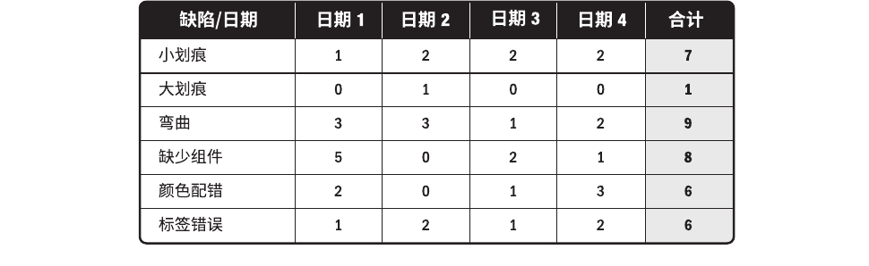

### 核对单

> 出现章节：4.2 / 8.2 / 8.3 / 11.2

核对单是包括需要考虑的项目、行动或要点的清单。它常被用作提醒。基于从类似项目和其他信息来源积累的历史信息和知识来编制核对单。编制核对单，列出过去曾出现且可能与当前项目相关的具体单个项目风险，这是吸取已完成的类似项目的经验教训的有效方式。组织可能基于自己已完成的项目来编制核对单，或者可能采用特定行业的通用风险核对单。虽然核对单简单易用，但它不可能穷尽所有风险。所以，必须确保不要用核对单来取代所需的风险识别工作；同时，项目团队也应该注意考察未在核对单中列出的事项。此外，还应该不时地审查核对单，增加新信息，删除或存档过时信息。

### 焦点小组

> 出现章节：4.1 / 4.2 / 5.2

焦点小组是召集预定的相关方和主题专家，了解他们对所讨论的产品、服务或成果的期望和态度。由一位受过训练的主持人引导大家进行互动式讨论。焦点小组往往比“一对一”的访谈更热烈。

### 访谈

> 出现章节：4.1 / 4.2 / 5.2 / 8.1 / 11.2 / 11.3 / 11.4 / 11.5

访谈是通过与相关方直接交谈，来获取信息的正式或非正式的方法。访谈的典型做法是向被访者提出预设和即兴的问题，并记录他们的回答。访谈经常是一个访谈者和一个被访者之间的“一对一”谈话，但也可以包括多个访谈者和/或多个被访者。访谈有经验的项目参与者、发起人和其他高管，以及主题专家，有助于识别和定义所需产品可交付成果的特征和功能。访谈也可用于获取机密信息。

### 市场调研

> 出现章节：12.1

市场调研包括考察行业情况和具体卖方的能力。采购团队可运用从会议、在线评论和各种其他渠道得到的信息，来了解市场情况。采购团队也可以调整具体的采购目标，以便在平衡与有能力提供所需材料或服务的卖方的范围有关的风险的同时，利用成熟技术。

### 问卷调查

> 出现章节：5.2 / 13.1

问卷调查是指设计一系列书面问题，向众多受访者快速收集信息。问卷调查方法非常适用于以下情况：受众多样化，需要快速完成调查，受访者地理位置分散，并且适合开展统计分析。

### 统计抽样

> 出现章节：8.3

统计抽样是指从目标总体中选取部分样本用于检查（如从 75 张工程图纸中随机抽取10 张）。样本用于测量控制和确认质量。抽样的频率和规模应在规划质量管理过程中确定。

## 数据分析技术（27种）

### 备选方案分析

> 出现章节：4.5 / 4.6 / 5.1 / 5.4 / 6.1 / 6.4 / 7.1 / 7.2 / 8.2 / 9.2 / 9.6 / 11.5 / 13.4

备选方案分析是一种对已识别的可选方案进行评估的技术，用来决定选择哪种方案或使用何种方法来执行项目工作。很多活动有多个备选的实施方案，例如使用能力或技能水平不同的资源、不同规模或类型的机器、不同的工具（手工或自动），以及关于资源自制、租赁或购买的决策。备选方案分析有助于提供在定义的制约因素范围内执行项目活动的最佳方案。

### 其他风险参数评估

> 出现章节：11.3

为了方便未来分析和行动，在对单个项目风险进行优先级排序时，项目团队可能考虑（除概率和影响以外的）其他风险特征。此类特征可能包括（但不限于）：
- 紧迫性。为有效应对风险而必须采取应对措施的时间段。时间短就说明紧迫性高。
- 邻近性。风险在多长时间后会影响一项或多项项目目标。时间短就说明邻近性高。
- 潜伏期。从风险发生到影响显现之间可能的时间段。时间短就说明潜伏期短。
- 可管理性。风险责任人（或责任组织）管理风险发生或影响的容易程度。如果容易管理，可管理性就高。
- 可控性。风险责任人（或责任组织）能够控制风险后果的程度。如果后果很容易控制，可控性就高。
- 可监测性。对风险发生或即将发生进行监测的容易程度。如果风险发生很容易监测，可监测性就高。
- 连通性。风险与其他单个项目风险存在关联的程度大小。如果风险与多个其他风险存在关联，连通性就高。
- 战略影响力。风险对组织战略目标潜在的正面或负面影响。如果风险对战略目标有重大影响，战略影响力就大。
- 密切度。风险被一名或多名相关方认为要紧的程度。被认为很要紧的风险，密切度就高。

相对于仅评估概率和影响，考虑上述某些特征有助于进行更稳健的风险优先级排序。

### 假设条件与制约因素分析

> 出现章节：11.2

每个项目及其项目管理计划的构思和开发都基于一系列的假设条件，并受一系列制约因素的限制。这些假设条件和制约因素往往都已纳入范围基准和项目估算。开展假设条件和制约因素分析，来探索假设条件和制约因素的有效性，确定其中哪些会引发项目风险。从假设条件的不准确、不稳定、不一致或不完整，可以识别出威胁，通过清除或放松会影响项目或过程执行的制约因素，可以创造出机会。

### 质量成本

> 出现章节：7.2 / 8.1

质量成本 (COQ) 包括在产品生命周期中为预防不符合要求、为评价产品或服务是否符合要求，以及因未达到要求（返工）而发生的所有成本。
- 预防成本。预防特定项目的产品、可交付成果或服务质量低劣所带来的相关成本。
- 评估成本。评估、测量、审计和测试特定项目的产品、可交付成果或服务所带来的相关成本。
- 失败成本。因产品、可交付成果或服务与相关方需求或期望不一致而导致的相关成本。失败成本通常分为内部（项目团队发现的）和外部（客户发现的）两类。失败成本也称为劣质成本。

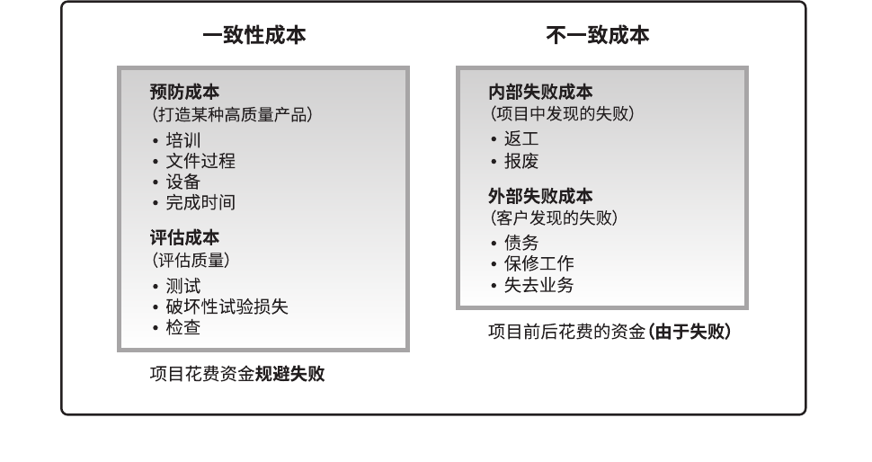

最优 COQ 能够在预防成本和评估成本之间找到恰当的投资平衡点，以规避失败成本。有关模型表明，最优项目质量成本，指在投资额外的预防/评估成本时，既无益处又不具备成本效益。

### 成本效益分析

> 出现章节：4.5 / 4.6 / 8.1 / 9.6 / 11.5

成本效益分析是用来估算备选方案优势和劣势的财务分析工具，以确定可以创造最佳效益的备选方案。成本效益分析可帮助项目经理确定规划的质量活动是否有效利用了成本。达到质量要求的主要效益包括减少返工、提高生产率、降低成本、提升相关方满意度及提升赢利能力。对每个质量活动进行成本效益分析，就是要比较其可能成本与预期效益。

### 决策树分析

> 出现章节：11.4

用决策树在若干备选行动方案中选择一个最佳方案。在决策树中，用不同的分支代表不同的决策或事件，即项目的备选路径。每个决策或事件都有相关的成本和单个项目风险（包括威胁和机会）。决策树分支的终点表示沿特定路径发展的最后结果，可以是负面或正面的结果。在决策树分析中，通过计算每条分支的预期货币价值，就可以选出最优的路径。

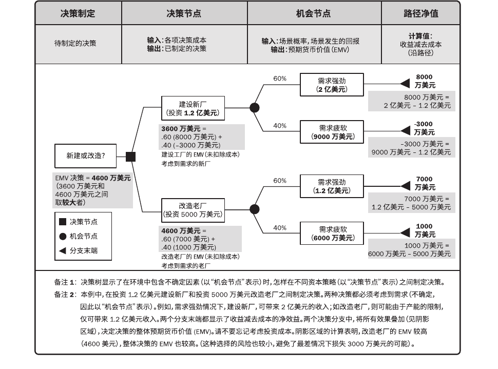

### 文件分析

> 出现章节：4.7 / 5.2 / 8.2 / 11.2 / 13.1

文件分析包括审核和评估任何相关的文件信息。在此过程中，文件分析用于通过分析现有文件，识别与需求相关的信息来获取需求。有助于获取相关需求的文件很多。
可供分析的文件包括（但不限于）：
- 协议；
- 商业计划；
- 业务流程或接口文档；
- 业务规则库；
- 现行流程；
- 市场文献；
- 问题日志；
- 政策和程序；
- 法规文件，如法律、准则、法令等；
- 建议邀请书；
- 用例。

### 挣值分析

> 出现章节：4.5 / 6.6 / 7.4 / 12.3

挣值分析(EVA)将实际进度和成本绩效与绩效测量基准进行比较。EVM把范围基准、成本基准和进度基准整合起来，形成绩效测量基准。它针对每个工作包和控制账户，计算并监测以下三个关键指标：
- 计划价值。计划价值（PV）是为计划工作分配的经批准的预算，它是为完成某活动或工作分解结构 (WBS) 组成部分而准备的一份经批准的预算，不包括管理储备。应该把该预算分配至项目生命周期的各个阶段；在某个给定的时间点，计划价值代表着应该已经完成的工作。PV的总和有时被称为绩效测量基准（PMB），项目的总计划价值又被称为完工预算（BAC）。
- 挣值。挣值（EV）是对已完成工作的测量值，用该工作的批准预算来表示，是已完成工作的经批准的预算。EV 的计算应该与 PMB 相对应，且所得的 EV 值不得大于相应组件的 PV 总预算。EV 常用于计算项目的完成百分比，应该为每个 WBS 组件规定进展测量准则，用于考核正在实施的工作。项目经理既要监测 EV 的增量，以判断当前的状态，又要监测 EV 的累计值，以判断长期的绩效趋势。
- 实际成本。实际成本（AC）是在给定时段内，执行某活动而实际发生的成本，是为完成与 EV相对应的工作而发生的总成本。AC 的计算方法必须与 PV 和 EV 的计算方法保持一致（例如，都只计算直接小时数，都只计算直接成本，或都计算包含间接成本在内的全部成本）。AC 没有上限，为实现 EV 所花费的任何成本都要计算进去。

### 影响图

> 出现章节：11.4

影响图是不确定条件下决策制定的图形辅助工具。它将一个项目或项目中的一种情境表现为一系列实体、结果和影响，以及它们之间的关系和相互影响。如果因为存在单个项目风险或其他不确定性来源而使影响图中的某些要素不确定，就在影响图中以区间或概率分布的形式表示这些要素；然后，借助模拟技术（如蒙特卡洛分析）来分析哪些要素对重要结果具有最大的影响。影响图分析，可以得出类似于其他定量风险分析的结果，如 S 曲线图和龙卷风图。

### 迭代燃尽图

> 出现章节：6.6

迭代燃尽图用于追踪迭代未完项中尚待完成的工作。它基于迭代规划中确定的工作，分析与理想燃尽图的偏差。可使用预测趋势线来预测迭代结束时可能出现的偏差，以及在迭代期间应该采取的合理行动。在燃尽图中，先用对角线表示理想的燃尽情况，再每天画出实际剩余工作，最后基于剩余工作计算出趋势线以预测完成情况。

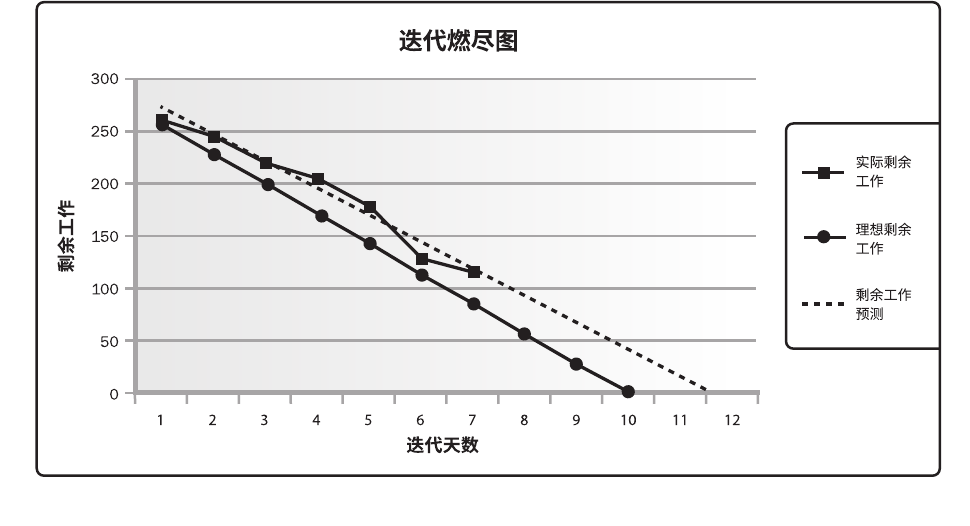

### 自制或外购分析

> 出现章节：12.1

自制或外购分析用于确定某项工作或可交付成果最好由项目团队自行完成，还是应该从外部采购。制定自制或外购决策时应考虑的因素包括；组织当前的资源配置及其技能和能力，对专业技术的需求，不愿承担永久雇用的义务，以及对独特技术专长的需求；还要评估与每个自制或外购决策相关的风险。

在自制或外购分析中，可以使用回收期、投资回报率（ROI）、内部报酬率 (IRR)、现金流贴现、净现值（NPV）、收益成本（BCA）或其他分析技术，来确定某种货物或服务是应该在项目内部自制，还是从外部购买。

### 绩效审查

> 出现章节：6.6 / 8.3 / 9.6 / 12.3

[进度]绩效审查是指根据进度基准，测量、对比和分析进度绩效，如实际开始和完成日期、已完成百分比，以及当前工作的剩余持续时间。

[质量]绩效审查针对实际结果，测量、比较和分析规划质量管理过程中定义的质量测量指标。

[资源]绩效审查是测量、比较和分析计划的资源使用和实际资源使用的不同。分析成本和进度工作绩效信息有助于指出可能影响资源使用的问题。

[采购]对照协议，对质量、资源、进度和成本绩效进行测量、比较和分析，以审查合同工作的绩效。其中包括确定工作包提前或落后于进度计划、超出或低于预算，以及是否存在资源或质量问题。

### 过程分析

> 出现章节：8.2

过程分析可以识别过程改进机会，同时检查在过程期间遇到的问题、制约因素，以及非增值活动。

### 建议书评估

> 出现章节：12.2

建议书进行评估，确定它们是否对包含在招标文件包中的招标文件、采购工作说明书、供方选择标准和其他文件，都做出了完整且充分的响应。

### 回归分析

> 出现章节：4.7

回归分析作用于项目结果的不同项目变量之间的相互关系，以提高未来项目的绩效。

### 储备分析

> 出现章节：6.4 / 7.2 / 7.3 / 7.4 / 11.6

[进度]储备分析用于确定项目所需的应急储备量和管理储备。在进行持续时间估算时，需考虑应急储备（有时称为“进度储备”），以应对进度方面的不确定性。应急储备是包含在进度基准中的一段持续时间，用来应对已经接受的已识别风险。应急储备与“已知 — 未知”风险相关，需要加以合理估算，用于完成未知的工作量。应急储备可取活动持续时间估算值的某一百分比或某一固定的时间段，亦可把应急储备从各个活动中剥离出来并汇总。随着项目信息越来越明确，可以动用、减少或取消应急储备，应该在项目进度文件中清楚地列出应急储备。也可以估算项目进度管理所需要的管理储备量。管理储备是为管理控制的目的而特别留出的项目预算，用来应对项目范围中不可预见的工作。管理储备用来应对会影响项目的“未知-未知”风险，它不包括在进度基准中，但属于项目总持续时间的一部分。依据合同条款，使用管理储备可能需要变更进度基准。

[成本]为应对成本的不确定性，成本估算中可以包括应急储备（有时称为“应急费用”）。应急储备是包含在成本基准内的一部分预算，用来应对已识别的风险；应急储备还通常是预算的一部分，用来应对那些会影响项目的“已知 — 未知”风险。例如，可以预知有些项目可交付成果需要返工，却不知道返工的工作量是多少。可以预留应急储备来应对这些未知数量的返工工作。小至某个具体活动，大到整个项目，任何层级都可有其应急储备。应急储备可取成本估算值的某一百分比、某个固定值，或者通过定量分析来确定；而随着项目信息越来越明确，可以动用、减少或取消应急储备。应该在成本文件中清楚地列出应急储备。应急储备是成本基准的一部分，也是项目整体资金需求的一部分。
管理储备是为了管理控制的目的而特别留出的项目预算，用来应对项目范围中不可预见的工作，目的是用来应对会影响项目的“未知 — 未知”风险。管理储备不包括在成本基准中，但属于项目总预算和资金需求的一部分。当动用管理储备资助不可预见的工作时，就要把动用的管理储备增加到成本基准中，从而导致成本基准变更。

### 风险数据质量评估

> 出现章节：11.3

风险数据是开展定性风险分析的基础。风险数据质量评估旨在评价关于单个项目风险的数据的准确性和可靠性。使用低质量的风险数据，可能导致定性风险分析对项目来说基本没用。如果数据质量不可接受，就可能需要收集更好的数据。可以开展问卷调查，了解项目相关方对数据质量各方面的评价，包括数据的完整性、客观性、相关性和及时性，进而对风险数据的质量进行综合评估。可以计算这些方面的加权平均数，将其作为数据质量的总体分数。

### 风险概率和影响评估

> 出现章节：11.3

风险概率评估考虑的是特定风险发生的可能性，而风险影响评估考虑的是风险对一项或多项项目目标的潜在影响，如进度、成本、质量或绩效。威胁将产生负面的影响，机会将产生正面的影响。要对每个已识别的单个项目风险进行概率和影响评估。风险评估可以采用访谈或会议的形式，参加者将依照他们对风险登记册中所记录的风险类型的熟悉程度而定。项目团队成员和项目外部资深人员应该参加访谈或会议。在访谈或会议期间，评估每个风险的概率水平及其对每项目标的影响级别。如果相关方对概率水平和影响级别的感知存在差异，则应对差异进行探讨。此外，还应记录相应的说明性细节，例如，确定概率水平或影响级别所依据的假设条件。应该采用风险管理计划中的概率和影响定义，来评估风险的概率和影响。低概率和影响的风险将被列入风险登记册中的观察清单，以供未来监控。

### 根本原因分析

> 出现章节：4.5 / 8.2 / 8.3 / 11.2 / 13.2 / 13.4

根本原因分析 (RCA)是确定引起偏差、缺陷或风险的根本原因的一种分析技术。一项根本原因可能引起多项偏差、缺陷或风险。根本原因分析还可以作为一项技术，用于识别问题的根本原因并解决问题。消除所有根本原因可以杜绝问题再次发生。

### 敏感度分析

> 出现章节：11.4

敏感性分析有助于确定哪些单个项目风险或其他不确定性来源对项目结果具有最大的潜在影响。它在项目结果变异与定量风险分析模型中的要素变异之间建立联系。
敏感性分析的结果通常用龙卷风图来表示。在该图中，标出定量风险分析模型中的每项要素与其能影响的项目结果之间的关联系数。这些要素可包括单个项目风险、易变的项目活动，或具体的不明确性来源。每个要素按关联强度降序排列，形成典型的龙卷风形状。

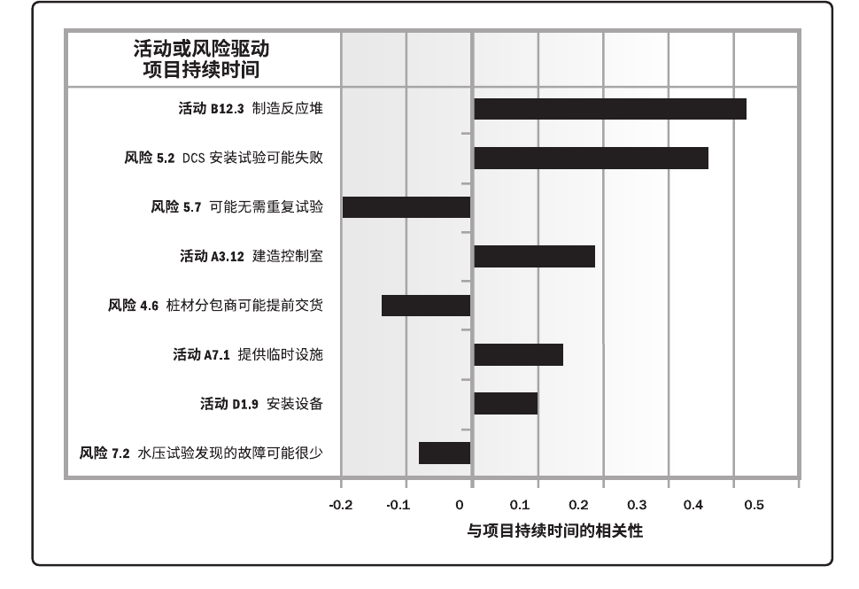

### 模拟

> 出现章节：6.5 / 11.4

[进度]模拟是把单个项目风险和不确定性的其他来源模型化的方法，以评估它们对项目目标的潜在影响。最常见的模拟技术是蒙特卡罗分析，它利用风险和其他不确定资源计算整个项目可能的进度结果。模拟包括基于多种不同的活动假设、制约因素、风险、问题或情景，使用概率分布和不确定性的其他表现形式，来计算出多种可能的工作包持续时间。下图显示了一个项目的概率分布，表明项目完成日期的可能性。

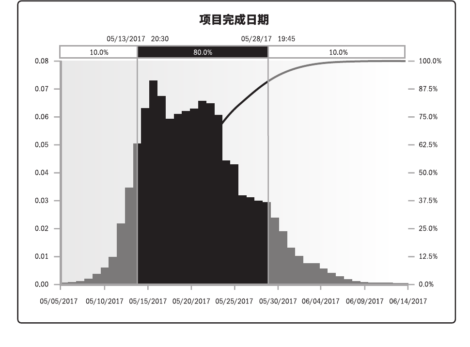

[风险]在定量风险分析中，使用模型来模拟单个项目风险和其他不确定性来源的综合影响，以评估它们对项目目标的潜在影响。模拟通常采用蒙特卡洛分析。对成本风险进行蒙特卡洛分析时，使用项目成本估算作为模拟的输入；对进度风险进行蒙特卡洛分析时，使用进度网络图和持续时间估算作为模拟的输入。开展综合定量成本-进度风险分析时，同时使用这两种输入。其输出就是定量风险分析模型。用计算机软件数千次迭代运行定量风险分析模型。每次运行，都要随机选择输入值（如成本估算、持续时间估算或概率分支发生频率）。这些运行的输出构成了项目可能结果（如项目结束日期、项目完工成本）的区间。典型的输出包括：表示模拟得到特定结果的次数的直方图，或表示获得等于或小于特定数值的结果的累积概率分布曲线（S 曲线）。在定量进度风险分析中，还可以执行关键性分析，以确定风险模型的哪些活动对项目关键路径的影响最大。对风险模型中的每一项活动计算关键性指标，即：在全部模拟中，该活动出现在关键路径上的频率，通常以百分比表示。通过关键性分析，项目团队就能够重点针对那些对项目整体进度绩效存在最大潜在影响的活动，来规划风险应对措施。

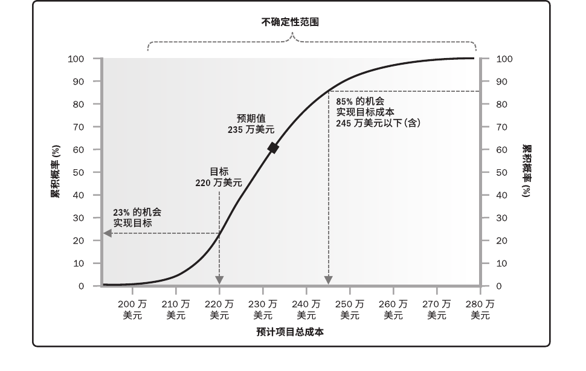

### 相关方分析

> 出现章节：11.1 / 13.1 / 13.4

相关方分析会产生相关方清单和关于相关方的各种信息，例如，在组织内的位置、在项目中的角色、与项目的利害关系、期望、态度（对项目的支持程度），以及对项目信息的兴趣。相关方的利害关系可包括（但不限于）以下各条的组合：
- 兴趣。个人或群体会受与项目有关的决策或成果的影响。
- 权利（合法权利或道德权利）。国家的法律框架可能已就相关方的合法权利做出规定，如职业健康和安全。道德权利可能涉及保护历史遗迹或环境的可持续性。
- 所有权。人员或群体对资产或财产拥有的法定所有权。
- 知识。专业知识有助于更有效地达成项目目标和组织成果，或有助于了解组织的权力结构，从而有益于项目。
- 贡献。提供资金或其他资源，包括人力资源，或者以无形方式为项目提供支持，例如，宣传项目目标，或在项目与组织权力结构及政治之间扮演缓冲角色。

### SWOT分析

> 出现章节：11.2 / 13.2

SWOT 分析是对项目的优势、劣势、机会和威胁 (SWOT) 进行逐个检查。在识别风险时，它会将内部产生的风险包含在内，从而拓宽识别风险的范围。首先，关注项目、组织或一般业务领域，识别出组织的优势和劣势；然后，找出组织优势可能为项目带来的机会，组织劣势可能造成的威胁。还可以分析组织优势能在多大程度上克服威胁，组织劣势是否会妨碍机会的产生。

### 技术绩效分析

> 出现章节：11.7

开展技术绩效分析，把项目执行期间所取得的技术成果与取得相关技术成果的计划进行比较。它要求定义关于技术绩效的客观的、量化的测量指标，以便据此比较实际结果与计划要求。技术绩效测量指标可能包括：重量、处理时间、缺陷数量、储存容量等。实际结果偏离计划的程度可以代表威胁或机会的潜在影响。

### 趋势分析

> 出现章节：4.5 / 4.7 / 5.6 / 6.6 / 7.4 / 9.6 / 12.3

趋势分析根据以往结果预测未来绩效，它可以预测项目的进度延误，提前让项目经理意识到，按照既定趋势发展，后期进度可能出现的问题。应该在足够早的项目时间进行趋势分析，使项目团队有时间分析和纠正任何异常。可以根据趋势分析的结果，提出必要的预防措施建议。

> iceman注：以下内容，需结合[挣值分析](#挣值分析)。原文来自挣值分析的下方，因此，个人觉得会有一些关联性。

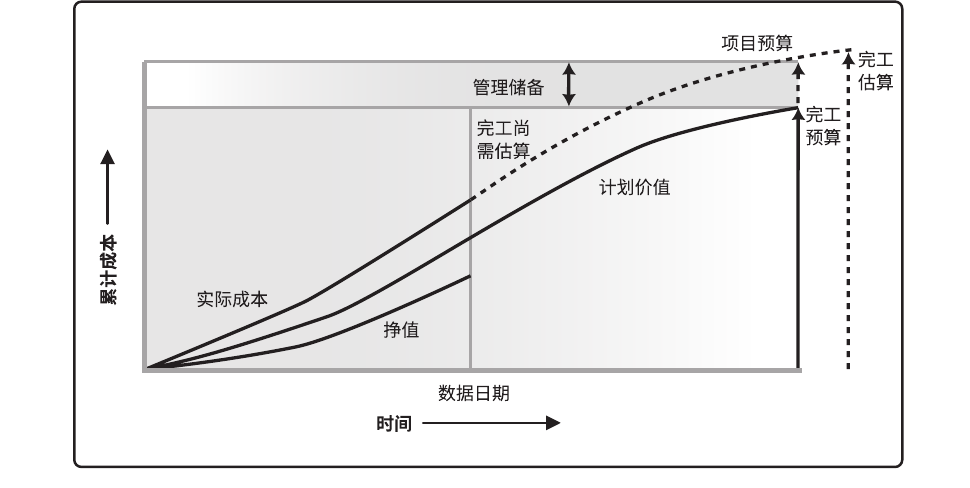

趋势分析旨在审查项目绩效随时间的变化情况，以判断绩效是正在改善还是正在恶化。图形分析技术有助于了解截至目前的绩效情况，并把发展趋势与未来的绩效目标进行比较，如 BAC 与EAC、预测完工日期与计划完工日期的比较。趋势分析技术包括（但不限于）：
- 图表。在挣值分析中，对计划价值、挣值和实际成本这三个参数，既可以分阶段（通常以周或月为单位）进行监督和报告，也可以针对累计值进行监督和报告。下图以S曲线展示了某个项目的 EV 数据，该项目预算超支且进度落后。
- 预测。随着项目进展，项目团队可根据项目绩效，对完工估算（EAC）进行预测，预测的结果可能与完工预算（BAC）存在差异。如果 BAC 已明显不再可行，则项目经理应考虑对EAC进行预测。预测EAC是根据当前掌握的绩效信息和其他知识，预计项目未来的情况和事件。预测要根据项目执行过程中所提供的工作绩效数据来产生、更新和重新发布。工作绩效信息包含项目过去的绩效，以及可能在未来对项目产生影响的任何信息。在计算 EAC 时，通常用已完成工作的实际成本，加上剩余工作的完工尚需估算（ETC）。项目团队要根据已有的经验，考虑实施 ETC 工作可能遇到的各种情况。把挣值分析与手工预测 EAC 方法联合起来使用，效果会更佳。由项目经理和项目团队手工进行的自下而上汇总方法，就是一种最普通的 EAC 预测方法。项目经理所进行的自下而上的 EAC 估算，就是以已完成工作的实际成本为基础，并根据已积累的经验来为剩余项目工作编制一个新估算。公式：EAC = AC + 自下而上的 ETC。可以很方便地把项目经理手工估算的 EAC 与计算得出的一系列 EAC 作比较，这些计算得出的EAC 代表了不同的风险情景。在计算 EAC 值时，经常会使用累计 CPI 和累计 SPI 值。尽管可以用许多方法来计算基于 EVM 数据的 EAC 值，但下面只介绍最常用的三种方法：
  - 假设将按预算单价完成 ETC 工作。这种方法承认以实际成本表示的累计实际项目绩效（不论好坏），并预计未来的全部 ETC 工作都将按预算单价完成。如果目前的实际绩效不好，则只有在进行项目风险分析并取得有力证据后，才能做出“未来绩效将会改进”的假设。公式：EAC = AC +（BAC – EV）。
  - 假设以当前 CPI 完成 ETC 工作。这种方法假设项目将按截至目前的情况继续进行，即 ETC工作将按项目截至目前的累计成本绩效指数（CPI）实施。公式：EAC = BAC/CPI。
  - 假设 SPI 与 CPI 将同时影响 ETC 工作。在这种预测中，需要计算一个由成本绩效指数与进度绩效指数综合决定的效率指标，并假设 ETC 工作将按该效率指标完成。如果项目进度对 ETC 有重要影响，这种方法最有效。使用这种方法时，还可以根据项目经理的判断，分别给 CPI 和 SPI 赋予不同的权重，如 80/20、50/50 或其他比率。公式：EAC =AC +［（BAC – EV）/（CPI x SPI）］。

### 偏差分析

> 出现章节：4.5 / 4.7 / 5.6 / 6.6 / 7.4

偏差分析审查目标绩效与实际绩效之间的差异（或偏差），可涉及持续时间估算、成本估算、资源使用、资源费率、技术绩效和其他测量指标。可以在每个知识领域，针对特定变量，开展偏差分析。在监控项目工作过程中，通过偏差分析对成本、时间、技术和资源偏差进行综合分析，以了解项目的总体偏差情况。这样就便于采取合适的预防或纠正措施。

> iceman注：以下内容，需结合[挣值分析](#挣值分析)。原文来自挣值分析的下方，因此，个人觉得会有一些关联性。

在EVM中，偏差分析用以解释成本偏差（CV = EV – AC）、进度偏差（SV = EV – PV）和完工偏差（VAC = BAC – EAC）的原因、影响和纠正措施。成本和进度偏差是最需要分析的两种偏差。对于不使用正规挣值分析的项目，可开展类似的偏差分析，通过比较计划成本和实际成本，来识别成本基准与实际项目绩效之间的差异；然后可以实施进一步的分析，以判定偏离进度基准的原因和程度，并决定是否需要采取纠正或预防措施。可通过成本绩效测量来评价偏离原始成本基准的程度。项目成本控制的重要工作包括：判定偏离成本基准的原因和程度，并决定是否需要采取纠正或预防措施。随着项目工作的逐步完成，偏差的可接受范围（常用百分比表示）将逐步缩小。偏差分析包括（但不限于）：
- 进度偏差。进度偏差（SV）是测量进度绩效的一种指标，表示为挣值与计划价值之差。它是指在某个给定的时点，项目提前或落后的进度，它是测量项目进度绩效的一种指标，等于挣值（EV）减去计划价值（PV）。EVA 进度偏差是一种有用的指标，可表明项目进度是落后还是提前于进度基准。当项目完工时，全部的计划价值都将实现（即成为挣值），所以 EVA 进度偏差最终将等于零。最好把进度偏差与关键路径法 (CPM) 和风险管理一起使用。公式：SV = EV – PV。
- 成本偏差。成本偏差（CV）是在某个给定时点的预算亏空或盈余量，表示为挣值与实际成本之差。它是测量项目成本绩效的一种指标，等于挣值（EV）减去实际成本（AC）。项目结束时的成本偏差，就是完工预算（BAC）与实际成本之间的差值。由于成本偏差指明了实际绩效与成本支出之间的关系，所以非常重要。负的 CV 一般都是不可挽回的。公式：CV = EV – AC。
- 进度绩效指数。进度绩效指数（SPI）是测量进度效率的一种指标，表示为挣值与计划价值之比，反映了项目团队完成工作的效率。有时与成本绩效指数（CPI）一起使用，以预测项目的最终完工估算。当 SPI 小于 1.0 时，说明已完成的工作量未达到计划要求；当 SPI 大于1.0 时，则说明已完成的工作量超过计划。由于 SPI 测量的是项目的总工作量，所以还需要对关键路径上的绩效进行单独分析，以确认项目是否将比计划完成日期提前或推迟完工。SPI等于 EV 与 PV 的比值。公式：SPI = EV/PV。
- 成本绩效指数。成本绩效指数（CPI）是测量预算资源的成本效率的一种指标，表示为挣值与实际成本之比。它是最关键的 EVA 指标，用来测量已完成工作的成本效率。当 CPI 小于 1.0时，说明已完成工作的成本超支；当 CPI 大于 1.0 时，则说明到目前为止成本有结余。CPI 等于 EV 与 AC 的比值。公式：CPI = EV/AC。

### 假设情景分析

> 出现章节：6.5 / 6.6

假设情景分析是对各种情景进行评估，预测它们对项目目标的影响（积极或消极的）。假设情景分析就是对“如果情景 X 出现，情况会怎样？”这样的问题进行分析，即基于已有的进度计划，考虑各种各样的情景。例如，推迟某主要部件的交货日期，延长某设计工作的时间，或加入外部因素（如罢工或许可证申请流程变化等）。可以根据假设情景分析的结果，评估项目进度计划在不同条件下的可行性，以及为应对意外情况的影响而编制进度储备和应对计划。

### 亲和图

> 出现章节：5.2 / 8.2

用来对大量创意进行分组的技术，以便进一步审查和分析。

### 因果图

> 出现章节：8.2 / 8.3

因果图，又称“鱼骨图”、“why-why分析图”和“石川图”，将问题陈述的原因分解为离散的分支，有助于识别问题的主要原因或根本原因。

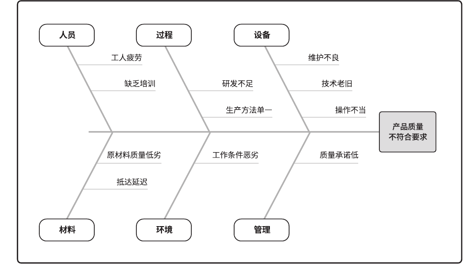

### 控制图

> 出现章节：8.3

控制图用于确定一个过程是否稳定，或者是否具有可预测的绩效。规格上限和下限是根据要求制定的，反映了可允许的最大值和最小值。上下控制界限不同于规格界限。控制界限根据标准的统计原则，通过标准的统计计算确定，代表一个稳定过程的自然波动范围。项目经理和相关方可基于计算出的控制界限，识别须采取纠正措施的检查点，以预防不在控制界限内的绩效。控制图可用于监测各种类型的输出变量。虽然控制图最常用来跟踪批量生产中的重复性活动，但也可用来监测成本与进度偏差、产量、范围变更频率或其他管理工作成果，以便帮助确定项目管理过程是否受控。

### 流程图

> 出现章节：8.1 / 8.2

流程图，也称过程图，用来显示在一个或多个输入转化成一个或多个输出的过程中，所需要的步骤顺序和可能分支。它通过映射水平价值链的过程细节来显示活动、决策点、分支循环、并行路径及整体处理顺序。流程图可能有助于了解和估算一个过程的质量成本。通过工作流的逻辑分支及其相对频率来估算质量成本。这些逻辑分支细分为完成符合要求的输出而需要开展的一致性工作和非一致性工作。用于展示过程步骤时，流程图有时又被称为“过程流程图”或“过程流向图”，可帮助改进过程并识别可能出现质量缺陷或可以纳入质量检查的地方。

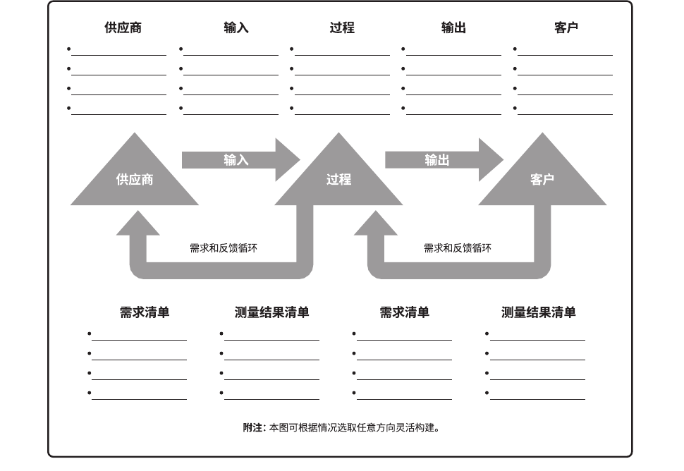

### 层级图

> 出现章节：9.1

> iceman注：在11.3.2.6，同样看到一个“层级图”，但是实际上说的却是“气泡图”等其他表示风险的图形。

可以采用传统的组织结构图，自上而下地显示各种职位及其相互关系。
- 工作分解结构 (WBS)。WBS 用来显示如何把项目可交付成果分解为工作包，有助于明确高层级的职责。
- 组织分解结构 (OBS)。WBS 显示项目可交付成果的分解，而 OBS 则按照组织现有的部门、单元或团队排列，并在每个部门下列出项目活动或工作包。运营部门（如信息技术部或采购部）只需要找到其所在的 OBS 位置，就能看到自己的全部项目职责。
- 资源分解结构。资源分解结构是按资源类别和类型，对团队和实物资源的层级列表，用于规划、管理和控制项目工作。每向下一个层次都代表对资源的更详细描述，直到信息细到可以与工作分解结构（WBS）相结合，用来规划和监控项目工作。

### 直方图

> 出现章节：8.2 / 8.3

直方图是一种展示数字数据的条形图，可以展示每个可交付成果的缺陷数量、缺陷成因的排列、各个过程的不合规次数，或项目或产品缺陷的其他表现形式。

### 逻辑数据模型

> 出现章节：8.1

逻辑数据模型把组织数据可视化，以商业语言加以描述，不依赖任何特定技术。逻辑数据模型可用于识别会出现数据完整性或其他质量问题的地方。

### 矩阵图

> 出现章节：8.1 / 8.2

矩阵图在行列交叉的位置展示因素、原因和目标之间的关系强弱。根据可用来比较因素的数量，项目经理可使用不同形状的矩阵图，如 L 型、T 型、Y 型、X 型、C 型和屋顶型矩阵。

### 矩阵基础图

> 出现章节：9.1

责任分配矩阵展示项目资源在各个工作包中的任务分配。矩阵型图表的一个例子是职责分配矩阵(RAM)，它显示了分配给每个工作包的项目资源，用于说明工作包或活动与项目团队成员之间的关系。在大型项目中，可以制定多个层次的 RAM。例如，高层次的RAM 可定义项目团队、小组或部门负责 WBS 中的哪部分工作，而低层次的 RAM 则可在各小组内为具体活动分配角色、职责和职权。矩阵图能反映与每个人相关的所有活动，以及与每项活动相关的所有人员，它也可确保任何一项任务都只有一个人负责，从而避免职权不清。RAM的一个例子是 RACI（执行、负责、咨询和知情）矩阵。图中最左边的一列表示有待完成的工作（活动）。分配给每项工作的资源可以是个人或小组，项目经理也可根据项目需要，选择“领导”或“资源”等适用词汇，来分配项目责任。如果团队是由内部和外部人员组成，RACI 矩阵对明确划分角色和职责特别有用。

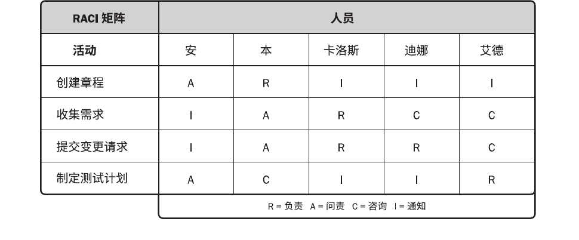

### 思维导图

> 出现章节：5.2 / 8.1 / 13.2

把从头脑风暴中获得的创意整合成一张图，用以反映创意之间的共性与差异，激发新创意。

### 概率和影响矩阵

> 出现章节：11.3

概率和影响矩阵。概率和影响矩阵是把每个风险发生的概率和一旦发生对项目目标的影响映射起来的表格。此矩阵对概率和影响进行组合，以便于把单个项目风险划分成不同的优先级组别。基于风险的概率和影响，对风险进行优先级排序，以便未来进一步分析并制定应对措施。采用风险管理计划中规定的风险概率和影响定义，逐一对单个项目风险的发生概率及其对一项或多项项目目标的影响（若发生）进行评估。然后，基于所得到的概率和影响的组合，使用概率和影响矩阵，来为单个项目风险分配优先级别。

组织可针对每个项目目标（如成本、时间和范围）制定单独的概率和影响矩阵，并用它们来评估风险针对每个目标的优先级别。组织还可以用不同的方法为每个风险确定一个总体优先级别。即可综合针对不同目标的评估结果，也可采用最高优先级别（无论针对哪个目标），作为风险的总体优先级别。

### 散点图

> 出现章节：8.2 / 8.3

散点图是一种展示两个变量之间的关系的图形，它能够展示两支轴的关系，一支轴表示过程、环境或活动的任何要素，另一支轴表示质量缺陷。

### 相关方参与度评估矩阵

> 出现章节：10.1 / 10.3 / 13.2 / 13.4

相关方参与度评估矩阵用于将相关方当前参与水平与期望参与水平进行比较。对相关方参与水平进行分类的方式之一。相关方参与水平可分为如下：
- 不了解型。不知道项目及其潜在影响。
- 抵制型。知道项目及其潜在影响，但抵制项目工作或成果可能引发的任何变更。此类相关方不会支持项目工作或项目成果。
- 中立型。了解项目，但既不支持，也不反对。
- 支持型。了解项目及其潜在影响，并且会支持项目工作及其成果。
- 领导型。了解项目及其潜在影响，而且积极参与以确保项目取得成功。

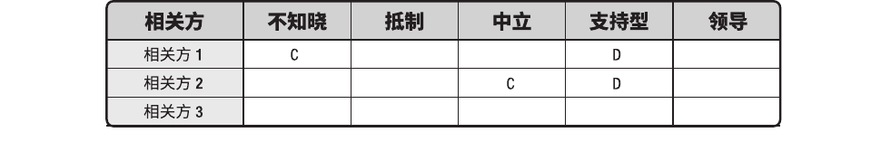

### 相关方映射分析/表现

> 出现章节：13.1

相关方映射分析和表现是一种利用不同方法对相关方进行分类的方法。对相关方进行分类有助于团队与已识别的项目相关方建立关系。常见的分类方法包括：
- 权力利益方格、权力影响方格，或作用影响方格。基于相关方的职权级别（权力）、对项目成果的关心程度（利益）、对项目成果的影响能力（影响），或改变项目计划或执行的能力，每一种方格都可用于对相关方进行分类。对于小型项目、相关方与项目的关系很简单的项目，或相关方之间的关系很简单的项目，这些分类模型非常实用。
- 相关方立方体。这是上述方格模型的改良形式。本立方体把上述方格中的要素组合成三维模型，项目经理和团队可据此分析相关方并引导相关方参与项目。作为一个多维模型，它将相关方视为一个多维实体，更好地加以分析，从而有助于沟通策略的制定。
- 凸显模型。通过评估相关方的权力（职权级别或对项目成果的影响能力）、紧迫性（因时间约束或相关方对项目成果有重大利益诉求而导致需立即加以关注）和合法性（参与的适当性），对相关方进行分类。在凸显模型中，也可以用邻近性取代合法性，以便考察相关方参与项目工作的程度。这种凸显模型适用于复杂的相关方大型社区，或在相关方社区内部存在复杂的关系网络。凸显模型可用于确定已识别相关方的相对重要性。
- 影响方向。可以根据相关方对项目工作或项目团队本身的影响方向，对相关方进行分类。可以把相关方分类为：
  - 向上（执行组织或客户组织、发起人和指导委员会的高级高级管理层）；
  - 向下（临时贡献知识或技能的团队或专家）；
  - 向外（项目团队外的相关方群体及其代表，如供应商、政府部门、公众、最终用户和监管部门）；或
  - 横向（项目经理的同级人员，如其他项目经理或中层管理人员，他们与项目经理竞争稀缺项目资源或者合作共享资源或信息）。
- 优先级排序。如果项目有大量相关方、相关方社区的成员频繁变化，相关方和项目团队之间或相关方社区内部的关系复杂，可能有必要对相关方进行优先级排序。

### 面向文本的格式

> 出现章节：9.1

文本型文件通常以概述的形式，提供诸如职责、职权、能力和资格等方面的信息。这种文件有多种名称，如职位描述、角色 — 职责 — 职权表，该文件可作为未来项目的模板，特别是在根据当前项目的经验教训对其内容进行更新之后。

## 数据表现技术（15种）

> iceman注：原文中没有出现这15种工具和技术的详细列表。但猜测，应该是数据分析技术中的后15种，即：亲和图、因果图、控制图、流程图、层级图、直方图、逻辑数据模型、矩阵图、矩阵基础图、思维导图、概率和影响矩阵、散点图、相关方参与度评估矩阵、相关方映射分析/表现、面向文本的格式。

## 决策技术（2种）

### 独裁型决策制定

> iceman注：本决策技术，没有列入“工具与技术”列表，可能是因为这不是一种好的技术吧。

一个人负责为整个集体制定决策。

### 多标准决策分析

> 出现章节：4.6 / 5.2 / 5.3 / 8.1 / 8.2 / 9.3 / 11.5 / 13.4

多标准决策分析工具（如优先矩阵）可用于识别关键事项和合适的备选方案，并通过一系列决策排列出备选方案的优先顺序。先对标准排序和加权，再应用于所有备选方案，计算出各个备选方案的数学得分，然后根据得分对备选方案排序。

### 投票

> 出现章节：4.5 / 4.6 / 5.2 / 5.5 / 6.4 / 7.2 / 13.4

投票。投票是一种为达成某种期望结果，而对多个未来行动方案进行评估的集体决策技术和过程。投票技术示例包括：
- 一致同意。每个人都同意某个行动方案。
- 大多数同意。获得群体中超过 50% 人员的支持，就能做出决策。把参与决策的小组人数定为奇数，可防止因平局而无法达成决策。
- 相对多数同意。根据群体中相对多数人的意见做出决策，即便未能获得大多数人的支持。通常在候选项超过两个时使用。

## 沟通技巧（2种）

> iceman注：在沟通技巧（书上叫“沟通技能”）部分，还出现2个技能：沟通胜任力、非口头技能（如表情、肢体语言、语调、眼神等），没有被列出来。

### 反馈

> 出现章节：10.2 / 13.4

反馈是关于沟通、可交付成果或情况的反应信息。反馈支持项目经理和团队及所有其他项目相关方之间的互动沟通。例如，指导、辅导和磋商。

### 演示

> 出现章节：10.2 / 13.4

演示是信息和/或文档的正式交付。向项目相关方明确有效地演示项目信息可包括（但不限于）：
- 向相关方报告项目进度和信息更新；
- 提供背景信息以支持决策制定；
- 提供关于项目及其目标的通用信息，以提升项目工作和项目团队的形象；
- 提供具体信息，以提升对项目工作和目标的理解和支持力度。

为获得演示成功，应该从内容和形式上考虑以下因素：
- 受众及其期望和需求；
- 项目和项目团队的需求及目标。

## 人际关系与团队技能（17种）

### 个人技能

#### 情商

> 出现章节：9.5

情商指识别、评估和管理个人情绪、他人情绪及团体情绪的能力。项目管理团队能用情商来了解、评估及控制项目团队成员的情绪，预测团队成员的行为，确认团队成员的关注点及跟踪团队成员的问题，来达到减轻压力、加强合作的目的。

#### 政治意识

> 出现章节：4.4 / 10.1 / 10.2 / 13.3 / 13.4

政治意识有助于项目经理根据项目环境和组织的政治环境来规划沟通。政治意识是指对正式和非正式权力关系的认知，以及在这些关系中工作的意愿。理解组织战略、了解谁能行使权力和施加影响，以及培养与这些相关方沟通的能力，都属于政治意识的范畴。

#### 文化意识

> 出现章节：10.1 / 10.2 / 13.3 / 13.4

文化意识指理解个人、群体和组织之间的差异，并据此调整项目的沟通策略。具有文化意识并采取后续行动，能够最小化因项目相关方社区内的文化差异而导致的理解错误和沟通错误。文化意识和文化敏感性有助于项目经理依据相关方和团队成员的文化差异和文化需求对沟通进行规划。

### 人际关系

#### 积极倾听

> 出现章节：4.4 / 10.2 / 13.4

积极倾听技术包括告知已收到、澄清与确认信息、理解，以及消除妨碍理解的障碍。

#### 影响力

> 出现章节：9.4 / 9.5 / 9.6 / 11.6

影响力。在矩阵环境中，项目经理对团队成员通常没有或仅有很小的命令职权，所以他们适时影响相关方的能力，对保证项目成功非常关键。影响力主要体现在如下各方面：
- 说服他人；
- 清晰表达观点和立场；
- 积极且有效的倾听；
- 了解并综合考虑各种观点；
- 收集相关信息，在维护相互信任的关系下，解决问题并达成一致意见。

#### 领导力

> 出现章节：4.4 / 9.5 / 13.4

领导力。成功的项目需要强有力的领导技能，领导力是领导团队、激励团队做好本质工作的能力。它包括各种不同的技巧、能力和行动。且领导力在项目生命周期中的所有阶段都很重要。有多种领导力理论，定义了适用于不同情形或团队的领导风格。领导力对沟通愿景及鼓舞项目团队高效工作十分重要。

#### 沟通风格评估

> 出现章节：10.1

规划沟通活动时，用于评估沟通风格并识别偏好的沟通方法、形式和内容的一种技术。常用于不支持项目的相关方。可以先开展相关方参与度评估，再开展沟通风格评估。在相关方参与度评估中，找出相关方参与度的差距。为弥补这种差距，就需要特别裁剪沟通活动和工件。

#### 人际交往

> 出现章节：4.4 / 10.2 / 13.4

人际交往是通过与他人互动交流信息，建立联系。人际交往有利于项目经理及其团队通过非正式组织解决问题，影响相关方的行动，以及提高相关方对项目工作和成果的支持，从而改善绩效。

#### 激励

> 出现章节：9.4

激励为某人采取行动提供了理由。提高团队参与决策的能力并鼓励他们独立工作。

#### 谈判

> 出现章节：9.3 / 9.4 / 9.6 / 12.2 / 13.3

谈判是为达成协议而进行的讨论。

#### 观察/交谈

> 出现章节：5.2 / 10.3 / 13.4

观察和交谈是指直接察看个人在各自的环境中如何执行工作（或任务）和实施流程。当产品使用者难以或不愿清晰说明他们的需求时，就特别需要通过观察来了解他们的工作细节。观察，也称为“工作跟随”，通常由旁站观察者观察业务专家如何执行工作，但也可以由“参与观察者”来观察，通过实际执行一个流程或程序，来体验该流程或程序是如何实施的，以便挖掘隐藏的需求。

### 团队技能

#### 冲突管理

> 出现章节：4.1 / 4.2 / 9.4 / 9.5 / 10.2 / 13.3

在项目环境中，冲突不可避免。冲突的来源包括资源稀缺、进度优先级排序和个人工作风格差异等。采用团队基本规则、团队规范及成熟的项目管理实践（如沟通规划和角色定义），可以减少冲突的数量。

成功的冲突管理可提高生产力，改进工作关系。同时，如果管理得当，意见分歧有利于提高创造力和改进决策。假如意见分歧成为负面因素，应该首先由项目团队成员负责解决；如果冲突升级，项目经理应提供协助，促成满意的解决方案，采用直接和合作的方式，尽早并且通常在私下处理冲突。如果破坏性冲突继续存在，则可使用正式程序，包括采取惩戒措施。

项目经理解决冲突的能力往往决定其管理项目团队的成败。不同的项目经理可能采用不同的解决冲突方法。影响冲突解决方法的因素包括：
- 冲突的重要性与激烈程度；
- 解决冲突的紧迫性；
- 涉及冲突的人员的相对权力；
- 维持良好关系的重要性；
- 永久或暂时解决冲突的动机。

有五种常用的冲突解决方法，每种技巧都有各自的作用和用途。
- 撤退/回避。从实际或潜在冲突中退出，将问题推迟到准备充分的时候，或者将问题推给其他人员解决。
- 缓和/包容。强调一致而非差异；为维持和谐与关系而退让一步，考虑其他方的需要。
- 妥协/调解。为了暂时或部分解决冲突，寻找能让各方都在一定程度上满意的方案，但这种方法有时会导致“双输”局面。
- 强迫/命令。以牺牲其他方为代价，推行某一方的观点；只提供赢 — 输方案。通常是利用权力来强行解决紧急问题，这种方法通常会导致“赢输”局面。
- 合作/解决问题。综合考虑不同的观点和意见，采用合作的态度和开放式对话引导各方达成共识和承诺，这种方法可以带来双赢局面。

#### 引导

> 出现章节：4.1 / 4.2 / 4.4 / 5.2 / 5.3 / 11.2 / 11.3 / 11.4 / 11.5

引导是指有效引导团队活动成功以达成决定、解决方案或结论的能力。引导者确保参与者有效参与，互相理解，考虑所有意见，按既定决策流程全力支持得到的结论或结果，以及所达成的行动计划和协议在之后得到合理执行。

#### 名义小组技术

> 出现章节：5.2

名义小组技术是用于促进头脑风暴的一种技术，通过投票排列最有用的创意，以便进一步开展头脑风暴或优先排序。名义小组技术是一种结构化的头脑风暴形式，由四个步骤组成：
- 向集体提出一个问题或难题。每个人在沉思后写出自己的想法。
- 主持人在活动挂图上记录所有人的想法。
- 集体讨论各个想法，直到全体成员达成一个明确的共识。
- 个人私下投票决出各种想法的优先排序，通常采用 5 分制，1 分最低，5 分最高。为减少想法数量、集中关注想法，可进行数轮投票。每轮投票后，都将清点选票，得分最高者被选出。

#### 制定决策

> 出现章节：9.5

这种情况下，决策包括谈判能力以及影响组织与项目管理团队的能力，而不是决策工具集所描述的一系列工具。进行有效决策需要：
- 着眼于所要达到的目标；
- 遵循决策流程；
- 研究环境因素；
- 分析可用信息；
- 激发团队创造力；
- 理解风险。

#### 会议管理

> 出现章节：4.1 / 4.2 / 10.2

会议管理是采取步骤确保会议有效并高效地达到预期目标。规划会议时应采取以下步骤：
- 准备并发布会议议程（其中包含会议目标）；
- 确保会议在规定的时间开始和结束；
- 确保适当参与者受邀并出席；
- 切题；
- 处理会议中的期望、问题和冲突；
- 记录所有行动以及所分配的行动责任人。

#### 团队建设

> 出现章节：9.4

团队建设是通过举办各种活动，强化团队的社交关系，打造积极合作的工作环境。团队建设活动既可以是状态审查会上的五分钟议程，也可以是为改善人际关系而设计的、在非工作场所专门举办的专业提升活动。团队建设活动旨在帮助各团队成员更加有效地协同工作。如果团队成员的工作地点相隔甚远，无法进行面对面接触，就特别需要有效的团队建设策略。非正式的沟通和活动有助于建立信任和良好的工作关系。团队建设在项目前期必不可少，但它更是个持续的过程。项目环境的变化不可避免，要有效应对这些变化，就需要持续不断地开展团队建设。项目经理应该持续地监督团队机能和绩效，确定是否需要采取措施来预防或纠正各种团队问题。

## 未分组（60种）

> iceman注：我很认真的数过了，没有60，只有59。

### 广告

> 出现章节：12.2

广告是就产品、服务或成果与用户或潜在用户进行的沟通。在大众出版物（如指定的报纸）或专门行业出版物上刊登广告，往往可以扩充现有的潜在卖方名单。大多数政府机构都要求公开发布采购广告，或在网上公布拟签署的政府合同的信息。

### 敏捷发布规划

> 出现章节：6.5

敏捷发布规划基于项目路线图和产品发展愿景，提供了高度概括的发布进度时间轴（通常是 3 到 6个月）。同时，敏捷发布规划还确定了发布的迭代或冲刺次数，使产品负责人和团队能够决定需要开发的内容，并基于业务目标、依赖关系和障碍因素确定达到产品放行所需的时间。

对客户而言，产品功能就是价值，因此，该时间轴定义了每次迭代结束时交付的功能，提供了更易于理解的项目进度计划，而这些就是客户真正需要的信息。

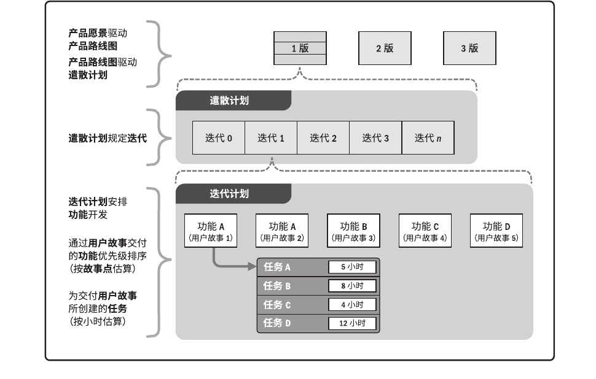

### 类比估算

> 出现章节：6.4 / 7.2 / 9.2

类比估算是一种使用相似活动或项目的历史数据，来估算当前活动或项目的持续时间或成本的技术。类比估算以过去类似项目的参数值（如持续时间、预算、规模、重量和复杂性等）为基础，来估算未来项目的同类参数或指标。在估算持续时间时，类比估算技术以过去类似项目的实际持续时间为依据，来估算当前项目的持续时间。这是一种粗略的估算方法，有时需要根据项目复杂性方面的已知差异进行调整，在项目详细信息不足时，就经常使用类比估算来估算项目持续时间。

相对于其他估算技术，类比估算通常成本较低、耗时较少，但准确性也较低。类比估算可以针对整个项目或项目中的某个部分进行，或可以与其他估算方法联合使用。如果以往活动是本质上而不是表面上类似，并且从事估算的项目团队成员具备必要的专业知识，那么类比估算就最为可靠。

### 审计

> 出现章节：8.2 / 11.7 / 12.3

审计是用于确定项目活动是否遵循了组织和项目的政策、过程与程序的一种结构化且独立的过程。质量审计通常由项目外部的团队开展，如组织内部审计部门、项目管理办公室 (PMO) 或组织外部的审计师。质量审计目标可能包括（但不限于）：
- 识别全部正在实施的良好及最佳实践；
- 识别所有违规做法、差距及不足；
- 分享所在组织和/或行业中类似项目的良好实践；
- 积极、主动地提供协助，以改进过程的执行，从而帮助团队提高生产效率；
- 强调每次审计都应对组织经验教训知识库的积累做出贡献。

采取后续措施纠正问题，可以降低质量成本，并提高发起人或客户对项目产品的接受度。质量审计可事先安排，也可随机进行；可由内部或外部审计师进行。

质量审计还可确认已批准的变更请求（包括更新、纠正措施、缺陷补救和预防措施）的实施情况。

### 投标人会议

> 出现章节：12.2

投标人会议（又称承包商会议、供应商会议或投标前会议）是在卖方提交建议书之前，在买方和潜在卖方之间召开的会议，其目的是确保所有潜在投标人对采购要求都有清楚且一致的理解，并确保没有任何投标人会得到特别优待。

### 自下而上估算

> 出现章节：6.2 / 7.2 / 9.2

自下而上估算是一种估算项目持续时间或成本的方法，通过从下到上逐层汇总 WBS 组成部分的估算而得到项目估算。如果无法以合理的可信度对活动持续时间进行估算，则应将活动中的工作进一步细化，然后估算具体的持续时间，接着再汇总这些资源需求估算，得到每个活动的持续时间。活动之间可能存在或不存在会影响资源利用的依赖关系；如果存在，就应该对相应的资源使用方式加以说明，并记录在活动资源需求中。

### 变更控制工具

> 出现章节：4.6

为了便于开展配置和变更管理，可以使用一些手动或自动化的工具。配置控制重点关注可交付成果及各个过程的技术规范，而变更控制则着眼于识别、记录、批准或否决对项目文件、可交付成果或基准的变更。

工具的选择应基于项目相关方的需要，包括考虑组织和环境情况和（或）制约因素。工具应支持以下配置管理活动：
- 识别配置项。识别与选择配置项，从而为定义与核实产品配置、标记产品和文件、管理变更和明确责任提供基础。
- 记录并报告配置项状态。关于各个配置项的信息记录和报告。
- 进行配置项核实与审计。通过配置核实与审计，确保项目的配置项组成的正确性，以及相应的变更都被登记、评估、批准、跟踪和正确实施，从而确保配置文件所规定的功能要求都已实现。

工具还应支持以下变更管理活动：
- 识别变更。识别并选择过程或项目文件的变更项。
- 记录变更。将变更记录为合适的变更请求。
- 做出变更决定。审查变更，批准、否决、推迟对项目文件、可交付成果或基准的变更或做出其他决定。
- 跟踪变更。确认变更被登记、评估、批准、跟踪并向相关方传达最终结果。

也可以使用工具来管理变更请求和后续的决策，同时还要格外关注沟通，以帮助变更控制委员会的成员履行职责，以及向相关方传达决定。

### 索赔管理

> 出现章节：12.3

如果买卖双方不能就变更补偿达成一致意见，或对变更是否发生存在分歧，那么被请求的变更就成为有争议的变更或潜在的推定变更。此类有争议的变更称为索赔。如果不能妥善解决，它们会成为争议并最终引发申诉。在整个合同生命周期中，通常会按照合同条款对索赔进行记录、处理、监督和管理。如果合同双方无法自行解决索赔问题，则可能不得不按合同中规定的程序，用替代争议解决方法（ADR）去处理。谈判是解决所有索赔和争议的首选方法。

### 集中办公

> 出现章节：9.4

集中办公是指把许多或全部最活跃的项目团队成员安排在同一个物理地点工作，以增强团队工作能力。集中办公既可以是临时的（如仅在项目特别重要的时期），也可以贯穿整个项目。实施集中办公策略，可借助团队会议室、张贴进度计划的场所，以及其他能增进沟通和集体感的设施。

### 沟通方法

> 出现章节：10.1 / 10.2

项目相关方之间用于分享信息的沟通方法有几种。这些方法可以大致分为：
- 互动沟通。在两方或多方之间进行的实时多向信息交换。它使用诸如会议、电话、即时信息、社交媒体和视频会议等沟通工件。
- 推式沟通。向需要接收信息的特定接收方发送或发布信息。这种方法可以确保信息的发送，但不能确保信息送达目标受众或被目标受众理解。在推式沟通中，可以采用的沟通工件包括信件、备忘录、报告、电子邮件、传真、语音邮件、博客、新闻稿。
- 拉式沟通。适用于大量复杂信息或大量信息受众的情况。它要求接收方在遵守有关安全规定的前提之下自行访问相关内容。这种方法包括门户网站、企业内网、电子在线课程、经验教训数据库或知识库。

应该采用不同方法来实现沟通管理计划所规定的主要沟通需求：
- 人际沟通。个人之间交换信息，通常以面对面的方式进行。
- 小组沟通。在三到六名人员的小组内部开展。
- 公众沟通。单个演讲者面向一群人。
- 大众传播。信息发送人员或小组与大量目标受众（有时为匿名）之间只有最低程度的联系。
- 网络和社交工具沟通。借助社交工具和媒体，开展多对多的沟通。

可用的沟通工件和方法包括（但不限于）：
- 公告板；
- 新闻通讯、内部杂志、电子杂志；
- 致员工或志愿者的信件；
- 新闻稿；
- 年度报告；
- 电子邮件和内部局域网；
- 门户网站和其他信息库（适用于拉式沟通）；
- 电话交流；
- 演示；
- 团队简述或小组会议；
- 焦点小组；
- 相关方之间的正式或非正式的面对面会议；
- 咨询小组或员工论坛；
- 社交工具和媒体。

### 沟通模型

> 出现章节：10.1

沟通模型可以是最基本的线性（发送方和接收方）沟通过程，也可以是增加了反馈元素（发送方、接收方和反馈）、更具互动性的沟通形式，甚至可以是融合了发送方或接收方的人性因素、试图考虑沟通复杂性的更加复杂的沟通模型。
- 基本的发送方和接收方沟通模型示例。此模型将沟通描述为一个过程，并由发送方和接收方两方参与；其关注的是确保信息送达，而非信息理解。基本沟通模型中的步骤顺序为：
  - 编码。把信息编码为各种符号，如文本、声音或其他可供传递（发送）的形式。
  - 传递信息。通过沟通渠道发送信息。信息传递可能受各种物理因素的不利影响，如不熟悉的技术，或不完备的基础设施。可能存在噪音和其他因素，导致信息传递和（或）接收过程中的信息损耗。
  - 解码。接收方将收到的数据还原为对自己有用的形式。
- 互动沟通模型示例。此模型也将沟通描述为由发送方与接收方参与的沟通过程，但它还强调确保信息理解的必要性。此模型包括任何可能干扰或阻碍信息理解的噪音，如接收方注意力分散、接收方的认知差异，或缺少适当的知识或兴趣。互动沟通模型中的新增步骤有：
  - 确认已收到。收到信息时，接收方需告知对方已收到信息（确认已收到）。这并不一定意味着同意或理解信息的内容，仅表示已收到信息。
  - 反馈/响应。对收到的信息进行解码并理解之后，接收方把还原出来的思想或观点编码成信息，再传递给最初的发送方。如果发送方认为反馈与原来的信息相符，代表沟通已成功完成。在沟通中，可以通过积极倾听实现反馈。

作为沟通过程的一部分，发送方负责信息的传递，确保信息的清晰性和完整性，并确认信息已被正确理解；接收方负责确保完整地接收信息，正确地理解信息，并需要告知已收到或作出适当的回应。在发送方和接收方所处的环境中，都可能存在会干扰有效沟通的各种噪音和其他障碍。

在跨文化沟通中，确保信息理解会面临挑战。沟通风格的差异可源于工作方法、年龄、国籍、专业学科、民族、种族或性别差异。不同文化的人们会以不同的语言（如技术设计文档、不同的风格）沟通，并喜欢采用不同的沟通过程和礼节。

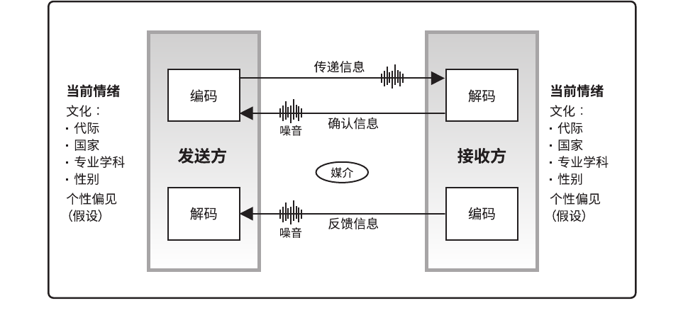

上图所示的沟通模型展示了发送方的当前情绪、知识、背景、个性、文化和偏见会如何影响信息本身及其传递方式。类似地，接收方的当前情绪、知识、背景、个性、文化和偏见也会影响信息的接收和解读方式，导致沟通中的障碍或噪音。
此沟通模型及其强化版有助于制定人对人或小组对小组的沟通策略和计划，但不可用于制定采用其他沟通工件（如电子邮件、广播信息或社交媒体）的沟通策略和计划。

### 沟通需求分析

> 出现章节：10.1

分析沟通需求，确定项目相关方的信息需求，包括所需信息的类型和格式，以及信息对相关方的价值。

常用于识别和确定项目沟通需求的信息包括（但不限于）：
- 相关方登记册及相关方参与计划中的相关信息和沟通需求；
- 潜在沟通渠道或途径数量，包括一对一、一对多和多对多沟通；
- 组织结构图；
- 项目组织与相关方的职责、关系及相互依赖；
- 开发方法；
- 项目所涉及的学科、部门和专业；
- 有多少人在什么地点参与项目；
- 内部信息需要（如何时在组织内部沟通）；
- 外部信息需要（如何时与媒体、公众或承包商沟通）；
- 法律要求。

### 沟通技术

> 出现章节：9.4 / 10.1 / 10.2

用于在项目相关方之间传递信息的方法很多。信息交换和协作的常见方法包括对话、会议、书面文件、数据库、社交媒体和网站。

可能影响沟通技术选择的因素包括：
- 信息需求的紧迫性。信息传递的紧迫性、频率和形式可能因项目而异，也可能因项目阶段而异。
- 技术的可用性与可靠性。用于发布项目沟通工件的技术，应该在整个项目期间都具备兼容性和可得性，且对所有相关方都可用。
- 易用性。沟通技术的选择应适合项目参与者，而且应在合适的时候安排适当的培训活动。
- 项目环境。团队会议与工作是面对面还是在虚拟环境中开展，成员处于一个还是多个时区，他们是否使用多语种沟通，是否还有能影响沟通效率的其他环境因素（如与文化有关的各个方面）？
- 信息的敏感性和保密性。需要考虑的一些方面有：
- 拟传递的信息是否属于敏感或机密信息？如果是，可能需要采取合理的安全措施。
- 为员工制定社交媒体政策，以确保行为适当、信息安全和知识产权保护。

### 系统交互图

> 出现章节：5.2

系统交互图是范围模型的一个例子，它是对产品范围的可视化描绘，显示业务系统（过程、设备、计算机系统等）及其与人和其他系统（行动者）之间的交互方式。系统交互图显示了业务系统的输入、输入提供者、业务系统的输出和输出接收者。

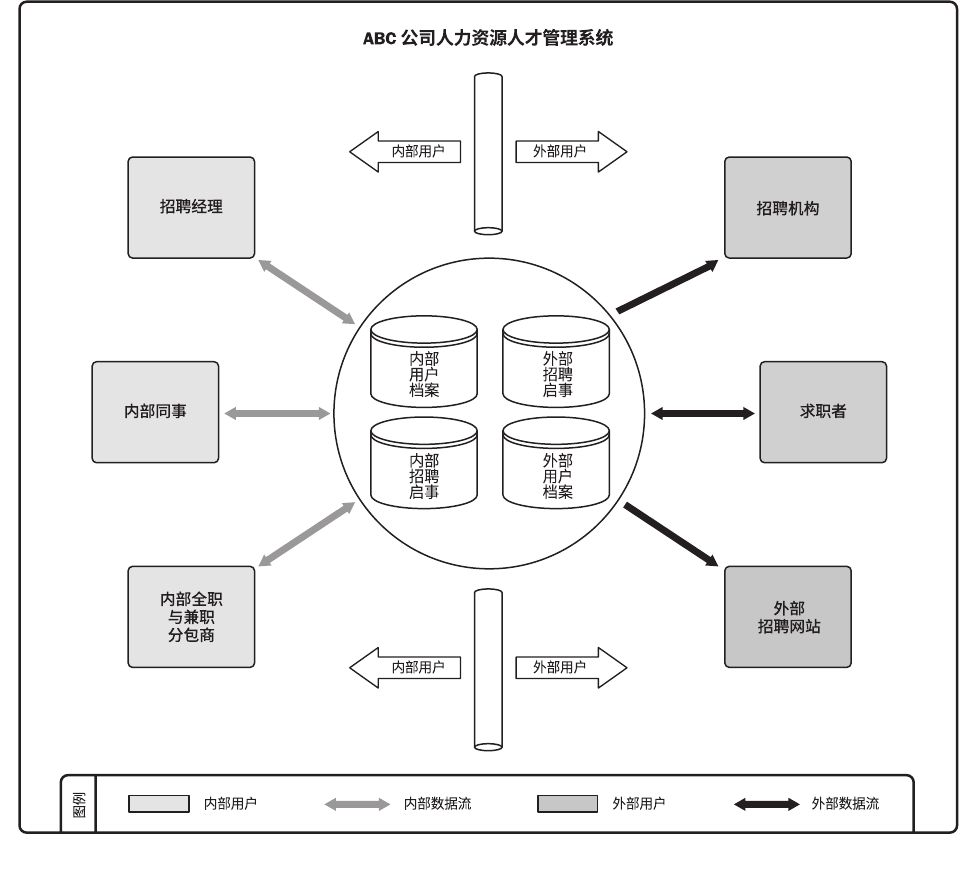

### 应急应对策略

> 出现章节：11.5

可以设计一些仅在特定事件发生时才采用的应对措施。对于某些风险，如果项目团队相信其发生会有充分的预警信号，那么就应该制定仅在某些预定条件出现时才执行的应对计划。应该定义并跟踪应急应对策略的触发条件，例如，未实现中间的里程碑，或获得卖方更高程度的重视。采用此技术制定的风险应对计划，通常称为应急计划或弹回计划，其中包括已识别的、用于启动计划的触发事件。

### 成本汇总

> 出现章节：7.3

先把成本估算汇总到 WBS 中的工作包，再由工作包汇总至 WBS 的更高层次（如控制账户），最终得出整个项目的总成本。

### 关键路径法

> 出现章节：6.5 / 6.6

关键路径法用于在进度模型中估算项目最短工期，确定逻辑网络路径的进度灵活性大小。这种进度网络分析技术在不考虑任何资源限制的情况下，沿进度网络路径使用顺推与逆推法，计算出所有活动的最早开始、最早结束、最晚开始和最晚法完成日期，如下图所示。在这个例子中，最长的路径包括活动 A、C 和 D，因此，活动序列 A - C - D 就是关键路径。关键路径是项目中时间最长的活动顺序，决定着可能的项目最短工期。最长路径的总浮动时间最少，通常为零。由此得到的最早和最晚的开始和结束日期并不一定就是项目进度计划，而只是把既定的参数（活动持续时间、逻辑关系、提前量、滞后量和其他已知的制约因素）输入进度模型后所得到的一种结果，表明活动可以在该时段内实施。关键路径法用来计算进度模型中的关键路径、总浮动时间和自由浮动时间，或逻辑网络路径的进度灵活性大小。

在任一网络路径上，进度活动可以从最早开始日期推迟或拖延的时间，而不至于延误项目完成日期或违反进度制约因素，就是总浮动时间或进度灵活性。正常情况下，关键路径的总浮动时间为零。在进行紧前关系绘图法排序的过程中，取决于所用的制约因素，关键路径的总浮动时间可能是正值、零或负值。总浮动时间为正值，是由于逆推计算所使用的进度制约因素要晚于顺推计算所得出的最早完成日期；总浮动时间为负值，是由于持续时间和逻辑关系违反了对最晚日期的制约因素。负值浮动时间分析是一种有助于找到推动延迟的进度回到正轨的方法的技术。进度网络图可能有多条次关键路径。许多软件允许用户自行定义用于确定关键路径的参数。为了使网络路径的总浮动时间为零或正值，可能需要调整活动持续时间（可增加资源或缩减范围时）、逻辑关系（针对选择性依赖关系时）、提前量和滞后量，或其他进度制约因素。一旦计算出总浮动时间和自由浮动时间，自由浮动时间就是指在不延误任何紧后活动最早开始日期或不违反进度制约因素的前提下，某进度活动可以推迟的时间量。例如，下图中，活动 B 的自由浮动时间是 5 天。

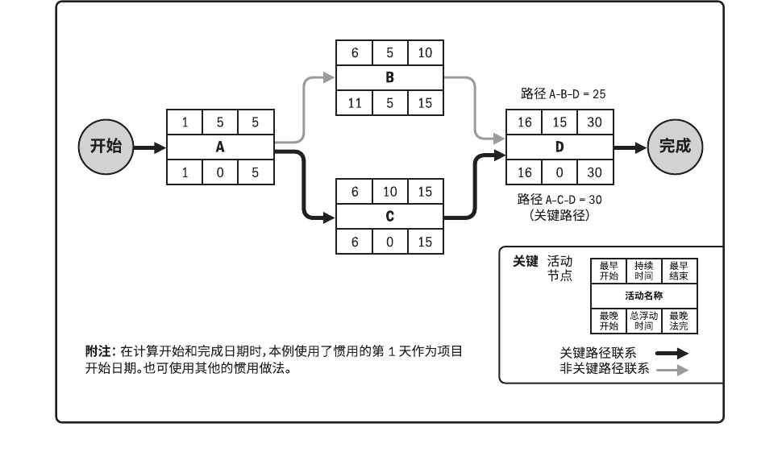

### 分解

> 出现章节：5.4 / 6.3

分解是一种把项目范围和项目可交付成果逐步划分为更小、更便于管理的组成部分的技术；工作包是 WBS 最低层的工作，可对其成本和持续时间进行估算和管理。分解的程度取决于所需的控制程度，以实现对项目的高效管理；工作包的详细程度则因项目规模和复杂程度而异。要把整个项目工作分解为工作包，通常需要开展以下活动：
- 识别和分析可交付成果及相关工作；
- 确定 WBS 的结构和编排方法；
- 自上而下逐层细化分解；
- 为 WBS 组成部分制定和分配标识编码；
- 核实可交付成果分解的程度是否恰当。

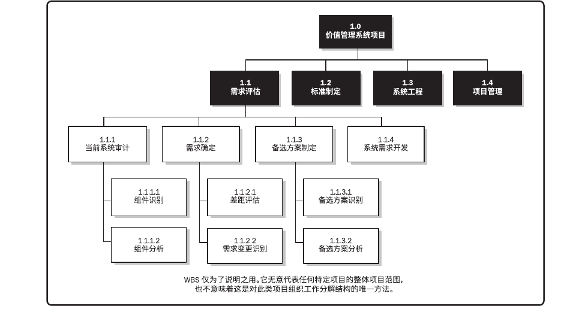
上图显示了某工作分解的一部分，其中若干分支已经向下分解到工作包层次。

创建 WBS 的方法多种多样，常用的方法包括自上而下的方法、使用组织特定的指南和使用 WBS模板。自下而上的方法可用于归并较低层次组件。WBS 的结构可以采用多种形式，例如：
- 以项目生命周期的各阶段作为分解的第二层，把产品和项目可交付成果放在第三层，如下图1；
- 以主要可交付成果作为分解的第二层，如下图2；
- 纳入由项目团队以外的组织开发的各种较低层次组件（如外包工作）。随后，作为外包工作的一部分，卖方须制定相应的合同 WBS。

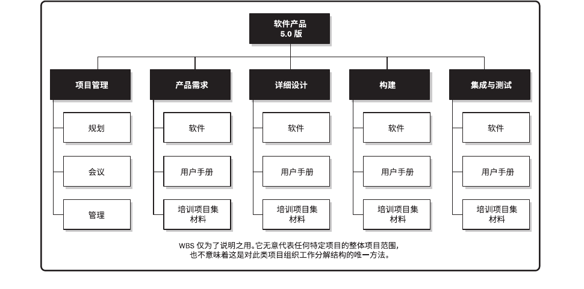
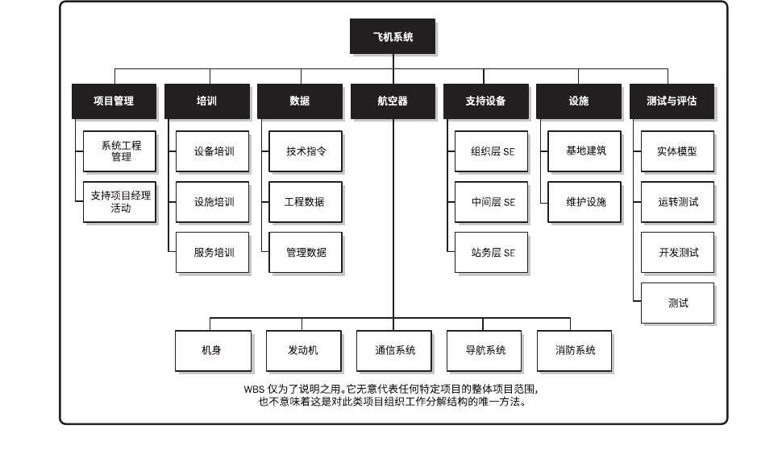

对 WBS 较高层组件进行分解，就是要把每个可交付成果或组件分解为最基本的组成部分，即可核实的产品、服务或成果。如果采用敏捷方法，可以将长篇故事分解成用户故事。WBS 可以采用提纲式、组织结构图或能说明层级结构的其他形式。通过确认 WBS 较低层组件是完成上层相应可交付成果的必要且充分的工作，来核实分解的正确性。不同的可交付成果可以分解到不同的层次。某些可交付成果只需分解到下一层，即可到达工作包的层次，而另一些则须分解更多层。工作分解得越细致，对工作的规划、管理和控制就越有力。但是，过细的分解会造成管理努力的无效耗费、资源使用效率低下、工作实施效率降低，同时造成 WBS 各层级的数据汇总困难。

要在未来远期才完成的可交付成果或组件，当前可能无法分解。项目管理团队因而通常需要等待对该可交付成果或组成部分达成一致意见，才能够制定出 WBS 中的相应细节。这种技术有时称做滚动式规划。

WBS 包含了全部的产品和项目工作，包括项目管理工作。通过把 WBS 底层的所有工作逐层向上汇总，来确保既没有遗漏的工作，也没有多余的工作。这有时被称为100%规则。

### 确定和整合依赖关系

> 出现章节：6.3

依赖关系可能是强制或选择的，内部或外部的。这四种依赖关系可以组合成强制性外部依赖关系、强制性内部依赖关系、选择性外部依赖关系或选择性内部依赖关系。
- 强制性依赖关系。强制性依赖关系是法律或合同要求的或工作的内在性质决定的依赖关系，强制性依赖关系往往与客观限制有关。例如，在建筑项目中，只有在地基建成后，才能建立地面结构；在电子项目中，必须先把原型制造出来，然后才能对其进行测试。强制性依赖关系又称硬逻辑关系或硬依赖关系，技术依赖关系可能不是强制性的。在活动排序过程中，项目团队应明确哪些关系是强制性依赖关系，不应把强制性依赖关系和进度计划编制工具中的进度制约因素相混淆。
- 选择性依赖关系。选择性依赖关系有时又称首选逻辑关系、优先逻辑关系或软逻辑关系。即便还有其他依赖关系可用，选择性依赖关系应基于具体应用领域的最佳实践或项目的某些特殊性质对活动顺序的要求来创建。例如，根据普遍公认的最佳实践，在建造期间，应先完成卫生管道工程，才能开始电气工程。这个顺序并不是强制性要求，两个工程可以同时（并行）开展工作，但如按先后顺序进行可以降低整体项目风险。应该对选择性依赖关系进行全面记录，因为它们会影响总浮动时间，并限制后续的进度安排。如果打算进行快速跟进，则应当审查相应的选择性依赖关系，并考虑是否需要调整或去除。在排列活动顺序过程中，项目团队应明确哪些依赖关系属于选择性依赖关系。
- 外部依赖关系。外部依赖关系是项目活动与非项目活动之间的依赖关系，这些依赖关系往往不在项目团队的控制范围内。例如，软件项目的测试活动取决于外部硬件的到货；建筑项目的现场准备，可能要在政府的环境听证会之后才能开始。在排列活动顺序过程中，项目管理团队应明确哪些依赖关系属于外部依赖关系。
- 内部依赖关系。内部依赖关系是项目活动之间的紧前关系，通常在项目团队的控制之中。例如，只有机器组装完毕，团队才能对其测试，这是一个内部的强制性依赖关系。在排列活动顺序过程中，项目管理团队应明确哪些依赖关系属于内部依赖关系。

### 面向X的设计

> 出现章节：8.2

面向 X 的设计 (DfX) 是产品设计期间可采用的一系列技术指南，旨在优化设计的特定方面，可以控制或提高产品最终特性。DfX 中的“X”可以是产品开发的不同方面，例如可靠性、调配、装配、制造、成本、服务、可用性、安全性和质量。使用 DfX 可以降低成本、改进质量、提高绩效和客户满意度。

### 专家判断

> 出现章节：4.1 / 4.2 / 4.3 / 4.4 / 4.5 / 4.6 / 4.7 / 5.1 / 5.2 / 5.3 / 5.4 / 6.1 / 6.2 / 6.4 / 7.1 / 7.2 / 7.3 / 7.4 / 8.1 / 9.1 / 9.2 / 10.1 / 10.3 / 11.1 / 11.2 / 11.3 / 11.4 / 11.5 / 11.6 / 12.1 / 12.2 / 12.3 / 13.1 / 13.2 / 13.3

专家判断是指基于某应用领域、知识领域、学科和行业等的专业知识而做出的，关于当前活动的合理判断，这些专业知识可来自具有专业学历、知识、技能、经验或培训经历的任何小组或个人。

### 融资

> 出现章节：7.3

融资是指为项目获取资金。长期的基础设施、工业和公共服务项目通常会寻求外部融资。如果项目使用外部资金，出资实体可能会提出一些必须满足的要求。

### 资金限制平衡

> 出现章节：7.3

应该根据对项目资金的任何限制，来平衡资金支出。如果发现资金限制与计划支出之间的差异，则可能需要调整工作的进度计划，以平衡资金支出水平。这可以通过在项目进度计划中添加强制日期来实现。

### 基本规则

> 出现章节：13.3

根据团队章程中定义的基本规则，来明确项目团队成员和其他相关方应该采取什么行为去引导相关方参与。

### 历史信息审核

> 出现章节：7.3

审核历史信息有助于进行参数估算或类比估算。历史信息可包括各种项目特征（参数），它们用于建立数学模型预测项目总成本。这些数学模型可以是简单的（例如，建造住房的总成本取决于单位面积建造成本），也可以是复杂的（例如，软件开发项目的成本模型中有多个变量，且每个变量又受许多因素的影响）。

类比和参数模型的成本及准确性可能差别很大。在以下情况下，它们将最为可靠：
- 用来建立模型的历史信息准确；
- 模型中的参数易于量化；
- 模型可以调整，以便对大项目、小项目和各项目阶段都适用。

### 个人和团队评估

> 出现章节：9.4

个人和团队评估工具能让项目经理和项目团队洞察成员的优势和劣势。这些工具可帮助项目经理评估团队成员的偏好和愿望、团队成员如何处理和整理信息、如何制定决策，以及团队成员如何与他人打交道。有各种可用的工具，如态度调查、专项评估、结构化访谈、能力测试及焦点小组。这些工具有利于增进团队成员间的理解、信任、承诺和沟通，在整个项目期间不断提高团队成效。

### 信息管理

> 出现章节：4.4

信息管理工具和技术用于创建人们与知识之间的联系，可以有效促进简单、明确的显性知识的分享，包括（但不限于）：
- 编撰显性知识的方法，例如，如何确定经验教训登记册的条目；
- 经验教训登记册；
- 图书馆服务；
- 信息收集，例如搜索网络和阅读已发表的文章；
- 项目管理信息系统 (PMIS)。项目管理信息系统通常包括文档管理系统。

通过增加互动要素，如“与我联系”的功能，使用户能够与经验教训发帖者联系，并向其寻求与特定项目和情境有关的建议。这样一来，就能够强化信息管理工具和技术的使用。

互动和支持也有助于人们找到相关信息。相比搜索关键词，直接询问通常是一种更轻松快捷的方式。搜索关键词经常难以使用，因为人们可能不知道选择什么样的关键词或关键短语才能找到所需的信息。

知识和信息管理工具与技术应与项目过程和过程责任人相对应。例如，实践社区和主题专家 (SME)可以提供见解，帮助改善控制过程；而设置内部发起人可以确保改善措施得到执行。可以分析经验教训登记册的条目来识别通过项目程序变更能够解决的常见问题。

### 检查

> 出现章节：5.5 / 8.3 / 12.3 / 13.3

检查是指检验工作产品，以确定是否符合书面标准。检查的结果通常包括相关的测量数据，可在任何层面上进行。可以检查单个活动的成果，也可以检查项目的最终产品。检查也可称为审查、同行审查、审计或巡检等，而在某些应用领域，这些术语的含义比较狭窄和具体。检查也可用于确认缺陷补救。

### 知识管理

> 出现章节：4.4

知识管理工具和技术将员工联系起来，使他们能够合作生成新知识、分享隐性知识，以及集成不同团队成员所拥有的知识。适用于项目的工具和技术取决于项目的性质，尤其是创新程度、项目复杂性，以及团队的多元化（包括学科背景多元化）程度。

工具和技术包括（但不限于）：
- 人际交往，包括非正式的社交和在线社交。可以进行开放式提问（如“谁知道……？”）的在线论坛有助于与专家进行知识分享对话；
- 实践社区（有时称为“兴趣社区”或“社区”）和特别兴趣小组；
- 会议，包括使用通信技术进行互动的虚拟会议；
- 工作跟随和跟随指导；
- 讨论论坛，如焦点小组；
- 知识分享活动，如专题讲座和会议；
- 研讨会，包括问题解决会议和经验教训总结会议；
- 讲故事；
- 创造力和创意管理技术；
- 知识展会和茶座；
- 交互式培训。

可以通过面对面和（或）虚拟方式来应用所有这些工具和技术。通常，面对面互动最有利于建立知识管理所需的信任关系。一旦信任关系建立，可以用虚拟互动来维护这种信任关系。

### 提前量和滞后量

> 出现章节：6.3 / 6.5 / 6.6

提前量是相对于紧前活动，紧后活动可以提前的时间量。例如，在新办公大楼建设项目中，绿化施工可以在尾工清单编制完成前 2 周开始，这就是带 2 周提前量的完成到开始的关系。在进度计划软件中，提前量往往表示为负滞后量。

滞后量是相对于紧前活动，紧后活动需要推迟的时间量。例如，对于一个大型技术文档，编写小组可以在编写工作开始后 15 天，开始编辑文档草案，这就是带 15 天滞后量的开始到开始关系。在下图的项目进度网络图中，活动 H 和活动 I 之间就有滞后量，表示为 SS+10（带10 天滞后量的开始到开始关系），虽然图中并没有用精确的时间刻度来表示滞后的量值。

项目管理团队应该明确哪些依赖关系中需要加入提前量或滞后量，以便准确地表示活动之间的逻辑关系。提前量和滞后量的使用不能替代进度逻辑关系，而且持续时间估算中不包括任何提前量或滞后量，同时还应该记录各种活动及与之相关的假设条件。

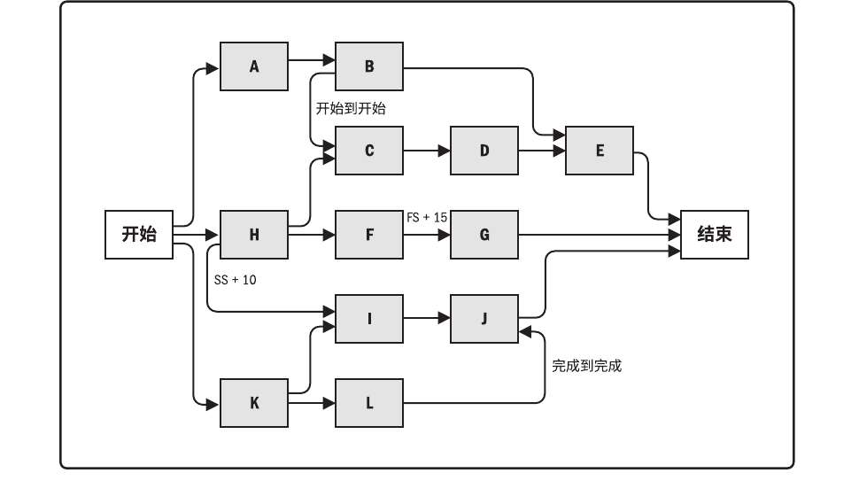

### 会议

> 出现章节：4.1 / 4.2 / 4.3 / 4.5 / 4.6 / 4.7 / 5.1 / 6.1 / 6.2 / 6.4 / 7.1 / 8.1 / 8.3 / 9.1 / 9.2 / 9.4 / 10.1 / 10.2 / 10.3 / 11.1 / 11.2 / 11.3 / 11.6 / 12.1 / 13.1 / 13.2 / 13.3 / 13.4

> iceman注：会议出现的频次极高，而且每次都有不一样的定义、形式、内容。因此，此处不记录。不过，确实存在几个重要的会议，例如：项目启动大会、项目收尾报告会等。

### 组织理论

> 出现章节：9.1

组织理论阐述个人、团队和组织部门的行为方式。有效利用组织理论中的常用技术，可以节约规划资源管理过程的时间、成本及人力投入，提高规划工作的效率。此外，可以根据相关的组织理论灵活使用领导风格，以适应项目生命周期中团队成熟度的变化。重要的是要认识到，组织的结构和文化影响项目组织结构。

### 参数估算

> 出现章节：6.4 / 7.2 / 9.2

参数估算是一种基于历史数据和项目参数，使用某种算法来计算成本或持续时间的估算技术。它是指利用历史数据之间的统计关系和其他变量（如建筑施工中的平方英尺），来估算诸如成本、预算和持续时间等活动参数。

把需要实施的工作量乘以完成单位工作量所需的工时，即可计算出持续时间。例如，对于设计项目，将图纸的张数乘以每张图纸所需的工时；或者对于电缆铺设项目，将电缆的长度乘以铺设每米电缆所需的工时。如果所用的资源每小时能够铺设 25 米电缆，那么铺设 1000 米电缆的持续时间是40 小时（1000 米除以 25 米/小时）。

参数估算的准确性取决于参数模型的成熟度和基础数据的可靠性。且参数进度估算可以针对整个项目或项目中的某个部分，并可以与其他估算方法联合使用。

### 预分派

> 出现章节：9.3

预分派指事先确定项目的实物或团队资源，可在下列情况下发生：在竞标过程中承诺分派特定人员进行项目工作；项目取决于特定人员的专有技能；在完成资源管理计划的前期工作之前，制定项目章程过程或其他过程已经指定了某些团队成员的工作分派。

### 紧前关系绘图法

> 出现章节：6.3

紧前关系绘图法（PDM）是创建进度模型的一种技术，用节点表示活动，用一种或多种逻辑关系连接活动，以显示活动的实施顺序。

PDM 包括四种依赖关系或逻辑关系。紧前活动是在进度计划的逻辑路径中，排在非开始活动前面的活动。紧后活动是在进度计划的逻辑路径中，排在某个活动后面的活动。这些关系的定义如下，并如下图所示：
- 完成到开始（FS）。只有紧前活动完成，紧后活动才能开始的逻辑关系。例如，只有完成装配PC 硬件（紧前活动），才能开始在 PC 上安装操作系统（紧后活动）。
- 完成到完成（FF）。只有紧前活动完成，紧后活动才能完成的逻辑关系。例如，只有完成文件的编写（紧前活动），才能完成文件的编辑（紧后活动）。
- 开始到开始（SS）。只有紧前活动开始，紧后活动才能开始的逻辑关系。例如，开始地基浇灌（紧后活动）之后，才能开始混凝土的找平（紧前活动）。
- 开始到完成（SF）。只有紧前活动开始，紧后活动才能完成的逻辑关系。例如，只有启动新的应付账款系统（紧前活动），才能关闭旧的应付账款系统（紧后活动）。

在 PDM 图中，FS 是最常用的逻辑关系类型；SF 关系则很少使用，为了保持 PDM 四种逻辑关系类型的完整性，这里也将 SF 列出。

虽然两个活动之间可能同时存在两种逻辑关系（例如 SS 和 FF），但不建议相同的活动之间存在多种关系。因此必须做出选出影响最大关系的决定。此外也不建议采用闭环的逻辑关系。

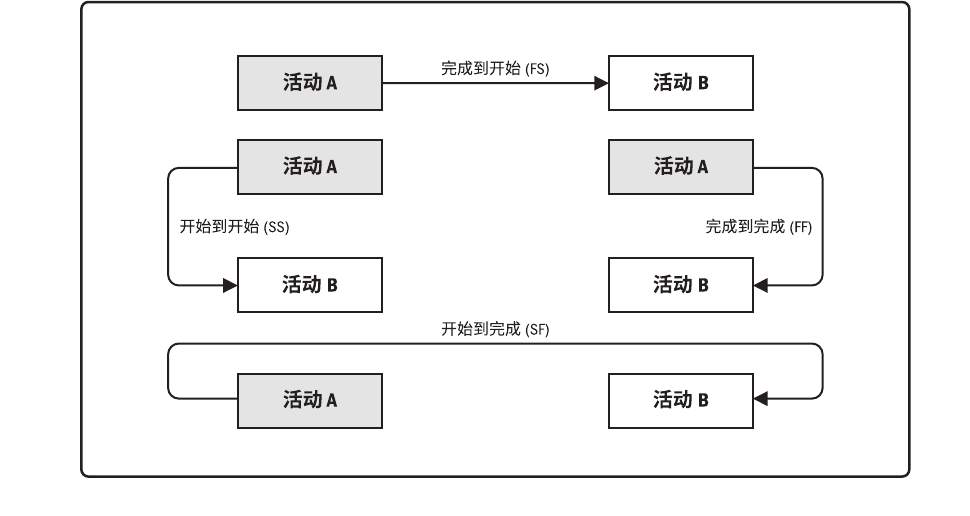

### 问题解决

> 出现章节：8.2 / 9.6

问题解决发现解决问题或应对挑战的解决方案。它包括收集其他信息、具有批判性思维的、创造性的、量化的和/或逻辑性的解决方法。有效和系统化地解决问题是质量保证和质量改进的基本要素。问题可能在控制质量过程或质量审计中发现，也可能与过程或可交付成果有关。使用结构化的问题解决方法有助于消除问题和制定长久有效的解决方案。问题解决方法通常包括以下要素：
- 定义问题；
- 识别根本原因；
- 生成可能的解决方案；
- 选择最佳解决方案；
- 执行解决方案；
- 验证解决方案的有效性。

### 产品分析

> 出现章节：5.3

产品分析可用于定义产品和服务，包括针对产品或服务提问并回答，以描述要交付的产品的用途、特征及其他方面。

每个应用领域都有一种或几种普遍公认的方法，用以把高层级的产品或服务描述转变为有意义的可交付成果。首先获取高层级的需求，然后将其细化到最终产品设计所需的详细程度。产品分析技术包括（但不限于）：
- 产品分解；
- 需求分析；
- 系统分析；
- 系统工程；
- 价值分析；
- 价值工程。

### 项目管理信息系统

> 出现章节：4.3 / 6.3 / 6.5 / 6.6 / 7.2 / 7.4 / 9.2 / 9.5 / 9.6 / 10.2 / 10.3 / 11.6

PMIS 提供信息技术 (IT) 软件工具，例如进度计划软件工具、工作授权系统、配置管理系统、信息收集与发布系统，以及进入其他在线自动化系统（如公司知识库）的界面。自动收集和报告关键绩效指标（KPI）可以是本系统的一项功能。

### 项目报告

> 出现章节：8.2

> iceman注：项目报告，并没有在8.2章节的工具与技术中看到，反而是10.2章节见到一个“项目报告发布”，我怀疑是同一个东西。

项目报告发布是收集和发布项目信息的行为。项目信息应发布给众多相关方群体。应针对每种相关方来调整项目信息发布的适当层次、形式和细节。从简单的沟通到详尽的定制报告和演示，报告的形式各不相同。可以定期准备信息或基于例外情况准备。虽然工作绩效报告是监控项目工作过程的输出，但也可能会编制临时报告、项目演示、博客，以及其他类型的信息。

### 提示清单

> 出现章节：11.2

提示清单是关于可能引发单个项目风险以及可作为整体项目风险来源的风险类别的预设清单。在采用风险识别技术时，提示清单可作为框架用于协助项目团队形成想法。可以用风险分解结构底层的风险类别作为提示清单，来识别单个项目风险。某些常见的战略框架更适用于识别整体项目风险的来源，如 PESTLE（政治、经济、社会、技术、法律、环境）、TECOP（技术、环境、商业、运营、政治），或 VUCA（易变性、不确定性、复杂性、模糊性）

### 原型法

> 出现章节：5.2

原型法是指在实际制造预期产品之前，先造出该产品的模型，并据此征求对需求的早期反馈。原型包括微缩产品、计算机生成的二维和三维模型、实体模型或模拟。因为原型是有形的实物，它使得相关方可以体验最终产品的模型，而不是仅限于讨论抽象的需求描述。原型法支持渐进明细的理念，需要经历从模型创建、用户体验、反馈收集到原型修改的反复循环过程。在经过足够的反馈循环之后，就可以通过原型获得足够的需求信息，从而进入设计或制造阶段。

故事板是一种原型技术，通过一系列的图像或图示来展示顺序或导航路径。故事板用于各种行业的各种项目中，如电影、广告、教学设计，以及敏捷和其他软件开发项目。在软件开发中，故事板使用实体模型来展示网页、屏幕或其他用户界面的导航路径。

### 质量改进方法

> 出现章节：8.2

质量改进的开展，可基于质量控制过程的发现和建议、质量审计的发现，或管理质量过程的问题解决。计划 — 实施 — 检查 — 行动和六西格玛是最常用于分析和评估改进机会的两种质量改进工具。

### 奖励与表彰

> 出现章节：9.4

> iceman注：书中的标题是“认可与奖励”。

在建设项目团队过程中，需要对成员的优良行为给予认可与奖励。最初的奖励计划是在规划资源管理过程中编制的，只有能满足被奖励者的某个重要需求的奖励，才是有效的奖励。在管理项目团队过程中，可以正式或非正式的方式做出奖励决定，但在决定认可与奖励时，应考虑文化差异。

当人们感受到自己在组织中的价值，并且可以通过获得奖励来体现这种价值，他们就会受到激励。通常，金钱是奖励制度中的有形奖励，然而也存在各种同样有效、甚至更加有效的无形奖励。大多数项目团队成员会因得到成长机会、获得成就感、得到赞赏以及用专业技能迎接新挑战，而受到激励。项目经理应该在整个项目生命周期中尽可能地给予表彰，而不是等到项目完成时。

### 不确定性表现方法

> 出现章节：11.4

要开展定量风险分析，就需要建立能反映单个项目风险和其他不确定性来源的定量风险分析模型，并为之提供输入。

如果活动的持续时间、成本或资源需求是不确定的，就可以在模型中用概率分布来表示其数值的可能区间。概率分布可能有多种形式，最常用的有三角分布、正态分布、对数正态分布、贝塔分布、均匀分布或离散分布。应该谨慎选择用于表示活动数值的可能区间的概率分布形式。

单个项目风险可以用概率分布图表示，或者，也可以作为概率分支包括在定量分析模型中。在后一种情况下，应在概率分支上添加风险发生的时间和（或）成本影响，以及在特定模拟中风险发生的概率情况。如果风险的发生与任何计划活动都没有关系，就最适合将其作为概率分支。如果风险之间存在相关性，例如有某个共同原因或逻辑依赖关系，那么应该在模型中考虑这种相关性。

其他不确定性来源也可用概率分支来表示，以描述贯穿项目的其他路径。

### 资源优化

> 出现章节：6.5 / 6.6

资源优化用于调整活动的开始和完成日期，以调整计划使用的资源，使其等于或少于可用的资源。资源优化技术是根据资源供需情况，来调整进度模型的技术，包括（但不限于）：
- 资源平衡。为了在资源需求与资源供给之间取得平衡，根据资源制约因素对开始日期和完成日期进行调整的一种技术。如果共享资源或关键资源只在特定时间可用，数量有限，或被过度分配，如一个资源在同一时段内被分配至两个或多个活动，就需要进行资源平衡。也可以为保持资源使用量处于均衡水平而进行资源平衡。资源平衡往往导致关键路径改变。而可以用浮动时间平衡资源。因此，在项目进度计划期间，关键路径可能发生变化。
- 资源平滑。对进度模型中的活动进行调整，从而使项目资源需求不超过预定的资源限制的一种技术。相对于资源平衡而言，资源平滑不会改变项目关键路径，完工日期也不会延迟。也就是说，活动只在其自由和总浮动时间内延迟，但资源平滑技术可能无法实现所有资源的优化。

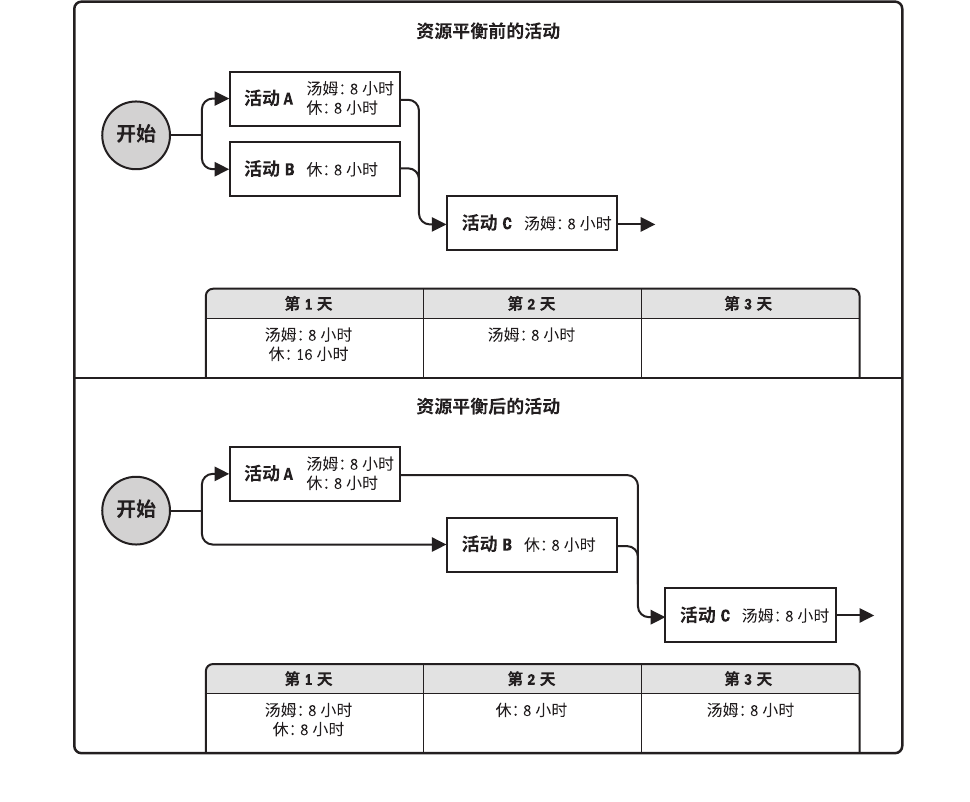

### 风险分类

> 出现章节：11.3

项目风险可依据风险来源（如采用风险分解结构 [RBS]）、受影响的项目领域（如采用工作分解结构 [WBS]），以及其他实用类别（如项目阶段、项目预算、角色和职责）来分类，确定哪些项目领域最容易被不确定性影响；风险还可以根据共同的根本原因进行分类。应该在风险管理计划中规定可用于项目的风险分类方法。

对风险进行分类，有助于把注意力和精力集中到风险敞口最大的领域，或针对一组相关的风险制定通用的风险应对措施，从而有利于更有效地开展风险应对。

### 滚动式规划

> 出现章节：6.2

滚动式规划是一种迭代式的规划技术，即详细规划近期要完成的工作，同时在较高层级上粗略规划远期工作。它是一种渐进明细的规划方式，适用于工作包、规划包以及采用敏捷或瀑布式方法的发布规划。因此，在项目生命周期的不同阶段，工作的详细程度会有所不同。在早期的战略规划阶段，信息尚不够明确，工作包只能分解到已知的详细水平；而后，随着了解到更多的信息，近期即将实施的工作包就可以分解到具体的活动。

### 进度压缩

> 出现章节：6.5 / 6.6

进度压缩技术是指在不缩减项目范围的前提下，缩短或加快进度工期，以满足进度制约因素、强制日期或其他进度目标。负值浮动时间分析是一种有用的技术。关键路径是浮动时间最少的方法。在违反制约因素或强制日期时，总浮动时间可能变成负值。下图比较了多个进度压缩技术，包括：
- 赶工。通过增加资源，以最小的成本代价来压缩进度工期的一种技术。赶工的例子包括：批准加班、增加额外资源或支付加急费用，来加快关键路径上的活动。赶工只适用于那些通过增加资源就能缩短持续时间的，且位于关键路径上的活动。但赶工并非总是切实可行的，因它可能导致风险和/或成本的增加。
- 快速跟进。一种进度压缩技术，将正常情况下按顺序进行的活动或阶段改为至少是部分并行开展。例如，在大楼的建筑图纸尚未全部完成前就开始建地基。快速跟进可能造成返工和风险增加，所以它只适用于能够通过并行活动来缩短关键路径上的项目工期的情况。以防进度加快而使用提前量通常增加相关活动之间的协调工作，并增加质量风险。快速跟进还有可能增加项目成本。

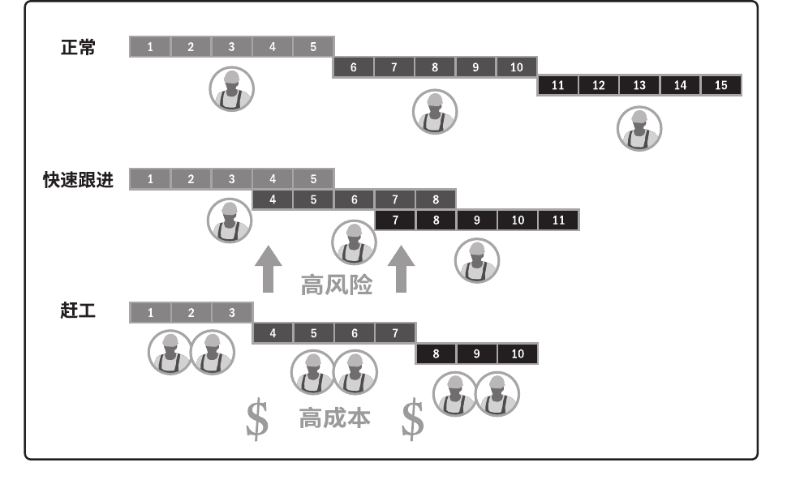

### 进度网络分析

> 出现章节：6.5

进度网络分析是创建项目进度模型的一种综合技术，它采用了其他几种技术，例如关键路径法、资源优化技术和建模技术。其他分析包括（但不限于）：
- 当多个路径在同一时间点汇聚或分叉时，评估汇总进度储备的必要性，以减少出现进度落后的可能性。
- 审查网络，看看关键路径是否存在高风险活动或具有较多提前量的活动，是否需要使用进度储备或执行风险应对计划来降低关键路径的风险。

进度网络分析是一个反复进行的过程，一直持续到创建出可行的进度模型。

### 供方选择分析

> 出现章节：12.1

在确定选择方法前，有必要审查项目竞争性需求的优先级。由于竞争性选择方法可能要求卖方在事前投入大量时间和资源，因此，应该在采购文件中写明评估方法，让投标人了解将会被如何评估。常用的选择方法包括：
- 最低成本。最低成本法适用于标准化或常规采购。此类采购有成熟的实践与标准，有具体明确的预期成果，可以用不同的成本来取得。
- 仅凭资质。仅凭资质的选择方法适用于采购价值相对较小，不值得花时间和成本开展完整选择过程的情况。买方会确定短名单，然后根据可信度、相关资质、经验、专业知识、专长领域和参考资料选择最佳的投标人。
- 基于质量或技术方案得分。邀请一些公司提交建议书，同时列明技术和成本详情；如果技术建议书可以接受，再邀请它们进行合同谈判。采用此方法，会先对技术建议书进行评估，考察技术方案的质量。如果经过谈判，证明它们的财务建议书是可接受的，那么就会选择技术建议书得分最高的卖方。
- 基于质量和成本。在基于质量和成本的方法中，成本也是用于选择卖方的一个考虑因素。一般而言，如果项目的风险和（或）不确定性较高，相对于成本而言，质量就应该是一个关键因素。
- 独有来源。买方要求特定卖方准备技术和财务建议书，然后针对建议书开展谈判。由于没有竞争，因此仅在有适当理由时才可采用此方法，而且应将其视为特殊情况。
- 固定预算。固定预算法要求在建议邀请书中向受邀的卖方披露可用预算，然后在此预算内选择技术建议书得分最高的卖方。因为有成本限制，所以卖方会在建议书中调整工作的范围和质量，以适应该预算。买方应该确保固定预算与工作说明书相符，且卖方能够在该预算内完成相关任务。此方法仅适用于工作说明书定义精确、预期不会发生变更，而且预算固定且不得超出的情况。

### 机会应对策略

> 出现章节：11.5

针对机会，可以考虑下列五种备选策略：
- 上报。如果项目团队或项目发起人认为某机会不在项目范围内，或提议的应对措施超出了项目经理的权限，就应该取用上报策略。被上报的机会将在项目集层面、项目组合层面或组织的其他相关部门加以管理，而不在项目层面。项目经理确定应就机会通知哪些人员，并向该人员或组织部门传达关于该机会的详细信息。对于被上报的机会，组织中的相关人员必须愿意承担应对责任，这一点非常重要。机会通常要上报给其目标会受该机会影响的那个层级。机会一旦上报，就不再由项目团队做进一步监督，虽然仍可出现在风险登记册中供参考。
- 开拓。如果组织想确保把握住高优先级的机会，就可以选择开拓策略。此策略将特定机会的出现概率提高到 100%，确保其肯定出现，从而获得与其相关的收益。开拓措施可能包括：把组织中最有能力的资源分配给项目来缩短完工时间，或采用全新技术或技术升级来节约项目成本并缩短项目持续时间。
- 分享。分享涉及到将应对机会的责任转移给第三方，使其享有机会所带来的部分收益。必须仔细为已分享的机会安排新的风险责任人，让那些最有能力为项目抓住机会的人担任新的风险责任人。采用风险分享策略，通常需要向承担机会应对责任的一方支付风险费用。分享措施包括建立合伙关系、合作团队、特殊公司或合资企业来分享机会。
- 提高。提高策略用于提高机会出现的概率和（或）影响。提前采取提高措施通常比机会出现后尝试改善收益更加有效。通过关注其原因，可以提高机会出现的概率；如果无法提高概率，也许可以针对决定其潜在收益规模的因素来提高机会发生的影响。机会提高措施包括为早日完成活动而增加资源。
- 接受。接受机会是指承认机会的存在，但不主动采取措施。此策略可用于低优先级机会，也可用于无法以任何其他方式加以经济有效地应对的机会。接受策略又分为主动或被动方式。最常见的主动接受策略是建立应急储备，包括预留时间、资金或资源，以便在机会出现时加以利用；被动接受策略则不会主动采取行动，而只是定期对机会进行审查，确保其并未发生重大改变。

### 整体项目风险应对策略

> 出现章节：11.5

风险应对措施的规划和实施不应只针对单个项目风险，还应针对整体项目风险。用于应对单个项目风险的策略也适用于整体项目风险：
- 规避。如果整体项目风险有严重的负面影响，并已超出商定的项目风险临界值，就可以采用规避策略。此策略涉及采取集中行动，弱化不确定性对项目整体的负面影响，并将项目拉回到临界值以内。例如，取消项目范围中的高风险工作，就是一种整个项目层面的规避措施。如果无法将项目拉回到临界值以内，则可能取消项目。这是最极端的风险规避措施，仅适用于威胁的整体级别在当前和未来都不可接受。
- 开拓。如果整体项目风险有显著的正面影响，并已超出商定的项目风险临界值，就可以采用开拓策略。此策略涉及采取集中行动，去获得不确定性对整体项目的正面影响。例如，在项目范围中增加高收益的工作，以提高项目对相关方的价值或效益；或者，也可以与关键相关方协商修改项目的风险临界值，以便将机会包含在内。
- 转移或分享。如果整体项目风险的级别很高，组织无法有效加以应对，就可能需要让第三方代表组织对风险进行管理。若整体项目风险是负面的，就需要采取转移策略，这可能涉及支付风险费用；如果整体项目风险高度正面，则由多方分享，以获得相关收益。整体项目风险的转移和分享策略包括（但不限于）：建立买方和卖方分享整体项目风险的协作式业务结构、成立合资企业或特殊目的公司，或对项目的关键工作进行分包。
- 减轻或提高。本策略涉及变更整体项目风险的级别，以优化实现项目目标的可能性。减轻策略适用于负面的整体项目风险，而提高策略则适用于正面的整体项目风险。减轻或提高策略包括重新规划项目、改变项目范围和边界、调整项目优先级、改变资源配置、调整交付时间等。
- 接受。即使整体项目风险已超出商定的临界值，如果无法针对整体项目风险采取主动的应对策略，组织可能选择继续按当前的定义推动项目进展。接受策略又分为主动或被动方式。最常见的主动接受策略是为项目建立整体应急储备，包括预留时间、资金或资源，以便在项目风险超出临界值时使用；被动接受策略则不会主动采取行动，而只是定期对整体项目风险的级别进行审查，确保其未发生重大改变。

### 威胁应对策略

> 出现章节：11.5

针对威胁，可以考虑下列五种备选策略：
- 上报。如果项目团队或项目发起人认为某威胁不在项目范围内，或提议的应对措施超出了项目经理的权限，就应该采用上报策略。被上报的风险将在项目集层面、项目组合层面或组织的其他相关部门加以管理，而不在项目层面。项目经理确定应就威胁通知哪些人员，并向该人员或组织部门传达关于该威胁的详细信息。对于被上报的威胁，组织中的相关人员必须愿意承担应对责任，这一点非常重要。威胁通常要上报给其目标会受该威胁影响的那个层级。威胁一旦上报，就不再由项目团队做进一步监督，虽然仍可出现在风险登记册中供参考。
- 规避。风险规避是指项目团队采取行动来消除威胁，或保护项目免受威胁的影响。它可能适用于发生概率较高，且具有严重负面影响的高优先级威胁。规避策略可能涉及变更项目管理计划的某些方面，或改变会受负面影响的目标，以便于彻底消除威胁，将它的发生概率降低到零。风险责任人也可以采取措施，来分离项目目标与风险万一发生的影响。规避措施可能包括消除威胁的原因、延长进度计划、改变项目策略，或缩小范围。有些风险可以通过澄清需求、获取信息、改善沟通或取得专有技能来加以规避。
- 转移。转移涉及到将应对威胁的责任转移给第三方，让第三方管理风险并承担威胁发生的影响。采用转移策略，通常需要向承担威胁的一方支付风险转移费用。风险转移可能需要通过一系列行动才得以实现，包括（但不限于）购买保险、使用履约保函、使用担保书、使用保证书等。也可以通过签订协议，把具体风险的归属和责任转移给第三方。
- 减轻。风险减轻是指采取措施来降低威胁发生的概率和（或）影响。提前采取减轻措施通常比威胁出现后尝试进行弥补更加有效。减轻措施包括采用较简单的流程，进行更多次测试，或者选用更可靠的卖方。还可能涉及原型开发，以降低从实验台模型放大到实际工艺或产品中的风险。如果无法降低概率，也许可以从决定风险严重性的因素入手，来减轻风险发生的影响。例如，在一个系统中加入冗余部件，可以减轻原始部件故障所造成的影响。
- 接受。风险接受是指承认威胁的存在，但不主动采取措施。此策略可用于低优先级威胁，也可用于无法以任何其他方式加以经济有效地应对的威胁。接受策略又分为主动或被动方式。最常见的主动接受策略是建立应急储备，包括预留时间、资金或资源以应对出现的威胁；被动接受策略则不会主动采取行动，而只是定期对威胁进行审查，确保其并未发生重大改变。

### 测试与检查的规划

> 出现章节：8.1

在规划阶段，项目经理和项目团队决定如何测试或检查产品、可交付成果或服务，以满足相关方的需求和期望，以及如何满足产品的绩效和可靠性目标。不同行业有不同的测试与检查，可能包括软件项目的 α 测试和 β 测试、建筑项目的强度测试、制造和实地测试的检查，以及工程的无损伤测试。

### 测试/产品评估

> 出现章节：8.3

测试是一种有组织的、结构化的调查，旨在根据项目需求提供有关被测产品或服务质量的客观信息。测试的目的是找出产品或服务中存在的错误、缺陷、漏洞或其他不合规问题。用于评估各项需求的测试的类型、数量和程度是项目质量计划的一部分，具体取决于项目的性质、时间、预算或其他制约因素。测试可以贯穿于整个项目，可以随着项目的不同组成部分变得可用时进行，也可以在项目结束（即交付最终可交付成果）时进行。早期测试有助于识别不合规问题，帮助减少修补不合规组件的成本。

不同应用领域需要不同测试。例如，软件测试可能包括单元测试、集成测试、黑盒测试、白盒测试、接口测试、回归测试、α 测试等；在建筑项目中，测试可能包括水泥强度测试、混凝土和易性测试、在建筑工地进行的旨在测试硬化混凝土结构的质量的无损伤测试，以及土壤试验；在硬件开发中，测试可能包括环境应力筛选、老化测试、系统测试等。

### 三点估算

> 出现章节：6.4 / 7.2

【进度】

通过考虑估算中的不确定性和风险，可以提高持续时间估算的准确性。使用三点估算有助于界定活动持续时间的近似区间：
- 最可能时间 (tM)。基于最可能获得的资源、最可能取得的资源生产率、对资源可用时间的现实预计、资源对其他参与者的可能依赖关系及可能发生的各种干扰等，所估算的活动持续时间。
- 最乐观时间 (tO)。基于活动的最好情况所估算的活动持续时间。
- 最悲观时间 (tP)。基于活动的最差情况所估算的持续时间。

基于持续时间在三种估算值区间内的假定分布情况，可计算期望持续时间tE。一个常用公式为三角分布：`tE = (tO + tM + tP) / 3`。

历史数据不充分或使用判断数据时，使用三角分布，基于三点的假定分布估算出期望持续时间，并说明期望持续时间的不确定区间。

【成本】

通过考虑估算中的不确定性与风险，使用三种估算值来界定活动成本的近似区间，可以提高单点成本估算的准确性：
- 最可能成本（cM）。对所需进行的工作和相关费用进行比较现实的估算，所得到的活动成本。
- 最乐观成本（cO）。基于活动的最好情况所得到的成本。
- 最悲观成本（cP）。基于活动的最差情况所得到的成本。

基于活动成本在三种估算值区间内的假定分布情况，使用公式来计算预期成本（cE）。两种常用的公式是三角分布和贝塔分布，其计算公式分别为：
- 三角分布。`cE = (cO + cM + cP) / 3`
- 贝塔分布。`cE = (cO + 4cM + cP) / 6`

基于三点的假定分布计算出期望成本，并说明期望成本的不确定区间。

### 完工尚需绩效指数

> 出现章节：7.4

完工尚需绩效指数（TCPI）是一种为了实现特定的管理目标，剩余资源的使用必须达到的成本绩效指标，是完成剩余工作所需的成本与剩余预算之比。TCPI 是指为了实现具体的管理目标（如BAC 或 EAC），剩余工作的实施必须达到的成本绩效指标。如果 BAC 已明显不再可行，则项目经理应考虑使用预测的 EAC。经过批准后，就用 EAC 取代 BAC。基于 BAC 的 TCPI 公式：TCPI =（BAC –EV）/（BAC – AC）。

TCPI 的概念可用下图表示。其计算公式在图的左下角，用剩余工作（BAC 减去 EV）除以剩余资金（可以是 BAC 减去 AC，或 EAC 减去 AC）。

如果累计 CPI 低于基准（如下图所示），那么项目的全部剩余工作都应立即按 TCPI（BAC）（图7-13 中最高的那条线）执行，才能确保实际总成本不超过批准的 BAC。至于所要求的这种绩效水平是否可行，就需要综合考虑多种因素（包括风险、项目剩余时间和技术绩效）后才能判断；如果不可行，就需要把项目未来所需的绩效水平调整为如 TCPI（EAC）线所示。基于 EAC 的 TCPI 公式：TCPI =（BAC – EV）/（EAC – AC）。

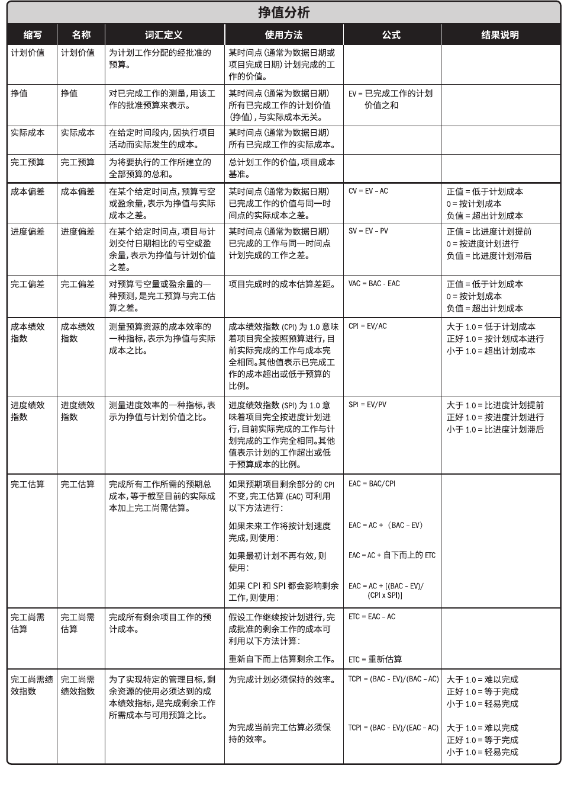

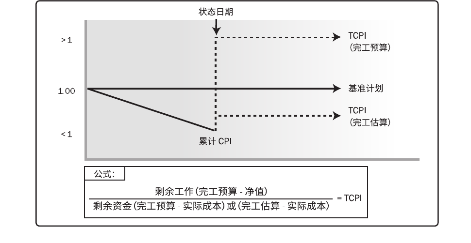

### 培训

> 出现章节：9.4

培训包括旨在提高项目团队成员能力的全部活动，可以是正式或非正式的，方式包括课堂培训、在线培训、计算机辅助培训、在岗培训（由其他项目团队成员提供）、辅导及训练。如果项目团队成员缺乏必要的管理或技术技能，可以把对这种技能的培养作为项目工作的一部分。项目经理应该按资源管理计划中的安排来实施预定的培训，也应该根据管理项目团队过程中的观察、交谈和项目绩效评估的结果，来开展必要的计划外培训，培训成本通常应该包括在项目预算中，或者如果增加的技能有利于未来的项目，则由执行组织承担。培训可以由内部或外部培训师来执行。

### 虚拟团队

> 出现章节：9.3 / 9.4

虚拟团队的使用为招募项目团队成员提供了新的可能性。虚拟团队可定义为具有共同目标、在完成角色任务的过程中很少或没有时间面对面工作的一群人。现代沟通技术（如电子邮件、电话会议、社交媒体、网络会议和视频会议等）使虚拟团队成为可行。虚拟团队模式使人们有可能：
- 在组织内部地处不同地理位置的员工之间组建团队；
- 为项目团队增加特殊技能，即使相应的专家不在同一地理区域；
- 将在家办公的员工纳入团队；
- 在工作班次、工作小时或工作日不同的员工之间组建团队；
- 将行动不便者或残疾人纳入团队；
- 执行那些原本会因差旅费用过高而被搁置或取消的项目；
- 节省员工所需的办公室和所有实物设备的开支。

在虚拟团队的环境中，沟通规划变得日益重要。可能需要花更多时间，来设定明确的期望、促进沟通、制定冲突解决方法、召集人员参与决策、理解文化差异，以及共享成功喜悦。